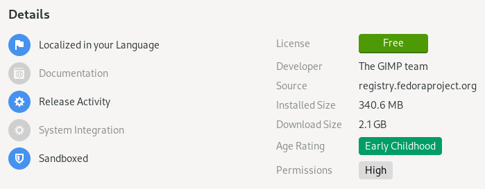
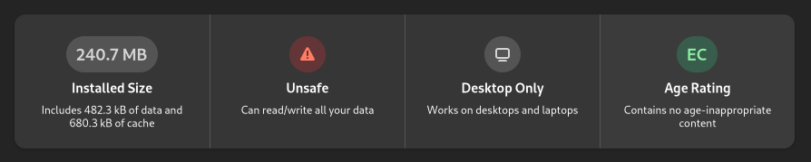
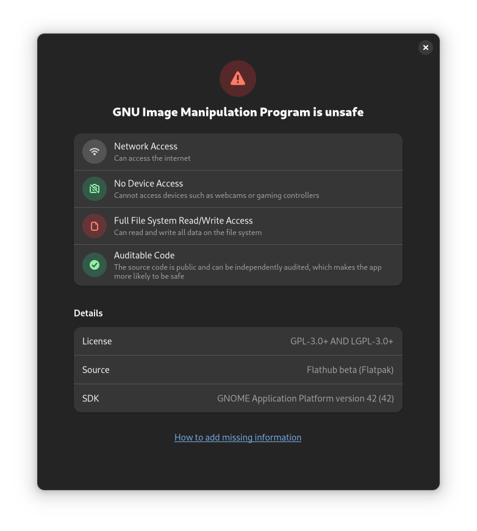

# 对《Flatpak Is Not the Future》的回应

## 作品信息

- 作者：[TheEvilSkeleton](https://theevilskeleton.gitlab.io/about)
- 原文：[Response to "Flatpak Is Not the Future"](https://theevilskeleton.gitlab.io/2022/05/16/response-to-flatpak-is-not-the-future.html)
- 许可证：[CC-BY-SA 4.0](https://creativecommons.org/licenses/by-sa/4.0/legalcode.txt)
- 译者：暮光的白杨
- 日期：2022-05-17

----

## 导言

去年底，[Nicholas Fraser](https://github.com/ludocode) 公开发表了《[Flatpak Is Not the Future](https://ludocode.com/blog/flatpak-is-not-the-future)》这篇有趣的文章，很快引起了 Linux 社区的关注。我想回顾一下作者的一些论点，并解释一些误解和主张。

请记住，我没有反对作者的观点。本文的重点是减少该文章可能造成的误导和误解，因为我已经看到（现在仍然看到）许多用户非常频繁地张贴这篇文章，而没有对该文的主题有正确的理解。

## "尺寸"

=== "译文"

    >假设你想制作一个简单的计算器应用程序。应该需要下载多大的东西？
    >
    >[…]
    >
    >Flatpak 或 Steam 等其他解决方案分别下载运行环境。你的应用程序元数据指定它需要使用的运行环境，后台服务会下载它并使用它运行你的应用程序。
    >
    >那么这些运行环境有多大？当在一台全新的机器上从 Flathub 安装 KCalc 时，你可以看到你需要下载的第一个运行环境大小接近近 900MB。如下：
    >
    ```shell
                ID                                      Branch    Op   Remote    Download
     1.     org.freedesktop.Platform.GL.default     20.08     i    flathub   < 106.4 MB
     2.     org.freedesktop.Platform.VAAPI.Intel    20.08     i    flathub    < 11.6 MB
     3.     org.freedesktop.Platform.openh264       2.0       i    flathub     < 1.5 MB
     4.     org.kde.KStyle.Adwaita                  5.15      i    flathub     < 6.6 MB
     5.     org.kde.Platform.Locale                 5.15      i    flathub   < 341.4 MB (partial)
     6.     org.kde.Platform                        5.15      i    flathub   < 370.1 MB
     7.     org.kde.kcalc.Locale                    stable    i    flathub   < 423.1 kB (partial)
     8.     org.kde.kcalc                           stable    i    flathub     < 4.4 MB
    ```
    >
    >请注意，应用程序本身只有 4.4MB。其余的是我系统上已经存在的冗余的库。我只是从 Flatpak 安装路径中直接运行了 `kcalc` 二进制文件（未启用沙盒化），并让它使用我的本地库。它运行得很好，因为它使用的所有库都是向后兼容的。
    >
    >Flatpak 想要下载 3D 驱动程序、专有视频编解码器、主题、语言环境、Qt 5、KDE 5、GTK 3、ICU、LLVM、ffmpeg、Python 以及 `org.kde.Platform` 中的所有其他内容，来运行一个计算器。因为与 AppImage 不同，Flatpak 的运行环境并没有被精简到应用程序需要的内容。而是获取了任何应用程序的所有依赖项。它在现有的操作系统之上，再造了一个完整的通用操作系统。

=== "原文"

    >Suppose you want to make a simple calculator app. How big should the download be?
    >
    >[…]
    >
    >Other solutions like Flatpak or Steam download the runtime separately. Your app metadata specifies what runtime it wants to use and a service downloads it and runs your app against it.
    >
    >So how big are these runtimes? On a fresh machine, install KCalc from Flathub. You’re looking at a nearly 900 MB download to get your first runtime. For a calculator.
    >
    ```shell
                ID                                      Branch    Op   Remote    Download
     1.     org.freedesktop.Platform.GL.default     20.08     i    flathub   < 106.4 MB
     2.     org.freedesktop.Platform.VAAPI.Intel    20.08     i    flathub    < 11.6 MB
     3.     org.freedesktop.Platform.openh264       2.0       i    flathub     < 1.5 MB
     4.     org.kde.KStyle.Adwaita                  5.15      i    flathub     < 6.6 MB
     5.     org.kde.Platform.Locale                 5.15      i    flathub   < 341.4 MB (partial)
     6.     org.kde.Platform                        5.15      i    flathub   < 370.1 MB
     7.     org.kde.kcalc.Locale                    stable    i    flathub   < 423.1 kB (partial)
     8.     org.kde.kcalc                           stable    i    flathub     < 4.4 MB
    ```
    >
    >Note that the app package itself is only 4.4 MB. The rest is all redundant libraries that are already on my system. I just ran the `kcalc` binary straight out of its Flatpak install path unsandboxed and let it use my native libraries. It ran just fine, because all of the libraries it uses are backwards compatible.
    >
    >Flatpak wants to download 3D drivers, patented video codecs, themes, locales, Qt 5, KDE 5, GTK 3, ICU, LLVM, ffmpeg, Python, and everything else in `org.kde.Platform`, all to run a calculator. Because unlike AppImage, the runtime isn’t stripped down to just what the app needs. It’s got every dependency for any app. It’s an entire general-purpose OS on top of your existing OS.

Flatpak 安装这些运行环境以确保你和其他用户在不同系统上运行完全相同的二进制文件和库，无论这些库是否向后兼容。这样做是为了减少应用程序开发人员所需的质量保证 (QA) 数量并尽可能减少错误，因为应用程序开发人员可以测试针对相同工具链和依赖项进行构建测试。

通过主机的库运行程序，可能会遇到特定于发行版的错误，或者其他类型的负面影响，例如 修补的库、稍旧或更新版本的库、被忽略的依赖项等。

此外，这实际上与系统包非常相似。假设你在你的系统上使用 GNOME，并且你想在你的系统上安装 KCalc。如果你没有安装 Plasma，则包管理器将下载并安装所有需要的 Qt 和 Plasma 依赖项，然后再安装大小为 4.4MB 的 KCalc。

就像系统包一样，你安装的应用程序越多，Flatpak 的空间效率就越高。Flatpak 进入一个称为重复数据删除（Deduplication）的过程，在该过程中它尽可能复用依赖项，从而避免重复下载数据。在作者的示例中，KCalc 拉取了 900MB 的运行环境和驱动程序。现在，假设你安装了 10 个以上的 Qt 应用程序。与其重新下载和重新安装 9GB（900MB * 10 ≈ 9GB），Flatpak *不会*重新下载安装 10 次依赖，而且你*也不会*浪费 9GB。相反，所有 10 个 Qt 应用程序将继续使用之前已安装的相同的运行环境。重复数据删除确保依赖相同依赖项的应用程序将继续复用相同的依赖项。基本上，你安装的应用程序越多，Flatpak 的空间效率就越高。

### "共享运行环境？"

=== "译文"

    >他们声称他们对运行环境进行了重复数据删除。我质疑重新编译所有内容时不同分支之间真正可以共享多少。`/usr` 在 Ubuntu 的不同版本之间发生了多大的变化？ 我想差不多都是一样的。

=== "原文"

    >They claim that they deduplicate runtimes. I question how much can really be shared between different branches when everything is recompiled. How much has /usr changed between releases of Ubuntu? I would guess just about all of it.

关于这一部分，Will Thompson 已经在他的网站上写了一篇回复：[On Flatpak disk usage and deduplication](https://blogs.gnome.org/wjjt/2021/11/24/on-flatpak-disk-usage-and-deduplication/)。他查看了运行环境的大小以及有多少重复数据删除生效。这是一个关于去重的非常详细的解释，我推荐阅读它。

总而言之，freedesktop.org 20.08 和 21.08 运行环境相比，重复数据删除将 498MB 减少了 113MB。GNOME 41 和 freedesktop.org 21.08 运行环境相比，重复数据删除将 715MB 减少了 388MB。他还更深入地研究了这些运行环境和应用程序。

并且，Flatpak 不仅对运行环境进行了重复数据删除，而且对运行环境之外的内容也进行了重复数据删除，只要这些文件共享相同的哈希（校验和）即可。Flatpak 的维护者 Alexander Larsson 在[此视频](https://conf.tube/w/qWLp5vosZg1V7vmZhmn5wM?start=26m49s)中详细解释了相关内容。

#### "存储空间使用"

我们将检查我的系统上使用的运行环境的数量。让我们看看我在我的系统上安装了什么：

```shell
$ flatpak list --runtime --user | wc -l
57
```

在我的系统中，我安装了 57 个运行环境。

现在，让我们看看我安装的运行环境：

```shell
$ flatpak list --runtime --user
Name                                                   Application ID                                               Version             Branch              Origin
Codecs                                                 com.github.Eloston.UngoogledChromium.Codecs                                      stable              flathub
Proton (community build)                               com.valvesoftware.Steam.CompatibilityTool.Proton             7.0-2               stable              flathub
Proton experimental (community build)                  com.valvesoftware.Steam.CompatibilityTool.Proton-Exp         7.0-20220511        stable              flathub
Proton-GE (community build)                            com.valvesoftware.Steam.CompatibilityTool.Proton-GE          7.17-1              stable              flathub
gamescope                                              com.valvesoftware.Steam.Utility.gamescope                    3.11.28             stable              flathub
steamtinkerlaunch                                      com.valvesoftware.Steam.Utility.steamtinkerlaunch                                test                steamtinkerlaunch-origin
Codecs                                                 org.audacityteam.Audacity.Codecs                                                 stable              flathub
Codecs                                                 org.chromium.Chromium.Codecs                                                     stable              flathub
Fedora Platform                                        org.fedoraproject.Platform                                   35                  f35                 fedora
LSP                                                    org.freedesktop.LinuxAudio.Plugins.LSP                       1.1.30              20.08               flathub
LSP                                                    org.freedesktop.LinuxAudio.Plugins.LSP                       1.2.1               21.08               flathub
TAP-plugins                                            org.freedesktop.LinuxAudio.Plugins.TAP                       1.0.1               21.08               flathub
ZamPlugins                                             org.freedesktop.LinuxAudio.Plugins.ZamPlugins                3.14                20.08               flathub
ZamPlugins                                             org.freedesktop.LinuxAudio.Plugins.ZamPlugins                3.14                21.08               flathub
SWH                                                    org.freedesktop.LinuxAudio.Plugins.swh                       0.4.17              21.08               flathub
Freedesktop Platform                                   org.freedesktop.Platform                                     20.08.19            20.08               flathub
Freedesktop Platform                                   org.freedesktop.Platform                                     21.08.13            21.08               flathub
i386                                                   org.freedesktop.Platform.Compat.i386                                             21.08               flathub
Mesa                                                   org.freedesktop.Platform.GL.default                          21.1.8              20.08               flathub
Mesa                                                   org.freedesktop.Platform.GL.default                          21.3.8              21.08               flathub
default                                                org.freedesktop.Platform.GL32.default                                            21.08               flathub
MangoHud                                               org.freedesktop.Platform.VulkanLayer.MangoHud                0.6.6-1             21.08               flathub
vkBasalt                                               org.freedesktop.Platform.VulkanLayer.vkBasalt                0.3.2.5             21.08               flathub
ffmpeg-full                                            org.freedesktop.Platform.ffmpeg-full                                             21.08               flathub
i386                                                   org.freedesktop.Platform.ffmpeg_full.i386                                        21.08               flathub
openh264                                               org.freedesktop.Platform.openh264                            2.1.0               2.0                 flathub
Freedesktop SDK                                        org.freedesktop.Sdk                                          21.08.13            21.08               flathub
i386                                                   org.freedesktop.Sdk.Compat.i386                                                  21.08               flathub
.NET Core SDK extension                                org.freedesktop.Sdk.Extension.dotnet6                        6.0.300             21.08               flathub
Free Pascal Compiler and Lazarus                       org.freedesktop.Sdk.Extension.freepascal                     3.2.2               21.08               flathub
toolchain-i386                                         org.freedesktop.Sdk.Extension.toolchain-i386                                     21.08               flathub
GNOME Boxes Osinfo DB                                  org.gnome.Boxes.Extension.OsinfoDb                           20220214            stable              flathub
GNOME Application Platform version 41                  org.gnome.Platform                                                               41                  flathub
GNOME Application Platform version 42                  org.gnome.Platform                                                               42                  flathub
GNOME Application Platform version Nightly             org.gnome.Platform                                                               master              gnome-nightly
i386                                                   org.gnome.Platform.Compat.i386                                                   41                  flathub
i386                                                   org.gnome.Platform.Compat.i386                                                   42                  flathub
GNOME Software Development Kit version 41              org.gnome.Sdk                                                                    41                  flathub
GNOME Software Development Kit version 42              org.gnome.Sdk                                                                    42                  flathub
GNOME Software Development Kit version Nightly         org.gnome.Sdk                                                                    master              gnome-nightly
i386                                                   org.gnome.Sdk.Compat.i386                                                        41                  flathub
i386                                                   org.gnome.Sdk.Compat.i386                                                        42                  flathub
Adwaita dark GTK theme                                 org.gtk.Gtk3theme.Adwaita-dark                                                   3.22                flathub
adw-gtk3 Gtk Theme                                     org.gtk.Gtk3theme.adw-gtk3                                                       3.22                flathub
adw-gtk3-dark Gtk Theme                                org.gtk.Gtk3theme.adw-gtk3-dark                                                  3.22                flathub
Kvantum theme engine                                   org.kde.KStyle.Kvantum                                       1.0.1               5.15-21.08          flathub
KDE Application Platform                               org.kde.Platform                                                                 5.15-21.08          flathub
QGnomePlatform                                         org.kde.PlatformTheme.QGnomePlatform                                             5.15                flathub
QGnomePlatform                                         org.kde.PlatformTheme.QGnomePlatform                                             5.15-21.08          flathub
QtSNI                                                  org.kde.PlatformTheme.QtSNI                                                      5.15                flathub
QtSNI                                                  org.kde.PlatformTheme.QtSNI                                                      5.15-21.08          flathub
KDE Software Development Kit                           org.kde.Sdk                                                                      5.15-21.08          flathub
QGnomePlatform-decoration                              org.kde.WaylandDecoration.QGnomePlatform-decoration                              5.15                flathub
QGnomePlatform-decoration                              org.kde.WaylandDecoration.QGnomePlatform-decoration                              5.15-21.08          flathub
DXVK                                                   org.winehq.Wine.DLLs.dxvk                                    1.10.1              stable-21.08        flathub
Gecko                                                  org.winehq.Wine.gecko                                                            stable-21.08        flathub
Mono                                                   org.winehq.Wine.mono                                                             stable-21.08        flathub
```

这是一张包括我安装的所有不同的版本、分支的运行环境的巨大列表。

我使用 `--user` 标志安装 Flatpak 应用程序，这意味着每个用户都安装了所有内容；也意味着所有 Flatpak 安装都位于 `~/.local/share/flatpak` 目录中。

我最近编写了一个[脚本](https://gitlab.com/TheEvilSkeleton/flatpak-dedup-checker)来对比 Flatpak 应用程序、运行环境或两者的大小。 它检查大小而不进行重复数据删除、重复数据删除和压缩（如果适用）。

此脚本检查文件硬链接的次数，并在给定的 Flatpak 目录中相应地相乘。例如，如果一个文件硬链接 10 次，则脚本显示为 10 倍空间（但实际上，它只使用一次）。然后，它（使用重复数据删除）检查实际大小。最后，如果使用带有[透明压缩](https://btrfs.wiki.kernel.org/index.php/Compression)的 btrfs，脚本将智能地检查启用压缩的大小。

在这个脚本的帮助下，让我们看看它们占用了多少数据：

```shell
$ ./flatpak-dedup-checker --path=~/.local/share/flatpak --runtime
Directory:                  /var/home/TheEvilSkeleton/.local/share/flatpak/runtime
Size without deduplication: 36.22 GB
Size with deduplication:    13.07 GB (36% of 36.22 GB)
```

就是这样！57 个运行环境在启用了重复数据删除的情况下只使用了 13.07GB 的空间，而不是 36.22GB，这远远低于 50%。

我们可以观察到重复数据删除实际上是有效的。由于运行环境已经开始共享大量文件，因此对一半以上的文件进行了重复数据删除。

### "磁盘空间很便宜！"

=== "译文"

    >他们说磁盘空间很便宜。这不是真的，现代计算机的基础设备不是这样。内置存储实际上一直在缩小。
    >
    >软件变得如此缓慢和臃肿，以至于操作系统不再可以在机械硬盘上令人满意地运行。笔记本电脑制造商正在转向更小的闪存驱动器，以提高性能，同时保持利润。在 2015 年，廉价笔记本电脑配备 256GB 或更大的机械硬盘。现在在 2021 年，它们配备 120GB 闪存。NVMe 驱动器的价格约为 100$/TB，笔记本电脑制造商将这些价格抬高了 500% 或更多，因此升级新笔记本电脑的成本可能很高。
    >
    >Chromebook 甚至更小，因为它们将所有内容都推送到云存储中。 智能手机开始运行成熟的 Linux 发行版。Raspberry Pi 4 和 400 使用 SD 卡作为存储设备，并且具有如此出色的性能，我们正处于低成本计算革命的边缘。当然，Flatpak 应该可以在这些系统上使用！没有理由说 16 GB 的存储设备不适合我们想要的所有可能的非游戏软件。Flatpak 不是革命的一部分。它阻止了它。

=== "原文"

    >They say disk space is cheap. This is not true, not for the root devices of modern computers. Built-in storage has in fact been shrinking.
    >
    >Software has gotten so much slower and more bloated that operating systems no longer run acceptably on spinning rust. Laptop manufacturers are switching to smaller flash drives to improve performance while preserving margins. Budget laptops circa 2015 shipped with 256 GB or larger mechanical drives. Now in 2021 they ship with 120 GB flash. NVMe drives are around $100/TB and laptop manufacturers inflate these prices 500% or more so upgrading a new laptop can be pricey.
    >
    >Chromebooks are even smaller as they push everything onto cloud storage. Smartphones are starting to run full-fledged Linux distributions. The Raspberry Pi 4 and 400 use an SD card as root device and have such fantastic performance that we’re on the verge of a revolution in low-cost computing. Surely Flatpak should be usable on these systems! There is no reason why a 16 GB root device shouldn’t fit every possible piece of non-game software we could want. Flatpak isn’t part of the revolution; it’s holding it back.

内置存储肯定变小了。但是，由于 [SSD 控制器](https://www.flashmemorysummit.com/Proceedings2019/08-07-Wednesday/20190807_CTRL-201-1_Haratsch.pdf)和[闪存存储](https://businesscomputingworld.co.uk/compression-and-deduplication-in-flash-storage/)中内置了压缩和重复数据删除功能，闪存存储比硬盘驱动器具有更高的物理密度。

由于这些功能，操作系统、游戏和其他数据在闪存上占用的空间更少。换句话说：作为最终用户，你直观看到存储空间变少，但与机械硬盘相比，数据在闪存上占用的空间也更少。

此外，我们可以启用 btrfs 透明压缩以节省大量空间。Fedora Linux 使用 `zstd:1`（zstd 级别 1）压缩以减少数据占用的空间，这是我将在以下示例中使用的压缩。

让我们启用压缩，对比一下上面结果的大小：

```shell
$ ./flatpak-dedup-checker --path=~/.local/share/flatpak --runtime
Directory:                  /var/home/TheEvilSkeleton/.local/share/flatpak/runtime
Size without deduplication: 36.22 GB
Size with deduplication:    13.07 GB (36% of 36.22 GB)
Size with compression:      9.41 GB (25% of 36.22 GB; 71% of 13.07 GB)
```

最终表现甚至更好。仅使用重复数据删除时，运行环境的大小为 34.56GB 的 36%。启用 `zstd:1` 后，又降至 25%。

让我们对所有已安装的应用程序执行相同的操作：

```
$ flatpak list --app --user | wc --lines
79
```

我安装了 79 个应用程序。以下是已安装的所有应用程序的列表：

```shell
$ flatpak list --app --user
Name                                       Application ID                                        Version                       Branch                   Origin
Decoder                                    com.belmoussaoui.Decoder                              0.2.2                         stable                   flathub
Brave Browser                              com.brave.Browser                                     1.38.115                      stable                   flathub
Discord                                    com.discordapp.Discord                                0.0.17                        stable                   flathub
Discord Canary                             com.discordapp.DiscordCanary                          0.0.135                       beta                     flathub-beta
Mindustry                                  com.github.Anuken.Mindustry                           126.2                         stable                   flathub
ungoogled-chromium                         com.github.Eloston.UngoogledChromium                  101.0.4951.64                 stable                   flathub
Notepad Next                               com.github.dail8859.NotepadNext                       v0.5.1                        stable                   flathub
Tor Browser Launcher                       com.github.micahflee.torbrowser-launcher              0.3.5                         stable                   flathub
waifu2x-ncnn-vulkan                        com.github.nihui.waifu2x-ncnn-vulkan                  20220419                      stable                   flathub
Czkawka                                    com.github.qarmin.czkawka                             4.1.0                         stable                   flathub
Avvie                                      com.github.taiko2k.avvie                              2.1                           stable                   flathub
Flatseal                                   com.github.tchx84.Flatseal                            1.7.5                         stable                   flathub
EasyEffects                                com.github.wwmm.easyeffects                           6.2.5                         stable                   flathub
NewsFlash                                  com.gitlab.newsflash                                  1.5.1                         stable                   flathub
Google Chrome                              com.google.Chrome                                     101.0.4951.41-1               beta                     flathub-beta
Extension Manager                          com.mattjakeman.ExtensionManager                      0.3.0                         stable                   flathub
Microsoft Edge                             com.microsoft.Edge                                    101.0.1210.39-1               stable                   flathub
OBS Studio                                 com.obsproject.Studio                                 27.2.4                        stable                   flathub
BlackBox                                   com.raggesilver.BlackBox                              42.alpha0                     master                   blackbox-origin
Bottles                                    com.usebottles.bottles                                2022.5.2-trento-3             stable                   flathub
Steam                                      com.valvesoftware.Steam                               1.0.0.74                      stable                   flathub
Visual Studio Code                         com.visualstudio.code                                 1.67.0-1651667246             stable                   flathub
Fragments                                  de.haeckerfelix.Fragments                             2.0.2                         stable                   flathub
Boop-GTK                                   fyi.zoey.Boop-GTK                                     1.6.0                         stable                   flathub
Element                                    im.riot.Riot                                          1.10.12                       stable                   flathub
Amberol                                    io.bassi.Amberol                                      0.6.1                         stable                   flathub
youtubedl-gui                              io.github.JaGoLi.ytdl_gui                             3.0                           stable                   flathub
Celluloid                                  io.github.celluloid_player.Celluloid                  0.23                          stable                   flathub
Mousai                                     io.github.seadve.Mousai                               0.6.6                         stable                   flathub
LibreWolf                                  io.gitlab.librewolf-community                         100.0-2                       stable                   flathub
Lutris                                     net.lutris.Lutris                                     0.5.10.1                      beta                     flathub-beta
Poedit                                     net.poedit.Poedit                                     3.0.1                         stable                   flathub
Color Picker                               nl.hjdskes.gcolor3                                    2.4.0                         stable                   flathub
Audacity                                   org.audacityteam.Audacity                             3.1.3                         stable                   flathub
Chromium Web Browser                       org.chromium.Chromium                                 101.0.4951.64                 stable                   flathub
Chromium application base                  org.chromium.Chromium.BaseApp                                                       21.08                    flathub
Electron2 application base                 org.electronjs.Electron2.BaseApp                                                    21.08                    flathub
Fedora Media Writer                        org.fedoraproject.MediaWriter                         4.2.2                         stable                   fedora
Flatpak External Data Checker              org.flathub.flatpak-external-data-checker                                           stable                   flathub
appstream-glib                             org.freedesktop.appstream-glib                                                      stable                   flathub
Feeds                                      org.gabmus.gfeeds                                     1.0.3                         stable                   flathub
GNU Image Manipulation Program             org.gimp.GIMP                                         2.99.10                       beta                     flathub-beta
Adwaita Demo                               org.gnome.Adwaita1.Demo                               1.2.alpha                     master                   gnome-nightly
Boxes                                      org.gnome.Boxes                                       42.0                          stable                   flathub
Builder                                    org.gnome.Builder                                     42.0                          stable                   flathub
Calendar                                   org.gnome.Calendar                                    42.0                          stable                   flathub
Contacts                                   org.gnome.Contacts                                    42.0                          stable                   flathub
Web                                        org.gnome.Epiphany.Devel                              42~beta                       master                   devel-origin
File Roller                                org.gnome.FileRoller                                  3.42.0                        stable                   flathub
Firmware                                   org.gnome.Firmware                                    42.1                          stable                   flathub
Fractal                                    org.gnome.Fractal.Devel                               5.alpha                       master                   gnome-nightly
Geary                                      org.gnome.Geary                                       40.0                          stable                   flathub
Notes                                      org.gnome.Notes                                       40.1                          stable                   flathub
Text Editor                                org.gnome.TextEditor                                  42.1                          stable                   flathub
Weather                                    org.gnome.Weather                                     42.0                          stable                   flathub
Clocks                                     org.gnome.clocks                                      42.0                          stable                   flathub
Contrast                                   org.gnome.design.Contrast                             0.0.5                         stable                   flathub
Image Viewer                               org.gnome.eog                                         42.1                          stable                   flathub
Fonts                                      org.gnome.font-viewer                                 42.0                          stable                   flathub
gitg                                       org.gnome.gitg                                        41                            stable                   flathub
Identity                                   org.gnome.gitlab.YaLTeR.Identity                      0.3.0                         stable                   flathub
Iotas                                      org.gnome.gitlab.cheywood.Iotas                       0.1.1                         stable                   flathub
Apostrophe                                 org.gnome.gitlab.somas.Apostrophe                     2.6.3                         stable                   flathub
Inkscape                                   org.inkscape.Inkscape                                 1.1.2                         stable                   flathub
Kdenlive                                   org.kde.kdenlive                                      22.04.0                       stable                   flathub
Krita                                      org.kde.krita                                         5.0.2                         stable                   flathub
LibreOffice                                org.libreoffice.LibreOffice                           7.3.3.2                       stable                   flathub
Thunderbird                                org.mozilla.Thunderbird                               91.9.0                        stable                   flathub
Firefox                                    org.mozilla.firefox                                   100.0                         stable                   flathub
Olive                                      org.olivevideoeditor.Olive                            0.1.2                         stable                   flathub
ONLYOFFICE Desktop Editors                 org.onlyoffice.desktopeditors                         7.0.1                         stable                   flathub
Helvum                                     org.pipewire.Helvum                                   0.3.4                         stable                   flathub
PolyMC                                     org.polymc.PolyMC                                     1.2.2                         stable                   flathub
PulseAudio Volume Control                  org.pulseaudio.pavucontrol                            5.0                           stable                   flathub
qBittorrent                                org.qbittorrent.qBittorrent                           4.4.2                         stable                   flathub
QOwnNotes                                  org.qownnotes.QOwnNotes                               22.5.0                        stable                   flathub
Tenacity                                   org.tenacityaudio.Tenacity                                                          nightly                  tenacity
Wine                                       org.winehq.Wine                                       7.0                           stable-21.08             flathub
Commit                                     re.sonny.Commit                                       3.2.0                         stable                   flathub
```

让我们检查一下它们在没有使用重复数据删除、使用重复数据删除以及同时使用重复数据删除和透明压缩的情况下占用的存储量：

```shell
$ ./flatpak-dedup-checker --path=~/.local/share/flatpak --app
Directory:                  /var/home/TheEvilSkeleton/.local/share/flatpak/app
Size without deduplication: 11.16 GB
Size with deduplication:    9.78 GB (87% of 11.16 GB)
Size with compression:      7.81 GB (69% of 11.16 GB; 79% of 9.78 GB)
```

同样，重复数据删除和压缩在这里也很有效。应用程序已经占用了非常少的空间，并且由于应用程序通常包含不同的文件，因此利用重复数据删除的可能性小于运行环境。使用重复数据删除后，未被重复数据删除删除的内容仅占 11.16GB 原有大小的 87%。在启用 `zstd:1` 透明压缩后，仅占原有大小的 69%。

现在，结合运行环境和应用程序：

```
./flatpak-dedup-checker --path=~/.local/share/flatpak
Directories                 /var/home/TheEvilSkeleton/.local/share/flatpak/{runtime,app}
Size without deduplication: 47.38 GB
Size with deduplication:    22.75 GB (48% of 47.38 GB)
Size with compression:      17.17 GB (36% of 47.38 GB; 75% of 22.75 GB)
```

我们可以在这里观察到压缩是有效的。这也是 Fedora Linux 向用户推送 btrfs 的驱动力，因此我们可以利用透明压缩等现代特性。希望越来越多的发行版能遵循相同的脚步。

### "内存使用，启动时间"

=== "译文"

    >更大的问题是这些应用程序实际上可能需要几秒钟才能启动。他们必须从磁盘加载所有自己的库，而不是使用系统上已有的，已载入内存的库。

=== "原文"

    >A bigger problem is that these applications can actually take several seconds to start up. They have to load all their own libraries from disk instead of using what’s already on the system, already in memory.

这是假设用户在系统上安装了两个相同的应用程序（从发行版软件源和 Flatpak 同时安装）并且想要加载两者。我只能想象有一小部分用户同时安装了两种变体（Flatpak 和原生版本）并经常使用它们。否则，如果这些应用程序主要用作 Flatpak，应该不会有问题。

大力推动 Flatpak 的发行版，如 Fedora Silverblue/Kinoite、Endless OS 和elementaryOS，严格推动 Flatpak 作为桌面应用程序的获取方式。作为副作用，这些发行版的基础安装量也非常小。例如，根据 Will Thompson 在[在 Flatpak 磁盘使用和重复数据删除](https://blogs.gnome.org/wjjt/2021/11/24/on-flatpak-disk-usage-and-deduplication/)中的说法，安装 Endless OS 大约需要 4.2GB 的存储空间。

## "安全"

=== "译文"

    >Flatpak 允许应用程序声明它们需要完全访问你的文件系统或主文件夹，但软件商店仍然声称此类应用程序是沙盒的。这在之前[已经讨论过](https://flatkill.org/2020/)了。当我在全新安装的 Fedora 34 的软件应用程序中搜索 GIMP 时，会发生以下情况：
    >

=== "原文"

    >Flatpak allows applications to declare that they need full access to your filesystem or your home folder, yet graphical software stores still claim such applications are sandboxed. This has been [discussed before](https://flatkill.org/2020/). Here’s what happens when I search GIMP in the Software application on a fresh install of Fedora 34:
    >

这个之前也[讨论过](https://theevilskeleton.gitlab.io/2021/02/11/response-to-flatkill-org.html)。我还想补充一点，这是一个由 GNOME Software 导致显示不正确的问题，而不是 Flatpak 有问题。另一方面，自 GNOME 41 以来，此问题已得到修复：





无论如何，我个人认为将由前端（GNOME Software）引起的问题归咎于后端（Flatpak）是不公平的。`flatpak` 非常清楚地标注了 GIMP 或任何其他应用程序将默认使用的权限：

```shell
$ flatpak install org.gimp.GIMP
org.gimp.GIMP permissions:
    ipc                   network       x11      dri      file access [1]
    dbus access [2]       tags [3]

    [1] /tmp, host, xdg-config/GIMP, xdg-config/gtk-3.0, xdg-run/gvfs, xdg-run/gvfsd
    [2] org.freedesktop.FileManager1, org.gnome.Shell.Screenshot, org.gtk.vfs, org.gtk.vfs.*,
        org.kde.kwin.Screenshot
    [3] stable


        ID                    Branch         Op         Remote         Download
 1.     org.gimp.GIMP         stable         i          flathub        < 121.3 MB

Proceed with these changes to the user installation? [Y/n]:
```

Flatpak 本身总是明目张胆地设置权限，我认为当他们没有造成这种情况时，批评他们是不公平的。

## "总比没有好！"

=== "译文"

    >Flatpak 和 Snap 的辩护者声称，有一些安全总比没有好。实际上并非如此。从纯粹的技术角度来看，对于具有文件系统访问权限的应用程序，安全性完全等于没有。这实际更糟糕，因为它导致人们对他们在互联网上随机找到的应用程序的信任度超过了他们应该信任的程度。

=== "原文"

    >Flatpak and Snap apologists claim that some security is better than nothing. This is not true. From a purely technical perspective, for applications with filesystem access the security is exactly equal to nothing. In reality it’s actually worse than nothing because it leads people to place more trust than they should in random applications they find on the internet.

从纯粹的技术角度来看，无论是否使用 `filesystem=host/home`，Flatpak 也有一些安全优势。文件系统访问并不自动意味着有问题的应用程序可以访问*所有内容*。

首先，Flatpak 应用程序无法看到其他 Flatpak 应用程序的内容。让我们对比一下主机 shell 看到的内容和在 ~/.var/app 的 GIMP 容器内的 shell 看到的内容，Flatpak 应用程序中的所有用户配置都位于其中。

```shell
$ ls ~/.var/app | wc --lines
83
$ ls ~/.var/app
com.belmoussaoui.Decoder                  com.microsoft.Edge                    org.chromium.Chromium                      org.gnome.Contacts         org.gnome.gitlab.cheywood.Iotas    org.mozilla.Firefox
com.brave.Browser                         com.obsproject.Studio                 org.cubocore.CoreArchiver                  org.gnome.design.Contrast  org.gnome.gitlab.somas.Apostrophe  org.mozilla.firefox
com.discordapp.Discord                    com.raggesilver.Terminal              org.fedoraproject.MediaWriter              org.gnome.eog              org.gnome.gitlab.YaLTeR.Identity   org.olivevideoeditor.Olive
com.discordapp.DiscordCanary              com.usebottles.bottles                org.flathub.flatpak-external-data-checker  org.gnome.eog.Devel        org.gnome.NautilusDevel            org.onlyoffice.desktopeditors
com.github.Anuken.Mindustry               com.valvesoftware.Steam               org.freedesktop.appstream-glib             org.gnome.Epiphany.Devel   org.gnome.Notes                    org.pipewire.Helvum
com.github.dail8859.NotepadNext           de.haeckerfelix.Fragments             org.gabmus.gfeeds                          org.gnome.Evince           org.gnome.Screenshot               org.polymc.PolyMC
com.github.Eloston.UngoogledChromium      fyi.zoey.Boop-GTK                     org.gimp.GIMP                              org.gnome.FileRoller       org.gnome.TextEditor               org.pulseaudio.pavucontrol
com.github.micahflee.torbrowser-launcher  im.riot.Riot                          org.gnome.Adwaita1.Demo                    org.gnome.Firmware         org.gnome.Totem                    org.qbittorrent.qBittorrent
com.github.nihui.waifu2x-ncnn-vulkan      io.bassi.Amberol                      org.gnome.Boxes                            org.gnome.font-viewer      org.gnome.Weather                  org.qownnotes.QOwnNotes
com.github.tchx84.Flatseal                io.github.celluloid_player.Celluloid  org.gnome.Builder                          org.gnome.Fractal.Devel    org.inkscape.Inkscape              org.tenacityaudio.Tenacity
com.github.wwmm.easyeffects               io.github.JaGoLi.ytdl_gui             org.gnome.Calculator                       org.gnome.FractalDevel     org.kde.alligator                  org.winehq.Wine
com.gitlab.newsflash                      io.github.seadve.Mousai               org.gnome.Calendar                         org.gnome.Geary            org.kde.kdenlive                   re.sonny.Commit
com.google.Chrome                         net.poedit.Poedit                     org.gnome.Characters                       org.gnome.gedit            org.kde.krita                      us.zoom.Zoom
com.mattjakeman.ExtensionManager          nl.hjdskes.gcolor3                    org.gnome.clocks                           org.gnome.gitg             org.libreoffice.LibreOffice
```

我们可以观察到主机 shell 可以看到 ~/.var/app 中的所有内容。

让我们检查一下 GIMP 容器内部的 shell：

```shell
$ flatpak run --command=bash org.gimp.GIMP
[📦 org.gimp.GIMP theevilskeleton.gitlab.io]$ ls ~/.var/app
org.gimp.GIMP
```

与主机 shell 不同，GIMP 容器内的 shell 只能看到 `~/.var/app/org.gimp.GIMP`，这是 GIMP 配置所在的位置。即使 `filesystem=host`，GIMP 默认情况下也无法看到我的 Geary、GNOME 联系人或其他 Flatpak 应用程序的配置，这意味着 GIMP 更难从其他应用程序读取并篡改数据。

此外，默认情况下，这些应用程序无法访问系统中的每个 API 或框架。我的计算机已连接并与我的 Nextcloud 实例、Google 和 Microsoft 帐户同步。为了让我的计算机与我的帐户进行通信，它使用 [OnlineAccounts](https://wiki.gnome.org/Projects/GnomeOnlineAccounts) 框架。这还允许 GNOME Contacts、Notes 等应用程序同步我的联系人、便笺和其他信息。GNOME Contacts 具有 `org.gnome.OnlineAccounts=talk` 权限，这意味着它可以与框架“对话”并访问这些信息，而 GIMP 则不能。

为了确认，让我们检查一下一个带有 `filesystem=host` 的 GIMP，是否具有 `org.gnome.OnlineAccounts=talk` 权限：

```shell
$ flatpak info --show-permissions org.gimp.GIMP
[Context]
shared=network;ipc;
sockets=x11;wayland;fallback-x11;
devices=dri;
filesystems=xdg-config/GIMP;xdg-config/gtk-3.0;/tmp;xdg-run/gvfsd;host;xdg-run/gvfs;

[Session Bus Policy]
org.kde.kwin.Screenshot=talk
org.gtk.vfs.*=talk
org.gnome.Shell.Screenshot=talk
org.freedesktop.FileManager1=talk
```

我们注意到这里没有 `org.gnome.OnlineAccounts=talk`。这意味着，如果没有此权限，GIMP 就很难与 OnlineAccounts 框架进行通信，因此它无法成功地将我的联系人、笔记或其他类型的信息提取到我连接的帐户中。

不用说，`filesystem=host/home` 可以写入敏感位置肯定是个问题。但是 GIMP 需要额外的步骤才能访问我的其他个人信息这一事实意味着 Flatpak 可以通过 `filesystem=host/home` 稍微防止不良行为者。此外，大多数应用程序都没有这些权限。在安全领域，100% 的安全是不存在的，但我们总是可以更近一步，这正是 Flatpak 所做的。

此外，如果对默认设置感到不舒服，我们可以使用 [Flatseal](https://github.com/tchx84/Flatseal) 来管理这些权限。虽然我承认这不是一个好方法，但它肯定是目前最好的选择。另一种方法是手动配置 bubblewrap、Firejail 或 AppArmor，这比 Flatseal 需要更多的时间和知识。另一个“替代方案”是依赖非沙盒环境。Flatseal 还整洁地[记录](https://github.com/tchx84/Flatseal/blob/master/DOCUMENTATION.md)了主要权限，以帮助用户了解他们将要更改的内容。

## "权限和 Portals"

=== "译文"

    >Flatpak 正在开发一个[细粒度的权限系统](https://docs.flatpak.org/en/latest/sandbox-permissions.html)，以提高其沙箱的安全性。权限是诸如是否允许应用程序访问麦克风或打印机之类的事情。[Portals](https://github.com/flatpak/xdg-desktop-portal) 就像在沙盒外运行的文件打开对话框之类的东西，因此沙盒中的应用程序只获取用户选择的文件。
    >
    >Flatpak 记录了这些 Portals 并提供了一个用于访问它们的客户端库，[libportal](https://github.com/flatpak/libportal)。但是，这并不是真正适用于单个应用程序。这一切都意味着要集成到工具包中。从文档中：
    >
    >>像 GTK3 和 Qt5 这样的接口工具包实现了对 Portals 的透明支持，这意味着应用程序不需要做任何额外的工作就能使用它们（值得检查每个工具包支持哪些 Portals）。
    >
    >显然，为应用程序本身开发客户端 API 与 Flatpak 的使命背道而驰。他们希望在 Flatpak 上运行的应用程序不知道 Flatpak。他们宁愿修改 GTK 等核心库以与 Flatpak 集成。例如，如果你想打开一个文件，你不是去调用 Flatpak API 函数来获取文件或请求权限。相反，你调用一个普通的 GTK 文件打开对话框，并且你的 Flatpak 运行环境的 GTK 在内部与 Flatpak 服务进行 Portals 交互（使用各种黑客手段让你“正常”访问文件并假装你没有被沙盒化。）
    >
    >这是实现这一点的最复杂和最脆弱的方法。其他沙盒平台的工作方式也完全不同。如果我想要在 Android 上获得文件访问权限，我不只是尝试使用 Java File API 打开文件并期望它神奇地提示用户。 我必须[先调用 Android 特定的 API 来请求权限](https://developer.android.com/training/permissions/requesting)。 iOS 也是一样。那么为什么我不能只调用 `flatpak_request_permission(PERMISSION)` 并在用户批准或拒绝时获得回调呢？

=== "原文"

    >Flatpak is working on a [fine-grained permission system](https://docs.flatpak.org/en/latest/sandbox-permissions.html) to improve the security of its sandbox. Permissions are things like whether the app is allowed to access the microphone or the printer. Portals are things like a file open dialog that runs outside the sandbox, so the app in the sandbox gets only the file the user chose.
    >
    >Flatpak documents these [portals](https://github.com/flatpak/libportal) and provides libportal, a client library to access them. However this isn’t really intended for individual apps. It’s all meant to be integrated in the toolkits. From the [documentation](https://docs.flatpak.org/en/latest/sandbox-permissions.html#portals):
    >
    >>Interface toolkits like GTK3 and Qt5 implement transparent support for portals, meaning that applications don’t need to do any additional work to use them (it is worth checking which portals each toolkit supports).
    >
    >Apparently, developing client APIs for apps themselves is antithetical to Flatpak’s mission. They want the apps running on Flatpak to be unaware of Flatpak. They would rather modify the core libraries like GTK to integrate with Flatpak. So for example if you want to open a file, you don’t call a Flatpak API function to get a file or request permissions. Instead, you call for an ordinary GTK file open dialog and your Flatpak runtime’s GTK internally does the portal interaction with the Flatpak service (using all sorts of hacks to let you access the file “normally” and pretend you’re not sandboxed.)
    >
    >This is the most complicated and brittle way to implement this. It’s also not at all how other sandboxed platforms work. If I want file access permissions on Android, I don’t just try to open a file with the Java File API and expect it to magically prompt the user. I have to call [Android-specific APIs to request permissions first](https://developer.android.com/training/permissions/requesting). iOS is the same. So why shouldn’t I be able to just call `flatpak_request_permission(PERMISSION)` and get a callback when the user approves or declines?

Portals 被设计为标准而不是 Flatpak 特定的。这意味着 Portals 可以在 Flatpak 之外使用，即系统包甚至是 Snap。这也意味着我们可以利用这些 Portals 更好地与桌面集成。

一个臭名昭著的例子是 Linux 上的文件选择器问题。长期以来，基于 Firefox 和 Chromium 的浏览器（包括 Electron）一直在使用 GTK 文件选择器。这意味着，如果你当时使用 Plasma，这些浏览器使用的是 GTK 文件选择器而不是 KDE 文件选择器，这使得它们看起来很不一致，具体情况取决于所你使用的桌面。

后来这个问题通过 XDG FileChooser Portals 解决了。XDG FileChooser Portals 使应用程序打开主机文件选择器，而不是工具包或框架正在使用的硬编码文件选择器。如今，如果你在 Plasma、Flatpak 上使用 Firefox 或 Google Chrome，并且你决定在这些应用程序中打开文件选择器，那么它们将打开 KDE 文件选择器，而不是之前硬编码的 GTK 文件选择器。同样，Kdenlive，一个 KDE 应用程序，在用户使用 GNOME 时打开 GTK 文件选择器，而不是 KDE 文件选择器。

Portals 的另一个巨大好处是，一旦应用程序开发人员升级到包含 Portals 支持的工具包或框架版本，它们就会自动使用，因此是透明的。去年，Electron 开始支持 [FileChooser Portals](https://github.com/electron/electron/pull/19159#event-4543753441)。 [Element](https://element.io/) 是一个使用 Electron 的 Matrix 客户端，已升级到支持 FileChooser Portals 的较新版本的 Electron。 升级之后，Element “神奇地”开始打开主机的文件选择器，而不是之前硬编码的 GTK 文件选择器。因此，如果你使用 Plasma，Element 现在应该打开 KDE 文件选择器，而不是 GTK 文件选择器。从字面上看，这再简单不过了。

相比之下，我只能想象 Flatpak 开发人员开发 Flatpak 特定的（即非标准的） API 会迫使个别应用程序开发人员集成这些 API 并持续维护它们。这将导致应用程序开发人员之间的重复工作，并且还可能迫使个别开发人员在他们已经使用的 API 之上维护 Flatpak 特定的 API，而不是为每个用例使用一个。最糟糕的是，这只适用于 Flatpak，因此原生应用程序无法打开桌面的文件选择器。

Flatpak 开发人员目前采用的方法是一种标准化、透明且易于集成的方式，应用程序开发人员只需很少甚至不费吹灰之力就能让这些 API 正常工作。大多数开发人员已经不优先考虑 Linux 桌面，通过要求开发人员单独为 Flatpak 实现和维护不同的 API 集来期望在 Linux 桌面上采用不会有太大帮助。

=== "译文"

    >[这就是为什么](https://www.youtube.com/watch?v=faqQuJkqCIA&t=1347s)。Fedora 正在将他们所有的 rpm 应用程序自动转换为 Flatpak。为了做到这一点，他们通常需要 Flatpak 权限系统和 Flatpak，不需要改变任何应用程序。
    >
    >他们到底为什么要对应用程序进行大规模自动转换？我跟你一样也不知道。该视频声称 Fedora 的应用程序质量高于上游，并且 Fedora 使他们的 Flatpak 可用于较旧的发行版。我认为他们更有可能只是想要大量自动转换的应用程序，以使其看起来像 Flatpak 有用。不管是什么原因，很明显，这一要求影响了他们许多糟糕的设计决策。

=== "原文"

    >This is why. Fedora is auto-converting all of their rpm apps to Flatpak. In order for this to work, they need the Flatpak permission system and Flatpak in general to require no app changes whatsoever.
    >
    >Why on Earth would they do a mass automatic conversion of apps? Your guess is as good as mine. The video claims that Fedora’s apps are higher quality than upstream, and Fedora makes their Flatpaks available on older distributions. I think it’s more likely they just want huge numbers of auto-converted apps to make it look like Flatpak is useful. Whatever the reason, it’s clear that this requirement has influenced many of their poor design decisions.

这看起来似乎并无关联？演示文稿中的前几张幻灯片与 Portals 没有任何关联。这完全是 Fedora 项目的决定。

从逻辑上讲，如果 Flatpak 开发人员决定创建 Flatpak 特定 API，然后应用程序开发人员将这些 API 集成到他们的应用程序中，这些转换后的 RPM 将在 Flatpak 容器中运行这些应用程序没有问题，因为上游已经支持这些 Flatpak 特定 API。调用 Flatpak 特定的 API 根本不会影响 Fedora Flatpak。

由于 Fedora Flatpak 将 Fedora 仓库的 RPM 转换为 Flatpak 应用程序，因此从 Fedora 项目开发人员和维护人员的角度来看，信任和审计要容易得多。此外，这些 RPM 已经符合 Fedora Project 的所有行为和标准。它们都构建在 Fedora 项目的基础设施中，并基于 Fedora 项目维护者维护的 RPM。另一方面，Flathub 是独立的，不隶属于 Fedora 项目。这也使 Fedora 项目维护人员的审计更加困难。

## "标识符冲突"

=== "译文"

    >因此 Fedora 自动将其所有应用程序转换为 Flatpak。它是否至少将它们命名为特定于 Fedora 的东西？
    >
    >不，它没有。Fedora 将 GIMP 的 Flatpak 版发布为 `org.gimp.GIMP`。这与 GIMP 开发人员在 Flathub 上发布的官方 `org.gimp.GIMP` 冲突。在全新安装 Fedora 34 时，如果添加 Flathub 存储库并键入 `flatpak install org.gimp.GIMP`，系统会提示你安装哪个：
    >
    ```shell
    [nick@fedora active]$ flatpak install org.gimp.GIMP
    Looking for matches…
    Remotes found with refs similar to ‘org.gimp.GIMP’:

          1) ‘fedora’ (system)
          2) ‘flathub’ (system)

    Which do you want to use (0 to abort)? [0-2]:
    ```
    >
    >如果你选择选项 1，你将获得一个带有 Fedora 补丁的 GIMP 版本，该补丁使用 650MB 大小的 Fedora 35 运行环境。如果你选择选项 2，你将获得使用 1.8GB 大小的 freedesktop.org GNOME 运行环境的 GIMP。
    >org.gimp 前缀是为实际拥有 gimp.org 域的人保留的，这难道不是反向 DNS 的全部意义吗？Fedora 如何在伪装成上游开发者的同时证明发布应用程序的合理性？如果主要的 Linux 发行版甚至都不尊重 DNS，那么谁会呢？

=== "原文"

    >So Fedora auto-converts all its apps to Flatpak. Does it at least namespace them to something specific to Fedora?
    >
    >No, it doesn’t. Fedora publishes its Flatpak of GIMP as `org.gimp.GIMP`. This conflicts with the official `org.gimp.GIMP` published by the GIMP developers on Flathub. On a fresh install of Fedora 34, if you add the Flathub repository and type `flatpak install org.gimp.GIMP`, you get prompted for which one to install:
    ```shell
    [nick@fedora active]$ flatpak install org.gimp.GIMP
    Looking for matches…
    Remotes found with refs similar to ‘org.gimp.GIMP’:

          1) ‘fedora’ (system)
          2) ‘flathub’ (system)

    Which do you want to use (0 to abort)? [0-2]:
    ```
    >
    >If you choose option 1, you get a build of GIMP with Fedora’s patches that uses the 650 MB Fedora 35 runtime. If you choose option 2, you get a different build of GIMP that uses the 1.8 GB freedesktop.org GNOME runtime.
    >
    >Isn’t the whole point of reverse DNS that the org.gimp prefix is reserved for people who actually own the gimp.org domain? How can Fedora justify publishing apps while masquerading as the upstream developers? If major Linux distributions won’t even respect DNS, who will?

反向 DNS 表示法的要点是使用应用程序作者的域名，而不是打包程序的作者。

不用说，这确实是个问题。Flatpak 的去中心化特性使 Flatpak 远程仓库可以自由使用相同的应用程序 ID，这也可能导致标识符冲突。尽管如此，这仍然比没有应用程序 ID 更能防止应用程序具有相同的名称。

## "服务"

=== "译文"

    >所有这些应用程序打包系统都要求用户在安装任何软件包之前在其 PC 上安装一些服务。
    >
    >值得称赞的是，AppImage 在技术上不需要服务来运行应用程序，但如果没有它，AppImage 就不会与桌面集成。我有时需要 AppImage 应用程序，我的解决方案是将它放在我的 `~/Downloads` 文件夹中，然后从我的文件管理器中双击它来运行它。这是一种糟糕的用户体验。
    >
    >所有桌面集成（启动器条目、MIME 类型、图标和更新）都由 appimaged 或 AppImageLauncher 提供，用户必须安装它们其中一个才能使桌面集成正常工作。所以在实践中，AppImage 与我们的任何其他解决方案没有什么不同：它需要一个服务才能使用。

=== "原文"

    >All of these app packaging systems require that the user have some service installed on their PC before any packages can be installed.
    >
    >AppImage, to its credit, technically does not require a service to run apps, but it doesn’t integrate with the desktop without it. I needed to use an AppImage app for a while and my solution was to just leave it in my ~/Downloads folder and double click it from my file manager to run it. This is a terrible user experience.
    >
    >All of the desktop integration (launcher entries, mimetypes, icons, updates) is provided by either appimaged or AppImageLauncher, one of which must be installed by the user for any of this to work. So in practice, AppImage is no different than any of our other solutions: it requires a service to be usable.

缺少一个重要的关键：商店集成。AppImages 不会（也不会很快）与 GNOME Software 或 Discover 等软件商店集成。GNOME Software 和 Discover 负责同时管理 Flatpak 应用程序和系统包，而 AppImageHub 专门用于 AppImage。

大多数 AppImage 需要一个很大的最小依赖。大多数 AppImage 不打包 glibc 或其他核心依赖。此外，许多 AppImage 甚至可能没有捆绑更高级别的依赖项，这些依赖项可以使应用程序在不依赖主机的情况下真正发挥作用。这些 AppImage 中的许多将假定用户的主机已经安装了一些依赖项并且具有正确的版本。

这意味着大多数 AppImages 实际上并不是通用的，并且根据你使用的发行版，使用它们可能变得更加困难。如果你使用的是基于 musl 的发行版，AppImages 将无法工作。 同样，如果你使用不可变的发行版，它们可能不会带有许多较低和较高级别的依赖项，因为 Flatpak 和其他容器实用程序已经处理了这一点。Flatpak 兼容大多数桌面电脑。甚至 [Steam Deck 也默认使用 Flatpak](https://steamcommunity.com/app/1675200/discussions/0/3186864655192471065/)。那是因为 Flatpak 提供了更为丰富的依赖项。

## "Flatpak 能被修好吗"

=== "译文"

    >如果 Flatpak 开发者真的想要一个可以与 Android 和 iOS 相媲美的应用分发系统，那么沙盒、权限和 Portals 系统应该是唯一的重点。
    >
    >他们应该：
    >
    >放弃与运行环境相关的一切，转而将本机 `/usr`（或 `/usr` 中的一组受限核心库）以只读方式挂载到每个容器中；

=== "原文"

    >If the Flatpak developers truly want an app distribution system that rivals Android and iOS, the sandbox, permissions and portal system should be the only focus.
    >
    >They should:
    >
    >Abandon everything related to runtimes, and instead mount the native /usr (or a restricted set of core libraries from /usr) read-only into each container;

`/usr` 是一个在大多数情况下每次安装都是唯一的目录，因为用户安装不同的软件包。如果 Flatpak 假定已经安装了一些库和依赖项。这将重现与 AppImage 相同的问题，因此不会使 `/usr` 具有通用性，同时也将违背 Flatpak 的目的。

运行环境确保核心依赖项在任何给定系统上始终可用，更重要的是，确保正确的版本。

=== "译文"

    >构建一个细粒度的用户交互运行环境权限系统，该系统需要应用程序调用 Flatpak 特定的 API 以激活权限对话框；

=== "原文"

    >Build a fine-grained user-interactive runtime permission system that requires the app to make Flatpak-specific API calls to activate permission dialogs; and

这*正是* Flatpak 正在做的事情，唯一的区别是这些 “Flatpak 特定的 API 调用”是 Portals，也是标准。随着时间的推移，我们将开始看到越来越多使用 Portals 的应用程序。GTK 应用程序已经使用 Portals，Qt 应用程序也是如此。Firefox、基于 Chromium 的浏览器和 Electron 也开始支持一些 Portals，等等。

=== "译文"

    >弃用安装时权限（尤其是文件系统访问权限）并从 Flathub 中删除所有使用它们的应用程序。

=== "原文"

    >Deprecate install-time permissions (especially filesystem access) and remove all apps from Flathub that use them.

大规模采用不会在 10 天内发生。这主要取决于应用程序开发人员的优先事项。目前，我们依赖于安装时（静态）权限，因为许多框架开发人员并不认为 Portals 是优先事项。这个问题甚至不是 Flatpak 特有的问题，Wayland、Windows Store 和其他平台上的许多其他新技术也会发生这种情况。现代视频游戏也依赖于 32 位库。这说起来容易做起来难，而且实际上不可能让为非沙盒环境设计的应用程序在其对立环境中运行而不会出现问题。

任何需要过渡或适应不同技术的事情都需要时间和精力。Flatpak 不是魔术，Wayland、PipeWire 和其他事物也不是。

即使有文件系统权限，仍然有安全优势。这些应用程序通常无法访问所有 API，也无法访问单个 Flatpak 应用程序的数据。此外，管理权限也比其他方法更容易，因为文档可用且界面易于使用。

容器方面也非常有用，因为它使升级系统变得更加容易。Flatpak 应用程序不依赖 PPA、Copr 等，而是在主要版本之间独立更新，只需要打包一次就让所有人使用。

另一方面，避免静态权限确实是一个优先事项，因为我们希望完全切换到 Portals，正如 Alexander Larsson 在这个[演示文稿](https://www.youtube.com/watch?v=4569sjVer54)中提到的那样:

=== "译文"

    >在此系统下，将鼓励应用程序静态链接它们的许多依赖项，但使用系统 GTK/Qt/SDL、OpenGL/Vulkan、OpenSSL/curl 和其他大型或安全关键库。社区可以维护指南和包装器，以使应用程序能够动态链接到系统库的跨版本和交叉分发。应用程序将被期望进行修改以运行沙盒，并直接通过 Flatpak 客户端 API 请求权限。

=== "原文"

    >Under this system, apps would be encouraged to statically link many of their dependencies, but use the system GTK/Qt/SDL, OpenGL/Vulkan, OpenSSL/curl, and other large or security-critical libraries. The community could maintain guidelines and wrappers to make apps that dynamically link against the system libraries cross-version and cross-distribution. Apps would be expected to make changes to run sandboxed and request permissions directly through a Flatpak client API.

这再次导致通用性问题。这些依赖项可能使用较旧的、较新的、已修补的等变体，具体取决于发行版，而 Flatpak 在任何地方都使用相同的变体。我最近偶然[发现](https://github.com/bottlesdevs/Bottles/issues/1442)一个用户遇到了 [Bottles](https://github.com/bottlesdevs/Bottles) 无法渲染字体的问题。这是由于使用了 GTK 的修补版本造成的。该问题后来得到解决，但我们可以观察到简单的补丁可能会导致可用性问题。更别说版本差异了。

## "结论"

=== "译文"

    >如果你是 Linux 发行版维护者，请了解所有这些解决方案试图完成的任务。你在构建软件存储库、维护库、测试无数系统配置、设计一致的用户体验方面的所有辛勤工作……他们正试图抛弃所有这些。这些运行环境打包机制中的每一个都试图颠覆操作系统，尽可能多地用自己的来替换。你为什么要支持这个？

=== "原文"

    >If you are a Linux distribution maintainer, please understand what all of these solutions are trying to accomplish. All your hard work in building your software repository, maintaining your libraries, testing countless system configurations, designing a consistent user experience… they are trying to throw all of that away. Every single one of these runtime packaging mechanisms is trying to subvert the operating system, replacing as much as they can with their own. Why would you support this?

Flatpak 的目标是不“把所有这些都扔掉”。相反，它是为了避免做重复的工作，给发行版开发者更多的空间来创新他们的发行版，而不是花费大部分时间来打包软件并持续维护它们。Alexander Larsson 做了一个演示，[详细解释](https://www.youtube.com/watch?v=0yeXTounX3E&t=252s)了此事。

这也是 Fedora Silverblue/Kinoite 快速改进的原因。 Fedora Silverblue/Kinoite 与大多数发行版完全不同，因为它具有不可变的特性。 由于它主要依赖于 Flatpak 和 [Toolbx](https://containertoolbx.org/)，因此还有很多改进核心实用程序的空间，例如 `rpm-ostree`（Fedora Silverblue/Kinoite 的包管理器）。另一个典型的例子是 SteamOS。

## 结论

综上所述，相信文章作者对 Flatpak 的很多方面都有误解，然后很快就得出了结论。

在 Flatpak 首次发布之前，Linux 桌面上已经存在很多问题：X11、PulseAudio、碎片等。由于碎片化，通常针对不同的工具链和不同的库和依赖项构建包。在任何给定时间，软件在任何发行版上都无法按预期运行的可能性是无穷无尽的。

这些都是 Linux 桌面上的现实问题，我们可以清楚地看到 Flatpak 开发人员在解决这些问题方面做得非常出色；也是正确的：Flatpak 于​​ 2015 年首次宣布为 xdg-app，甚至不到十年后，GTK 应用程序与 Flatpak 相比其发行版分发的系统包版本工作得非常好（有时甚至更好）。复杂的应用程序，如 [Bottles](https://github.com/bottlesdevs/Bottles)、Firefox 和任何基于 Chromium 的浏览器，在 Flatpak 中运行良好。Steam Deck 在 SteamOS 上发布并主要使用 Flatpak。Fedora Silverblue/Kinoite、Endless OS 和elementaryOS 也主要使用 Flatpak。

Flatpak 完美吗？不，我们仍然严重依赖静态权限。但是，随着时间的推移，我相信会有越来越多的框架和工具包开始使用 Portals。更多使用这些框架和工具包的应用程序将开始支持 Portals，只需投入很少的工作，并且应用程序将被设计为默认在操作系统上是安全的，因为 Portals 已经处理了大多数安全问题。
