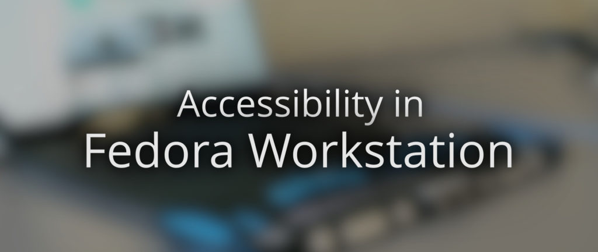

# Fedora Workstation 的无障碍功能

## 译文信息

- 原文：[Accessibility in Fedora Workstation](https://fedoramagazine.org/accessibility-in-fedora-workstation/)
- 作者：[Christian Fredrik Schaller](https://fedoramagazine.org/author/uraeus/)
- 许可证：[CC-BY-SA 4.0](http://creativecommons.org/licenses/by-sa/4.0/)
- 译者：暮光的白杨
- 日期：2022-06-27

----

## 正文

当 Sun Microsystems 决定在 Solaris 上使用 GNOME 时，他们做出了第一次支持 Linux 下无障碍功能的共同努力。

Sun 组建了一个团队，专注于构建使 GNOME 2 完全支持无障碍功能的可用性组件，并与硬件制造商合作以确保诸如盲文设备之类的设备正常运作。我甚至听说由于这项努力，GNOME 和 Linux 在一段时间内拥有任何操作系统中最佳的无障碍支持。随着 Sun 开始陷入危机并被 Oracle 收购后，这种支持无障碍可用性的努力最终也并未因社区随后试图补救这一被荒废的行动而得以延续。在这段时光中，来自 Igalia 的工程师们非常活跃，试图保持无障碍可用性的良好运作。

但多年来，我们确实不再关注某些事务，而且我们知道 GNOME 3 的许多部分在无障碍支持方面都不是很好。在过去几年的红帽雇员招聘中，我们一直在努力确保我们在招聘时注意多样性和包容性，并努力确保我们不会意外地根据性别或人种等原因预先选择代表性不足的应聘者。但直到最近，我们才意识到我们并未没有对围绕允许各种残疾人士使用我们的软件的无障碍支持技术给予应有的关注。因此，我很高兴地宣布红帽刚刚聘请了盲人软件工程师 Lukas Tyrychtr 来领导我们的工作，以确保 Red Hat Enterprise Linux 和 Fedora Workstation 具有出色的无障碍支持！

任何曾在大公司工作过的人都知道，为新计划申请资金通常很困难，而且可能需要等待很长时间，我想强调一下，我对聘请 Lukas 从事可访问性工作的支持如此快速和容易感到非常惊讶。当 Jiri Eischmann 和我将项目申请发送给我的经理 Stef Walter 时，他在当天就同意并支持这个项目申请，然后当我们将其发送给 Linux 工程副总裁 Mike McGrath 时，他立即回复说他会将这个提案转给我们的软件工程高级副总裁 Tim Cramer。几天之内，我们就聘请了 Lukas。每个人都立即同意无障碍支持很重要，而且我们作为一家公司应该做的事情让我作为一名红帽员工感到无比自豪。

我们希望从中获得的不仅是为我们的用户提供更好的体验，还是可以让更多像 Lukas 这样富有才华的工程师在红帽从事 Linux 和开源软件方面的工作。我认为此时对 Lukas Tyrychtr 进行一次关于 Linux 下的无障碍支持状态以及他的关注点的快速采访是个好主意。

- Christian：嗨 Lukas，首先欢迎你作为全职工程师加入团队！你能告诉我们一些关于你自己的事情吗？

Lukas：嗨，Christian。我是一个完全失明的人，可以看到一些光，但也仅限于此。大约在 2009 年左右（大约在我 15 岁或 16 岁生日时），我开始对计算机感兴趣。首先，由于环境的原因，我开始接触 Windows，但不久之后因为一些好朋友的缘故我就遇到了 Linux。然后，在四年大学时光中，我之前积累的 Linux 知识发挥了作用，因此我轻松地通过所有的 Linux 理论和实践课程（是的，没有涉及 GUI，所以还不错，包括一些自定义内核配置调教）。 在那段时间里，红帽公司的同事联系我，问我是否愿意在我们的学院里帮助做一些与无障碍环境有关的演讲，这就是合作的开始。当然，我受雇于红帽也是此次合作目前的成果，但我希望这实际上只是漫长而富有成效的旅程的开端。

- Christian：所以作为一个盲人，你对 Linux 下的无障碍支持的状态有第一手的经验。你能告诉我们什么有效，什么无效？

Lukas：一般来说，支持情况都很好。纯文本控制台上的盲文支持基本上总是有效的（除了一些与 SELinux 相关的问题）。在控制台里实现文本转语音更具挑战性，因为所需的内核模块（ [Speakup](http://www.linux-speakup.org/speakup.html) ）并未包含在所有发行版中，不幸的是它也不包含在 Fedora 中，但幸运的是 Arch Linux 有此模块。当我们查看桌面环境在此方面的事务（无障碍功能支持）时，基本上只有一个屏幕阅读器（读取屏幕内容的应用程序），也就是 [Orca](https://wiki.gnome.org/action/show/Projects/Orca?action=show&redirect=Orca)，它在同类竟品中可能不是最佳的，但另一方面，窃取 Orca 的开发人员也不会很好。总的来说，至少与 GTK、Qt、主要的网络浏览器以及所有最近的基于 Electron 的应用程序一起使用时，桌面环境的无障碍功能是可用的。当然，无障碍支持接受的测试比我想要的要少得多，例如，屏幕阅读器的分段错误仍然会因此侥幸地从维护者眼皮底下悄悄溜过。但是，一般来说，基础部分工作情况良好。语音合成拥有更多自然的声音可能有助于吸引更多盲人用户，但说服所有用户并非易事。然后是开发人员认知的问题。确实，无障碍支持所需的一切早已存在于一些指南中，比如 GNOME 指南，但我遇到无障碍功能不受支持的次数比我预想的要多得多，例如没有任何无障碍功能标签的按钮，所以我想帮助所有开发人员修复他们的应用程序，这样无障碍功能回归错误就不会影响到用户，但我想这必须慢慢改进。

- Christian：所以你提到 Orca，是否还有其他应用程序被广泛使用以提供无障碍访问？

Lukas：老实说，很少。比如 Speakup ——一个内核模块，可以使用语音合成读取文本控制台，例如这些的屏幕阅读器，但是没有像 Espeakup（一个 Espeak 到 Speakup 桥）这样的东西基本上是无用的，因为它默认支持硬件合成器，但是这个硬件基本上是过去的想法，但我自己从来没有见过。然后是 [BRLTTY](https://brltty.app/)，该软件为屏幕控制台提供盲文输出，并为想要输出盲文的应用程序提供 API，因此驱动程序只需实现一次即可。基本上就是这样，除此之外还有在 Rust 中创建 Orca 替代品的一些努力，但这还有很长的路要走。当然，也存在其他无障碍需求支持的应用程序，但我对这些了解不多。

- Christian：你目前的工作重点是什么？

Lukas：目前，我的重点是检查在 GNOME 开发周期中一部分移植到 GTK 4 的应用程序，并确保它们的无障碍功能良好运行。我的工作包括添加很多缺失的标签，但在某些情况下，我会涉及更大的更改，例如，GNOME 日历似乎需要更多的工作。在所有这些过程中，也不应该忘记教育开发人员。解决这些问题后，应该通过扩展质量保证和自动持续集成检查来确保应用程序不会出现回归，但这是一个更遥远的目标。

- Christian： Lukas，非常感谢你与我们的此次交谈，如果有其他人有兴趣帮助解决 Fedora Workstation 的无障碍功能问题，那么与您联系的最佳地点是什么？

实际上，目前联系我的最简单方法是发送电子邮件至 [ltyrycht@redhat.com](mailto:ltyrycht@redhat.com)。我很高兴与任何想要帮助 Fedora Workstation 改进无障碍功能支持的人交谈。