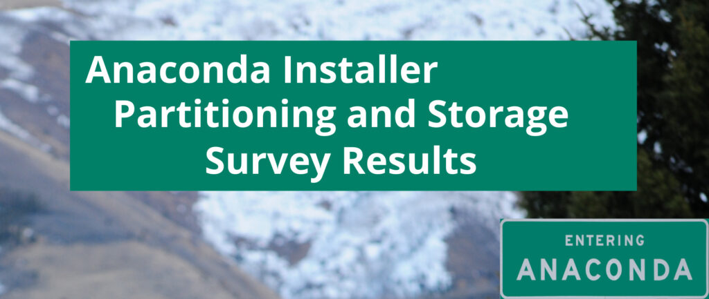
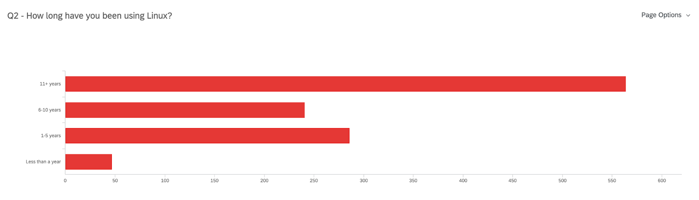
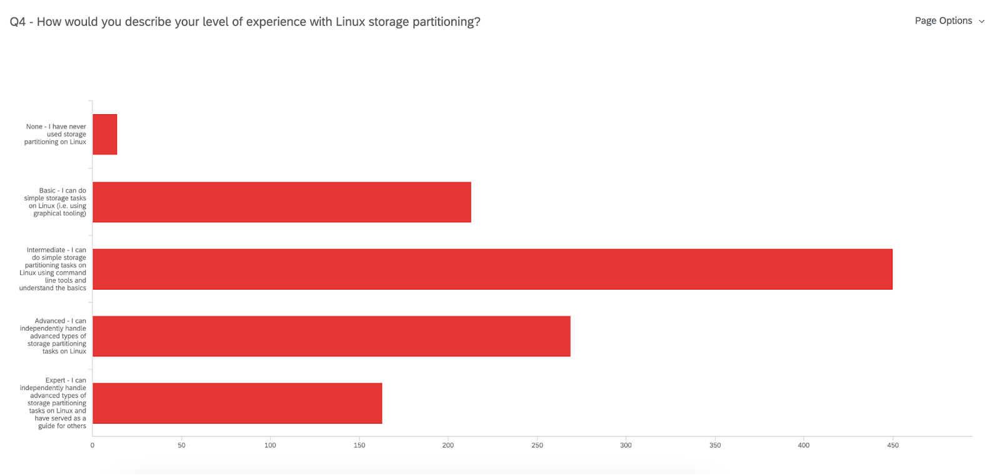
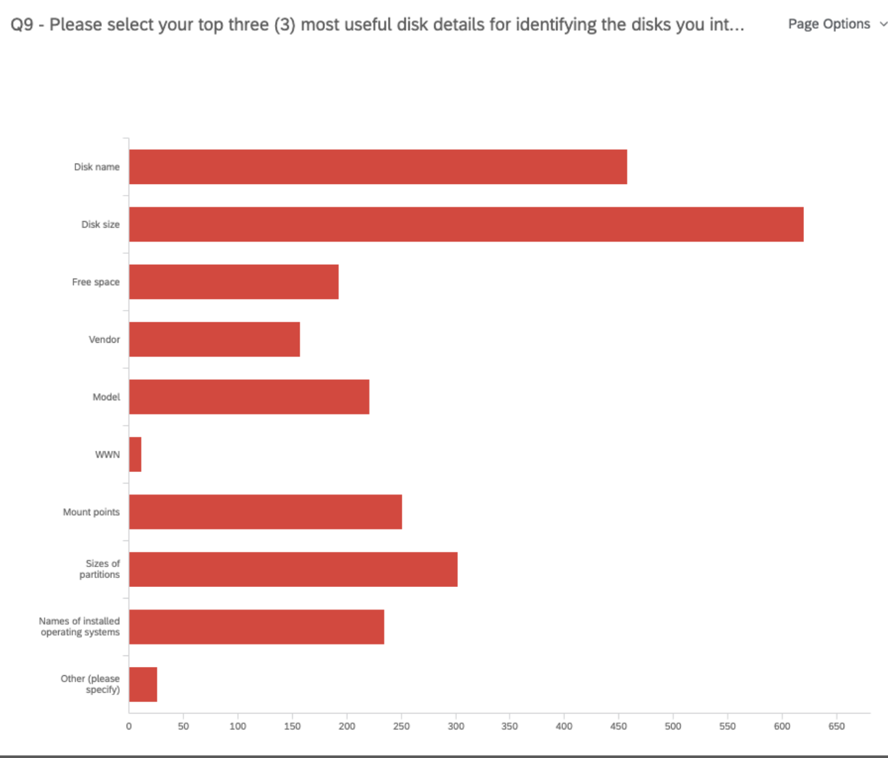
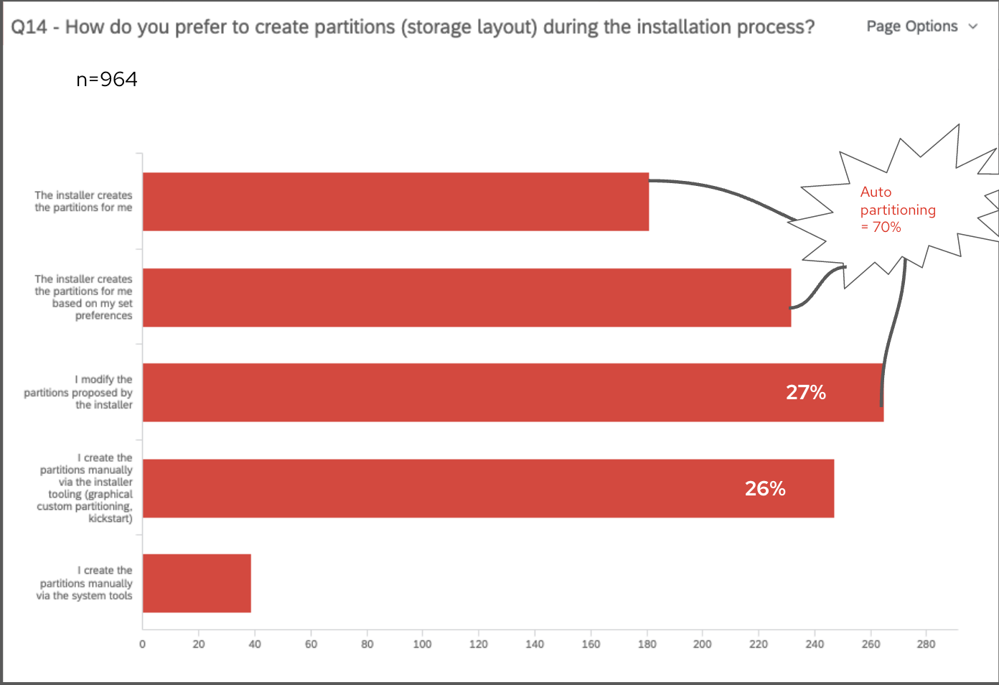

# Anaconda 安装器分区和存储调查结果

## 译文信息

- 源文：[Anaconda Web UI storage feedback requested!](https://fedoramagazine.org/anaconda-installer-partitioning-and-storage-survey-results/)
- 作者：[Flo Forno](https://fedoramagazine.org/author/fforno/)
- 译者：暮光的白杨
- 许可证：[CC-BY-SA 4.0](http://creativecommons.org/licenses/by-sa/4.0/)
- 日期：2023-04-26

----

  
由 [David Cantrell](https://fedoraproject.org/wiki/User:Dcantrell) 拍摄的背景照片（已裁剪）

早在今年 1 月下旬，我们就发布了一项[调查]，重点关注 [Anaconda] 安装器（RHEL、CentOS 和 Fedora 的操作系统安装程序）的分区首选项。由此我们收到了 1269 份回复信息！感谢所有参与调查的人。我们收集的数据将帮助 Anaconda 团队继续提供最适合大多数人需求的系统安装器。

[调查]: ./anaconda-need-feedback.md
[Anaconda]: https://docs.fedoraproject.org/en-US/quick-docs/anaconda/anaconda/

鉴于参与率很高，我们很高兴与你一同分享主要结果和发现！

## 我们的用户是谁？

首先，我们想了解我们的用户是谁。从人口统计问题的最常见答复中，我们得出以下结论：

- （在 1138 个回复中）有 96% 的人是 Linux 桌面/工作站用户
- （在 1138 条回复中）有 50% 的人拥有 11 年以上的 Linux 使用经验
- 有 90% 的人使用 Fedora（有时与 RHEL、CentOS、Ubuntu 或 Debian 结合使用）

450 名用户认为自己在 Linux 存储分区方面具有**中级专业知识**。

  
*n=1138*

  
*n=1109*

这些数据意味着你们中的大多数人已经在桌面或工作站上使用 Linux 和（不仅限于） Fedora 超过十年了！这真是令人印象深刻！但是当涉及到 Linux 存储分区时，仍然有很多东西需要学习——而我们在这里是为了让学习变得更容易。

## 使用什么存储和分区？

### 存储

在我们更好地了解参与者是谁后，我们随即询问有关你当前存储和分区设置的问题。例如，我们发现，在确定要用于安装系统的磁盘时，大多数人主要关注磁盘名称、大小和分区大小。这有助于团队决定将哪些更有帮助的数据显示在磁盘选择屏幕上。

  
*n=969*

### 分区

然后，我们询问了你对分区的偏好和期望。从过去的研究中，我们不断看到对自动分区和自定义分区几乎持平的偏好，因为它们各自满足不同的需求。 然而，这项调查表明，人们更倾向于自动分区，但你们中的许多人明确表示，需要安装器允许用户对分区进行一些自定义。我们团队当然牢记这一点。事实上，我们向你问过“在安装过程中你更喜欢如何创建分区（存储布局）？” 并且占大多数的多项选择分别是“安装器为我创建分区”、“安装器根据我的设置首选项创建分区”或“我修改安装器建议的分区”。这三个选项表示某种形式的自动分区，导致 964 个回复中有 70% 的人更喜欢自动分区。

  

## Anaconda 的下一步发展

最后，我们希望你能对 Anaconda 的下一步发展提出意见。开发团队一直在考虑几种不同的方法，受访者中的大多数人将“能够通过简化的步骤选择预定义的分区配置选项”列为第一选择，紧随其后的是“能够定制分区的细节”。这告诉我们，你们期待获得更多的分区引导体验，尤其是考虑到你们中的大多数人还觉得关于 Linux 存储分区还有很多东西需要学习。敬请关注 Anaconda 的下一步发展!

## 感谢所有参与者

再次感谢所有花时间填写调查的人。你们为团队提供了大量的数据，以便为 Anaconda 安装器的未来发展考虑。