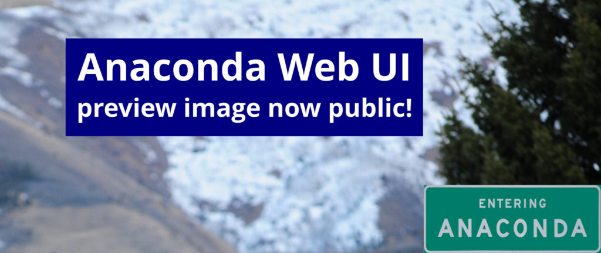
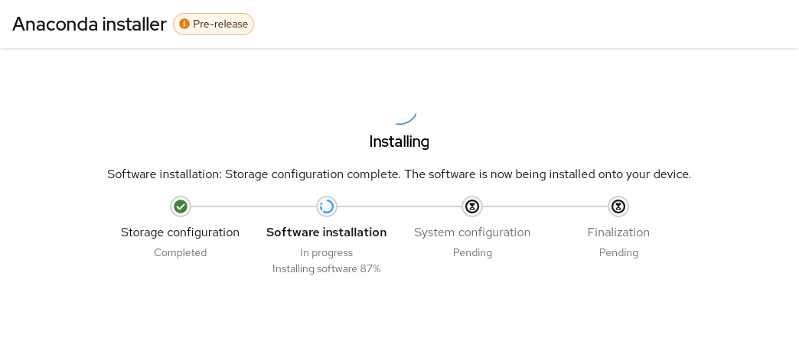

# Anaconda Web UI 预览镜像现已发布

## 文章信息

- 原文：[Anaconda Web UI preview image now public!](https://fedoramagazine.org/anaconda-web-ui-preview-image-now-public/)
- 作者：[Jiří Konečný](https://fedoramagazine.org/author/jkonecny/)
- 许可证：[CC-BY-SA 4.0](http://creativecommons.org/licenses/by-sa/4.0/)
- 译者：暮光的白杨
- 日期：2022-11-22

----

> 
> *背景照片由 [David Cantrell](https://fedoraproject.org/wiki/User:Dcantrell) 拍摄（已裁剪）*

我们很高兴地宣布新 Anaconda Web UI 的第一个公开预览镜像！我们的愿景是重新构想和现代化我们的安装器的用户体验（请参阅我们的博客文章 “[Anaconda 正在获得新套装](https://communityblog.fedoraproject.org/anaconda-is-getting-a-new-suit/)”）。我们正在通过重新设计各个方面的用户体验来实现这一点，以使其更易于所有人使用。

今天，我们想介绍一下我们的公开预览版[计划](https://fedoraproject.org/wiki/Changes/Anaconda_Web_UI_preview_image)，因为我们的新项目已经到了核心代码功能已经开发完毕并且新界面可以用于实际安装的状态。

所以，我们给了你一些好玩的东西！🙂

## 为什么是公开预览镜像？

通过尽快为你提供一个有效的 ISO，你将有机会帮助我们定义这个新 UI。这项任务使我们能够重新思考我们拥有的东西并找到克服新 UI 带来的挑战的新方法，而不是重新创建我们已经拥有的东西。请借此机会向我们提供你的反馈，以帮助我们创建有史以来最好的操作系统安装程序！

请让我们知道你对 Anaconda 的要求。**哪些功能**对你很重要，**为什么**这些很重要？这将使我们能够优先关注开发和设计。请参阅下文了解如何[联系我们](https://hanjingxue-boling.github.io/Whiteboard/translation/anaconda-webui-image-go-public/#_5)。

## 如何获得公开预览镜像？

请前往[此处](https://fedorapeople.org/groups/anaconda/webui_preview_image/x86_64/webui_latest_install.iso)下载 Anaconda 预览版镜像。

非常感谢[镜像构建](https://github.com/osbuild/osbuild-composer)团队为我们提供了一种使用 Fedora 37 Workstation GA 内容构建 ISO 的方法。我们计划通过上面的链接为你提供包含了 Anaconda Webui 安装器最新的功能和错误修复的 ISO 镜像文件。安装有效负载（已安装的系统数据）还没有更新。我们将通过发送邮件至 [anaconda-devel@lists.fedoraproject.org](mailto:anaconda-devel@lists.fedoraproject.org) 并抄送至 [devel@lists.fedoraproject.org](mailto:devel@lists.fedoraproject.org) 来宣布 ISO 镜像的重要更新。请订阅其中任何一个以获取有关新闻的信息。这样，我们将能够迭代您的反馈。

## 预览版 ISO 将提供什么？

预览版 ISO 将允许你在安装系统时体验 Anaconda 的新 UI，因此你可以尽早向我们提供反馈。但是，它还处于开发周期的早期阶段。我们建议你不要使用此 ISO 文件在存储着重要数据的关键基础设施或机器上安装系统。

让我们来看看你可以用 ISO 做什么更有趣的事情：

- 选择安装语言
- 选择你的磁盘
- 自动磁盘分区。**注意！这会将所选磁盘的数据全部擦除。**
- 自动安装 Fedora 37 GA Workstation
- 你所选择的安装方案的基本概览页面
- 安装进程页面
- 内置帮助（仅在安装目的地页面）

## 已知问题：

- 在引导加载程序菜单中，你将看到 “Install Fedora 38”，这是预期会发生的；因为安装环境来自 Rawhide。但是，安装的内容将是 Fedora 37 GA，所以不用担心。
- 在 Virtual Box Mac 版上使用此 ISO 可能会遇到分辨率问题。我们正在努力解决这个问题。
- 纵横比和窗口处理。我们知道我们需要更好地解决这个问题，欢迎提供反馈。

## 如何提供反馈？

你的反馈对于拥有一个你和我们都引以为豪的项目至关重要，因此请与我们分享你遇到的问题：

- 使用我们的 [GitHub 仓库讨论页面](https://github.com/rhinstaller/anaconda/discussions/new?category=web-ui)
- 向 [anaconda-devel@lists.fedoraproject.org](mailto:anaconda-devel@lists.fedoraproject.org) 邮件列表发送反馈邮件

请花点时间玩玩 Web UI 并告诉我们你的想法。什么正常工作，什么出现故障，以及你想要什么。理想情况下，请关注未来的更新动态并告诉我们情况是在变好，还是在变糟。

我们非常期待你的反馈，我们很感谢大家在这个旅程中支持我们！