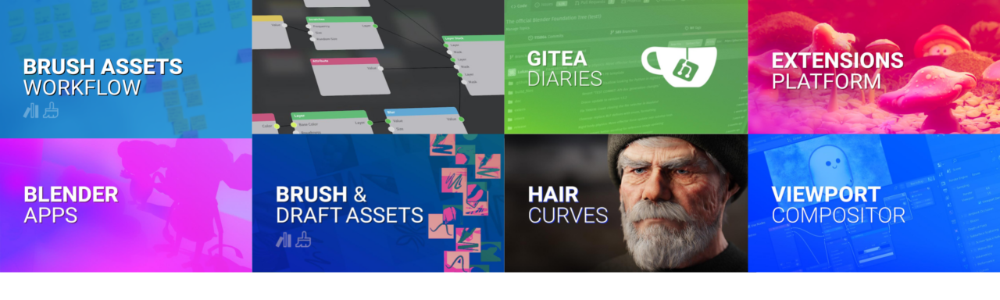

# 2023 年值得期待的 Blender 项目

## 译文信息

- 原文：[Projects to look forward to in 2023](https://www.blender.org/development/projects-to-look-forward-to-in-2023/)
- 作者：[Ton Roosendaal](https://www.blender.org/author/ton/)
- 许可证：[CC-BY-SA 3.0](https://creativecommons.org/licenses/by-sa/3.0/)
- 译者：暮光的白杨
- 日期：2023-01-06

----

即将到来的一年对 Blender 来说将很有趣。除了 blender.org 社区努力保持核心功能稳定和不断更新之外，几个备受瞩目的项目已经开始可能会在今年实现。

## Vulkan 和 Metal 支持

Blender 开发人员多年来一直致力于将代码迁移到新的跨平台 Vulkan 图形库。预计 OpenGL 将在未来几年内被业界弃用。继任者 “Vulkan” 有望提供许多 OpenGL 永远无法提供的功能，例如多线程和光线追踪。Blender 基金会承诺投入开发人员时间在 2023 年完成该项目。

在这个开发工作进行的同时，Apple 工程师一直致力于使 Blender 与 MacOS 的 Metal 图形 API 完全兼容。这适用于渲染（循环、视口）和整个 UI 的绘制。该项目预计将于 2023 年完成。

## 实时视口合成

这个项目的目的是开发一个新的合成器后端，利用 GPU 加速来获得足够的性能来进行实时交互。

第一步，这个后端将用于驱动新的视口合成器，它直接在 3D 视口中应用合成器编辑器节点树的结果。艺术家不必等待完整的渲染开始合成，从而允许对项目进行更快、更具交互性的迭代。

从长远来看，它的目标是为现有的合成器编辑器带来 GPU 的能力。

[实时合成器](https://code.blender.org/2022/07/real-time-compositor/){ .md-button }

## 笔刷资产

Blender 的资产系统和浏览器将完全支持用于绘画和雕刻的画笔。 这使得使用、制作和与他人共享笔刷包变得容易。

[笔刷和资产草案](https://code.blender.org/2022/11/brush-and-draft-assets/){ .md-button }

[笔刷资产工作流程](https://code.blender.org/2022/12/brush-assets-workflow/){ .md-button }

## 程序纹理编辑

Bender 中的这个新纹理系统允许对程序纹理节点进行分层编辑。两全其美的结合！使用程序纹理，您可以更高效地设计高质量的 PBR 材料。

该项目于 2022 年初开始，预计今年完成。

[分层纹理设计](https://code.blender.org/2022/02/layered-textures-design/){ .md-button }

## Blender 应用

由于 Blender 使用 Python 脚本进行了非常高水平的自定义，因此可以使用您自己的 UI 和编辑器布局从头开始构建 Blender。这与捆绑的 `.blend` 文件（assets、data）相结合，您可以创建它来制作自定义工具或完整的体验。

[Blender Apps](https://code.blender.org/2022/11/blender-apps/){ .md-button }

## 扩展插件平台

Blender 基金会将推出一个由社区管理的官方网站，用于共享、发现和下载扩展插件、主题、keympas 和资产库（asset libraries）。

此扩展站点将只提供与 [GNU GPL](https://en.wikipedia.org/wiki/GNU_General_Public_License) 兼容的软件，或 [CC-BY–SA](https://en.wikipedia.org/wiki/Creative_Commons_license#Types_of_licenses) 兼容的内容。平台上不会发生商业化。它旨在吸引艺术家和扩展插件开发人员在 blender.org 上自由分享他们的作品，即使他们选择使用第三方服务通过相同或相似的扩展来产生收入。

[Blender 扩展插件平台](https://code.blender.org/2022/10/blender-extensions-platform/){ .md-button }

## 下一代 Eevee

Blender 的实时照片写实渲染引擎 EEVEE 自从在 Blender 2.80 中推出以来一直在不断发展。我们的目标是让它在资产创建和最终渲染方面都是可行的，并支持广泛的工作流程。然而，然而，由于最新的硬件创新，许多新技术已经变得可行，EEVEE 可以利用它们。

你可以期待新的功能，如屏幕空间全局照明、硬件光线追踪和体积渲染的改进。

[EEVEE 的未来](https://code.blender.org/2021/06/eevees-future/){ .md-button }

## 仿真节点

随着去年几何节点获得头发支持，今年将致力于使用节点创建实时模拟。为了使这项工作正常进行，视口将以固定的（物理）时钟运行，在编辑时提供物理系统的持续更新。

[几何节点研讨会 2022](https://code.blender.org/2022/11/geometry-nodes-workshop-2022/){ .md-button }

## 使用 Gitea 升级 developer.blender.org

Blender 开发人员目前使用 “Phabricator” 网站来管理他们的项目和进行问题跟踪。 不幸的是，该软件已停产，因此我们找到了一个很好的替代品。我们的选择是使用 [Gitea](https://gitea.io/en-us/) 项目，这是一个类似于 github 的完全免费/开源软件管理项目。

主要工作是将 Blender 整整 20 年的开发历史迁移到这个新的（基于 git 的）软件管理系统。预计迁移日期为今年 2 月。

[Gitea 日志：第 2 部分](https://code.blender.org/2022/08/gitea-diaries-part-2/){ .md-button }

## 角色动画

动画和索具将得到全面改造，特别是将核心设计升级到我们现在已知的规格，我们预计在未来几年将需要这些规格。一大群开发人员和动画专家都参与其中。启动仪式是在上次 Blender 大会上进行的，你可以在下面阅读报告。

[角色动画的未来](https://code.blender.org/2022/11/the-future-of-character-animation-rigging/){ .md-button }

## 还有更多！

Grease Pencil 团队将带着雄心勃勃的计划而来，令人兴奋的纹理绘画和雕刻加速即将到来，Blender 的渲染 API 将允许 Hydra 委托……大部分这些内容你可通过 [Blender 代码博客](https://code.blender.org/)来跟随关注。

我代表大家，祝愿 2023 年一切顺利！

Blender 基金会主席，Ton Roosendaal。