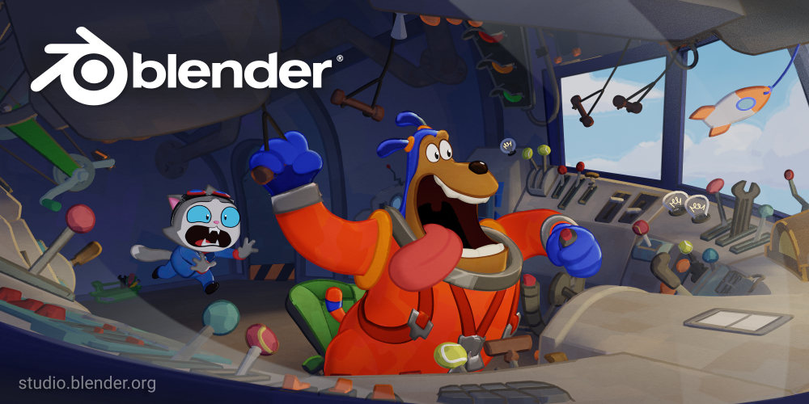

# Blender 3.6 LTS 现已发布

## 译文信息

- 原文：[Blender 3.6 LTS Release](https://www.blender.org/press/blender-3-6-lts-release/)
- 作者：[Pablo Vazquez](https://www.blender.org/author/venomgfx/)
- 许可证：[CC-BY-SA 3.0](https://creativecommons.org/licenses/by-sa/3.0/)
- 译者：暮光的白杨
- 日期：2023-06-30

----

## 正文

Blender 基金会和在线开发者社区很自豪地推出 Blender 3.6 LTS！

  
<grey>Blender 3.6 LTS splash by Blender Studio. <a href="https://www.blender.org/download/demo-files/#splash">Download this file.</a></grey>

### 新功能

Blender 3.6 LTS 是进入 4.x 系列之前的最后一个版本，重点关注稳定性，以确保这是一个可以在未来几年坚持使用的出色版本。

尽管如此，此版本带来了大量新功能和性能改进：

- [模拟节点]，几何节点的下一个飞跃
- 新的 [UV 打包引擎]
- [动画改进]
- 更快的 [FBX I/O]
- 多项 [USD 改进]，包括曲线/头发导出
- AMD、Intel® Arc™ 和 Apple Silicon GPU 上的[循环加速]
- 网格编辑和几何节点性能改进
- [库覆盖重新同步]的主要更新
- [用户界面]改进
- 包含 [VDM Brush Baker] 附加组件
- 等等，还有更多

[模拟节点]: https://www.blender.org/download/releases/3-6/#simulation
[UV 打包引擎]: https://www.blender.org/download/releases/3-6/#uv
[动画改进]: https://www.blender.org/download/releases/3-6/#animation
[FBX I/O]: https://wiki.blender.org/wiki/Reference/Release_Notes/3.6/Pipeline_Assets_IO#FBX
[USD 改进]: https://wiki.blender.org/wiki/Reference/Release_Notes/3.6/Pipeline_Assets_IO#USD
[循环加速]: https://www.blender.org/download/releases/3-6/#cycles
[库覆盖重新同步]: https://wiki.blender.org/wiki/Reference/Release_Notes/3.6/Core#Library_Overrides
[用户界面]: https://wiki.blender.org/wiki/Reference/Release_Notes/3.6/User_Interface#User_Interface
[VDM Brush Baker]: https://docs.blender.org/manual/en/3.6/addons/baking/vdm_brush_baker.html

一个新的 [Human Base Meshes 资源包][human]已添加到 Blender.org 的演示文件部分。

请浏览[发行说明]，深入了解新功能。

[发行说明]: https://www.blender.org/download/releases/3-6/
[human]: https://www.blender.org/download/demo-files/#assets

### 长期支持

随着 [Blender 2.93 LTS] 产品寿命结束，我们发布了新的长期支持版本。**直到 2025 年 6 月之前，Blender 3.6 LTS 将一直获得修复和支持。**

对于正在进行的项目，[Blender 3.3 LTS] 直到 2024 年 9 月之前，仍会得到积极支持。

[Blender 2.93 LTS]: https://www.blender.org/download/lts/2-93/
[Blender 3.3 LTS]: https://www.blender.org/download/lts/3-3/

### 感谢！

感谢 Blender 社区以及向 [Blender 发展基金]捐款的 3250 名个人和 33 个组织，实现了另一个令人兴奋的里程碑。

[Blender 发展基金]: https://fund.blender.org/

Happy Blending!

Blender 团队  
2023-06-27