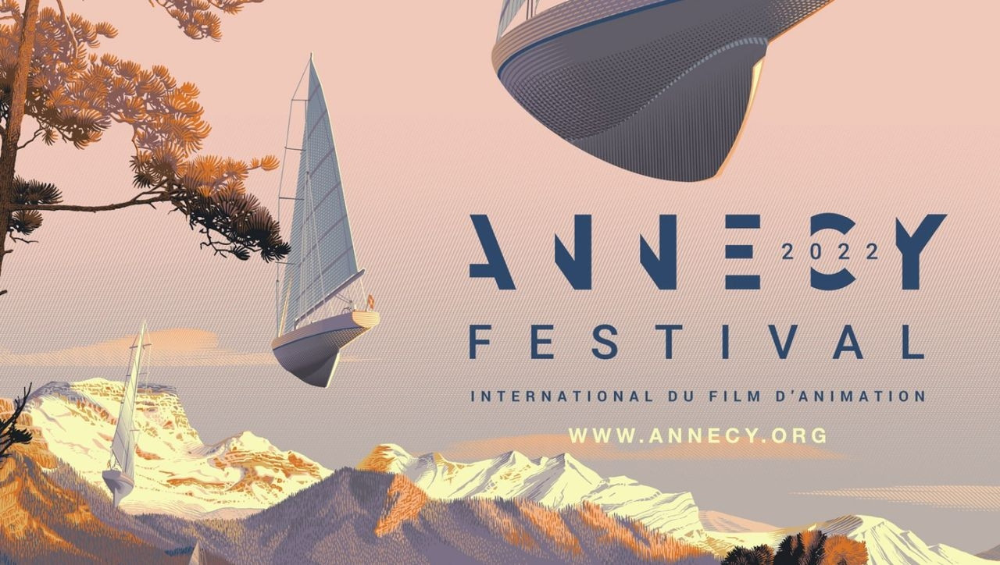
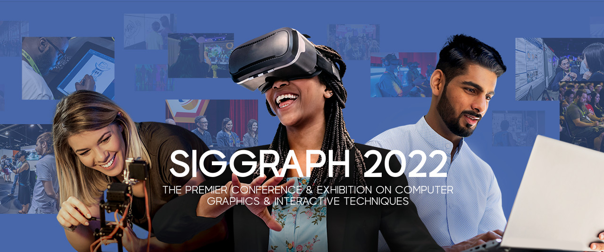
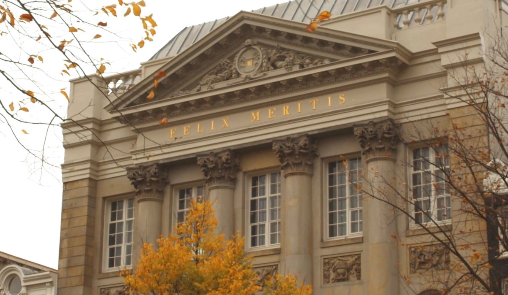

# Blender 在 2022 年的活动

## 作品信息

- 原文：[Blender Events in 2022](https://www.blender.org/news/blender-events-in-2022/)
- 作者：[Pablo Vazquez](https://www.blender.org/author/venomgfx/)
- 许可证：[CC-BY-SA 3.0](https://creativecommons.org/licenses/by-sa/3.0/)
- 译者：暮光的白杨
- 日期：2022-05-19

----

## 正文

>2022 年对于 Blender 来说是重要的一年，庆祝项目开源 20 周年，回归大型活动以与社区和行业建立联系。

### 安纳西国际动画电影节

6 月 13 日至 18 日，法国[阿讷西](https://zh.wikipedia.org/wiki/%E5%AE%89%E9%8C%AB)

Blender 今年出席的第一个大型活动是[安纳西国际动画电影节](https://www.annecy.org/home)。[与 2018 年一样](https://www.blender.org/press/blender-at-annecy-2018/)，Blender 将在 MIFA（6 月 14 日至 17 日）拥有自己的展位。

Blender Studio 团队的一部分成员将参加此次活动，因为这将是 Open Movie 项目 (Sprite Fright) 首次获得安纳西国际动画电影节 (FIFA) 的提名！

此外，*Conservatoire à Rayonnement Régional* 的学生创作了 Sprite Fright 的替代乐谱。这首音乐将由一支管弦乐队演奏；你可以在安纳西城堡博物馆的电影音乐会收看此次表演，时间是 6 月 15 日晚上 7 点和 9 点。

安纳西电影节是与工作室和个人艺术家建立联系的绝佳机会。

2018 年，在 Blender 2.80 改进发布之前，一大群人[聚集在一起观看](https://www.youtube.com/watch?v=23m0eG1Qr1c) Daniel Martinez Lara 的油性铅笔演示。今年 Daniel 将再次加入活动团队。我们将组织与 Blender 专业人士的见面会，敬请关注[社交媒体](https://twitter.com/blender)上的更多信息。

我们迫不及待地想看看人们现在用 Blender 创造了什么！

请访问[他们的网站](https://www.annecy.org/)以了解有关安纳西电影节的更多信息。

### SIGGRAPH

8 月 8 日至 11 日，加拿大温哥华

最大的计算机图形会议又回来了，Blender 将再次成为它的一部分，就像它自 1999 年以来一样。

这将是自 Blender 2.80 标志性发布以来的第一个 SIGGRAPH，Blender 团队正在为社区和行业准备一个更大的,用于网络，或者只是简单的聚会的展位。

使用代码 **SBF22** 注册时可享受特别折扣。

请访问[他们的网站](https://s2022.siggraph.org/)以了解更多关于 SIGGRAPH 的信息。

### Blender 会议

10 月 27 日至 29 日，荷兰阿姆斯特丹

轰轰烈烈地结束了这一年，Blender 活动又回来了，而且规模比以往任何时候都更大。

BCON22（Blender Conference 2022）将在阿姆斯特丹市中心美丽的 18 世纪新古典主义 Felix Meritis 举行，届时将接待最多的游客。

门票销售将于 6 月底开始，同时也将举行会谈征集和 Suzanne 颁奖典礼的提交。

关注 [@BlenderConf](https://twitter.com/BlenderConf) 以获取最新动态。