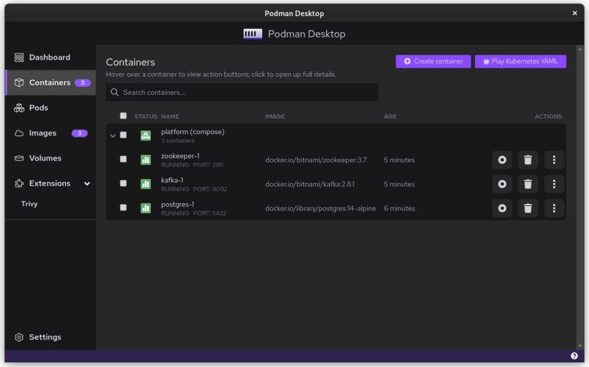
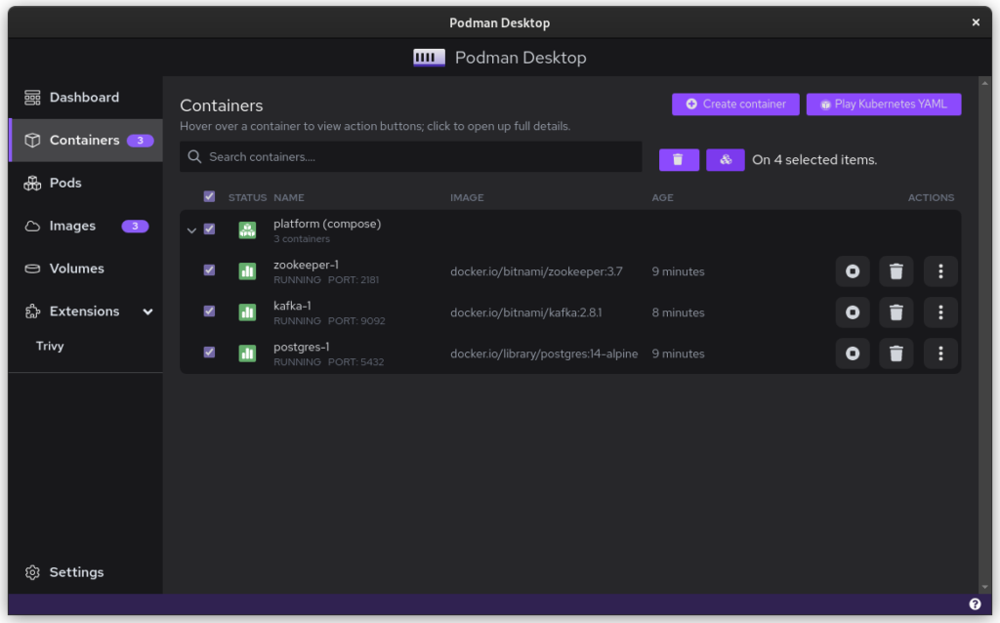
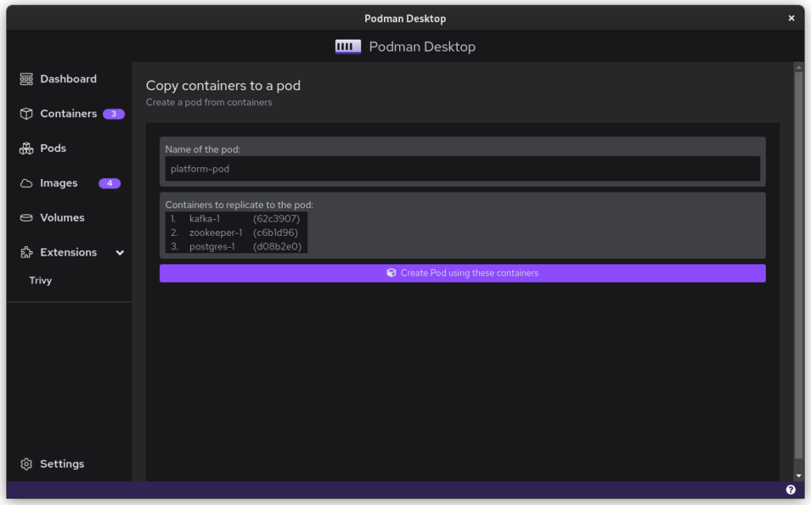
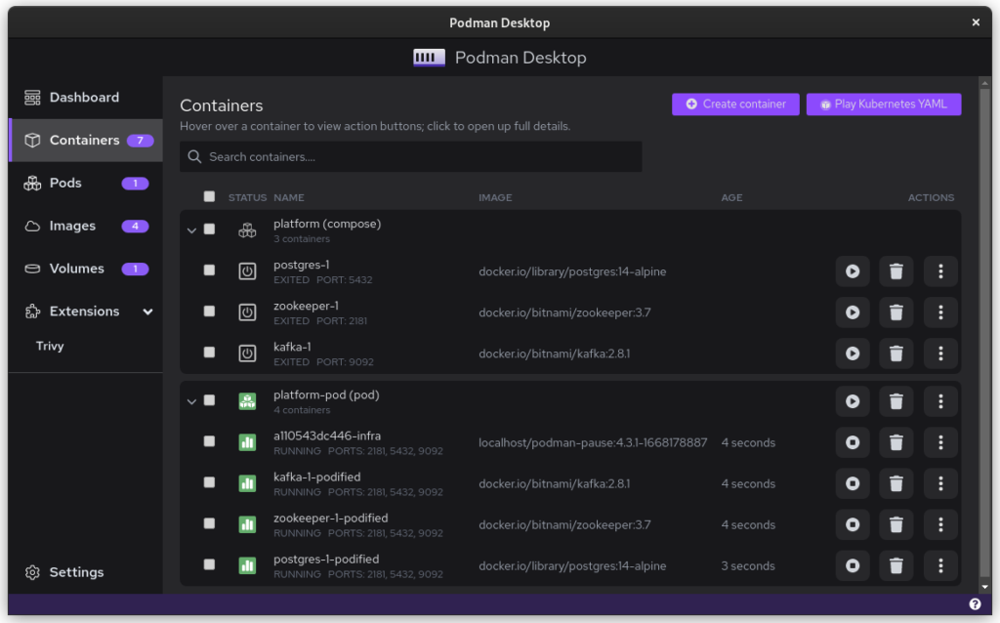
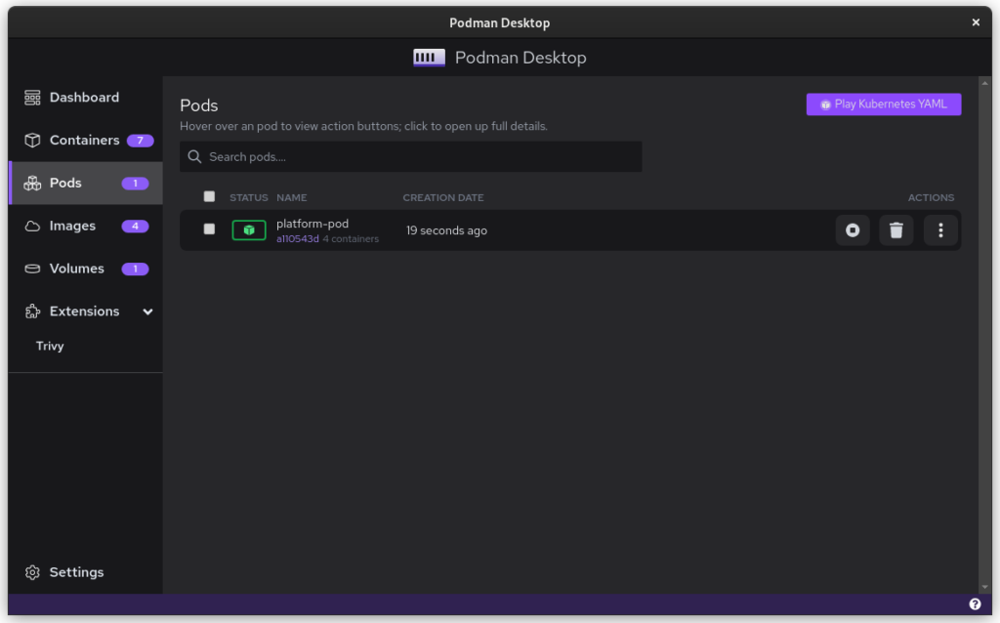
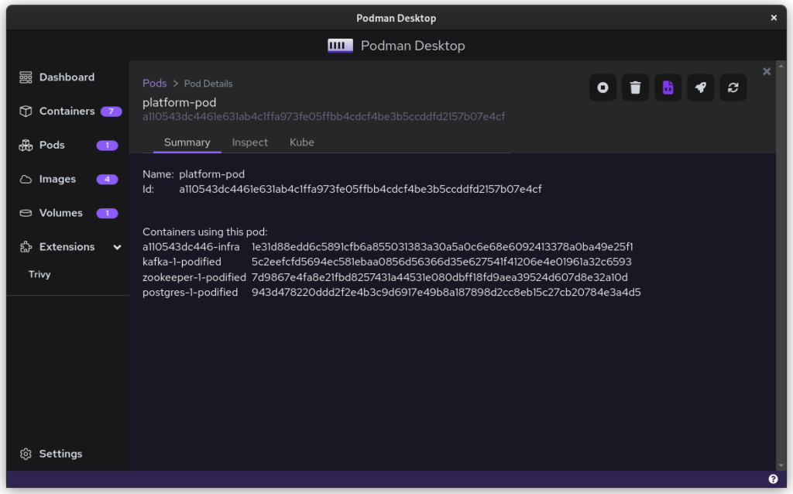
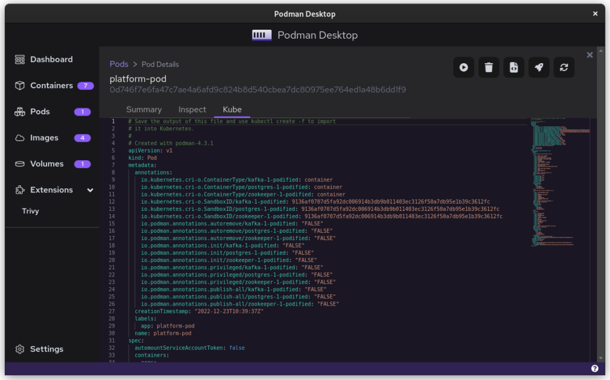
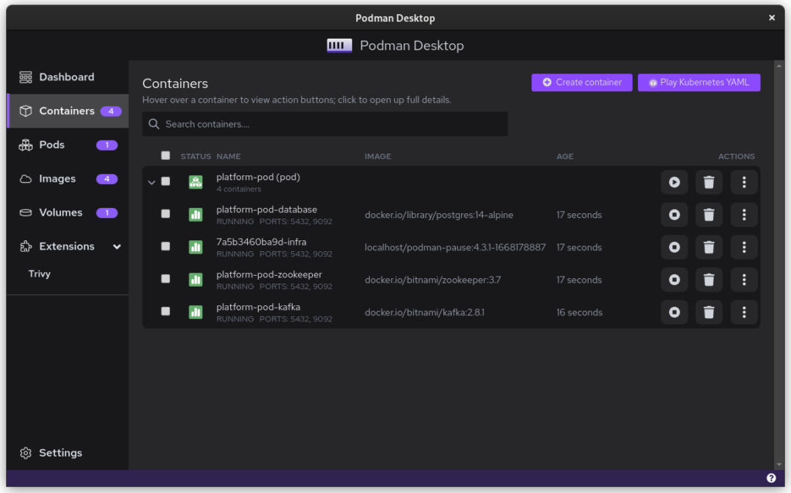
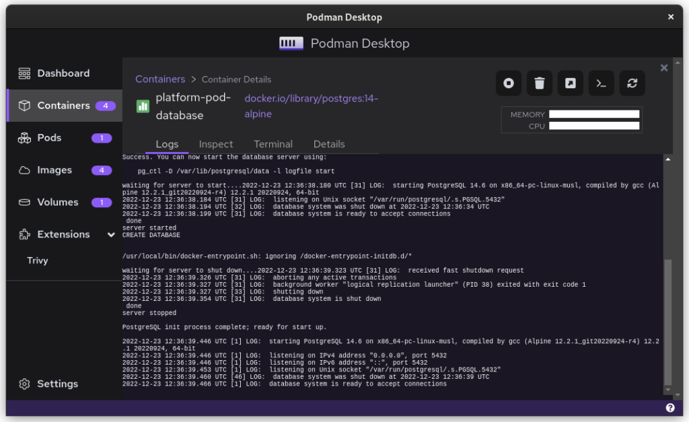
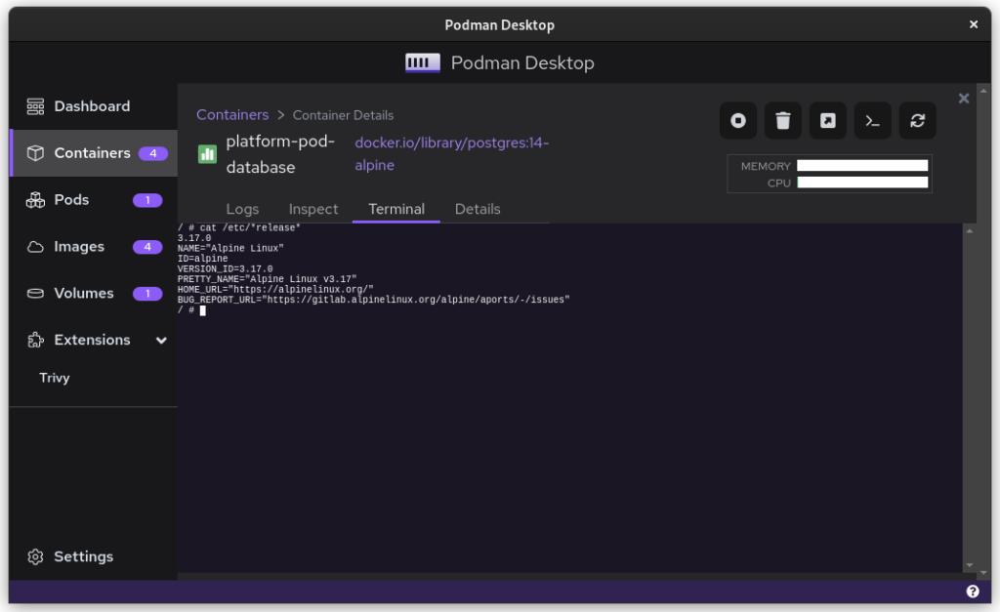

# Docker 和 Fedora 37：迁移至 Podman

## 译文信息

- 原文：[Docker and Fedora 37: Migrating to Podman](https://fedoramagazine.org/docker-and-fedora-37-migrating-to-podman/)
- 作者：[Kevin Degeling](https://fedoramagazine.org/author/eonfge/)
- 许可证：[CC BY-SA 4.0](http://creativecommons.org/licenses/by-sa/4.0/)
- 译者：暮光的白杨
- 日期：2023-01-04

----


在前几期（[Fedora 32](https://fedoramagazine.org/docker-and-fedora-32/)、[Fedora 35](https://fedoramagazine.org/docker-and-fedora-35/)）文章中，重点关注如何在 Fedora Linux 上使用 Docker。本文将重点介绍这一漫长旅程的最后阶段；专注于将一个跨平台的生产设置从 Docker 迁移到 [Podman](https://podman.io/)。

## 背景

Docker 和 Podman 使用相同的[容器开放标准](https://opencontainers.org/)。在这个容器标准的基础上，有多种方法将容器组织在一起。Docker-Compose 和 Kubernetes 是这方面的两种主要技术，尽管像 [Ansible](https://fedoramagazine.org/using-ansible-to-configure-podman-containers/) 这样的工具也很流行。

但在业务方面，有很大的不同。Docker 与一个名为 [Docker Desktop](https://www.docker.com/products/docker-desktop/) 的[非自由](https://www.gnu.org/philosophy/categories.en.html)应用程序一起分发，而 Podman 在历史上从未有一个图形界面。Docker 于 2013 年开始上线，2016 年崛起。Podman 在 2018 年发布，最近两年才开始流行起来。

Podman 当然不是第一个出场的，它一直在打一场艰苦的战斗。不过在很多方面，这也是一个机会。Podman 可以避免 Docker 所犯的一些架构错误，而且它可以与 Docker 发布时还不存在的其他工具整合。

## 个人背景

之前关于 Docker 和 Fedora 的文章是基于作者[^1]的职业生活。在我[^1]工作的公司，当我入职时，我们严重依赖 Docker。这意味着我需要 Docker，我开始记录我的挣扎，最终导致了第一篇文章的产生。第二篇文章是后续文章，告知读者过去的大部分障碍都不再是问题。

## Podman Destkop

整个故事中的变革者是 [Podman Desktop](https://podman-desktop.io/)。它是一个跨平台的用户界面，允许 Linux、macOS 和 Windows 平台的团队进行协作。它的工作方式与 Docker Desktop 相同，包括捆绑虚拟机和 WSL 支持。这也意味着，Podman 现在为软件公司提供了一个完整的软件包。虽然过去 Linux 上的软件开发人员可以使用 Podman，但现在可以迁移整个跨平台协作的团队了。

## 从 Dokcer 迁移

那么，让我们开始从 Docker 迁移到 Podman。首先，你需要确保你安装了 podman 和 podman-compose。你可以从 [Flathub 轻松下载 Podman Desktop](https://flathub.org/apps/details/io.podman_desktop.PodmanDesktop)。

## 镜像文件

你不需要变更镜像文件本身。基于容器背后的开放标准，它们是相同的文件。

你现在会看到的一件事是，有大量公司和团体提供他们自己的镜像存储库[^2]。

- **hub.docker.com**（别名，docker.io）是 Docker 提供的，他们的工具一般地设置为 Hub.docker.com。
- **registry.gitlab.com** 是 GitLab 商业产品的 registry[^2]。 社区版本遵循相同的语法，例如：registry.gitlab.gnome.org
- **registry.fedoraproject.org** 是 Fedora 的 registry。该存储库还用于 Fedora 存储库中的 flatpak 应用。
- **Quay.io** 是 Red Hat 提供的存储库，其中包含 Podman 的所有工具以及 CentOS 镜像。

从 Docker 切换到 Podman 时，你必须适应的最大变化是你需要填写完整的镜像地址，而不仅仅是存根。例如：你不能使用 `postgres:14-alpine`，而是需要使用 `docker.io/library/postgres:14-alpine`。

## Docker-Compose 文件

Compose 文件是 Docker 专有的，它们不能与 Podman 一起使用。不过，你可以使用的是 podman-compose。更好的是，你可以启动基于 docker 的平台，然后使用 Podman Desktop 将当前配置导出为 Kubernetes 文件。

```
$ podman-compose -f ./docker-compose-platform.yaml up --detach
``` 

使用旧的 docker-compose .yaml 文件启动 podman-compose 后，你会看到许多容器在一个 “compose” 组中运行。这就是将事物转化至 Podman 世界的方式。在这里，你可以选择容器并创建 Pod。Pod 是在他们自己的网络中运行的容器的集合。

=== "用 `podman-compose` 启动的容器"

    

=== "全选以创建一个新的 pod"

    

=== "为 pod 命名"

    

=== "替换了 podman-compose 容器的 pod"

    

=== "一个单独的 pod"

    

=== "与 pod 相关的日志记录"

    

=== "要导出的 Kube 文件"

    

检查 Pod 后，你将拥有一个代表此容器集合的 Kube 文件。把它保存在某个地方，再给它一个独特的外观。你可能会删除一些不影响系统的运作的东西。毕竟，自动生成的文件会有一些人工痕迹。

演示中的所有三个文件都可以在这里找到。

- [docker-compose-platform.yaml](https://pagure.io/Magazine-DockerFedora37/blob/master/f/docker-compose-platform.yaml)
- [podman-kube-platform.yaml](https://pagure.io/Magazine-DockerFedora37/blob/master/f/podman-kube-platform.yaml)
- [podman-kube-platform-cleanup.yaml](https://pagure.io/Magazine-DockerFedora37/blob/master/f/podman-kube-platform-cleanup.yaml)

就这样了。你现在已经从 Docker 迁移到 Podman 了。要用 Kubernetes 文件启动 Podman，只需执行以下操作：

```
$ podman play kube podman-kube-platform-cleanup.yaml --replace
```

=== "1"

    

=== "2"

    

=== "3"

    

## GitLab CI/CD

GitLab 拥有大量开源和商业产品，可让你自动部署和测试你的系统。过去，在 GitLab 中使用 Docker 的人不得不求助于 Docker-in-Docker 解决方案。这让很多工程师很头疼。从 Docker 迁移到 Podman 将解决该问题。

例如，你可以使用 Podman 的官方镜像文件来轻松构建自己的产品镜像，如下：

```
runner-setup:
  image: quay.io/podman/stable:latest
  stage: setup
  script:
    - podman login registry.gitlab.com -u ${COMPANY_CI_USERNAME} -p                  ${COMPANY_CI_PASSWORD}
    - podman build --pull --no-cache -t registry.gitlab.com/company/platform:latest -f ./distribute/image .
    - podman push registry.gitlab.com/company/platform:latest
```

在这个例子中，我们使用基于 Fedora Linux 37 的 Podman 官方稳定版镜像。我们用它来构建基于 `./distribute/image` 文件的最新版本的平台。我们无需设置 Docker 就可以完成这一切。

## 工具和集成

最后，我们必须谈谈一些工具。并非所有工具从一开始就都能同样有效地工作。例如，Amazon 的 AWS CLI 提供的登录硬编码为 Docker。尽管如此，你仍然可以通过执行以下操作轻松登录 AWS：

```
$ aws ecr get-login-password --region $REGION | podman login --username AWS --password-stdin $AWS_REPO_NAME
```

你同样可以为 Podman 和 Docker 缓存你的 registry 凭据。你可以使用如下命令完成此事：

```
$ podman login registry.gitlab.com –authfile=${HOME}/.docker/config.json
```

## 替代方案/解决方法

也许所有这些听起来都不错，但你需要更多时间来说服你的团队和公司采用开源工具是件好事。在这种情况下，你可以将以下代码片段添加到 `.bashrc` 并使用 `Podman`，而无需更改团队的工具。

```
#Ensure that these aliases also affect other scripts
shopt -s expand_aliases

alias docker=podman
alias docker-compose=podman-compose
```

这也让你有机会测试你的设置，以防技术不兼容。你还可以使用 podman-docker（可通过 dnf 获得）自动将 Docker 命令转换为 Podman 命令。

## 实际迁移的经验

从 Docker 到 Podman 的迁移在我的开发团队中受到了好评。macOS 和 Windows 用户的桌面体验得到了改善，因为他们不再需要使用闭源工具。CI 系统的改进也有助于维护管道，并使集成测试运行得更快。

在日常工作中，团队真的很热衷于检查运行中的容器、管理镜像和清理临时卷的便利性。

从总体上看，从 Docker 到 Podman 的迁移进一步帮助公司限制了金融负债。macOS 和 Windows 上的开发人员不再依赖闭源产品。最后，这也意味着团队获得了一些 Kubernetes 的经验，这在未来肯定会有所回报。

## 总结

切换到 Podman 的好处确实超过了设置和迁移所需的时间。Podman 和 Podman Desktop 的未来是光明的，它为 Docker 带来的问题提供了一个很好的解决方案。

最后，对于我们 Fedora Linux 用户来说，还有一个很大的好处。开发中有一些漂亮的工具可以让我们的生活变得更加轻松。以下是应用程序 [Pods](https://github.com/marhkb/pods) 的屏幕截图。目前正在活跃开发中，但肯定会在未来被证明是一个有用的工具。

=== "1"

    

=== "2"

    

=== "3"

    


[^1]: 此处指 Kevin Degeling
[^2]: https://docs.docker.com/registry/