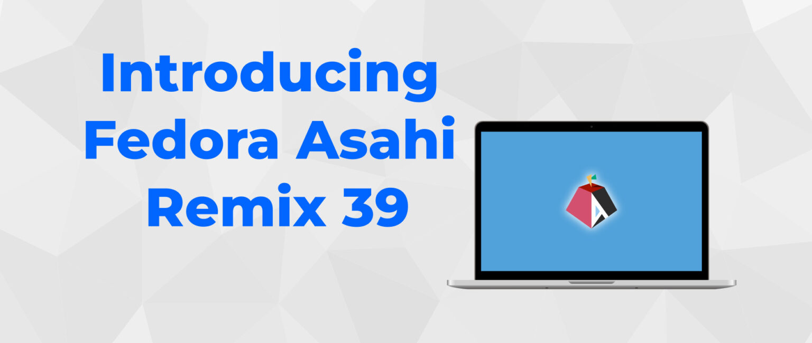

# Fedora Asahi Remix 39 简介

- 译文信息：
    - 原文：[Introducing Fedora Asahi Remix 39](https://fedoramagazine.org/introducing-fedora-asahi-remix-39/)
    - 作者：[Neal Gompa](https://fedoramagazine.org/author/ngompa/) 和 [Davide Cavalca](https://fedoramagazine.org/author/dcavalca/)
    - 许可证：[CC-BY 4.0](https://creativecommons.org/licenses/by/4.0/)
    - 日期：2023-12-19
    - 译者：暮光的白杨
    - 补档翻译时间：2024-02-12

----

> 
> *图片来自 AsahiLinux.org*

早在八月，我们就[宣布] Fedora Linux 即将登陆苹果 Silicon Mac。我们在 [Flock] 上发布了 [Fedora Asahi Remix]。这是一个 [Fedora Asahi SIG] 和 [Asahi Linux 项目]密切合作开发的发行版。

[宣布]: ./fedora-asahi-remix.md
[Flock]: https://flocktofedora.org/
[Fedora Asahi Remix]: https://asahilinux.org/fedora/
[Fedora Asahi SIG]: https://fedoraproject.org/wiki/SIGs/Asahi
[Asahi Linux 项目]: https://asahilinux.org/

今天，我们很高兴地宣布 Fedora Asahi Remix 39 现已正式发布！Remix 基于 Fedora Linux 39，通过广泛的平台和设备支持，在 Apple Silicon Mac 上提供了出色的体验。支持所有配备 M1 和 M2 芯片的 MacBook Air、MacBook Pro、Mac Mini、Mac Studio 和 iMac 系统。有关各个系统的详细信息，请参阅 Asahi Linux 网站上的[功能列表]。

[功能列表]: https://asahilinux.org/fedora/

Fedora Asahi Remix 提供 KDE Plasma 作为我们的旗舰桌面体验，它还具有基于 [Calamares] 的自定义初始设置向导。此外我们还提供 GNOME 变体，两种桌面变体都与 Fedora Linux 提供的功能相匹配。KDE 和 GNOME 均使用开箱即用的 Wayland，利用 XWayland 支持传统的 X11 应用程序。

[Calamares]: https://calamares.io/

Fedora Asahi 还支持非标准的 [OpenGL] 3.3（包括 GPU 加速几何着色器和变换反馈），以及世界上首个也是唯一一个[经过认证的符合标准的 OpenGL ES 3.1](https://www.khronos.org/conformance/adopters/conformant-products/opengles#submission_1007)（适用于 Apple Silicon）。得益于我们新颖的集成 DSP 解决方案，开箱即全面支持高品质音频。这提供了具有完整响度和动态范围的均衡音效，同时不会影响电池寿命。

[OpenGL]: https://www.opengl.org/

Fedora Asahi Remix 还为服务器工作负载和其他类型的无头部署提供了 Fedora Server 变体。最后，我们还为希望从头开始构建自己的体验的用户提供了最小化（Minimal）镜像。

你现在就可以按照我们的[安装指南]安装 Fedora Asahi Remix。我们还有一个[问题跟踪器]，用于跟踪已知错误；一个 [Discourse 论坛]，用于提供用户支持；还有一个 [Matrix 聊天室]。

[安装指南]: https://docs.fedoraproject.org/en-US/fedora-asahi-remix/installation/
[问题跟踪器]: https://pagure.io/fedora-asahi/remix-bugs/issues
[Discourse 论坛]: https://discussion.fedoraproject.org/c/neighbors/asahi/92
[Matrix 聊天室]: https://matrix.to/#/#asahi:fedoraproject.org

Fedora Asahi Remix 是多年合作的成果，我们希望你会喜欢在你的系统上运行它。我们期待着在未来扩展对更多设备和功能的支持，并继续为苹果 Silicon Mac 提供最好的 Linux 体验。