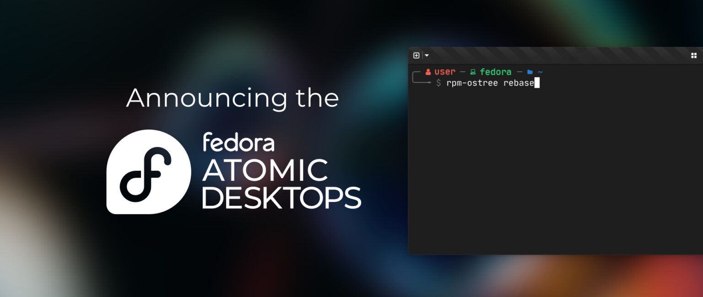

# Fedora Atomic Desktops 简介

- 译文信息：
    - 原文：[Introducing Fedora Atomic Desktops](https://fedoramagazine.org/introducing-fedora-atomic-desktops/)
    - 作者：[Joseph Gayoso](https://fedoramagazine.org/author/joseph/)
    - 许可证：[CC-BY 4.0](https://creativecommons.org/licenses/by/4.0/)
    - 译者：暮光的白杨
    - 日期：2024-02-10

----

>
> *原始图像由 Daimar Stein 提供*

<!-- end-of-list -->

> - 有关原子化设计的理念，另见：《[Atomic Design](https://atomicdesign.bradfrost.com/)》 —— Brad Frost

我们很高兴地宣布一个新的 [Fedora Spins] 系列诞生了：[Fedora Atomic Desktops]（Fedora 原子化桌面版）！随着 [Silverblue] 越来越受欢迎，我们看到 Fedora 推出越来越多的使用 [rpm-ostree] 技术的 spin 发行版。现在已经很难同时谈论所有这些话题了。因此，我们引入了一个新品牌，它将简化我们讨论 rpm-ostree 以及如何命名未来的 Fedora Atomic spin 分支的方式。

[Fedora Spins]: https://fedoraproject.org/spins/
[rpm-ostree]: https://coreos.github.io/rpm-ostree/
[Fedora Atomic Desktops]: https://fedoraproject.org/atomic-desktops/
[Silverblue]: https://fedoraproject.org/atomic-desktops/silverblue/

有些人可能会注意到这更像是重新介绍。原子项目（[Project Atomic]）于 10 年前随着原子主机（Atomic Host）的开发而启动。正如团队当时所说的那样，“原子主机包含一组来自操作系统的软件包（……），与 rpm-ostree 配套使用，以创建可以作为原子单元部署和更新的文件系统树。”在 2018 年，我们看到了 [Fedora Atomic Workstation] 的推出，这是一个搭载 [GNOME] 桌面环境的桌面（图形化）客户端实现；它在一年后更名为 Silverblue。

[Project Atomic]: https://projectatomic.io/blog/2014/04/announcing-project-atomic/
[Fedora Atomic Workstation]: https://projectatomic.io/blog/2018/02/fedora-atomic-workstation/
[gnome]: https://www.gnome.org/

2021 年，[Fedora 35] 推出了 [Kinoite]。事态似乎平静了一段时间，直到去年，我们又看到了两个 rpm-ostree spins 的发布—— [Fedora 38] 中的 [Sericea] 和 [Fedora 39] 中的 [Onyx]。

[Fedora 35]: https://fedoramagazine.org/announcing-fedora-35/
[Fedora 38]: https://fedoramagazine.org/announcing-fedora-38/
[Fedora 39]: https://fedoramagazine.org/announcing-fedora-linux-39/
[Kinoite]: https://fedoraproject.org/atomic-desktops/kinoite
[Sericea]: https://fedoraproject.org/atomic-desktops/sway
[Onyx]: https://fedoraproject.org/atomic-desktops/budgie

## 为何选择新品牌？

这就引出了我们需要调整品牌的第一个原因：可能会有更多的 spin 分支。我们有四个传统的 Fedora Linux Spins，但还没有原子化变体。其中一些桌面环境正在试验中，比如 [Universal Blue 自定义镜像]项目中的 Vauxite (Xfce)。还有其他一些桌面环境，如 [Pantheon] 或即将推出的 [COSMIC]，如果贡献者愿意，我们非常欢迎他们加入社区。随着 Spin 群组的不断壮大，我们需要将它们组织在同一个综合体下。

[Pantheon]: https://wiki.archlinux.org/title/Pantheon
[Universal Blue 自定义镜像]: https://universal-blue.org/
[COSMIC]: https://github.com/pop-os/cosmic

其次，如果没有一个统一的方式来谈论我们的原子化 spin，那么谈论起来就会更加困难。你是否曾经在尝试提及所有四种原子化 spin 或使用简写来提及它们（即 Silverblue 和它的朋友们）时犯了糊涂？让一个原子化 spin（Silverblue）代表其他三个原子化 spin，同时又指某个特定的东西（Fedora Linux 工作站的 rpm-ostree 实现），这是非常不方便的。此外，人们对这些 spin 的哪些方面是共享的也感到困惑。例如，有些人可能在查找 Kinoite 的文档时没有意识到一篇关于 Silverblue 的文章也适用于他们的问题。当你要查找有关它们共同的某一方面的信息时，使用如此多的关键字是低效的。

第三，这个好听的品牌术语也是谈论 rpm-ostree 如何工作的一种更准确的方式。Fedora Atomic spins 实际上并非不可变。有一些方法可以绕过实现的只读限制，尽管这要难得多。该操作系统的本质是，只有在成功构建时才会实施更新，并且你可以在核心主机系统之间回滚或变基，用原子性而非不变性来描述更合适。原子化（Atomic）也是 rpm-ostree 的许多贡献者更喜欢谈论的话题！品牌重塑提供了一个改变围绕这项技术的语言的机会。

## 好的部分

Fedora Atomic Desktops 由四个原子化 spin 组成：

- [Fedora Silverblue][Silverblue]
- [Fedora Kinoite][Kinoite]
- [Fedora Sway Atomic][Sericea]（前身为 Fedora Sericea）
- [Fedora Budgie Atomic][Onyx]（前身为 Fedora Onyx）

Silverblue 和 Kinoite 保留其名称的原因是品牌知名度和存在时间更长。使用 Silverblue 或 Kinoite 品牌制作的文章和视频很多，我们不想因为重新命名而浪费这些资源。Sericea 和 Onyx 的品牌刚发布不久，两个 [SIG] 群组都希望改用新的命名规则。

[SIG]: https://fedoraproject.org/wiki/Category:SIGs

今后，新的原子化 spin 将使用 `Fedora + 桌面环境名称 + Atomic` 的格式命名，以保持简单明了。不会再有哪个名称指代哪个桌面环境的问题。不会再有错误发音。新名称更清楚地说明为什么这些 Fedora spins 与普通的 spins 不同。

新的综合性品牌也为我们提供了一个新的名称，让我们可以将其与 rpm-ostree 同类产品放在一起！Fedora Atomic Desktops 与 [Fedora CoreOS] 和 [Fedora IoT] 并列，因为它们都使用 rpm-ostree 来满足不同的需求。

[Fedora CoreOS]: https://fedoraproject.org/coreos/
[Fedora IoT]: https://fedoraproject.org/iot/

[Fedora Atomic Desktops SIG] 和社区中的许多人对这一变化感到非常兴奋。我们希望它能让讨论和学习这种操作系统变得更加容易。

[Fedora Atomic Desktops SIG]: https://fedoraproject.org/wiki/SIGs/AtomicDesktops

单击[此处]了解有关 Fedora Atomic 的更多信息。让我们也开始使用 `#FedoraAtomic` 来简化我们在社交媒体上的对话！

[此处]: https://fedoraproject.org/atomic-desktops/