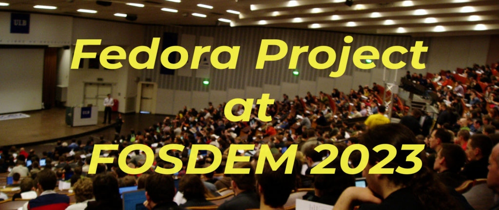
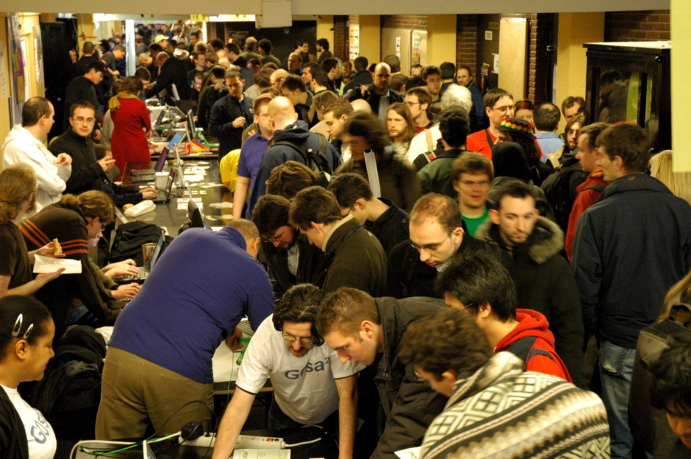
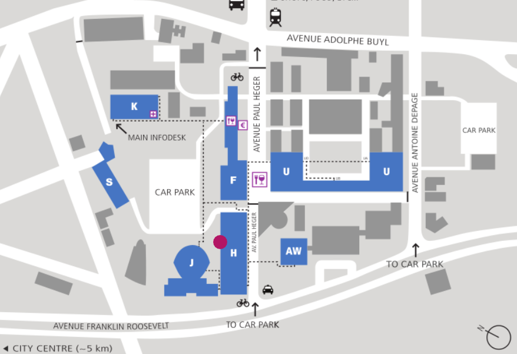

# Fedora 项目将出席 FOSDEM 2023

## 译文信息

- 源文：[Fedora Project at FOSDEM 2023](https://fedoramagazine.org/fedora-project-at-fosdem-2023/)
- 作者：[Bogomil Shopov](https://fedoramagazine.org/author/bogomil/)
- 许可证：[CC BY-SA 4.0](https://creativecommons.org/licenses/by-sa/4.0/)
- 译者：暮光的白杨
- 日期：2023-01-21

----

> 
> *图片来自 Filippo Giunchedi，基于 [CC BY-SA 2.0](https://creativecommons.org/licenses/by-sa/2.0/) 进行授权使用。*

!!! info "关联信息"

    [在 FOSDEM 上了解更多有关于 openSUSE 和 ALP 的信息](https://suse.org.cn/%E7%A4%BE%E5%8C%BA%E6%96%B0%E9%97%BB/2023/01/17/%E5%9C%A8-FOSDEM-%E4%B8%8A%E4%BA%86%E8%A7%A3%E6%9B%B4%E5%A4%9A%E6%9C%89%E5%85%B3%E4%BA%8E-openSUSE-%E5%92%8C-ALP-%E7%9A%84%E4%BF%A1%E6%81%AF.html)

Fedora 项目将出席 FOSDEM 2023。本文介绍了这次聚会和议程上的一些活动。我[^1]想如果你正在阅读 [Fedora 杂志](https://fedoramagazine.org/)，你已经知道 FOSDEM 是什么了，但我还是要先做一个小小的介绍。

## 关于 FOSDEM

[FOSDEM](https://fosdem.org/2023/) 是目前世界上最大的自由和开源开发者和爱好者的活动聚会。

来自世界各地的许多优秀人士聚集在一起，讨论共同的话题并确定自由与开源的未来。该活动于二月初在布鲁塞尔举行。我们中的一些来自天气比较温和的国家的人，把它叫做 FrOSDEM，因为它通常都很冷[^2]。🙂

### 为什么要参加？

如果你已经是一名贡献者，或者你想开始利用你的技能为自由和开源世界做贡献，那么参加这个活动是很有必要的。

我知道每个人都有来访的理由，但我将分享最常见的理由：

- 你会见到那些创造和维护支持你在使用的互联网产品的人。
- 如果你已经是一个贡献者，你有机会与你的团队和使用你产品的人见面。
- 你很快就能学到很多新东西。
- 你可以通过关注你的熟知事物以外的东西来扩大视野。例如，如果你是 Fedora 的粉丝，可以去学习更多关于[安全或 Javascript](https://fosdem.org/2023/schedule/) 的知识。
- 你有机会和其他与你有同样热情的人交谈，甚至成为终身朋友。一个好朋友一直是一笔珍贵的财富！
- 你可实现你的每日步数目标，因为 [ULB 的校园很大](https://fosdem.org/2023/assets/campusmap-6166e45e7e736823c218c45ac65e02f5f7237111253db302da17bbaa0f4b5683.png)，你要走很多路才能到达你想去的房间。
- 如果这是驱动你的动力，你就有机会[做志愿者并帮助社区](https://volunteers.fosdem.org/)。
- 你参加了一个有很好的[行为准则](https://fosdem.org/2023/practical/conduct/)的活动。

### FOSDEM 2023 的 Fedora

Fedora 项目团队的传统是在那里展示我们去年的一些工作，并让你分享你对我们做得好的地方以及我们如何改进的反馈。

### 见面，打招呼，看看我们的社区在行动

FOSDEM 最特别的事情之一是[项目展位](https://fosdem.org/2023/stands/)，我在上一节中有意没有提到此事。几乎在每栋建筑中，你都会看到展位后面，随时准备与你谈论他们的项目、其价值和使命的人们。

!!! Quote "热闹的展位"

    
    *图片由 Francesco Crippa 提供，基于 [CC-BY 2.0](https://creativecommons.org/licenses/by/2.0/) 授权使用。*

我也必须在这里提到一些好东西。你可带着你最喜欢的项目中的许多物品回家。请务必继续进一步支持他们。

我们 Fedora 也将很高兴欢迎你光临我们的展位。你可以与社区成员交谈，给我们建设性的反馈，并看看我们准备的一些东西。

我们的展位位于 **H 楼**，旁边是其他 Linux 发行版。

!!! Quote "校园地图"

    

停下来用您的语言打招呼！我们期待与您交谈！

### 我们想分享是什么让我们的工作与众不同

在每届 FOSDEM 上，我们都有很多与我们在 Fedora 所做的事情相关的谈话。我只列出其中的一部分，以便你浏览[议程](https://fosdem.org/2023/schedule/)并自行探索其余部分。

#### 1: Fedora CoreOS——你的下一个多人家庭实验室发行版

*在自托管家庭实验室（Homelab）中使用 Fedora CoreOS 设置多人游戏服务器。*

**演讲者：**

=== "Akashdeep Dhar"

    Fedora 委员会成员，Fedora 网站和应用程序目标负责人  
    红帽社区平台工程软件工程师

=== "Sumantro Mukherjee"

    Fedora 理事会当选代表  
    红帽软件质量工程师

**简介：**

[Fedora CoreOS](https://getfedora.org/en/coreos) 是一个必不可少的、一体化的、自动更新的操作系统，针对运行的容器进行了优化。它专注于提供最佳容器主机，以安全、大规模地执行容器化工作负载。我们将展示[一个案例研究](https://github.com/t0xic0der/fcos-workshop-fosdemcd-2023/blob/main/README.md)，将 Fedora CoreOS 设置为自托管家庭实验室发行版，供全球访问（使用安全网络隧道）多人视频游戏服务器（即 **Minecraft**、**Valheim** 等）。

**时间地点：**

2 月 4 日星期六 [11:30 至 12:00](https://fosdem.org/2023/schedule/event/container_fedora_coreos/) 在[容器开发室](https://fosdem.org/2023/schedule/track/containers/)进行。

#### 2：创意自由峰会回顾展

**演讲者：**

=== "Emma Kidney"

    自 2021 年起加入红帽社区平台工程团队。  
    红帽社区设计团队的设计师。

=== "Jess Chitas"

    红帽社区平台工程团队的一员。  
    Fedora 吉祥物 Colúr 和 Fedora 品牌指南手册的创建者。

**简介：**

创意自由峰会（Creative Freedom Summit）是一个线上虚拟活动，专注于推广开源工具、传播如何使用它们的知识，以及连接整个自由与开源生态系统中的创意。峰会的成就和缺点将根据活动的第一年和随后几年的潜在变化进行审查。

**时间地点：**

2 月 5 日星期日 [14:30 至 14:55](https://fosdem.org/2023/schedule/event/creative_freedom_summit_retrospective/) 在[开源设计开发室](https://fosdem.org/2023/schedule/track/open_source_design/)进行。

### 在哪里可以找到更多相关讲座？

我们的[维基页面](https://fedoraproject.org/wiki/FOSDEM_2023)有一个大致的时间表，但 [FOSDEM 的时间表目录](https://fosdem.org/2023/schedule/)更为详细。一个小窍门：选择一个 30 分钟的好时段，浏览所有可能引起你注意的房间，并在你最喜欢的日历应用程序中创建个人日程安排。确保你有备用计划，因为有些房间可能已满员，你无法进入。

### 我想让你对挑战感兴趣

如果你对 FOSDEM 2023 的了解比我多，并且已经准备好了你的日程安排，请分享一段关于你的 FOSDEM 计划的评论，并列出你最喜欢的一些演讲。你将帮助社区了解活动的伟大之处，并找到更多理由去寒冷的布鲁塞尔旅行。

**不见不散！**

[^1]: Bogomil Shopov
[^2]: 布鲁塞尔 2 月的[日均气温](https://zh.wikipedia.org/wiki/%E5%B8%83%E9%B2%81%E5%A1%9E%E5%B0%94#%E6%B0%94%E5%80%99)为 3.5℃。