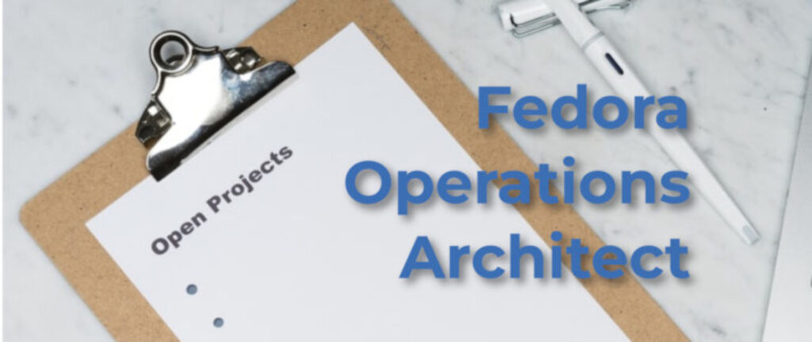

# 来自新 Fedora 运营架构师的自我介绍

- 译文信息：
    - 原文：[Introducing the Fedora Operations Architect](https://fedoramagazine.org/introducing-fedora-operations-architect/)
    - 作者：[Aoife Moloney](https://fedoramagazine.org/author/amoloney/)
    - 许可证：[CC-BY-SA 4.0](http://creativecommons.org/licenses/by-sa/4.0/)
    - 译者：暮光的白杨
    - 日期：2023-10-21

----

你好，Fedora 社区！我想正式向大家介绍我自己，我是 Fedora 项目的新[运营架构师]！我将正式加入 Fedora 项目，负责协调版本发布、管理变更提案，并以多种方式为 Fedora 项目提供帮助。

[运营架构师]: https://communityblog.fedoraproject.org/job-posting-fedora-operations-architect/

我在这里为那些不认识我的人和那些自己认为认识我的人自我介绍一下。😉 我在 RedHat 工作已经六年多了，其中过去的四年是在 Fedora 和 CentOS 项目中度过的。（说真的！）我的背景是机场地勤人员，这让我在帮助 Fedora 项目起飞和降落方面做好了充分准备。有时候，我也能应付一些乱流。我还从事过设施管理和项目管理工作，并学会了如何平衡超级严肃的业务工作，如遵守最后期限、收集和完善需求以及管理期望值，同时享受与不同的人和不同的团队一起工作的乐趣。加入 RedHat 之后，我非常喜欢了解开源项目世界和 FOSS 社区的精神，我很高兴有机会全职为 Fedora 项目工作！

我一直是 Fedora 项目[社区平台工程团队]的一员。我因帮助他们交付了许多有助于 Fedora 项目生态系统的项目而闻名，例如新的 F.M.N 服务和新的 Fedora 账户系统。但我也因主持 Flock/Nest/Hatch 酒吧问答……和说脏话而出名！如果我在您面前说了脏话，那就意味着我在您身边感到舒适，可以很自在地做我自己，而我在 Fedora 社区也一直感觉很自在。

[社区平台工程团队]: https://docs.fedoraproject.org/en-US/cpe/

闲暇时，我帮助我的儿子，他热衷于马术运动，尤其是障碍赛。我喜欢说他是在学我，因为我更年轻的时候也参加过比赛，但我很高兴地说，他比我好多了。我们有很多小马，它们都有自己的名字（Josh、Philip、Victor、Joe 和 Herman），都非常可爱，但都很费事！不过，我坚信任何值得拥有的东西都来之不易，所以我不会用任何东西来交换。

我有一个小小的请求，那就是给我一点时间，让我调整好自己的状态，适应这个令人兴奋的新角色，这样我才能作为你们的运营架构师，有效地帮助你们。如果您想联系我，我的联系方式列在下面，我真的很高兴能与 Fedora 项目正式合作。这是一个真正特别的地方，我期待着与大家共事！

- Matrix: amoloney:fedora.im
- IRC: amoloney
- Email: <amoloney@redhat.com>