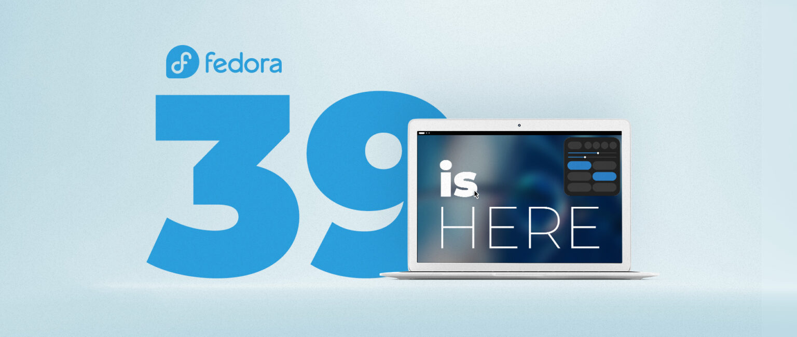

# Fedora Linux 39 现已发布

- 译文信息：
    - 原文：[Fedora Linux 39 is officially here!](https://fedoramagazine.org/announcing-fedora-linux-39/)
    - 作者：[Matthew Miller](https://fedoramagazine.org/author/mattdm/)
    - 日期：2023-11-07
    - 译者：暮光的白杨
    - 补档翻译时间：2024-02-11
    - 许可证：[CC-BY-SA 4.0](http://creativecommons.org/licenses/by-sa/4.0/)

---

> 
> *封面图由 [Daimar Stein](https://www.behance.net/daimarstein) 提供*

2003 年 11 月 6 日，Fedora 项目发布了 Fedora Core 1。二十年后的今天，我们很高兴地为你带来 Fedora Linux 39，这是我们为台式机、笔记本电脑、服务器、云、边缘设备以及你能想到的任何其他设备打造的完整的社区操作系统。

与往常一样，在从以前的版本升级之前，你应该确保你的系统是完全最新的。迫不及待想开始使用？边读边[下载]吧！

[下载]: https://fedoraproject.org/#editions

## 桌面新闻

Fedora Workstation 现在采用 [GNOME] 45，它带来了更好的性能和许多可用性增强，包括新的工作区切换器和大大改进的图像查看器。

[GNOME]: https://www.gnome.org/

如果你正在寻找不同的桌面体验，我们的 [Budgie] 特别兴趣小组已经创建了 [Fedora Onyx]，这是一款秉承 Fedora [Silverblue] 精神的基于 Budgie 的[“原子化”桌面]。

[Fedora Onyx]: https://fedoraproject.org/atomic-desktops/budgie/
[Silverblue]: https://fedoraproject.org/atomic-desktops/silverblue/
[“原子化”桌面]: https://fedoraproject.org/atomic-desktops/
[Budgie]: https://buddiesofbudgie.org/

当然，这还不是全部——我们还更新了其他桌面，包括 [KDE Plasma]、[Xfce]、[Cinnamon] 等。

[KDE Plasma]: https://kde.org/plasma-desktop/
[Xfce]: https://xfce.org/
[cinnamon]: https://cinnamon-spices.linuxmint.com/

## 云

除 [Google Cloud] 和 [AWS] 外，[Microsoft Azure] 将正式提供 [Fedora Cloud] 镜像。此外，我们的云镜像现在已配置，以便 cloud-init 可以（根据你的选择）安装更新并在首次配置时重新启动，这样你就可以知道你正在运行我们的最新安全更新。

[Google Cloud]: https://cloud.google.com/
[AWS]: https://aws.amazon.com/
[Microsoft Azure]: https://azure.microsoft.com/
[Fedora Cloud]: https://cloud.fedoraproject.org

## 其他更新

与往常一样，我们更新了很多很多其他软件包，致力于为你带来自由和开源软件世界所能提供的最好的一切。Fedora Linux 39 包含 [gcc] 13.2、[binutils] 2.40、[glibc] 2.38、[gdb] 13.2 和 [rpm] 4.19。它还更新了流行的编程语言栈，包括 [Python] 3.12 和 [Rust] 1.73。

[gcc]: https://gcc.gnu.org/
[binutils]: https://www.gnu.org/software/binutils/
[glibc]: https://www.gnu.org/software/libc/
[gdb]: https://www.gnu.org/software/gdb
[rpm]: https://rpm.org/
[Python]: https://www.python.org/
[Rust]: https://www.rust-lang.org/
[Inkscape]: https://inkscape.org/

特别值得一提的是，我们包含了最新版本的 [Inkscape]，这是一款流行的矢量图形插图和绘图工具。Inkscape 昨天也满 20 周岁了——我们是数字双胞胎！也祝贺参与这个出色项目的每个人。

## 万一出现问题……

如果你遇到问题，请访问我们的 [Ask Fedora] 用户支持论坛。这包括[常见问题]的类别。（特别是 Raspberry Pi 存在一些问题，我们仍在努力解决。因此，如果你计划更新其中一个问题，请务必先检查一下。）

[Ask Fedora]: https://ask.fedoraproject.org/
[常见问题]: https://discussion.fedoraproject.org/tags/c/ask/common-issues/82/none/f39

## 或者如果你只是想打声招呼……

欢迎访问 [Fedora Discussion 上的 “virtual watercooler”] 并加入对话，分享有趣的内容并介绍自己。

[Fedora Discussion 上的 “virtual watercooler”]: https://discussion.fedoraproject.org/c/fun/8

你还可受邀参加本周五和周六的虚拟发布派对。完全免费！我们将举办有趣的演讲和有趣的社交活动。[点此注册]！

[点此注册]: https://hopin.com/events/fedora-linux-39-release-party/registration

## 谢谢大家

再次感谢在此发布周期中为 Fedora 项目做出贡献的数千人。你们太棒了！