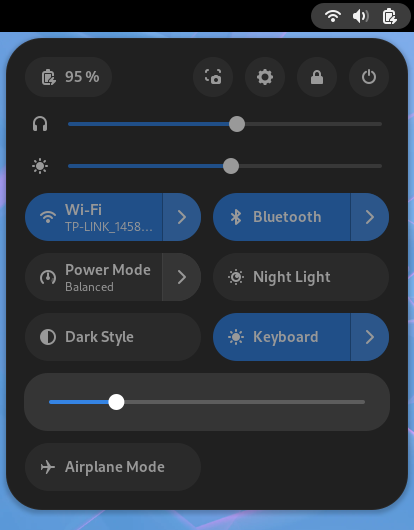
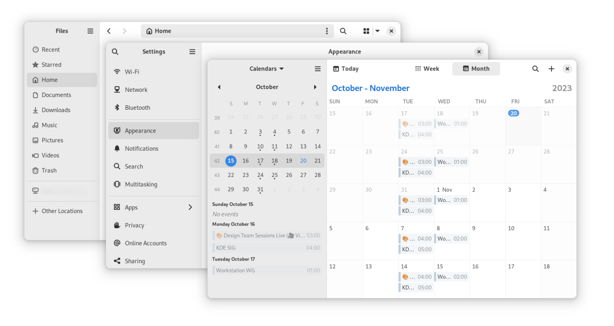
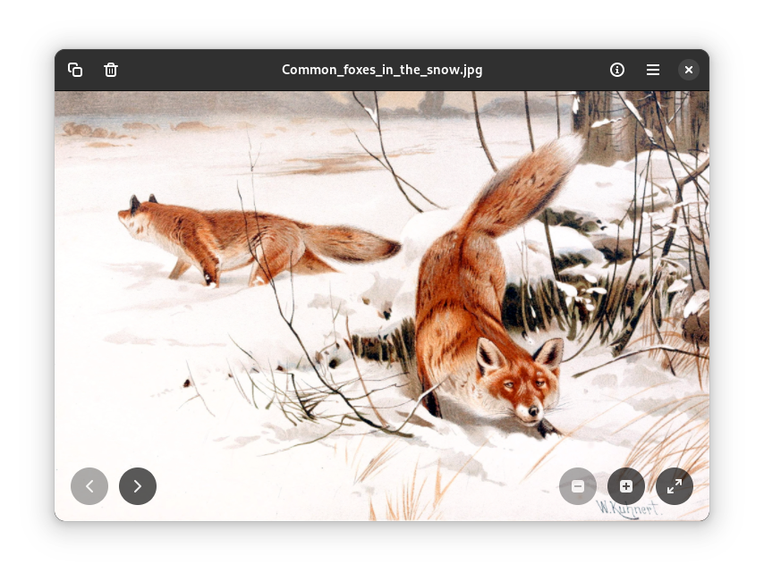
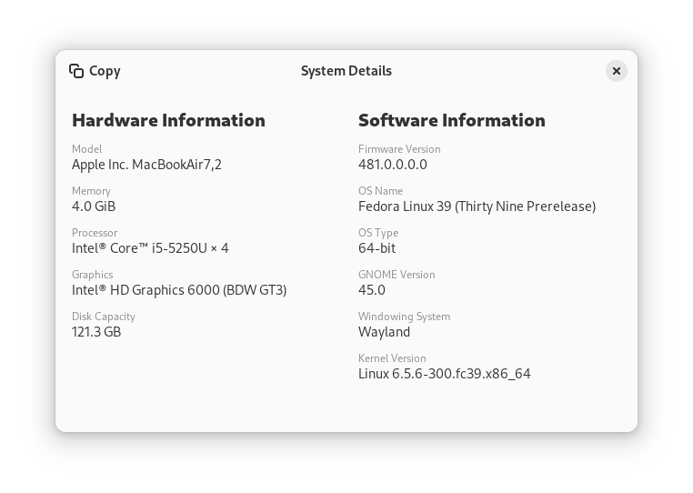
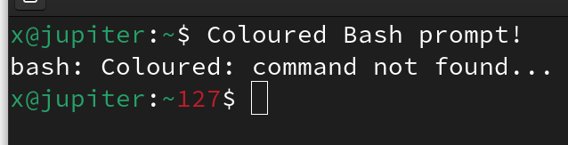

# Fedora Workstation 39 的新亮点

- 译文信息：
    - 原文：[What’s new in Fedora Workstation 39](https://fedoramagazine.org/whats-new-fedora-workstation-39/)
    - 作者：[Merlin Cooper](https://fedoramagazine.org/author/mxanthropocene/)
    - 许可证：[CC-BY-SA 4.0](http://creativecommons.org/licenses/by-sa/4.0/)
    - 日期：2023-11-07
    - 译者：暮光的白杨
    - 补档翻译日期：2024-02-13

----

> 
> *封面图片由 [Jackub Steiner](https://fedoraproject.org/wiki/User:Jimmac) 提供*

Fedora Workstation 是全球首屈一指的开源桌面操作系统，由包括你在内的全球社区共同打造！本文将介绍最新版本 Fedora Workstation 39 中一些面向用户的重大变化。现在就从 [Fedora Workstation 网页]上获取它，或在[软件]中升级现有系统，或在你最喜欢的终端模拟器中使用 [*dnf system-upgrade*] 进行升级！

[Fedora Workstation 网页]: https://fedoraproject.org/workstation/
[*dnf system-upgrade*]: https://docs.fedoraproject.org/en-US/quick-docs/upgrading-fedora-offline/

## GNOME 45

Fedora Workstation 39 包含最新版本的 [GNOME] 桌面环境，GNOME 45。该版本在多个核心应用程序中加入了时尚的新部件、全新的图像查看器应用程序、在支持的系统中加入了新的键盘背光设置、信息更丰富的 “Activities” 按钮、改进的性能以及其他许多改进用户体验的功能。更多详情请查看 [GNOME 45 发布说明]。

[GNOME]: https://www.gnome.org/
[GNOME 45 发布说明]: https://release.gnome.org/45/

### 小事大事

GNOME 45 对整体体验进行了多项改进。以下是其中几项：

- 动态工作区指示器取代了静态的 "活动" 按钮。新的指示器信息更丰富，工作区数量和当前关注的工作区一目了然。 
  

   
  <em>新的动态工作区指示器</em>
  

- 通过 Pipewire 访问摄像机时，会出现一个新的摄像机活动指示器。它与麦克风、截屏和屏幕录制指示器一起出现。
- 快速设置菜单在支持的硬件上新增了键盘背光设置。 
  

  { width=40% } 
  <em>新的键盘背光设置</em>
  

- 默认光标已经过重新设计，修复了原始设置中几个长期存在的问题。
- Fedora Workstation 39 不再使用 [Adwaita-qt] 和 [QGnomePlatform] Qt 主题。Qt 应用程序现在使用上游默认主题。

[Adwaita-qt]: https://github.com/FedoraQt/adwaita-qt
[QGnomePlatform]: https://github.com/FedoraQt/QGnomePlatform

### 核心应用

GNOME 45 中的许多应用程序现在都使用 [libadwaita] 1.4 中提供的新用户界面小部件。这为它们提供了漂亮的双色设计，侧边栏延伸至窗口的整个高度。这不仅美观大方，还增强了应用程序的适应性，使其更易于在窗口尺寸较小的情况下使用。更多详细信息请参见[此处]。此外，新的标题栏小部件增强了标题栏本身和窗口内容之间的视觉分离。

 
<em>显示新侧边栏小部件的文件、设置和日历</em>

[此处]: https://blogs.gnome.org/alicem/2023/09/15/libadwaita-1-4/
[libadwaita]: https://github.com/GNOME/libadwaita

Fedora Workstation 39 采用了 GNOME 的新图像查看器应用，内部称为 [Loupe]。它是使用 [Rust]、[GTK 4] 和 libadwaita 从头开始编写的，具有高性能和适应性。

 
<em>新的图像查看器应用（屏幕截图中显示的艺术品属于[公共领域]）</em>

[公共领域]: https://commons.wikimedia.org/wiki/File:Common_foxes_in_the_snow.jpg
[Loupe]: https://apps.gnome.org/Loupe/
[Rust]: https://www.rust-lang.org/
[GTK 4]: https://docs.gtk.org/gtk4/getting_started.html

对核心应用程序进行了一些较小的改进。其中包括：

- 应用程序[设置]具有新的 “系统详细信息” 部分、新的键盘布局查看器、更易于理解的说明以及更好的键盘导航功能。
  

  { width=70% } 
  <em>新的系统详细信息窗口</em>
  

- 更好地排列[文件]中的搜索结果。
- 现在可以在应用程序[软件]中卸载 [Flatpak] 应用时删除用户数据。
  

  { width=50% } 
  <em>卸载 Flatpak 应用程序时显示的新提示</em>
  

- [日历]中的逐行滚动和更实用的搜索结果。
- 在[连接]中使用 [RDP] 连接时，支持复制文件、图像和文本。

[设置]: https://apps.gnome.org/zh-CN/Settings/
[软件]: https://apps.gnome.org/zh-CN/Software/
[文件]: https://apps.gnome.org/zh-CN/Nautilus/
[Flatpak]: https://www.flatpak.org/
[日历]: https://apps.gnome.org/zh-CN/Calendar/
[连接]: https://apps.gnome.org/zh-CN/Connections/
[RDP]: https://en.wikipedia.org/wiki/Remote_Desktop_Protocol

### 性能改进

GNOME 45 对性能进行了大量改进。

- 如果可能的话，现在自动首选硬件加速视频解码。
- 应用程序[文件]中的缩略图现在是多线程的。
- 光标卡顿和延迟现象明显减少。
- [GNOME Shell] 和多个应用程序（包括[文件]、[软件]和[字符]）中的搜索性能得到大幅提升。

[GNOME Shell]: https://www.gnome.org/getting-gnome/
[字符]: https://apps.gnome.org/zh-CN/Characters/

整个堆栈也进行了多项性能改进，包括 [GLib]、[GTK 的 OpenGL 渲染器]和 [systemd]。如果没有在前一版本的 Fedora Workstation 中启用帧指针（frame pointers）[^1]，很多性能优化都是不可能实现的！

[GLib]: https://www.gtk.org/
[GTK 的 OpenGL 渲染器]: https://blogs.gnome.org/chergert/2021/02/24/gtk-4-ngl-renderer/
[systemd]: https://systemd.io/

[^1]: 另见：<https://fedoramagazine.org/performance-profiling-in-fedora-linux/>

## Fedora Linux 39 中的底层变化

Fedora Linux 39 具有许多底层更改。以下是一些值得注意的变化：

- Fedora Linux 39 现在默认具有彩色 Bash 提示符！
  

  { width=40% } 
  <em>彩色的 Bash 提示符</em>
  

- [Noto] 字体现在是使用印度文字的语言的默认字体。这取代了旧的 [Lohit] 字体集。
- 由于使用率低且缺乏主动维护，[modular 存储库]在 Fedora Linux 39 中不再可用。
    - Fedora 模块构建服务（[Fedora Module Build Service]）将于 Fedora Linux 38 生命周期结束时（即 2024 年 5 月）关闭。

[modular 存储库]: https://docs.fedoraproject.org/en-US/modularity/
[Fedora Module Build Service]: https://docs.fedoraproject.org/en-US/infra/sysadmin_guide/mbs/
[Noto]: https://fonts.google.com/noto
[Lohit]: https://en.wikipedia.org/wiki/Lohit_fonts

## 还请查看……

Fedora 项目中发生的很酷的事情！

- 2023 年 11 月 6 日是 Fedora 项目成立 20 周年。请密切关注 [Fedora 杂志]，获取 20 周年纪念特别文章！ 🎉

[Fedora 杂志]: https://fedoramagazine.org