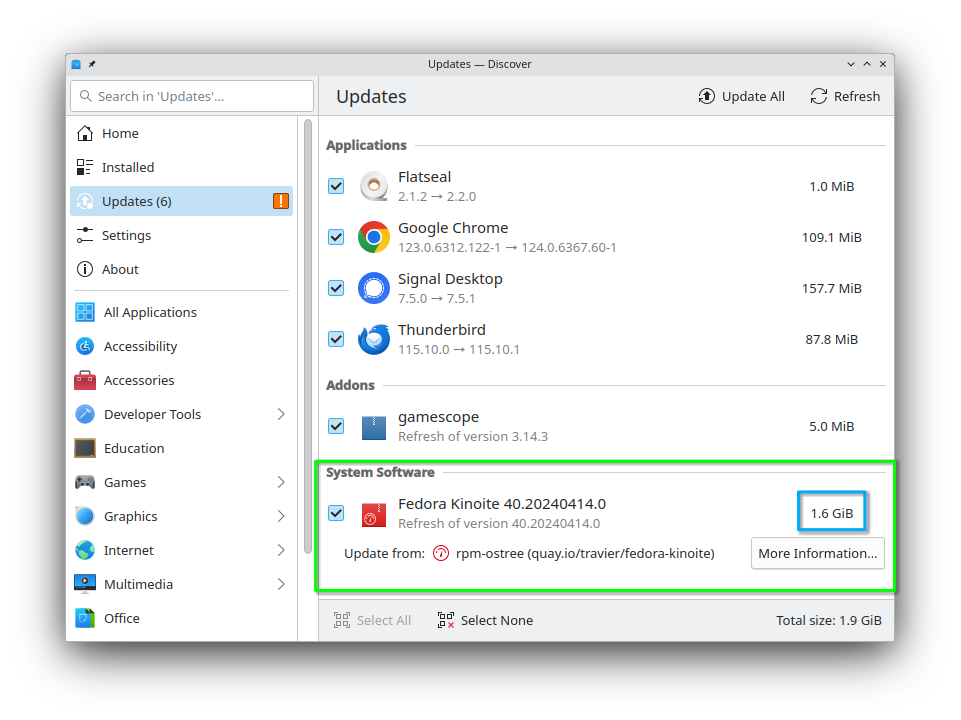

# Fedora 40 中的 Fedora Atomic Desktops 有哪些新亮点

- 译文信息：
    - 原文：[What’s new for Fedora Atomic Desktops in Fedora 40](https://fedoramagazine.org/whats-new-for-fedora-atomic-desktops-in-fedora-40/)
    - 作者：[Timothée Ravier](https://fedoramagazine.org/author/siosm/)
    - 许可证：[CC-BY-SA 4.0](http://creativecommons.org/licenses/by-sa/4.0/)
    - 日期：2024-04-30
    - 译者：暮光的白杨

----

> 
> 图片由 Fedora 团队提供

[Fedora 40 现已发布！][exlink1]🎉让我们来看看 Fedora Atomic Desktops 变体（Silverblue、Kinoite、Sway Atomic 和 Budgie Atomic）的新版本中包含哪些内容。

[exlink1]: ./fedora40-whatnew.md

## Fedora Atomic Desktops 介绍

正如你可能从标题中猜到的，我们现在叫 **Fedora Atomic Desktops**！请参阅 Fedora 杂志[关于 Fedora Atomic Desktops 介绍][exlink2]的文章，了解所有详细信息。

[exlink2]: ./fedora-atomic-de-intro.md

总的来说，Fedora 原子桌面由四个 Atomic [spin] 组成：

[spin]: https://spins.fedoraproject.org/

- Fedora Silverblue
- Fedora Kinoite
- Fedora Sway Atomic (曾经叫 Fedora Sericea)
- Fedora Budgie Atomic (曾经叫 Fedora Onyx)

我们[在 fedoraproject.org 网站上有一个发布页面][exlink3]。

[lolink1]: https://fedoraproject.org/atomic-desktops/

## 引导加载程序更新（bootupd 集成）的状态更新

遗憾的是，由于我们在 [Ananconda] 处理 [bootupd] 安装过程后期发现了一个问题，而这个问题依赖于 `bootupd` 中不完整的功能，因此我们无法在此版本中提供 `bootupd` 支持。

[Ananconda]: https://fedoraproject.org/wiki/Anaconda
[bootupd]: https://fedoraproject.org/wiki/Changes/FedoraSilverblueBootupd

我们将尝试在发布后通过更新再次添加 `bootupd`。

如果你在此期间遇到安全启动错误或需要更新引导加载器，可以尝试 [fedora-silverblue#543] 的说明。请确保准备好 Live USB 以防遇到问题。请事先做好备份。

[fedora-silverblue#543]: https://github.com/fedora-silverblue/issue-tracker/issues/543#issuecomment-2048350047

我们希望对 bootupd 进行改进，以简化这一过程。

另见：[atomic-desktops-sig#1].

[atomic-desktops-sig#1]: https://gitlab.com/fedora/ostree/sig/-/issues/1

## Silverblue 的新亮点

### 最新的 GNOME 桌面

Fedora Silverblue 已搭载最新的 [GNOME 46]。

[GNOME 46]: https://release.gnome.org/46/

有关 GNOME 46 变化的更多详情，请参阅 Fedora Magazine 上的 [Fedora Workstation 40 有哪些新功能][exlink3]，以及 Christian F.K. Schaller 的 [Fedora Workstation 40 - 我们在做什么][lolink2]。

[exlink3]: ./fedora40-whatnew.md
[lolink2]: https://blogs.gnome.org/uraeus/2024/03/28/fedora-workstation-40-what-are-we-working-on/

### 默认情况下不再覆盖语言包（langpack）

GNOME Software 将不再在第一次更新时为你的 locale 覆盖 langpack 软件包。这将使更新更快，因为更新不再需要覆盖软件包（除非你明确决定覆盖某些软件包）。

如果你是从以前的版本升级，则必须手动移除此覆盖软件包。例如

1. 使用 `rpm-ostree status` 查找覆盖的软件包：
    ```
    $ rpm-ostree status
    State: idle
    Deployments:
    ● fedora:fedora/40/x86_64/silverblue
                      Version: 40.20240410.1 (2024-04-10T03:43:23Z)
                       Commit: 2428fdbec13787633b3bcd79d4f002ab48582bae8c6a473ca357a1ad43573a94
                 GPGSignature: Valid signature by E8F23996F23218640CB44CBE75CF5AC418B8E74C
              LayeredPackages: langpacks-fr

      fedora:fedora/40/x86_64/silverblue
                     Version: 40.20240402.0 (2024-04-02T00:39:43Z)
                     Commit: 634c8097165e6aab2baeaca6ae6d1ea2a7f11fba9f4955297bcf0fc2507047be
                GPGSignature: Valid signature by E8F23996F23218640CB44CBE75CF5AC418B8E74C
            LayeredPackages: langpacks-fr
    ```

2. 移除覆盖的软件包：

    ```
    $ rpm-ostree uninstall langpacks-fr
    ```

3. 重启系统

请注意，这将从系统中删除相应语言的词典，从而删除镜像中包含的应用程序。

对于 Flatpak，词典是根据 Flatpak 配置中设置的语言下载的。如果你已在 GNOME 设置中设置了首选语言，那么该配置应该已经设置。例如

```
# Get the current config
$ flatpak config --list
languages: en;fr;de (default: en)
extra-languages: *unset*

# Set the languages to use
$ flatpak config --set languages "en;fr"
```

更多详情，请参阅 [flatpak-config] 文档。

[flatpak-config]: https://docs.flatpak.org/en/latest/flatpak-command-reference.html#flatpak-config

还要注意的是，使用 `man` 查询的系统命令的文档的翻译文件也将随之删除。要恢复这些手册页，你可以使用 toolbox 等将其安装到容器中：

```
$ toolbox create
$ toolbox enter
$ sudo dnf install man-pages-fr
```

另见：[atomic-desktops-sig#14].

[atomic-desktops-sig#14]: https://gitlab.com/fedora/ostree/sig/-/issues/14

## Kinoite 的新亮点

### KDE Plasma 6

Fedora Kinoite 预装了 [Plasma 6、Frameworks 6 和 Gear 24.02][lolink3]（详见 [Fedora Change]）。另请参阅 Fedora Magazine 上的 [Fedora KDE 40 有哪些新功能？][exlink4]

[lolink3]: https://kde.org/announcements/megarelease/6/
[Fedora Change]: https://fedoraproject.org/wiki/Changes/KDE_Plasma_6
[exlink4]: ./fedora40-whatnew-kde.md

### Wayland only

Fedora Kinoite 现在仅支持 Wayland 会话。传统 X11 应用程序将使用 XWayland 运行。请参阅 [Fedora 40：现不支持 X11][lolink4]。

[lolink4]: https://fedoraproject.org/wiki/KDE/X11_Unsupported

如果你使用的是 NVIDIA GPU 并遇到问题，我建议你查看 Universal Blue 镜像文件（见下文），等待即将到来，有望改善 Wayland 支持的 NVIDIA 驱动程序更新；或者尝试更新支持显卡的 Nouveau/NVK 堆栈。

### 使用 Fedora Flatpaks 的 KDE Apps

现在，新系统安装的 KDE 应用程序子集默认由 Ananconda 作为 Fedora Flatpaks 安装。Flatpak [不会在更新时安装]，但你可以从 [Fedora Flatpak remote] 或 [Flathub] 安装。

[不会在更新时安装]: https://gitlab.com/fedora/ostree/sig/-/issues/8
[Fedora Flatpak remote]: https://fedoramagazine.org/an-introduction-to-fedora-flatpaks/
[Flathub]: https://flathub.org/setup/Fedora

### Flathub 上的 KDE Flatpaks

大多数 KDE 应用程序都是由 KDE 社区直接在 Flathub 上发布和维护的，我们已经完成了向 [Qt] 6.6 和 KDE Framework 6 Runtime 的过渡。

[Qt]: https://www.qt.io/

您可以在 [kde/teams/flathub#26] 中跟踪其余应用程序的进度。

[kde/teams/flathub#26]: https://invent.kde.org/teams/flathub/issues/-/issues/26

## Sway Atomic 的新亮点

Fedora Sway Atmoic 预装了最新的 [Sway 1.9 版本]。

[Sway 1.9 版本]: https://github.com/swaywm/sway/releases/tag/1.9

## Budgie Atomic 的新亮点

Fedora Budgie Atomic 随 [Budgie Desktop 10.9] “发布系列（release series）”的最新版本一起发布。Budgie 10.9 在向 Wayland 迁移的过程中，对 `libxfce4windowing` 进行了初步移植，并重新设计了蓝牙小程序，新增了直接断开/连接的功能。

[Budgie Desktop 10.9]: https://buddiesofbudgie.org/blog/budgie-10-9-released

此外，Fedora Budgie Atomic 配备了最新的 Budgie 控制中心，并使用了 budgie-session。由于 Buddies of Budgie 正式支持 Fedora，Budgie Desktop 还获得了大量回传错误修复，为 Fedora 用户提供更好的使用体验。

您可以在 [Buddies of Budgie 博客]上了解更多关于 Budgie 的最新动态。

[Buddies of Budgie 博客]: https://buddiesofbudgie.org/blog

## 下一步行动

不幸的是，这一次的部分会很短，因为[自上次以来]我们的未来计划没有太大进展。

[自上次以来]: https://tim.siosm.fr/blog/2023/11/22/fedora-atomic-desktops-39/#whats-next

一旦获得更多信息，我们将提供最新文章。

## Kinoite 中 Discover 更新支持改进的预告



## Universal Blue、Bluefin、Bazzite 和 Aurora

我们在 Universal Blue、Bluefin 和 Bazzite 项目中的朋友也发布了他们的图像更新。

现在，Universal Blue 与 [Bluefin] 一起被视为 “[普遍可用]”（Generally Available）。

[普遍可用]: https://universal-blue.discourse.group/t/universal-blue-is-now-generally-available/1233
[Bluefin]: https://universal-blue.discourse.group/t/bluefin-is-now-generally-available/1234

为了满足你的所有游戏需求，Bazzite 以我们最新的 Fedora 40 镜像为基础，[升级到了 3.0 版本][lolink5]。

[lolink5]: https://universal-blue.discourse.group/t/announcing-bazzite-3-0/1218

他们还推出了 [Aurora]，一个基于 KDE Plasma 和 Kinoite 的 Bluefin 替代品。有关详细信息，请参阅《[Aurora 简介]》一文。

[Aurora]: https://getaurora.dev/
[Aurora 简介]: https://universal-blue.discourse.group/t/introduction-to-aurora/1235

## 联系我们

我们正在寻找贡献者，帮助我们为 Fedora 用户打造最佳的 Fedora Atomic Desktops 体验。

- Atomic Desktops SIG：[维基页面](https://fedoraproject.org/wiki/SIGs/AtomicDesktops)、[问题追踪器](https://gitlab.com/fedora/ostree/sig/-/issues) 和 [#atomic-desktops:fedoraproject.org](https://matrix.to/#/#atomic-desktops:fedoraproject.org)
- Silverblue：[Workstation 工作组](https://docs.fedoraproject.org/en-US/workstation-working-group/) 和 [#silverblue:fedoraproject.org](https://matrix.to/#/#silverblue:fedoraproject.org)
- Kinoite：[KDE SIG](https://fedoraproject.org/wiki/SIGs/KDE) 和 [#kinoite:fedoraproject.org](https://matrix.to/#/#kinoite:fedoraproject.org)
- Sway Atomic：[Sway SIG](https://fedoraproject.org/wiki/SIGs/Sway) 和 [#sway:fedoraproject.org](https://matrix.to/#/#sway:fedoraproject.org)
- Budgie Atomic：[Budgie SIG](https://fedoraproject.org/wiki/SIGs/Budgie) 和 [#budgie:fedoraproject.org](https://matrix.to/#/#budgie:fedoraproject.org)