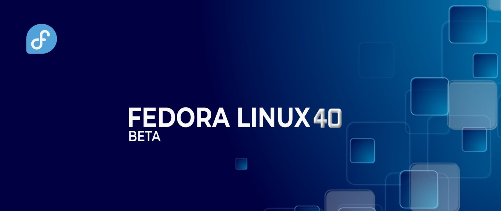

# Fedora Linux 40 Beta 版本现已发布

- 译文信息：
    - 原文：[Announcing Fedora Linux 40 Beta](https://fedoramagazine.org/announcing-fedora-linux-40-beta/)
    - 作者：[Matthew Miller](https://fedoramagazine.org/author/mattdm/)
    - 许可证：[CC-BY-SA 4.0](http://creativecommons.org/licenses/by-sa/4.0/)
    - 日期：2023-03-27
    - 译者：暮光的白杨

----



Fedora 项目很高兴地宣布 Fedora Linux 40 Beta 版本即将发布，这是我们计划于 4 月底发布 Fedora Linux 40 的下一步。

从我们的项目网站获取我们任意版本的预发行版：

- [Fedora Workstation 40 Beta](https://fedoraproject.org/workstation/download/)
- [Fedora Server 40 Beta](https://fedoraproject.org/server/download/)
- [Fedora IoT 40 Beta](https://fedoraproject.org/iot/download/)
- [Fedora Cloud 40 Beta](https://fedoraproject.org/cloud/download/)
- [Fedora CoreOS “next” stream](https://fedoraproject.org/coreos/download/?stream=next)

或者，尝试 [Fedora Linux Spins] 中的众多不同桌面变体之一（例如 KDE Plasma、Xfce 或 Cinnamon）。

[Fedora Linux Spins]: https://fedoraproject.org/spins/

你还可以使用 [DNF system-upgrade] 将现有系统更新为测试版。

[DNF system-upgrade]: https://docs.fedoraproject.org/en-US/quick-docs/upgrading-fedora-offline/

## Beta 版本亮点

此版本中需要尝试的一些关键功能！

[PyTorch] 是一种流行的开源机器学习框架。我们希望在 Fedora Linux 中尽可能轻松地使用此工具，现在你可以使用一个简单的命令来安装它：

```
sudo dnf install pytorch
```

需要注意的是，在本版本中，我们只包含了对 CPU 的支持，但这为未来支持 GPU 和 NPU 等加速器的更新奠定了基础。目前，这适合使用该技术，并且可能适合一些轻量的推理负载。

Fedora IoT 现在使用 ostree 原生容器或 "bootable containers（可启动容器）"。这展示了新一代用于组装操作系统的 ostree 技术。更多信息请参阅 [ostree] 和 [bootc] 文档。

[ostree]: https://coreos.github.io/rpm-ostree/container/
[bootc]: https://containers.github.io/bootc/intro.html

此外，在不可变操作系统方面，我们恢复了 "Atomic Desktop" 品牌，用于日益增多的基于 ostree 的桌面 spin 分支。不断扩大的晦涩矿物名称集合很有趣，但很难保持一致。我们将保留众所周知的 Silverblue 和 Kinoite，其他桌面环境将采用 Fedora Sway Atomic 和 Fedora Budgie Atomic 等名称。

## 其他值得注意的更新

由于 [Fedora KDE SIG] 和上游 KDE 项目的大量辛勤工作，Fedora KDE 桌面现在随 Plasma 6 一起提供，并仅支持 Wayland 会话。（不用担心 — X11 原生应用程序仍将在 Wayland（XWayland） 下运行。）

[Fedora KDE SIG]: https://fedoraproject.org/wiki/SIGs/KDE

Fedora Workstation 40 Beta 为我们带来了 GNOME 46。我们为你带来了用于容器管理的 Podman 5。AMD ROCm 加速器框架已更新至 6.0 版本。此外，我们还更新了新版本所需的语言栈：LLVM 18（即 clang 和它的朋友们）以及 GCC 14（包含更新的 glibc、binutils 和 gdb）。

整个版本还有许多其他大大小小的改动。请参阅 [Fedora Linux 40 官方变更集]了解更多信息，并检查你喜欢的软件是否有改进——由于这是一个测试版……可能还存在错误！

[Fedora Linux 40 官方变更集]: https://fedoraproject.org/wiki/Releases/40/ChangeSet

## 需要测试

与任何测试版一样，我们预计你可能会遇到错误或缺少功能。要报告测试期间遇到的问题，请通过测试邮件列表或 Fedora Chat 上的 #quality 频道联系 Fedora 质量团队。随着测试的进行，常见问题将在 Ask Fedora 的 “Common Issues” 类别中进行跟踪。

有关有效报告错误的提示，请阅读如何提交错误。

## 什么是 Beta 版？

测试版的代码是完整的，并且与最终版本非常相似。如果你花时间下载并试用测试版，你可以检查并确保对你重要的功能正在运行。你发现和报告的每个错误不仅可以帮助你，还可以改善全球数百万 Fedora Linux 用户的体验！只要我们齐心协力，Fedora 就能坚如磐石。我们有一种协调新功能并尽可能向上游推送修复的文化。你的反馈不仅改善了 Fedora Linux，还改善了 Linux 生态系统和整个自由软件。