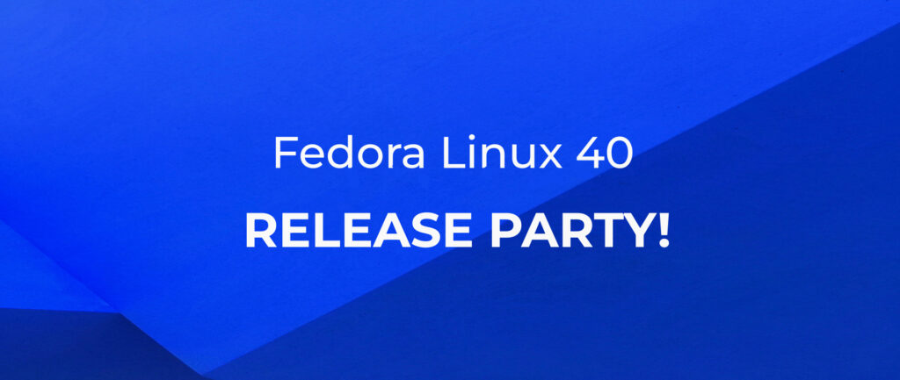

# 预留日期：Fedora 40 发行派对，5 月 24 日至 25 日

- 译文信息：
    - 原文：[Save the Date: Fedora 40 Release Party on May 24-25](https://fedoramagazine.org/save-the-date-fedora-40-release-party-on-may-24-25/)
    - 作者：[Joseph Gayoso](https://fedoramagazine.org/author/joseph/)
    - 许可证：[CC-BY-SA 4.0](http://creativecommons.org/licenses/by-sa/4.0/)
    - 日期：2024-05-06
    - 译者：暮光的白杨

----

> 
> 图片由 Consolation Obazee 提供

在经过辛勤努力发布 Fedora Linux 40 版本之后，我们现在要举办一个发行派对来庆祝一下！Fedora 40 发行派对将于 5 月 24 日至 25 日的星期五和星期六举行。

## 什么是发行派对？

Fedora 发布派对（Release Party）是虚拟的、以用户为中心的会议，社区聚集在一起讨论 Fedora 最新版本的新增功能以及我们未来版本的发展方向。我们讨论的主题包括实施变更的过程以及不同团队下一步想要在 Fedora 中做什么的路线图。有时，与 Fedora 相关的团体（例如 Amazon 或 Lenovo）会发布一些可分享的更新。我们也会在休息时间举行社交活动，大家可以通过视频通话互相交谈（如果您不愿意，则不必分享视频或发言）。如果您对您最喜欢的发行版的幕后花絮感兴趣，那就来和发行版的贡献者们一起学习和交流吧！

## 聚会的地点

前几年我们使用 Hopin 举办虚拟会议，但 Fedora 40 发布会将是我们第一次在 Matrix 上举办虚拟会议！自从几年前的[创意自由峰会]（Creative Freedom Summit）向我们展示了如何做到这一点之后，我们就一直想这么做。这一步骤使我们能够更多地依靠开源来进行推广。

[创意自由峰会]: https://creativefreedomsummit.com/

不过，我们也希望以另一种方式开放，那就是直播。我们将在 [Fedora 项目的 YouTube 频道]上直播活动。这样一来，任何人都可以观看，而且直播结束后也可以立即观看！

[Fedora 项目的 YouTube 频道]: https://www.youtube.com/@fedora

注册详情即将公布，但现在请预留 5 月 24 日至 25 日！

我们希望在聚会中看到你！

## 了解更多

[点此查看 Fedora 39 发行派对]，了解我们涵盖的主题类型。

[点此查看 Fedora 39 发行派对]: https://www.youtube.com/playlist?list=PL0x39xti0_64gKjGkGi8mId0X1ppl7lMH

请使用 `#FedoraReleaseParty` 主题标签在社交媒体上大力宣传！