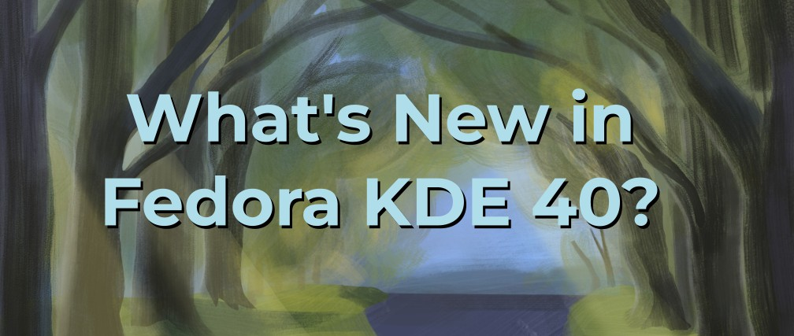
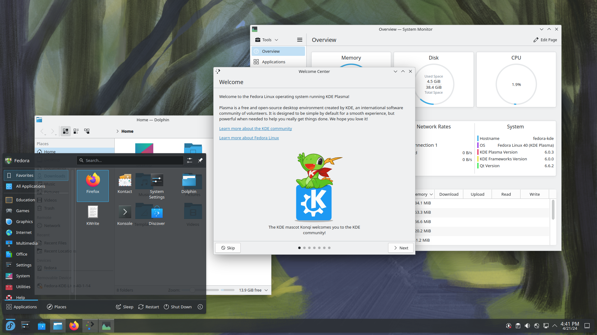

# Fedora KDE 40 的新亮点

- 译文信息：
    - 原文：[What’s New in Fedora KDE 40?](https://fedoramagazine.org/whats-new-in-fedora-kde-40/)
    - 作者：[Joseph Gayoso](https://fedoramagazine.org/author/joseph/)
    - 许可证：[CC-BY-SA 4.0](http://creativecommons.org/licenses/by-sa/4.0/)
    - 日期：2024-04-24
    - 译者：暮光的白杨

----

> 
> 图片由 Fedora 团队提供

Fedora Linux 是一个由社区开发和维护的操作系统。Fedora KDE 是我们为您的笔记本电脑或台式机改编的 Fedora Linux 系统之一。Fedora KDE 40 的发布具有里程碑式的意义，我们希望您有兴趣尝试一个从头到尾都属于您的操作系统，从安装到首次关机，从用户界面定制到底层的重大变更！

## KDE Plasma 6

Fedora KDE 40 的全面变化是引入了 KDE Plasma 6。这是九年来 Plasma 桌面环境的第一个重要版本！此外，Fedora KDE 是第一批搭载 Plasma 6 的主要发行版之一，我们也是第一个发布 Wayland-only 会话的 Fedora Linux 桌面变体（不用担心，我们保留了对 X11 应用程序的完全支持！），这使得该项目能够为整个 Linux 社区的利益推进对 Wayland 的改进。这是建立在以前的 Fedora Linux 版本中所做的工作的基础上的，默认情况下，Fedora KDE 从登录到关闭都在 Wayland 中运行。

## 特色亮点

- 有一个新的，用于在所有虚拟桌面上查看所有打开的应用程序的"概览效果（Overview Effect）"。
- 本版本实现了对 [HDR] 的部分支持，实现对 HDR 全面支持的工作仍在进行中。

[HDR]: https://en.wikipedia.org/wiki/High_dynamic_range

- 通过色盲校正滤镜改进了无障碍环境。
- 任务栏以浮动面板的形式呈现新面貌！Plasma 6 还通过易于理解的用户界面，让自定义面板变得前所未有的简单，帮助用户以最小的代价做出自己想要的改变。
- Breeze UI 主题一直是 Plasma 的标志，这次更新对其进行了必要的简化和现代化。
- 已默认搭载了 KDE 的 [Matrix] 客户端 [NeoChat]，供您试用。

[Matrix]: https://matrix.org/
[NeoChat]: https://apps.kde.org/neochat/

- Cube（立方体）回来了！新的概览效果很酷，使用 Cube 来管理您的虚拟桌面是一个很棒的派对技巧，可以在您下次共享屏幕时给您的朋友留下深刻的印象。 😉

您可以在 KDE Plasma 6 的 [megarelease 页面]找到更多更改和改进！

[megarelease 页面]: https://kde.org/announcements/megarelease/6/

## 关于 Kinoite……

如果您对不可变（immutable）/原子化（atomic）/云原生（cloud-native）/可组合（composable）/基于镜像（image-based）等话题感兴趣，[Fedora Atomic Desktops] 是进入这个世界的绝佳切入点。[Fedora Kinoite 40] 就是一个很好的例子，它是 Fedora KDE 的原子化实现，同时还配备了 Plasma 6！

[Fedora Atomic Desktops]: ./fedora-atomic-de-intro.md
[Fedora Kinoite 40]: https://fedoraproject.org/atomic-desktops/kinoite/

## 也请查看……

也请看看 Fedora 项目中发生的有趣事件！

- 请关注 Fedora 40 发行派对的日期，这是一个虚拟的、以用户为中心的、为期两天的会议，主要讨论 Fedora 中的新内容以及我们的贡献者所做的令人兴奋的事情。派对（希望）在五月举行。
- [DevConf.CZ] 将于 6 月 13 日至 15 日举行。

[DevConf.CZ]: http://devconf.cz/

- 我们将于 8 月 7 日至 10 日举办以贡献者为中心的现场会议 [Flock to Fedora]。

[Flock to Fedora]: https://flocktofedora.org/

- 紧随其后的是将于 8 月 14 日至 16 日举行的 [DevConf.US]。

[DevConf.US]: http://devconf.us/

- KDE 的贡献者大会 [Akademy] 将于 9 月 7 日至 12 日在德国举行。

[Akademy]: https://akademy.kde.org/2024/

感谢您了解 Fedora KDE 40。我们希望它能继续成为您所熟悉和喜爱的可靠而令人兴奋的桌面操作系统。请使用 `#FedoraKDE` 在社交媒体上分享您的赞赏或反馈！

[今天就试试 Fedora KDE 40！](https://fedoraproject.org/spins/kde/)