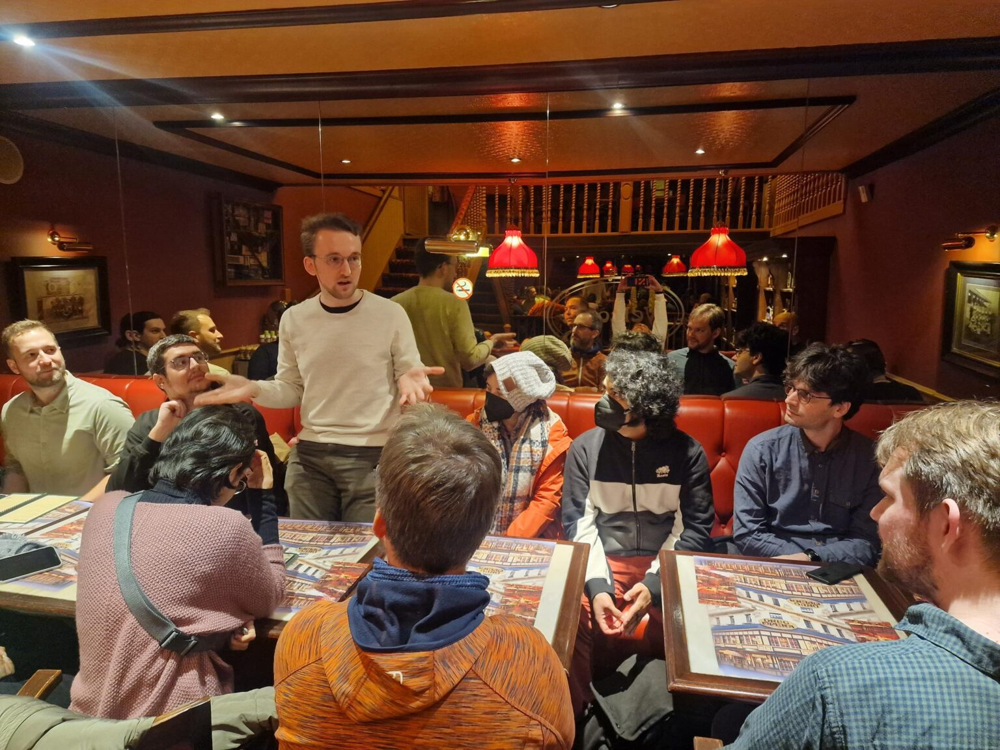

# Fedora 项目在 FOSDEM 2023 的经历 

## 译文信息

- 源文：[The Fedora Project FOSDEM 23 Experience](https://fedoramagazine.org/the-fedora-project-fosdem-23-experience/)
- 作者：[Akashdeep Dhar](https://fedoramagazine.org/author/t0xic0der/)
- 许可证：[CC-BY-SA 4.0](http://creativecommons.org/licenses/by-sa/4.0/)
- 日期：2023-03-11
- 译者：暮光的白杨

---

当跨越不同的时间和情况时，成长的衡量标准是最明显的。这适用于人们在很长时间后见到你，也适用于任其蔓延的植被，当然也适用于社区在长期的在线互动后的第一次聚会。[FOSDEM](https://fosdem.org/2023/) 2023 恰好是来自世界各地的社区成员大约三年来，在比利时布鲁塞尔首次线下见面的机会之一。无论是新面孔还是老面孔，他们的时间都花在代表社区上，向更广泛的自由和开源社区展示他们一直忙于的好东西，最重要的是，与他们的 Fedora 朋友建立联系。

今年的 FOSDEM 于 **2023 年 2 月 4 日和 2 月 5 日**在**布鲁塞尔自由大学**[^1]举行。来自世界各地的 8000 多名软件工程爱好者参加了这个自由与开源社区活动，在 55 个指定的开发室进行了大约 36 场快速演讲和大约 771 场演讲。来自我们社区的贡献者并没有限制自己仅作为与会者参加活动，他们还热情地自愿成为 Fedora 项目展台的看台管理员、各种演讲和讲座的演讲者、一组开发室的组织者，甚至是地面工作人员，帮助 FOSDEM 2023 取得巨大成功。

## 展位上的代表

=== "展位 1"

    

=== "展位 2"

    

=== "展位 3"

    

Fedora 项目在布鲁塞尔自由大学校园 H 楼，靠近我们在 [CentOS 项目](https://www.centos.org/)和 [GNOME 项目](https://www.gnome.org/)的朋友的展位旁边设置了官方展位。

我们按时布置好了桌子、显示 FOSDEM 23 与会者徽章二维码的显示屏和各种 Fedora 项目赠品（如带有 Fedora 徽标的键帽、带有 Fedora 徽标的 USB 闪存驱动器、印有 Fedora 子团队/SIG/工作组（例如 [NeuroFedora](https://docs.fedoraproject.org/en-US/neurofedora/overview/) 和 [Workstation](https://docs.fedoraproject.org/en-US/workstation-working-group/)）标志的贴纸和夹子、带有 Fedora Logo 的网络摄像头等等）。幸运的是，我们还获得了一罐可以提供给我们的展位参与者的果冻熊，以及我们在 [AlmaLinux](https://almalinux.org/) 社区的朋友们提供的一套贴纸。

我们的社区成员事先制定了指定的展位值班时间表，展位在任何时间点都由至少三名工作人员持续照管，并在整个活动过程中接待了数百名展位参观者。展位参观者很高兴地与我们的展位工作人员互动，分享了他们自己使用 Fedora Linux 以达到他们选择的目的的有趣经历，并询问了有关参与社区的问题。我们还与来自 **CentOS 项目**的朋友合作，共同努力管理我们的展位，并在 FOSDEM 更衣室间与展位之间来回运送物资。总而言之，我们非常感谢社区参与运营我们的官方展位。

## 讨论创新

参与 Fedora 项目社区的贡献者借助 FOSDEM 2023 期间多种会谈或讲座形式，迫不及待地分享关于他们一直在做的事情的见解。从在 Apple Silicon 硬件上运行的最新 Fedora Linux remix 到改进 GNU/Linux 发行版上的视频游戏体验，从总结第一个开源创意会议的有益成果到为 Fedora Linux 构建基于 Web 的安装程序，我们的成员参与其中，提供了大量高质量的内容，并受到了充满热情的与会者的大厅的广泛赞誉。

提供的演讲或讲座不仅有助于让其他人了解我们一直在做的所有很酷的事情，而且有助于从更广泛的自由和开源软件社区获得关于我们如何做得更好的反馈。与会者在会谈结束后热切地提问，并且很想知道我们的项目、活动和发展的方向，从而帮助演讲者建立他们的网络，并帮助潜在的新贡献者。以下是与 Fedora 项目相关的演讲与讲座列表，你可以点击其中的链接来访问录音和共享演示文稿文件。

- [Fedora Asahi](https://fosdem.org/2023/schedule/event/fedora_asahi/)  
    [Main Track](https://fosdem.org/2023/schedule/track/main_track_k_building/)  
    *由 [Eric Curtin](https://fosdem.org/2023/schedule/speaker/eric_curtin/) 提供*  
- [Fedora CoreOS——你的下一个多人家庭实验室发行版](https://fosdem.org/2023/schedule/event/container_fedora_coreos/)  
    [容器开发室](https://fosdem.org/2023/schedule/track/containers/)  
    *由 [Akashdeep Dhar](https://fosdem.org/2023/schedule/speaker/akashdeep_dhar/) 和 [Sumantro Mukherjee](https://fosdem.org/2023/schedule/speaker/sumantro_mukherjee/) 提供*  
- [DNF5 – RPM 软件管理的新时代 1](https://fosdem.org/2023/schedule/event/dnf5/)  
    [Main Track](https://fosdem.org/2023/schedule/track/main_track_k_building/)  
    *由 [Nicola Sella](https://fosdem.org/2023/schedule/speaker/nicola_sella/)、[Jan Kolárik](https://fosdem.org/2023/schedule/speaker/jan_kolarik/) 和 [Aleš Matěj](https://fosdem.org/2023/schedule/speaker/ales_matej/) 提供*  
- [创意自由峰会回顾 1](https://fosdem.org/2023/schedule/event/creative_freedom_summit_retrospective/)  
    [开源设计开发室](https://fosdem.org/2023/schedule/track/open_source_design/)  
    *由 [Emma Kidney 1](https://fosdem.org/2023/schedule/speaker/emma_kidney/) 和 Jess Chitas 提供*  
- [Linux 发行版的游戏状态](https://fosdem.org/2023/schedule/event/linux_gaming_fedora/)  
    [发行版开发室](https://fosdem.org/2023/schedule/track/distributions/)  
    *由 [Akashdeep Dhar](https://fosdem.org/2023/schedule/speaker/akashdeep_dhar/) 提供*  
- [从 Linux 到 Cloud 再到 Edge 和 Beyond：发行版和 FOSS 1 中女性贡献者的演变](https://fosdem.org/2023/schedule/event/women_in_linux_foss/)  
    [发行版开发室](https://fosdem.org/2023/schedule/track/distributions/)  
    *由 [Amita Sharma 1](https://fosdem.org/2023/schedule/speaker/amita/) 和 [Justin W. Flory 1](https://fosdem.org/2023/schedule/speaker/justin_w_flory/)提供*  
- [为 Fedora 安装程序构建 Web UI](https://fosdem.org/2023/schedule/event/anaconda_web_ui/)  
    [发行版开发室](https://fosdem.org/2023/schedule/track/distributions/)  
    *由 [Martin Kolman](https://fosdem.org/2023/schedule/speaker/martin_kolman/) 提供*  

## 帮助开发室

=== "开发室 1"

    

=== "开发室 2"

    

=== "开发室 3"

    

作为一个由志愿者推动，只有少数常驻工作人员的会议，FOSDEM 完全依靠自由和开源爱好者的贡献，来组织和运行各种开发室。FOSDEM 设置了互联网连接和投影仪，以确保各个团队能够以快速会谈、新闻、讨论、会谈和讲座的形式会面、讨论、快速编程和公开展示他们的最新进展。这些开发室涵盖了广泛的不同主题，为所有爱好者提供了一个展示他们一直在做的事情，了解他们感兴趣的领域的最新动态，并从围绕他们的主题进行的讨论中受益的平台。

从特定语言的开发室到关于社区治理的开发室，Fedora 项目社区的贡献者不仅参与了在这些开发室中进行的演讲或讲座，而且还自愿提供帮助，让这些活动取得巨大成功。从运行现场麦克风到弹出问题，再到标记抽认卡以向演讲者显示他们还剩多少时间，从为每个上台的新演讲者设置无线麦克风到活动结束后清理一切——FOSDEM 感谢社区的参与，我们全力以赴。以下是 Fedora 社区成员帮助的开发室列表。

- [发行版开发室](https://fosdem.org/2023/schedule/track/distributions/)  
    [Justin W. Flory](https://fedoraproject.org/wiki/User:jflory7)、Shaun McCance、[Akashdeep Dhar](https://fedoraproject.org/wiki/User:t0xic0der)、[Sumantro](https://fedoraproject.org/wiki/User:sumantrom) 和 [Mukherjee](https://fedoraproject.org/wiki/User:sumantrom)  
- [公共代码和数字公共产品](https://fosdem.org/2023/schedule/track/public_code_and_digital_public_goods/)  
    [Vipul Siddharth](https://fedoraproject.org/wiki/User:siddharthvipul1)

## 让 FOSDEM 成功举办

=== "活动剪影 10"

    

=== "活动剪影 11"

    

身穿亮橙色 FOSDEM 志愿者 T 恤的是我们引以为豪的 FOSDEM 地勤人员，他们投入时间确保会议组织过程中一切顺利。从在演讲或讲座开始前介绍演讲者，到在柜台上收银，销售 FOSDEM 的官方 T 恤，从负责 FOSDEM 衣帽间内的展位和设计室资产，到为赶往开发室的迷路的演讲者指路，不用说，没有他们，FOSDEM 就不可能实现。在这里，我们的 Fedora 项目长期贡献者之一，[Bogomil Shopov](https://fedoraproject.org/wiki/User:Bogomil) 在 FOSDEM 2023 期间自愿担任 FOSDEM 的官方地勤人员。

## 其他活动

=== "活动剪影 12"

    

=== "活动剪影 13"

    

=== "活动剪影 14"

    

除了 FOSDEM 2023 之外，参与 Fedora 项目社区的贡献者还参加了大约在同一时间举行的一系列聚会，这进一步丰富了我们成员的交流机会。这不仅导致我们的社区与其他社区（如 openSUSE、GNOME 等）的联系越来越广，而且在与其他社区合作的同时，也让我们学习并适应了其他社区的最佳做法。我们于 2023 年 2 月 3 日参加了为期一天的 [CentOS Connect](https://connect.centos.org/) 活动，于 2 月 3 日参加了谷歌的 FLOSS 基金会 2023 晚宴，于 2 月 4 日参加了谷歌的导师聚会和 Fedora & CentOS 朋友晚宴，以及在 2 月 5 日参加了 [GitHub 的 SustainOSS 聚会](https://opencollective.com/sustainoss/events/sustainoss-fosdem-2023-meetup-d5b38235)。

[^1]: Université Libre de Bruxelles, Campus du Solbosch, Avenue F. D. Roosevelt 50, 1050 Bruxelles, Belgium.