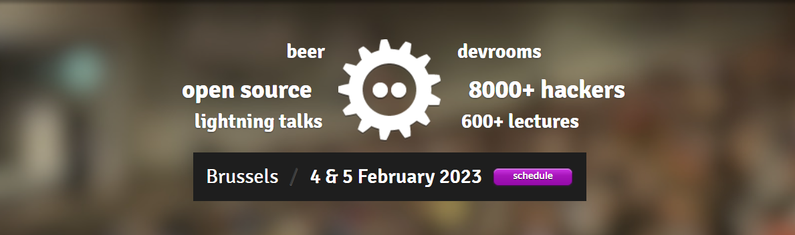

# FOSDEM 2023 Distributions Devroom - 征集参与

## 文章信息

- 原文：[FOSDEM 2023 Distributions Devroom - Call for Participation](https://discussion.fedoraproject.org/t/fosdem-2023-distributions-devroom-call-for-participation/44129/1)  
    - 类型：论坛讨论贴/新闻邮件
- 作者：[Justin W. Flory](https://discussion.fedoraproject.org/u/jflory7)
- 许可证：不明
- 译者：暮光的白杨
- 日期：2022-11-17

----

我们很高兴地宣布 Fedora 将重返 [FOSDEM 2023](https://fosdem.org/) 的 [Distributions Devroom](https://fosdem.org/2023/schedule/track/distributions/)，时间是 2 月 5 日星期日全天，现场聚会在布鲁塞尔举行。提案征集现已开放。

## 关于 Distributions Devroom

Distributions Devroom 由构建、打包和贡献 Linux 发行版及其他软件的人员运营，并为他们服务。无论是在裸机上还是在容器中运行，或是从超级计算机到边缘部署，Linux 发行版仍然是现代 IT 基础设施的重要组成部分。Distributions Devroom 提供了一个论坛来分享整个分发生命周期的最佳实践，从构建和集成到长期支持和安全修复。

## 征集提案

我们欢迎针对发行版特有问题感兴趣的贡献者的提案，尤其是在以下主题中：

- 围绕发行版发展、参与和与社区合作；
- 自动化构建和测试以最大限度地减少人工参与；
- 常见问题的跨发行版协作；
- 发行版的构建、安装、部署、打包和内容管理；
- 平衡新代码和活跃的上游与安全更新和最小化重大变化；
- 交付[无架构](https://stackoverflow.com/questions/43265767/difference-between-noarch-rpm-and-a-rpm)的软件；
- 与[供应商](https://en.wikipedia.org/wiki/Independent_software_vendor)合作并将他们纳入社区；
- 发行版的未来和新兴趋势；
- 发行版社区内的非工程主题（例如文档、营销、国际化、设计、社区运营等）；
- 通过评估上游组件并为下游提供安全来源来创建安全供应链。

## 重要日期

- 提交截止日期：2022 年 12 月 20 日
- 录取通知：2022 年 12 月 31 日
- 最终时间表公布：2022 年 1 月 14 日

## 提交步骤

1. 注册一个 [FOSDEM Pentabarf 帐户](https://penta.fosdem.org/user/new_account)并登录。
2. 访问 [FOSDEM 2023 CFP](https://penta.fosdem.org/submission/FOSDEM23) 并单击 “Create Event”。
3. 确保为 “Distributions devroom” 设置 “Track” 以便 wranglers 接收您的提交！
4. 使用您的演示文稿详细信息填写表格。

确保您提交的内容包含以下详细信息：

1. 标题；
2. 一段摘要；
3. 更长的描述，包括您与目标受众交谈的好处、目标受众的定义；
4. 大致长度/提交类型（演讲、BoF、……）等；
5. 相关网站/博客/谈话材料的链接（如果有）。

## 关于 FOSDEM

FOSDEM 是软件开发人员见面、分享想法和协作的免费活动。每年，来自世界各地的数千名自由和开源软件开发人员齐聚布鲁塞尔。FOSDEM 拥有数十个开发人员讨论室，社区成员在那里开展各种主题的活动。