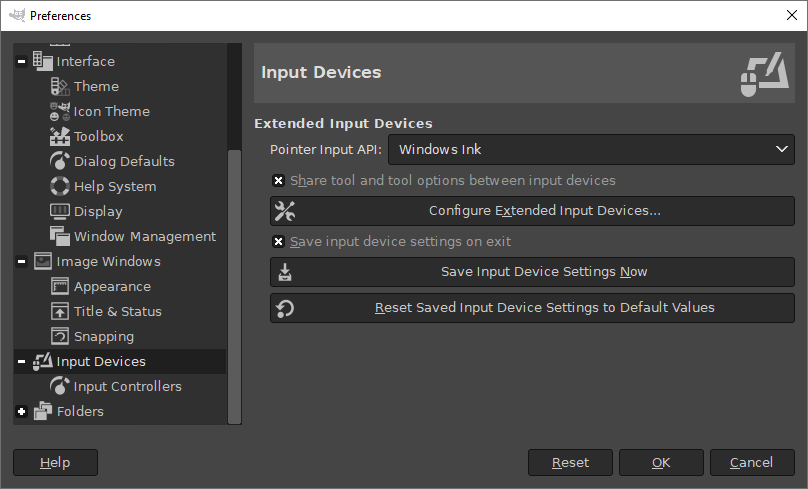

# GIMP 2.10.38 已发布!

- 译文信息：
    - 源文：[GIMP 2.10.38 Released](https://www.gimp.org/news/2024/05/05/gimp-2-10-38-released/)
    - 作者：[GIMP Team](https://www.gimp.org/author/gimp-team.html)
    - 许可证：[CC-BY-SA 4.0](https://creativecommons.org/licenses/by-sa/4.0/)
    - 日期：2024-05-07
    - 译者：暮光的白杨

----

这个（可能是最后一个）GIMP 2 稳定版本带来了备受期待的 GTK3 向后移植，包括改进对 Windows 绘图板的支持。该版本还包含大量错误修复和小幅改进。

*本新闻列出了最显著和最明显的更改。特别要指出的是，我们不会列出每一个错误修复或较小的改进。要获得更完整的变更列表，请参阅 [NEWS] 文件或查看[提交历史]。*

[NEWS]: https://gitlab.gnome.org/GNOME/gimp/-/blob/7d4a7604a8f038eca45045dfa246b363874c44b2/NEWS#L11
[提交历史]: https://gitlab.gnome.org/GNOME/gimp/-/commits/gimp-2-10

## 新功能和改进

### 改进对 Windows 绘图板的支持

在此版本发布之前，GIMP 只支持通过 WinTab 驱动程序连接 Windows 上的绘图板，而不是更新的 Windows Ink 驱动程序。因此，我们收到了许多关于绘图板出现按钮反应迟钝、压力敏感度不正确、画笔移动滞后和中途笔画位置改变等问题的报告。

这些问题是由于 GTK2 的限制造成的，因为对 Windows Ink 的支持是由长期贡献者 Luca Bacci 在 GTK3 中实现的。在此版本中，Luca 非常慷慨地将此支持向后移植到了 GTK2。现在，您可以在“首选项”对话框中的"输入设备"设置下，在 WinTab 和 Windows Ink 驱动程序之间进行切换（如果您的计算机支持）。

  
<grey><em>
现在可以更改 Windows 指针输入 API - GIMP 2.10.38
</em></grey>

### 其他向后移植的 GTK3 功能

Luca 还为 GTK2 向后移植了其他许多 GTK3 功能。一些向后移植的改进包括：更新打印对话框的大小，使按钮不会被切断；修复弹出对话框出现在前一个对话框后面的问题；以及一些键盘输入的修复。

这些改进主要针对 Windows，并已包含在 2.99 开发版中。不过，我们很高兴这些生活质量方面的改进能在 GIMP 2.10 稳定版中实现！

## BUG 修复

### 最近的崩溃

两个常见的崩溃问题现已得到纠正。GLib 2.80 中的一个改动暴露了我们关闭进程中的一个错误，导致退出时崩溃。Luca Bacci 再次为 2.10.38 和即将发布的 3.0 候选版设计了一个修复程序。此外，一些用户在进行非常小的选择时遇到的另一个崩溃也已修复。

### 其他修复

此版本中修复了许多其他小错误。其中包括：

- 具有透明度的索引 PNG 现在可以使用正确的颜色导出
- Anders Jonsson 修复了多个过滤器（例如 Waves 和 Distort）的输入范围
- 标题栏自定义字段现在支持 UTF-8 字符
- 现有的图片评论不再“泄漏”到新创建的图片中

## 发布统计数据

自 GIMP 2.10.36 起：

- 16 份报告已于 2.10.38 关闭并已修复
- 已合并 9 个合并请求
- 已推送 81 项提交
- 添加了 1 个新翻译：卡拜尔语
- 更新了 16 个翻译：白俄罗斯语、巴西葡萄牙语、英式英语、丹麦语、格鲁吉亚语、德语、希腊语、匈牙利语、冰岛语、意大利语、挪威尼诺斯克语、斯洛文尼亚语、西班牙语、瑞典语、土耳其语、西班牙语

25 人对 GIMP 2.10.36 代码库做出了更改或修复（顺序由提交数量决定）：

- 7 名开发人员：Alx Sa, Jehan, Luca Bacci, Jacob Boerema, Lukas Oberhuber, lillolollo, Øyvind Kolås
- 19 名译者：Kolbjørn Stuestøl, Sabri Ünal, Bruce Cowan, Yuri Chornoivan, Vasil Pupkin, Anders Jonsson, Rodrigo Lledó, Jürgen Benvenuti, Sveinn í Felli, Andi Chandler, Juliano de Souza Camargo, Ekaterine Papava, Balázs Úr, Martin, Philipp Kiemle, Alan Mortensen, Dimitris Spingos, Marco Ciampa, Yacine Bouklif

对 GIMPverse 中其他存储库的贡献（顺序由提交数量决定）：

- 自 2.10.36 发布以来，`gimp-macos-build` 的 `gimp-2-10` 分支（macOS 构建脚本）已由 2 位贡献者进行了 30 次提交：Lukas Oberhuber、Bruno Lopes。
- Flatpak 版本由 3 位贡献者的 11 项提交组成：Jehan、Hubert Figuière 和 Bruno Lopes。
- 自 2.99.18 发布以来，我们的[主网站]已由 4 位贡献者进行了 42 次提交：Jehan、Alx Sa、Andre Klapper 和 Lukas Oberhuber。
- 自 2.99.18 发布以来，我们的[开发者网站]已由 6 位贡献者进行了 34 次提交：Bruno Lopes、Jehan、Alx Sa、bootchk、Alpesh Jamgade 和 Robin Swift。
- 自 2.10.36 发布以来，我们的 [2.10 文档]由 8 位贡献者进行了 35 次提交：Alan Mortensen、Anders Jonsson、Rodrigo Lledó、Jacob Boerema、Kolbjørn Stuestøl、Marco Ciampa、Andi Chandler 和 Víttor Paulo Vieira da Costa。

[主网站]: https://www.gimp.org/
[开发者网站]: https://developer.gimp.org/
[2.10 文档]: https://docs.gimp.org/

我们不要忘记感谢所有帮助我们在 Gitlab 中进行分类、报告错误并与我们讨论可能的改进的人。我们的社区也深深感谢管理我们各种讨论渠道或社交网络帐户的互联网战士，例如 Ville Pätsi、Liam Quin、Michael Schumacher 和 Sevenix！

*注意：考虑到 GIMP 及其周围的部分数量，以及我们如何通过 `git` 脚本获取统计数据，这些统计数据中可能会出现错误。如果我们遗漏或错误分类了一些贡献者或贡献，请随时告诉我们。*

## 团队新闻和发布流程

GSoC 2023 贡献者 Idriss 最近被授予主源存储库的 “developer” 访问权限，以表彰自那时以来持续出色的工作。

Ville Pätsi 是多个主题（设计、主题等）的长期贡献者（超过 20 年！），获得了 Gitlab 的 “reporter” 访问权限，以帮助直接在跟踪器中进行分类和组织。

## GIMP 的周边

### 镜像站新闻

自我们[最新消息]发布以来，3 个新[镜像]开始分发 GIMP：

- [美国 Clarkson 开源研究所]
- [瑞士 FCIX]
- [葡萄牙的 Tomás Leite de Castro]

[葡萄牙的 Tomás Leite de Castro]: https://mirror.leitecastro.com/
[瑞士 FCIX]: http://ipng.mm.fcix.net/
[美国 Clarkson 开源研究所]: https://mirror.cosi.clarkson.edu/home
[最新消息]: ./gimp-2.99.18-released.md
[镜像]: https://www.gimp.org/donating/sponsors.html#official-mirrors

这样以来，全世界共有 49 个镜像站。

镜像很重要，因为它们通过分担每日数十万次下载的负载来帮助项目。此外，通过遍布全球的镜像，我们确保每个人都可以快速下载 GIMP。

### 基础设施和硬件赞助商

我们通过 2 个部分增强了赞助商页面：

- “[基础设施赞助商]”列出了帮助 GIMP 进行基础设施建设的赞助商：
    - **CircleCI** 和 **MacStadium** 使我们的 macOS 持续集成平台成为可能。
    - **ARM Ltd.** 赞助并管理着 Windows 上的几个 `Aarch64` runner，用于我们的 Windows ARM 64 位构建；而**微软**则赠送了其 Microsoft Store 的一次性费用。
- “[硬件赞助商]”列出了向贡献者捐赠一些硬件以帮助开发的赞助商：
    - **ARM Ltd.** 最近捐赠了 Windows Dev Kit 2023 以支持我们最近的 [Aarch64/Windows 支持]。
    - **Purism** 于 2021 年捐赠了一台 Librem Mini。

[Aarch64/Windows 支持]: ./gimp-support-arm.md
[基础设施赞助商]: https://www.gimp.org/donating/sponsors.html#infrastructure-sponsors
[硬件赞助商]: https://www.gimp.org/donating/sponsors.html#hardware-sponsors

## 下载 GIMP 2.10.38

您可以在 [GIMP 官方网站（gimp.org）][dl]上找到我们所有的官方版本：

[dl]: https://www.gimp.org/downloads/

- 适用于 x86 和 ARM（64 位）的 Linux Flatpak
- 适用于 x86（32 和 64 位）和 ARM（64 位）的通用 Windows 安装程序
- 适用于 Intel 硬件的 macOS DMG 软件包
- 适用于 Apple Silicon 硬件的 macOS DMG 包

第三方制作的其他软件包显然也会跟进（Linux 或 *BSD 发行版软件包等）。

## 下一步行动

显然这是 2.10 系列中最小的版本之一，也可能是我们的最后一个版本。我们将拭目以待，尽管我们也知道有些人在旧系列上比其他人停留的时间更长（特别是在使用自由软件操作系统的 LTS 发行版时），因此我们可能会（如果觉得有必要）在 GIMP 3.0.0 发布之前或之后发布一个包含错误修复的 2.10.40 版本，作为总结。

无论如何，我们现在停止向后移植 2.10 系列中的功能。这些对 Windows 绘图板支持的改进非常巨大，因此我们必须将它们添加进来；但从现在起，我们只想专注于发布 GIMP 3.0.0。

你可能会问，那是什么时候？很快！我们正在为发布候选版本做最后的冲刺。其中包括大量的错误修复，但仍有一些 API 变动。我们会随时更新！

别忘了，你还可以[为 GIMP 开发人员捐款和提供个人资助][donating]，**以此回馈项目并加速 GIMP 的开发**。社区承诺有助于项目的发展壮大！💪🥳

[donating]: https://www.gimp.org/donating/