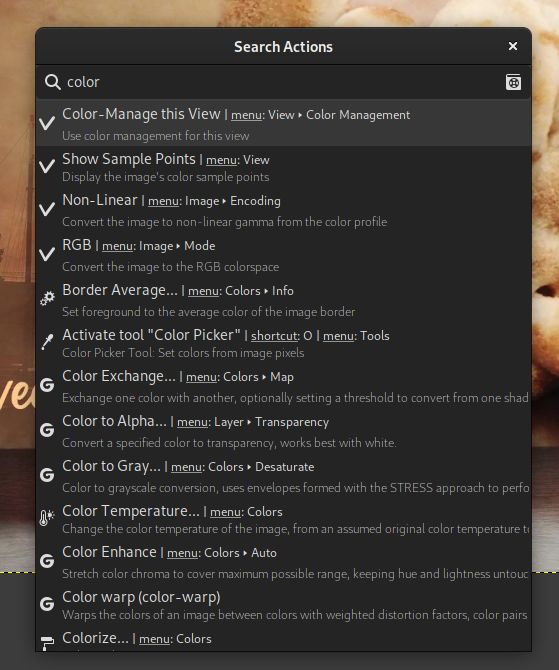

# GIMP 2.99.16（Wilber Week 2023 版）已发布!

- 译文信息：
    - 源文：[GIMP 2.99.16 Released: Wilber Week 2023 edition!](https://www.gimp.org/news/2023/07/09/gimp-2-99-16-released/)
    - 作者：[Jehan](https://www.gimp.org/author/jehan.html)
    - 许可证：[CC-BY-SA 4.0](https://creativecommons.org/licenses/by-sa/4.0/)
    - 译者：暮光的白杨
    - 日期：2023-07-10

<style>
    red { color: red }
    green { color: green }
    blue { color: #0099ff }
    orange { color: orange }
    grey { color: grey }
</style>

----

我们推出了比以往任何时候都更接近 GIMP 3.0 候选版本的，最新的开发版本：GIMP 2.99.16！<br />
本新闻涵盖了本次更新的一些更值得注意或有趣的部分，我们很高兴能够展示这些内容。

<center>

  
<grey><em>
新开发的启动画面，由 [Aryeom] 提供 - GIMP 2.99.16
</em></grey>

</center>

*注意：这个启动画面背后的有趣故事是 [Aryeom] 在 [Wilber Week] 的第一个晚上塑造了一个 [Wilber 披萨面团][piza]。在整个住宿期间，这个烤箱烤熟的面团一直[陪伴着我们]。此版本被称为 “Wilber Week 2023 版”，以向我们非常[成功的贡献者聚会][meetup]致敬。*

[Wilber Week]: ./gimp-wilber-week-2023.md
[Aryeom]: https://film.zemarmot.net/
[piza]: https://fosstodon.org/@zemarmot/110403126751688605
[陪伴着我们]: https://chaos.social/@nomis/110406801052021728
[meetup]: https://www.gimp.org/news/2023/06/29/wilber-week-2023/

*本篇新闻列出了最显着和最明显的变化。我们不会特别地在此处列出错误修复或较小的改进。要获得更完整的更改列表，你应该参考[新闻]文件或查看[提交历史]。*

[新闻]: https://gitlab.gnome.org/GNOME/gimp/-/blob/d3c5536ac85bb84e1beaba68aea12cf28062e08c/NEWS#L9
[提交历史]: https://gitlab.gnome.org/GNOME/gimp/-/commits/master

## GTK+3 移植正式完成

GIMP 3.0 被称为 GTK+3 移植版本，因此你会很高兴看到移植工作终于结束了。公平地说，我们仍然到处有一些小的弃用警告，但与过去的数百个警告不同。

### `GimpAction` 基础设施

我们的最后一项重大工作是移植 “action”（操作）的处理方式，在 GTK 词汇中，“action” 意味着快捷方式、其机制，以及菜单的处理方式和如何快速为通用小部件分配共享操作代码。从 GTK+3 开始，操作转移到 GLib（`GtkAction` 变成了 `GAction`），同时失去了很多功能（基本上面向用户的所有内容，即标签、描述、图标等）或被分解（快捷方式本身的概念仍然存在于 GTK 中）。<br />
因此，我们不得不把整个事情作为 `GAction` 的一个封装器来重新实现，显然称为`GimpAction`，因为对我们来说，这些面向用户的功能是构成一个操作的主要部分（特别是我们做了很多 GUI 和代码生成，所以像标签或图标这样的东西不会与一个部件相关联——无论是按钮、菜单项还是其他什么——而是与分配给这个部件的操作相关联，以方便和通用地重新使用。）。

我们还必须包装一堆其他的**部件**，比如我们自己的菜单（主要是因为从菜单模型生成的菜单在 GTK+3 中不再有工具提示，但我们却大量使用工具提示）和菜单模型（`GimpMenu` 和 `GimpMenuModel`），我们自己的工具条和菜单栏（`GimpToolbar` 和 `GimpMenuBar`）等等。

我花了大约2个月的时间来完成，同时还得处理其他的代码、维护和通常的错误修复。虽然很无聊，也很累，但现在已经完成了! 😅

它还为我们提供了一个全新的可能性，因为我们增加了我们长期以来想要的新概念，例如将短标签和长标签与一个操作联系起来的能力（例如当它在上下文界面（例如菜单）中使用时与在没有上下文的情况下使用时（例如操作搜索））。这也是计划中的未来改进的路线（例如，对于未来的[可定制的工具栏]）。

[可定制的工具栏]: https://developer.gimp.org/core/roadmap/#gui

我们还有更多的工作要做，才能让我们的新菜单和操作代码完全符合我们的要求，但我们已经处于足够好的状态来展示它。对于大多数人来说，这不会感觉很不同（并且你们也可能会发现问题），但不感觉太不同也是重点。

现在还有更多值得注意的直接改进。

### 每个操作有多个快捷方式

新的 Glib/GTK+3 action 使得为一个操作指定几个快捷键成为可能。目前，快捷方式对话框还不允许你这样做，然而我们已经在内部使用了这种功能，用于默认的快捷方式。例如，数字键盘的按键和数字键行的按键是不一样的，所以我们曾经创建了一个重复的操作来做同样的事情，以支持这两个操作（因为对于大多数人来说，无论是从数字键盘还是从数字键行，`Ctrl + 1` 都应该是一样的）。现在我们可以把这两个变体分配给同一个操作。

再比如，现在可以支持特殊语义的媒体键（例如，在一些键盘上可以找到的媒体键`复制`、`剪切`和`粘贴`）。

允许你设置自己的多个快捷方式的更新的快捷方式对话框可能不会出现在 GIMP 3.0 中，不过希望不会太晚。

### 操作搜索改进

现在我们有了自己的操作包装器，我们让它也跟踪自己的菜单位置，这样我们就可以在操作搜索对话框中显示这个菜单路径。这将帮助那些喜欢菜单的人更好地找到他们的方式。

<center>

{ width=70% }  
<grey><em>
操作搜索对话框现在显示菜单路径 - GIMP 2.99.16
</em></grey>

</center>

你可能还会注意到此屏幕截图中的一个“手册”📓 小图标。单击它将打开给定操作的手册页（如果此特定操作尚不存在帮助部分，你将被重定向到操作搜索帮助页面）。

或者，按 `F1` 键将打开所选操作的帮助页面。

## 改进 GEGL 操作的 GUI 集成

[GEGL] 是我们的图像处理引擎。过滤器（Filter）作为单独的模块实现，我们称之为 “operation”（操作）。虽然它发布时带有一长串默认操作，但第三方开发人员可以实现自己的过滤器，从而受益于自动对话框生成、画布上实时预览、幕布预览、预设保存、以前使用设置历史记录等。

[GEGL]: https://gegl.org/

自 GIMP 2.10 以来，GEGL 一直是一个主要组件，但我们仍然需要特定的代码来将 GEGL 操作放置在菜单中。<br />
对于第三方过滤器开发人员来说，他们不得不实现一个伪造的插件来包装他们的 GEGL 操作，或者满足于只在 GEGL 操作工具内显示的一长串过滤器列表中可见。

好吧，这已经改变了，因为 GEGL 过滤器现在可以轻松访问自己的菜单，就像插件一样。

从现在开始，GIMP 读取 GEGL key `"gimp:menu-path"` 以在菜单中添加操作。例如，假设我编写了一个艺术滤镜来对图像进行风格化，并且我希望它位于 `Filters > Artistic` 子菜单下。所以我的操作代码可以包含以下代码：

```
  gegl_operation_class_set_keys (operation_class,
                                 "name",           "Jehan:my-style",
                                 "title",          _("My Super Cool Style"),
                                 "description",    _("Stylize an image the way I like it"),
                                 "gimp:menu-path", "<Image>/Filters/Artistic",
                                 NULL);
```

然后如下：

<center>

  
<grey><em>
轻松将第三方滤镜添加到菜单 - GIMP 2.99.16
</em></grey>

</center>

GIMP 将根据你在操作中声明的属性自动生成 GUI。

当然，你也可以创建自己的菜单文件夹。假设我创建了一堆专门用于我们的电影项目的滤镜，我可以创建一个子菜单 `"<Image>/Filters/ZeMarmot"`（甚至是顶级菜单。你会注意到我的屏幕截图中的 “Girin” 菜单，我们已经在其中安装了自定义插件）。

我们也将使用它来简化核心 GIMP 代码，尽管目前只有[两个新的 GEGL 过滤器][gegl-babl]使用此功能。

[gegl-babl]: https://www.gimp.org/news/2023/07/09/gimp-2-99-16-released/#gegl-babl

ℹ️*关于 GEGL 操作命名空间（operation namespaces）：你可能会注意到我在假设的过滤器名称前添加了 “Jehan:” 前缀。这是一种使用唯一名称“命名”过滤器的方法，可以避免在有人使用相同名称实现过滤器时发生冲突。请明智地选择命名空间，特别是不要使用为 GEGL 核心操作保留的 “gegl:” 或 “svg:” 命名空间（我们甚至可能有一天会禁止第三方使用这个命名空间）。*

第二个重大改进是，你的自定义过滤器现在将显示在操作搜索中（默认为 `/` 键），无论你是否将其添加到菜单中。这允许非常轻松地搜索和运行它们！

<center>

{ width=70% }  
<grey><em>
现在可以搜索第三方过滤器 - GIMP 2.99.16
</em></grey>

</center>

## 工具

### 文字工具

虽然文本工具的画布上编辑器非常实用，但有时会很麻烦，因为它妨碍了你。在某些情况下，你希望在编辑文本时能够看到裸露的画布。

现在可以通过新选项 “*Show on-canvas editor*” 来切换其可见性。

<center>


<grey><em>
隐藏画布上的文本编辑器 - GIMP 2.99.16
</em></grey>

</center>

### 对齐和分布工具

该工具已在 GIMP 2.99.14 中进行了全面重新设计。

在此版本中，我们修改了选项 “Use extents of layer contents”（使用图层内容的范围），使其也适用于对齐参考（而不仅仅是目标对象）。

### 统一转换工具

我们提交了一个补丁，使变换矩阵可以在工具的画布上的对话框中选择。这使得在其他软件中重复使用矩阵变得更加容易（首先在 GIMP 中测试，以便立即预览变换，然后复制和粘贴矩阵）。

## Space Invasion

*Space Invasion* 是我们一个旨在确保我们展示或使用颜色的所有地方的颜色正确性、选择正确的颜色默认值、提出相关的颜色选项等内容的项目。

在此版本中，一些工作是在内部代码中完成的，这些代码仍然假设 sRGB 输入或输出，并在某些情况下使用。你现在可以更轻松地选择 sRGB 之外的前景色和背景色，并且拾色器工具会显示来自正确图像空间的颜色值。

我们还在拾色器工具（和可停靠的样本点）中，添加了新的 “*Grayscale (%)*” 显示模式，如果拾取的图像转换为灰度模式，则该模式会显示像素的灰度值。

关于这些界面还有更多工作正在进行中，例如确保颜色正确显示在各种颜色框中（不仅在画布上），当从一个图像的颜色空间切换到另一个颜色空间时，我们在共享颜色部件上得到合理的行为，等等。

此外，我们还计划在所有这些可以选择或显示颜色的共享界面上更明确地说明目前使用的颜色空间（可停靠的颜色、前景色/背景色、拾色器、可停靠的样本点……）。这将是下一个开发版本的最大部分之一。

## 用户图形界面

### 新选项 “合并菜单和标题栏”

在 “`首选项`” 对话框的 “`图像窗口`” 设置中，你会发现一个名为 “Merge menu and title bar”（合并菜单和标题栏）的新复选框。这基本上是一个为图像窗口切换到客户端装饰（Client Side Decoration）的选项，这主要意味着菜单将被合并到标题栏内，从而节省垂直空间。

<center>


<grey><em>
首选项设置 “合并菜单和标题栏” - GIMP 2.99.16
</em></grey>

</center>

*注意：此选项不适用于 macOS，因为 macOS 始终具有自己的特定于平台的菜单样式。*

由于标题栏在最大化时被设置为隐藏，因此如果你在 `首选项 > 图像窗口 > 外观 > 全屏模式下的默认外观` 中选中了“显示菜单栏”，菜单将暂时移出标题栏。即使在全屏模式下，这也会使菜单可见（如果选中相关选项；这是默认设置）。

现在我们知道，客户端装饰是一个相当有争议的功能。你会发现有很多人喜欢这个功能，但也有很多人反对（特别是因为你失去了窗口样式的一致性，因为装饰不再由窗口管理器处理）。此外，我们被告知，在某些特定情况下，系统拒绝放弃自己的窗口装饰，你可能会出现两个标题栏（一个由系统绘制，一个由GIMP绘制）。

由于这些原因，默认情况下禁用此选项。

### 主题

`Default` 主题的深色变体已被重新设计，因为它有点太暗了。旧版本已暂时移动至名为 “`Darker`” 的新主题，但我们不确定是否会保留它。

在我们上次[面对面的开发者会议][Wilber Week]上，也就是这项工作发生的地方，“高对比度”主题的概念也被唤起了。在某些时候，我们甚至讨论了实现主题颜色自定义设置的可能性。

现在我们不确定 GIMP 3.0 会发生什么。这实际上取决于我们发布时是否获得更多主题贡献。

## 填充和描边选择/路径改进

“*描边/填充选择轮廓*”或“*描边/填充路径*”对话框曾经建议使用“*纯色*”（实际上是前景色）或“*图案*”进行描边（分别填充）。我们将“纯色”分为“*前景色*”和“*背景色*”，这样你就不必不断地切换它们的位置。

此外，“*描边选择*”和“*描边路径*”对话框在堆栈切换器中进行了重新组织，使“*线条*”和“*绘画工具*”这两个选项更易于使用。<br />
由于节省了对话框空间，我们不再隐藏扩展器下的“线条样式”（Line Style）设置，以便更突出地显示线条渲染选项。

<center>

  
<grey><em>
重新组织的描边对话框 - GIMP 2.99.16
</em></grey>

</center>

## “中灰色（CIELAB）”图层填充选项

创建新图像或新图层时，有一个“填充”字段，你可以在前景色、背景色、白色、黑色、透明度或图案中选择创建的图层颜色。我们添加了“*中灰色*”（Middle Gray，CIELAB），它对应于 50% 的感知亮度（`CIELAB` 或 `CIELCh` 的 `L*`），或者同样是 18.42% 的亮度。

尽管“中灰色”的概念可能根据所选的定义而具有不同的值，但这是最常见的值之一，对于普通人类观察者的眼睛来说，它在感知上被认为介于黑暗和光明之间。

## 文件格式

文件格式方面的主要工作由 Alx Sa（即在之前的新闻中被称为 Nikc 的开发者）执行，他擅长添加对各种格式的支持并改进现有格式。这是很棒的工作，太棒了，Alx！ 👍

### FITS

[FITS] 是天文学中最常用的图像格式。

虽然我们过去常常嵌入自己的代码来支持 FITS，但现在我们将其移植到由 [NASA] 维护的库 [cfitsio]。

这使我们能够导入 8/16/32 位和浮点/双精度，压缩的 FITS 文件（GZIP、HCOMP、PLIO、RICE）。一般来说，它将大大提高我们对此格式的支持水平。

由于我们现在使用外部库，因此 FITS 支持变为可选（尤其与 Linux 发行版打包情况相关；在我们自己的软件包上，该功能始终可用）。

另外，我们要感谢 [Siril]（天文图像处理工具），它的开发人员与我们进行了交流，以改进对 GIMP 的支持。

[FITS]: https://en.wikipedia.org/wiki/FITS
[cfitsio]: https://heasarc.gsfc.nasa.gov/fitsio/fitsio.html
[NASA]: https://www.nasa.gov/
[Siril]: https://siril.org/

### PSD（以及一些 TIFF 和 JPEG）

GIMP 现在可以从 PSD 文件导入和导出剪切路径！

如果你的图像有任何路径，PSD 导出对话框将建议你“指定剪切路径”（Assign a Clipping Path），并且组合菜单将允许你选择要使用的路径。

<center>

  
<grey><em>
导出剪切路径 - GIMP 2.99.16
</em></grey>

</center>

该剪切路径可以在支持剪切路径的程序中使用，例如 [Scribus]（桌面出版程序）已经[列出了所有可用作剪切路径的路径][list]，但将以绿色突出显示所选的剪切路径，因此可以更好地标记你要用于此目的的路径。

[list]: https://wiki.scribus.net/canvas/How_to_Isolate_an_image_and_create_a_clipping_path_for_text_flow
[Scribus]: https://www.scribus.net/

<center>

  
<grey><em>
在 Scribus 中使用剪切路径（特别注意以绿色突出显示的路径） - GIMP 2.99.16
</em></grey>

</center>

同样，导入时，存储在 PSD 中的任何剪切路径信息将被重新用作导出的默认信息。

另一个有趣的变化是，导入时，如果不支持某些 PSD 功能，将显示兼容性警告对话框，列出所有缺少的功能：

<center>

{ width=60% }  
<grey><em>
导入 PSD 时出现兼容性警告 - GIMP 2.99.16
</em></grey>

</center>

这样，你可以在处理交换的 PSD 文件时做出明智的决定。

*请注意，导出对话框还有一个关于旧图层模式的新“兼容性声明”，因为有些人指出，导出 PSD 并在 Photoshop 中重新打开它们时，它们具有更好的兼容性。*

最后同样重要的是，我们新建了一个 PDB 过程 `"file-psd-load-metadata"`，以允许其他插件将 PSD 元数据加载委托给 PSD 插件。事实上，各种文件格式的一个常见用法是通过在 Photoshop 专有的元数据格式中存储自定义元数据来进行自我扩展。我们已经实现了 2 个这样的用法：

- TIFF 图像可以包含 `TIFFTAG_PHOTOSHOP` 元数据中的图像级（image-level）专有资源，以及 `TIFFTAG_IMAGESOURCEDATA` 元数据中的图层级资源（例如 PSD 图层而不是 TIFF 页面）。GIMP 现在支持这两者，并将加载它支持的内容。
- JPEG 图像能够包含图像级别的 PSD 元数据，例如路径。这些现在也将被加载。

与 PSD 插件本身相同，如果其中某些元数据不受支持，则会出现兼容性对话框。

这些将为 JPEG 和 TIFF（相对于特定的专有 PSD 资源）提供全新的支持，因为它们将同步到 PSD 插件的支持级别，而不是重复代码。

### JPEG

除了各种与元数据相关的改进之外，选项 “*4:2:2 horizontal (chroma halved)*” 被重命名为 “*4:2:2 (chroma halved horizontally)*”；选项 “*4:2:2 vertical (chroma halved)*” 被重命名为 “*4:4:0 (chroma halved vertically)*”。

研究表明这些是当今这些选项最常用的符号。

### JPEG-XL

我们添加了对 CMYK(A) 导出的初步支持：Key 和 Alpha 数据保存在额外通道中，并且也会保存模拟配置文件。

根据规范开发者的说法，该格式不支持“原始” CMYK 转换，因此导出时需要配置文件。如果未设置 CMYK 模拟配置文件，“导出为 CMYK” 选项将被禁用。

### DDS

我们在构建机器上启用了 [OpenMP] 支持。这尤其意味着启用了并行处理，这在某些情况下应该能提高处理速度。

[OpenMP]: https://en.wikipedia.org/wiki/OpenMP

### 新图像格式支持：PAM、QOI、Amiga IFF/ILBM、DCX

我们最近添加了对以下格式的导入和导出支持：

- [PAM]（灰度和 RGB，带或不带 alpha）：本质上是具有不同标头格式和 alpha/16 位支持的 PPM 文件。
- [QOI]：被有趣地命名为 “Quite OK Image” 格式，用于彩色光栅图像的无损图像压缩（每通道 8 位），带或不带 Alpha 通道。

我们添加了对以下格式的仅导入支持：

- [Amiga IFF/ILBM]：初步支持导入索引 ILBM、Amiga PBM 和 ACBM 图像。
- [DCX]：最多存储 1023 个 PCX 文件的容器。

[Amiga IFF/ILBM]: https://en.wikipedia.org/wiki/ILBM
[DCX]: https://en.wikipedia.org/wiki/PCX#PCX_image_formats
[PAM]: https://en.wikipedia.org/wiki/PAM_graphics_format
[QOI]: https://en.wikipedia.org/wiki/QOI_(image_format)

现在，支持奇怪的、旧的甚至有时被遗忘的格式似乎毫无用处，但这实际上很重要（至少是导入能力）。这对于归档、显示多年前创建的旧图像、重复使用和处理现有数据非常有用。

GIMP 的最终目标是能够加载世界上已经存在的任何格式！

*注意：其中一些新支持可能尚未包含在我们的官方软件包中（例如 Amiga IFF/ILBM），但应该很快就会包含在内。*

## 插件 API

插件的开发接口继续向其最终状态发展，尽管它仍然是 GTK+3 移植结束后最后的大型工作场所之一。

### 资源数据有自己的类

GIMP 插件过去通过名称来引用各种资源（画笔、字体、渐变、调色板、图案等）。我们开始在 `libgimp` 中的公共父类 `GimpResource` 下为这些数据创建特定的类（分别是 `GimpBrush`、`GimpFont`、`GimpGradient`、`GimpPalette` 和 `GimpPattern`）。这会将 API 的这一部分移至面向对象的接口（与图像、图层的其他现有类型相同），这对于绑定来说会更好。

此外，我们为每个资源不是基于名称的，而是唯一的 ID。虽然这部分仍然主要是 `libgimp` 端，但我们也计划在核心代码中减少名称的标识符。这确实很容易造成名称冲突，特别是当你与其他人交换数据时（很容易找到由不同人制作并使用相同名称的自定义画笔或字体）。我们正在努力使 GIMP 更加强大，以应对这些现实生活中的名称冲突。

### 插件本地化改进

我们完成了一些检查插件本地化规则的工作。虽然我们过去将菜单字符串由核心应用程序本身本地化，但其余部分由插件进程本地化。这一直让第三方开发者感到困惑（“我应该使用 `_()` 还是 `N_()` 来翻译字符串？”）。现在它已经变得简单了：插件完全负责自己的本地化，因此始终将已翻译的字符串发送到核心进程。这也意味着更改 GIMP 的语言设置会触发所有插件注册的重新加载（以更新字符串）。

除了简化规则之外，它还防止了 `gettext` 目录名称可能发生的冲突（如果两个插件使用相同的目录名，则不再重要，因为每个进程都处理自己的目录名）。

最后，尽管我们仍然推荐 gettext（我们还为插件提供了基础设施功能，可以使用 gettext 轻松设置插件本地化），它使第三方插件开发人员可以更自由地选择自己的本地化基础设施（如果他们更喜欢其他东西）。

所有这些更改也是将插件移至独立[扩展]的长期工作的一部分，这些扩展将易于共享和安装。

[扩展]: https://developer.gimp.org/core/roadmap/#extensions

### 更专业的插件参数类型

虽然 `GStrv` 是[在 GIMP 2.99.10 中添加][GStrv]的，但直到这个版本，它才被序列化到配置文件（我们在运行过程中存储插件设置的基础设施）。<br />
此功能的一个非常酷的首次用法是用于 Script-fu 控制台，它现在可以记住运行命令的历史记录。

[GStrv]: https://www.gimp.org/news/2022/02/25/gimp-2-99-10-released/#improved-api-for-plug-ins

此外，插件现在可以访问 `GBytes` 参数，用于所有我们错误使用 8 位无符号整数数组的情况，以表示二进制数据（或更一般的自定义数据，可以是从文本到二进制的任何数据）。`GimpUint8Array` 类型已作为可能的插件参数类型被删除，并且其所有用途均被替换。

### 更多内容

我们添加了更多功能，例如增强插件的 GUI 生成功能。我们处理了一些编码问题，并澄清了各种函数的注释和用法。

有关添加、删除或更改的功能的更详尽列表，请查看[新闻][news-01]文件。

[news-01]: https://gitlab.gnome.org/GNOME/gimp/-/blob/2c608168a222e9d36ba9c95564048e81523bc0d3/NEWS#L188

## GEGL，babl

和往常一样，这个版本的 GIMP 伴随着新版本的 [babl] 和 [GEGL]：

[babl]: https://gegl.org/babl/
[GEGL]: https://gegl.org/

babl 0.1.104 和 0.1.106 改进了 LUT 代码，并通过缓存平衡 RGB 到 XYZ 矩阵来提供更快的启动速度。

除了常见的错误修复之外，GEGL 0.4.44 和 0.4.46 开始向某些操作添加 `"gimp:menu-path"` 键，改进了 `gegl:ff-load`、`gegl:ff-save` 以使它们能够使用 FFmpeg 6.0（尽管 `gegl:ff-save` 仍然无法在该版本的 FFmpeg 上正常工作），并添加了 2 个新操作：

1. `gegl:chamfer`

在 LinuxBeaver 的研究基础上，使用 `gegl:distance-transform` 和 `gegl:emboss` 对不同的斜面进行模糊建模。

<center>

  
<grey><em>
将 `gegl:chamfer` 应用于文本以获得斜角效果 - GIMP 2.99.16
</em></grey>

</center>

2. `gegl:local-threshold`

邻域感知和可选的图像抗锯齿阈值处理。该操作相当于使用大半径进行锐化掩模，然后应用阈值放大图像并按放大因子的倒数缩小。<br />
如果你有一张照片并且想要制作一个不错的高光与阴影阈值，那么它会提供比内置阈值更好的结果。它从邻域半径中找到高斯平均值的每像素自适应阈值水平。此外，它还允许创建抗锯齿阈值掩码（如果半径设置为 0，则行为类似于内置阈值操作）。<br />
从用户体验的角度来看，接管当前阈值过滤器的新过滤器唯一缺少的是指定 `rgb⇒gray` 转换，然后 UI 的附加部分将是阈值选项。
但要注意的是，抗锯齿是通过放大和缩小输入来实现的——如此高的设置会导致其质量增益相对较小。

<center>

  
<grey><em>
左：原始；右上：当前阈值过滤器的结果；右下角：新本地阈值的结果 - GIMP 2.99.16
</em></grey>

</center>

## 发行统计数据

自 GIMP 2.99.14 起：

- 104 个错误报告已于 2016 年 2.99 月修复为已关闭。
- 已合并 123 个合并请求。
- 已推送 1115 项提交。
- 更新了 25 个翻译：巴斯克语、保加利亚语、加泰罗尼亚语、中文（中国）、中文（台湾）、丹麦语、世界语、法语、格鲁吉亚语、德语、希腊语、匈牙利语、冰岛语、意大利语、立陶宛语、波斯语、波兰语、葡萄牙语、罗马尼亚语、俄语、斯洛文尼亚语、西班牙语、瑞典语、土耳其语、乌克兰语。

67 人对 GIMP 2.99.16 代码库做出了更改或修复（顺序由提交数量决定）：

- 34 名开发者：Jehan, Alx Sa, Michael Natterer, Jacob Boerema, Simon Budig, Luca Bacci, Niels De Graef, Daniel Novomeský, Lloyd Konneker, Øyvind Kolås, Lukas Oberhuber, Ian Martins, programmer-ceds, Andras Timar, Andre Klapper, Carlos Garnacho, Idriss Fekir, Jordi Mallach, Sabri Ünal, Shubham, Stanislav Grinkov, Stephan Lenor, Venkatesh, kotvkvante, lapaz, lillolollo, programmer_ceds, valadaptive, 依云, Anders Jonsson, Jordi Mas, Richard Szibele, Tomasz Golinski and Florian Weimer.
- 31 名译者：Martin, Yuri Chornoivan, Ekaterine Papava, Alexander Shopov, Hugo Carvalho, Jordi Mas, Sabri Ünal, Rodrigo Lledó, Asier Sarasua Garmendia, Anders Jonsson, Alan Mortensen, Cristian Secară, Sveinn í Felli, dimspingos, Alexandre Prokoudine, Balázs Úr, Chao-Hsiung Liao, Piotr Drąg, Tim Sabsch, Kristjan SCHMIDT, Luming Zh, Marco Ciampa, Alexandre Franke, Aurimas Černius, Balázs Meskó, Christian Kirbach, Danial Behzadi, Emin Tufan Çetin, MohammadSaleh Kamyab, Zurab Kargareteli and حجت‌اله مداحی.
- 10 名资源创造者（图标、主题、光标、初始屏幕、元数据...）：Jehan, Michael Natterer, Alx Sa, Stanislav Grinkov, Lloyd Konneker, Ville Pätsi, Aryeom Han, Daniel Novomeský, Anders Jonsson and Mark.
- 5 名文档贡献者：Jehan, Lloyd Konneker, Anders Jonsson, Corey Berla and Michael Natterer.
- 15 名构建或 CI 贡献者：Jehan, Alx Sa, Jacob Boerema, Michael Natterer, Daniel Novomeský, Lloyd Konneker, Michael Schumacher, Stanislav Grinkov, Niels De Graef, Simon Budig, Lukas Oberhuber, Florian Weimer, Luca Bacci, lillolollo and Jordi Mallach.

对 GIMPverse 中其他存储库的贡献（顺序由提交数量决定）：

- babl 0.1.104 和 0.1.106 的 1 位贡献者：Øyvind Kolås。
- GEGL 0.4.44 和 0.4.46 的 13 名贡献者：Øyvind Kolås, Marco Ciampa, Martin, Asier Sarasua Garmendia, Ekaterine Papava, Piotr Drąg, Yuri Chornoivan, Alexandre Prokoudine, Jan Tojnar, Rodrigo Lledó, Sabri Ünal, Tim Sabsch and dimspingos.
- 自 2.99.14 发布以来，已有 2 位 [ctx] 贡献者： Øyvind Kolås 和 Carlos Eduardo.
- 自 2.99.14 发布以来，`gimp-macos-build`（macOS 构建脚本）的 3 位贡献者：Lukas Oberhuber, Kyungjoon Lee and Mingye Wang.
- beta flatpak 的 2 个贡献者（和一个机器人）：Jehan, Daniel Novomeský 和 flathubbot.
- 自 2.99.14 发布以来，我们的主网站（你现在正在阅读的内容）有 7 位贡献者：Jehan, Sabri Ünal, Jacob Boerema, Aryeom Han, Michael Schumacher, lillolollo and Tim Spriggs.
- 自 2.99.14 发布以来，我们的[开发者网站]已有 9 位贡献者：Jehan, Bruno Lopes, Jacob Boerema, Krek Krek, Mark, Alx Sa, GoldenWon, Michael Schumacher and kotvkvante.
- 自 2.99.14 发布以来，我们的 [3.0 文档]有 16 位贡献者：Andre Klapper, Jacob Boerema, Anders Jonsson, dimspingos, Yuri Chornoivan, Jordi Mas, Nathan Follens, Tim Sabsch, حجت‌اله مداحی, Alexander Shopov, Balázs Úr, Danial Behzadi, Hugo Carvalho, Martin, Piotr Drąg and Rodrigo Lledó.

[ctx]: https://ctx.graphics/
[开发者网站]: https://developer.gimp.org/
[3.0 文档]: https://testing.docs.gimp.org/

让我们不要忘记感谢所有帮助我们在 Gitlab 中进行分类、报告错误并与我们讨论可能的改进的人们。我们的社区也非常感谢那些管理我们各种[讨论频道]或社交网络账户的互联网战士，如 Ville Pätsi、Liam Quin、Michael Schumacher 和 Sevenix！

[讨论频道]: https://www.gimp.org/discuss.html

*注意：考虑到 GIMP 及其周围的部件数量，以及我们如何通过 `git` 脚本获取统计数据，这些统计数据中可能会出现错误。如果我们遗漏或错误分类了一些贡献者或贡献，请随时告诉我们。*

## 团队新闻及发布程序

每个新版本的发布程序都在不断完善。我要感谢我们的测试人员，他们出色地解决了 GIMP 2.99.16 发布过程中遇到的一些问题，以及跟进这些问题、处理技术回复、创建或更新软件包等的人员。

特别感谢（按字母顺序排列）：Alx Sa、Anders Jonsson、Daniel Novomeský、Hubert Figuière、Jacob Boerema、Liam Quin、lillolollo、Luca Bacci、Lukas Oberhuber、Mark Sweeney、Sevenix、ShiroYuki_Mot 和 Uzugijin！

在此提醒，如果有人愿意通过参与发布测试来帮助我们改进 GIMP，请在[开发者网站跟踪器]上打开一份报告，并提供以下信息：

[开发者网站跟踪器]: https://gitlab.gnome.org/Infrastructure/gimp-web-devel/-/issues/new

- 你将测试的操作系统（Linux、Windows、macOS、*BSD……），如果可能的话请提供详细信息（哪个 Linux 发行版和版本？Windows 或 macOS 的哪个版本？……）。
- 你将测试的架构（x86、ARM……32 或 64 位）。
- 如果你要测试我们的预构建包或来自源代码（自定义构建）。

然后我们将在下一个版本测试阶段（稳定版和开发版）通知你。

我们对测试人员的期望：

- 确保你的昵称被引用时收到 Gitlab 通知（我们建议将你的[全局通知级别]设置为 “Participate” 或 “On mention”）。
- 关注发行报告，了解正在发生的事情以及何时需要你。
- 发行报告不是我们教人们如何使用计算机基本功能的地方。测试人员不必是开发人员，但他们必须能够遵循基本的技术指南，提供比“*它不起作用*”更有用的反馈，并且能够在全球范围内与开发人员进行交互。
- 友善热情：这里的每个人都是志愿者，无论是测试人员还是开发人员。这是社区、自由软件，而不是一项没有灵魂的工作。 🤗

[全局通知级别]: https://gitlab.gnome.org/-/profile/notifications

## 围绕 GIMP

### 镜像新闻

位于英国南约克郡谢菲尔德的 *Fremont Cabal Internet Exchange* 贡献了一个新的[下载镜像]来分发 GIMP。在总共 41 个镜像中，他们提供了 11 个镜像，他们显然是我们最大的镜像赞助商！感谢 FCIX！

[下载镜像]: https://www.gimp.org/donating/sponsors.html#official-mirrors

镜像很重要，因为它们通过分担每日数十万次下载的负载来帮助项目。此外，通过遍布全球的镜像，我们确保每个人都可以快速下载 GIMP。

### 图书新闻

Sabri Ünal 进行了出色的书目研究，添加了 39 本书，并在我们的“[关于 GIMP 的书籍][book]”页面中更新了更多内容。我们不会列出所有更改，因为更改太多，但你可以阅读详细的合并请求描述（[!93] 和 [!98]）。

我们开始获得包含最新出版物的最新[图书页面][book]。真棒！ 📚🤓

我们提醒大家，我们欢迎新书的加入。如果你知道有关于 GIMP 的书籍尚未被列入，请[报告与其他书籍相同的信息][report-book]。谢谢！


[book]: https://www.gimp.org/books/
[!93]: https://gitlab.gnome.org/Infrastructure/gimp-web/-/merge_requests/93
[!98]: https://gitlab.gnome.org/Infrastructure/gimp-web/-/merge_requests/98
[report-book]: https://gitlab.gnome.org/Infrastructure/gimp-web/-/issues/new

## 下载 GIMP 2.99.16

GIMP 2.99.16 目前仅适用于 Linux 和 Windows。在 GNOME 基金会修复他们的 Apple 账户之前，我们的 macOS 软件包目前由于无法公证软件包而受阻。我们会随时更新。

你可以在 [GIMP 官方网站 (gimp.org)][official] 上找到我们所有的官方版本：

[official]: https://www.gimp.org/downloads/devel/

- Linux development flatpak
- Windows installer
- ~~适用于 Intel 硬件的 macOS DMG 软件包~~（等待 GNOME 基金会修复）
- ~~适用于 Apple Silicon 硬件的 macOS DMG 软件包~~（等待 GNOME 基金会修复）

显然预计第三方制作的其他软件包（Linux 或 *BSD 发行版的软件包等）也会跟进。

## 下一步行动

虽然路线图上还显示了一些未完成的项目，但下一个版本的两个最大的工作领域是 API 的重新设计——这已经在路上了，但其重要性足以让我们需要真正地研究细节——以及 Space Invasion 项目（确保每一个现有的与颜色相关的功能都是可靠的）。

由于我们的开发已经到了“稳定化”阶段，而我们的依赖规则是基于 “Debian testing”（不管它是什么），我们最近冻结了对刚刚发布的 Debian 12 (bookworm) 的依赖。这意味着我们不会在 Debian 12 的基础上提高任何最低要求（可选依赖项除外，甚至仅在特殊情况下且有充分理由的情况下）。这是因为我们计划尽快发布，因此我们需要确保 GIMP 可以打包在所有相当新的发行版上。<br />
当然，对于我们自己的软件包（Windows、macOS 和 Flatpak），我们将始终使用最新的依赖版本。

不要忘记你可以[捐赠并个人资助 GIMP 开发人员][donating]，作为回馈和加速 GIMP 发展的一种方式。💪🥳

[donating]: https://www.gimp.org/donating/