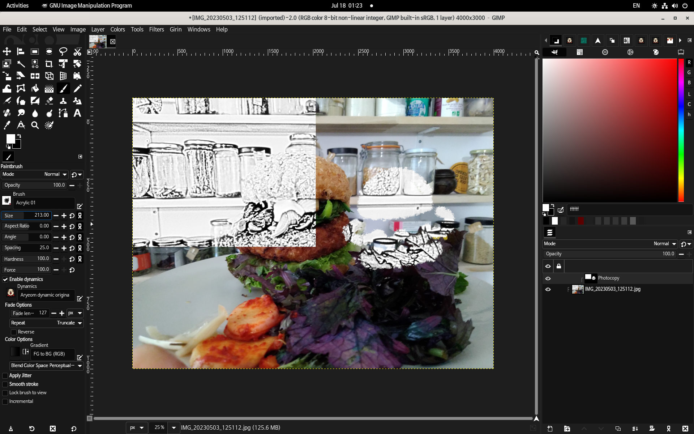
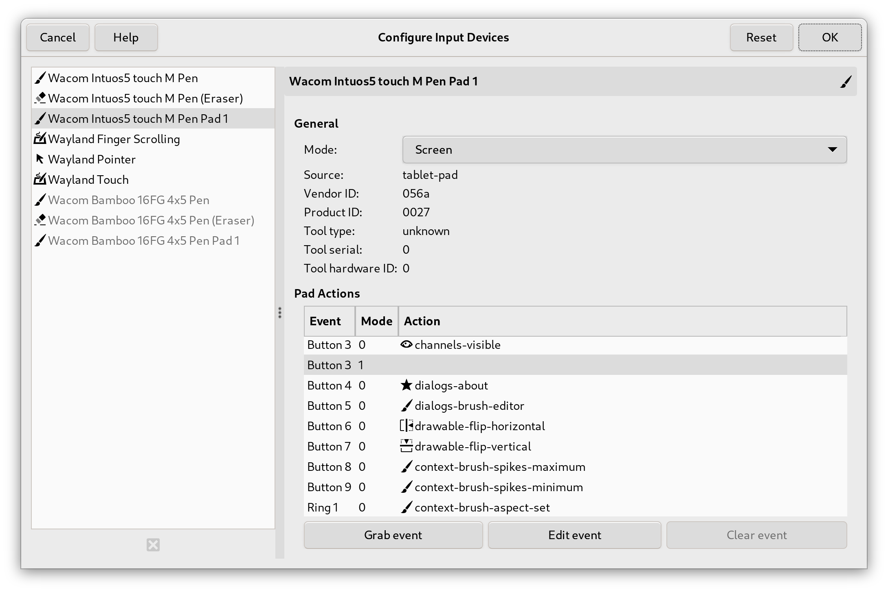

# GIMP 2.99.18 已发布：3.0 版本发布前最后的开发预览

- 译文信息：
    - 源文：[GIMP 2.99.18 Released: The Last Development Preview Before 3.0!](https://www.gimp.org/news/2024/02/21/gimp-2-99-18-released/)
    - 作者：[Wilber](https://www.gimp.org/author/wilber.html)
    - 许可证：[CC-BY-SA 4.0](https://creativecommons.org/licenses/by-sa/4.0/)
    - 日期：2024-02-21
    - 译者：暮光的白杨
    - 补档翻译日期：2024-03-28

----

终于，我们为您带来了 GIMP 3 之前的最终开发版本！虽然 2.99.18 版本的发布比[原定计划]晚了一些，但我们非常高兴能与大家分享许多新功能和改进。

[原定计划]: https://gitlab.gnome.org/GNOME/gimp/-/issues/10373#timeline

⚠️ ☢️

我们提醒大家，**开发版本**意味着这是一个展示工作进展的版本，同时也为社区提供了早期发现问题和报告问题的机会。换句话说，这是一个不稳定的版本，我们不建议在生产中使用它。当您想通过[报告 bug] 来帮助改进 GIMP 时请使用此开发版本。

[报告 bug]: https://gitlab.gnome.org/GNOME/gimp/-/issues

由于 “space invasion[^space]” 项目，2.99.18 版本可能是 2.99 系列中最不稳定的版本之一。 这是预料之中的，也是正常的。

[^space]: *"[Space Invasion]" 是一个长期项目的代号，始于 GIMP 2.10 的开发，即早在 2012 年。其理念是让 GIMP 不仅仅是一个 sRGB 编辑器。起初，我们专注于 [anyRGB]，但如今我们更加关注对 [anySpace] 的支持。我们也希望能使用 [CMYK] 后端编辑图像（现在，我们可以进行 CMYK 🗘 RGB 转换，这很好，但还不够），还允许使用随机通道（如专色通道），当然，为什么不能使用 [CIELAB] 图像或其他有用的东西呢？*   
          详见：<https://developer.gimp.org/core/roadmap/#space-invasion>

[Space Invasion]: https://developer.gimp.org/core/roadmap/#space-invasion
[anySpace]: https://en.wikipedia.org/wiki/Color_space
[anyRGB]: https://en.wikipedia.org/wiki/RGB_color_spaces
[CMYK]: https://en.wikipedia.org/wiki/CMYK_color_model
[CIELAB]: https://en.wikipedia.org/wiki/CIELAB_color_space

⚠️ ☢️

*本新闻发布列出了最显著、最明显的更改。我们不会在此列出次要的错误修复或较小的改进。要获得更完整的变更列表，请参阅[新闻]文件或查看[提交历史]。*

[新闻]: https://gitlab.gnome.org/GNOME/gimp/-/blob/1f85924e3cbd7a3e24f3bcb23cd854433d9b5271/NEWS#L9
[提交历史]: https://gitlab.gnome.org/GNOME/gimp/-/commits/master

---

## (颜色) Space Invasion

我们一直在 [Space Invasion] 项目上非常努力地工作，大家[可能还记得]，这是我们使 GIMP 在颜色方面更加**准确**的项目的代号。

[可能还记得]: https://www.gimp.org/news/2018/08/19/gimp-2-10-6-released/#prepare-for-the-space-invasion

最近，我们一直在移植旧的内部颜色结构（`GimpRGB`、`GimpCMYK`、`GimpHSV`……），我们用它们将颜色信息传递给 [`GeglColor`](https://developer.gimp.org/api/gegl/class.Color.html)。这个通用对象可以包含任何颜色数据，无论我们的像素编码引擎 [babl] 支持的[颜色模型]、精度或[空间][anySpace]如何。
 
[颜色模型]: https://en.wikipedia.org/wiki/Color_model
[babl]: https://gegl.org/babl/

对于颜色准确性来说，我们现在只有在需要时才会进行色彩转换（最后一秒转换），因此不会丢失本可以避免的信息。例如，假设您从图像中提取颜色：如果我们要将其转换为中间格式，然后再用于第二张图像（可能是也可能不是另一种颜色格式），那么我们将进行两次转换。这意味着精度损失的可能性更大。如果输入和输出格式相同（即根本不应该发生转换），那么问题就更加明显。当我们拥有核心 [CMYK] 后端时，这个问题会更加严重（我们确实希望避免使用 CMYK 进行中间格式的往返转换，因为 CMYK 与大多数其他色彩模型之间都不存在双向转换，即使在无约束工作和忽略精度问题的情况下也是如此）。

我们也在慢慢将存储数据转移到这个通用颜色对象（`GeglColor`）中。这尤其意味着调色板将可以包含 CMYK 颜色、[CIELAB] 颜色或任何其他支持的模型（而不仅仅是转换为无约束 sRGB（Unbounded sRGB[^srgb]）后的这些颜色）。

[^srgb]: [Limitations of unbounded sRGB as a universal color space for image editing](https://ninedegreesbelow.com/photography/unbounded-srgb-as-universal-working-space.html)

这对代码维护的一个好处是，由于结构中包含了数据及其"含义（meaning）"，因此在代码库中处理颜色转换就容易多了。与我们必须将这两种信息作为单独数据进行跟踪相比，它使颜色处理的错误率大大降低。

最后，我们正努力在界面的各个部分显示相关的[色彩空间][anySpace]信息，例如在显示或选择 RGB、CMYK、HSL 或 HSV 数据时。色彩模型中这些没有关联色彩空间的值几乎毫无意义。在界面上显示 RGB 数值而不提供其他信息，是过去的残余，因为过去主要指的是 `sRGB`。在现代图形工作中，这显然不再准确，界面应该清楚地表明这一点。

下面的视频展示了部分界面工作，例如 RGB、HSV 或 CMYK 模型始终显示值所处的色彩空间（通常意味着 [ICC 配置文件]的名称）。在颜色选择器工具、颜色样本、可停靠的前景/背景颜色、"更改前景/背景颜色" 对话框以及其他更多地方都是如此。

[ICC 配置文件]: https://www.color.org/icc_specs2.xalter

不仅如此，当人们选择软打样（soft-proofing[^soft]）配置文件并激活软打样时（例如，通过 [GIMP 2.99.12 中添加]的新模拟开关），我们不仅会在图像的色彩空间内显示出偏色区域，还会在软打样空间内显示出偏色区域。

[GIMP 2.99.12 中添加]: https://www.gimp.org/news/2022/08/27/gimp-2-99-12-released/#simulation-toggle-in-the-status-bar

[^soft]: 此处指的应该是 [Monitor proofing](https://en.wikipedia.org/wiki/Monitor_proofing)。

> 
<iframe title="Demo of GIMP 2.99.18: (Color) Space Invasion in the interface" width="560" height="315" src="https://peer.tube/videos/embed/0c97ef12-ba6e-479c-9835-a213bfe58e33" frameborder="0" allowfullscreen="" sandbox="allow-same-origin allow-scripts allow-popups"></iframe> 
>  <em>（颜色）界面中的 Space Invasion - GIMP 2.99.18</em>

**非常重要的警告**：这是我们代码库中又一次巨大的移植，影响了数千行代码。这项工作尚未完成，但必须在第一个候选版本发布之前完成。因此，此更新中预计会出现不稳定或错误，因此如果您遇到任何问题，我们建议您[报告它们]。

[报告它们]: https://gitlab.gnome.org/GNOME/gimp/-/issues

## 改进的颜色算法

Øyvind Kolås 改进了一些内部算法：

- 色相-饱和度工具中的消色像素（Achromatic[^dict] pixels）现在被特殊处理，因此（饱和度为 0 的）灰度像素仅通过主调整（master adjustment）更改，而不是通过红色调整（red adjustment）更改。
- 即使在渐变工具中选中了 "抖动（Dithering）"，灰度渐变（Grayscale gradients）现在也能保持消色差（achromatic）。

[^dict]: <https://en.wikipedia.org/wiki/Achromatic>

随着 "[Space Invasion]" 项目的不断深入，各种与色彩相关的算法越来越容易保持一致，从而使我们能够迅速发现问题并加以解决。

## 最初的非破坏性图层效果

我们“提前”完成的一个领域是备受期待的非破坏性图层效果（non-destructive layer effects）！自从将 [GEGL] 引入 GIMP 以来，许多开发人员多年来一直为这些功能奠定了基础。最初计划在 3.2 路线图中实现，但作为 [GSoC] 项目的延续，我们已经初步实现了这一功能。

[gegl]: https://www.gegl.org/
[GSoC]: https://summerofcode.withgoogle.com/

如果您不熟悉这个术语，“非破坏性编辑”意味着更改输出像素同时保持源像素完整的能力。对于模糊等滤镜效果来说，这意味着图层效果与图层像素是分开的。也就是说，如果以后想更改设置、重新排列甚至移除滤镜，都可以轻松实现，而不会影响图像的其他部分。在此之前，GIMP 采用的是破坏性编辑工作流（destructive editing workflow），效果会立即合并到图层上，因此这是一个重大的改变！

任何具有 GUI 的 GEGL 操作现在都可以非破坏性地应用于图层（图层蒙版和通道的非破坏性效果计划在未来更新）。这包括第三方 GEGL 插件和使用我们的 GEGL 图形工具创建的自定义操作。这些效果可以在 `.xcf`[^xcf] 项目文件中保存和加载，但当前版本并不支持所有 GEGL 属性。

[^xcf]: <https://en.wikipedia.org/wiki/XCF_(file_format)>

应用滤镜后，您可以通过单击可停靠图层中的滤镜图标进一步与其交互。这将打开一个弹出窗口，显示当前应用于该图层的所有滤镜。从这里，您可以切换滤镜的可见性、编辑滤镜设置、重新排序滤镜以及删除单个效果。您还可以合并所有过滤器以重新创建破坏性编辑工作流。

> 
<iframe title="Demo of GIMP 2.99.18: non-destructive layer effects" width="560" height="315" src="https://peer.tube/videos/embed/d15e2dbf-0d32-4970-9264-f2190ef9f111" frameborder="0" allowfullscreen="" sandbox="allow-same-origin allow-scripts allow-popups"></iframe> 
> <em>非破坏性图层效果 - GIMP 2.99.18</em>

请注意，这只是一个早期实现，为了实现非破坏性编辑的全功能版本，还有很多工作要做。我们将根据用户测试和反馈继续完善 3.0 版本的现有功能，并在之后进一步扩展。界面本身并不是我们设想中的理想功能，我们已经为一个集成度更高的工作流程[制定了第一份规范草案]。

[制定了第一份规范草案]: https://developer.gimp.org/core/specifications/layer-effects-ui/

下面的屏幕截图是第一份规范的模型，它将在主图层列表中显示图层效果，共享相同的“显示（eye）”和“锁定（lock）”按钮，但也有自己易于编辑的蒙版：

> 
> *规范模型图像：直接在图层列表中使用自己的蒙版查看图层效果*

然而，创建这个新界面本身就是一项挑战，因此我们决定将其推迟到 GIMP 3 发布之后，并首先提出这个早期实现。

请在 [discussion 论坛]和[问题跟踪器]上分享您的想法！

[discussion 论坛]: https://www.gimp.org/discuss.html
[问题跟踪器]: https://gitlab.gnome.org/GNOME/gimp/-/issues

## 改进的字体处理

另一位 GSoC 2023 学生 Idriss Fekir 一直与长期开发人员 Liam Quinn 合作，改进 GIMP 处理字体的方式。其中很多工作都是内部进行的，目的是提高 GIMP 处理未来字体和文本更新的能力。其中比较明显的变化包括：

- GIMP 不再依赖唯一的字体名称来区分它们。这意味着它不会再添加 "#1"、"#2 " 等名称，而是将原始名称保留在字体选择列表中。尽管名称上有明显冲突，但两种同名字体现在都可以正常工作。
- GIMP 现在可以使用自定义样式加载字体（绕过无法加载它们的 [Pango]）。
- 我们现在可以加载比以前更多类型的字体。如果我们还不支持某种字体（或者该字体不存在），我们可以更好地检测到这一点并回退到默认字体。这也改善了在其他电脑上创建的 `.xcf` 文件加载到不同可用字体时的支持。
- 在 Windows 上，我们强制 Pango 后端始终使用抗锯齿功能。这提高了该操作系统上菜单文本的可读性，尤其是在深色主题下。
- XCF 保存代码现在可以更准确地存储字体信息，这有助于避免在重新打开某些 XCF 文件时加载错误的字体。
- RTL[^RTL] 语言文本层中的文本对齐方式现在与其在其他软件（例如 [LibreOffice] 或 [Scribus]）中的工作方式更加一致。

[^RTL]: Right-to-left script，从右至左书写。 
       另见：<https://en.wikipedia.org/wiki/Right-to-left_script>

[Pango]: https://pango.gnome.org/
[Scribus]: https://en.wikipedia.org/wiki/Scribus
[LibreOffice]: https://www.libreoffice.org/

与其他一些功能相比，这些更改不那么华丽，因此可能感觉不那么重要，但它们实际上是使 GIMP 中的文本处理更加可靠的基础工作。在我们的设想中，未来的文本编辑将变得更简单，同时功能更强大、更丰富（尤其是 [OpenType] 功能，是我们希望最终获得的一些重大改进）。

[OpenType]: https://en.wikipedia.org/wiki/OpenType

## 自动扩展图层

去年夏天，学生 Shubham Daule 的第三个 GSoC 项目带来了一个社区长期要求的功能——自动扩展图层（Auto-Expanding Layers）！画笔工具现在有一个额外的“扩展图层（Expand Layers）”选项。选中该选项后，画过图层边界的部分将自动扩展，这样您就不必自己管理图层大小了。如果您想将图层扩展到画布的当前大小之外，您还需要选中“视图”菜单中的“显示全部”选项。

> 
<iframe title="Demo of GIMP 2.99.18: auto-expanding layers" width="560" height="315" src="https://peer.tube/videos/embed/adaa59b4-6f0c-491a-9ccd-baa1a8c7cc80" frameborder="0" allowfullscreen="" sandbox="allow-same-origin allow-scripts allow-popups"></iframe> 
> <em>自动扩展图层 - GIMP 2.99.18</em>

选择“扩展图层”选项后，还会有其他设置。您可以决定每当画笔到达图层边界时您希望图层边界扩展多少。还有一些选项可指定展开时应如何填充图层和图层蒙版的新区域。

## 新的捕捉选项

新贡献者 fantastic 先生开发了两个用于在画布上对齐图层的新选项。 启用“对齐边界框（Snap to Bounding Boxes）”后，当您移动的图层与其他图层的中心或侧面对齐时，将显示动态参考线。活动图层还将捕捉到这些边界，以帮助您正确排列它们。第二个选项“对齐等距（Snap to Equidistance）”允许您在彼此等距的三个图层之间对齐。

> 
<iframe title="Demo of GIMP 2.99.18: Snap to Bounding Boxes and Snap to Equidistance" width="560" height="315" src="https://peer.tube/videos/embed/57be0a8d-a34c-4aab-a453-d34705d583cc" frameborder="0" allowfullscreen="" sandbox="allow-same-origin allow-scripts allow-popups"></iframe> 
> <em>新的捕捉选项 - GIMP 2.99.18</em>

## 主题

我们继续改进此版本的用户界面和风格。最大的改进之一是处理“系统主题泄漏（system theme leaks）”。我们的主题中没有具体定义某些样式，因此允许不同的系统提供自己的（通常是冲突的）样式。在多位贡献者和用户的帮助和反馈下，我们在定义这些样式方面取得了很大进展，从而使每个人都能获得一致的体验！

最近 Jehan 致力于重新组织和简化我们的主题系统。在过去的开发版本中，我们有五个不同的主题：Default、Gray、System、Darker 和 Compact（每个主题都有浅色和深色选项）。现在这些主题已简化为系统主题和单一的默认主题；默认主题有三种可能的状态——浅色、深色和灰色。同样，我们的四个独立的图标主题被压缩为旧版集（Legacy set）和带有颜色和符号选项的默认值。我们认为这些变化将减少用户的困惑，并使他们更容易找到他们喜欢的界面外观。

此外，在 Windows 上，主标题栏（以及大多数对话框标题栏）现在根据所选主题调整为浅色或深色模式。

## 欢迎对话框

欢迎对话框已得到扩展，可快速访问许多有用的功能和选项。现在有四个新部分：

- 个性化（Personalize）：有几个自定义选项需要通过首选项对话框进行更改。现在，你可以在此页面轻松更改颜色和图标主题、用户界面语言和字体大小，以及操作系统的特定设置。
- 创建（Create）：此页面显示您最近打开的八张图像，并允许您快速重新打开它们。还有用于创建新图像或加载现有图像的按钮。与其他程序一样，您可以将此屏幕设置为在 GIMP 启动时自动显示，以便立即访问这些功能。
- 贡献（Contribute）：我们在本页汇总了参与 GIMP 开发的多种方式。这里有报告错误、编写代码、协助翻译或捐款的直接链接。
- 发行说明（Release Notes）：最初这些显示在欢迎页面的下半部分。现在我们有一个专门针对它们的完整选项卡，以便于阅读。

## 文件格式

与其他版本一样，我们对现有文件格式进行了改进，并添加了对一些新文件格式的导入和导出支持。

### DDS

新贡献者 Stayd 一直在与开发人员 Jacob Boerema 合作，对 [DDS] 插件进行了许多改进。首先，导入函数已编写得更简单，并且将来更容易扩展。其他一些额外更新包括：

- 现在可以加载每通道 16 位和 32 位 [RGBA] DDS 图像。
- 为 mipmap 生成添加了 [Catmull-Rom] 三次过滤器，所有 mipmap 生成计算均以 32 位精度执行。
- 现在还可以加载 R8G8、R16 和 R16G16 格式的 DDS 图像。
- 添加了在导入时垂直翻转 DDS 图像的选项，以反映现有的导出选项，因为有些游戏图像是以这种方式存储数据的。

[DDS]: https://en.wikipedia.org/wiki/DirectDraw_Surface
[RGBA]: https://en.wikipedia.org/wiki/RGBA_color_model
[Catmull-Rom]: https://www.mvps.org/directx/articles/catmull/

### GIF

过去，覆盖 GIF 而不是导出总是会将其转换为单帧图像。现在我们会在加载时检查 GIF 是否为动画，因此在覆盖时也会保持动画效果。

### HEIF 和 JPEG-XL

两个插件现在都使用各自的库（[libheif] 和 [libjxl]）来加载元数据。因此，我们删除了解释图像方向的自定义代码，转而依赖库提供的信息。

[libheif]: https://github.com/strukturag/libheif
[libjxl]: https://github.com/libjxl/libjxl

### OpenEXR

除了颜色类型之外，[OpenEXR] 还允许通道具有自定义名称。在这些情况下，我们现在将任何具有非常规名称的单通道图像视为灰度图像。导入时，我们还会显示通知，以便用户了解转换情况。

[OpenEXR]: https://www.openexr.com/

### PDF

即使只有一个图层组，现在也可以使用“图层作为页面（Layers as Pages）”导出选项。以前此选项不可用，因为插件仅检查是否有多个“图层”，而不考虑它是否是具有多个子图层的图层组。

### PNG

现在，导入时会保留可安全复制（Safe-to-copy）的 PNG 块，并包含在导出的图像中。此外，经常报告的导出透明索引 PNG 的问题已得到修复。现在导出的索引颜色应该可以正确显示。

### PSD

Jacob Boerema 继续致力于改进 [PSD] 插件。除了修正导入时的图层顺序等错误修复之外，他还澄清了有关 GIMP 和 Photoshop 之间图层模式兼容性的导出警告。

[PSD]: https://www.adobe.com/creativecloud/file-types/image/raster/psd-file.html

### PSP

[Paintshop Pro] 插件现在支持从项目文件导入更多功能，例如 ICC 颜色配置文件、参考线、网格以及保存文件时的活动选择。此版本还修复了 [ZDI-CAN-22096] 和 [ZDI-CAN-22097] 安全漏洞。

[Paintshop Pro]: https://www.paintshoppro.com/
[ZDI-CAN-22096]: https://www.zerodayinitiative.com/advisories/ZDI-CAN-22096/
[ZDI-CAN-22097]: https://www.zerodayinitiative.com/advisories/ZDI-23-1591/

### 新支持的图像格式：Farbfeld、Esm Software PIX 和 HEJ2

我们最近添加了对 [Farbfeld] 的导入和导出支持，Farbfeld 是一种 sRGB 图像格式，旨在易于外部解析、管道和压缩。

[Farbfeld]: https://tools.suckless.org/farbfeld/

我们还添加了对以下新文件格式的仅导入支持：

- [Esm Software PIX]：一种修改后的 JPEG 格式，由 Esm Software 公司专用于存储其定制图像。该格式是在一份[错误报告]中提出的，该错误报告将该格式与我们现有的 [Alias PIX] 图像支持相混淆。
- [HEJ2]：贡献者 Daniel Novomeský 对我们现有 HEIF 插件的补充，允许导入 JPEG 2000 压缩图像。

[Esm Software PIX]: http://fileformats.archiveteam.org/wiki/Esm_Software_PIX
[错误报告]: https://gitlab.gnome.org/GNOME/gimp/-/issues/10058
[Alias PIX]: http://justsolve.archiveteam.org/wiki/Alias_PIX
[HEJ2]: https://en.wikipedia.org/wiki/High_Efficiency_Image_File_Format#JPEG_compression_formats_in_HEIF_files

### 新支持的调色板格式：Swatchbooker

[Swatchbooker] 是一款 [FOSS] 软件，可以创建和转换各种格式的调色板。虽然软件本身已经多年没有更新，但其自定义调色板格式 `.sbz` 是我们目前支持的所有调色板格式中最全面的。其众多功能包括允许每个调色板条目有多个颜色模型定义、可本地化的名称和描述，以及支持每个条目的 ICC 颜色配置文件。

[Swatchbooker]: https://www.selapa.net/swatchbooker/
[FOSS]: https://en.wikipedia.org/wiki/Free_and_open-source_software

在我们进行导入支持工作时，我们为 [Krita] 修复对 Swatchbooker 支持的[一个错误]提供了帮助信息。项目之间能够相互合作、相互帮助，总是一件好事！

[Krita]: https://krita.org/en/
[一个错误]: https://bugs.kde.org/show_bug.cgi?id=474583

## Wayland 数位板交互

GNOME 长期贡献者 Carlos Garnacho 添加了通过数位板与 GIMP 交互的支持。插入数位板后，您现在可以通过“编辑”菜单下的“输入设备”对话框为数位板控件分配不同的操作。特别是，您不必在系统端将键盘快捷键映射到数位板的按钮上，然后再在 GIMP 端将相同的快捷键映射到操作上。您可以直接将数位板的按钮映射到操作，而无需键盘快捷键作为中介。

>   
> *将操作分配给数位板按钮 - GIMP 2.99.18*

这项工作还涉及[将功能移植]到 GTK 3（GIMP 所基于的 GUI 框架）。请注意，该功能目前仅支持 Wayland。

[将功能移植]: https://gitlab.gnome.org/GNOME/gtk/-/merge_requests/6095

## API 更新

作为 GIMP 3 改革的一部分，针对插件制作者的 API 正在稳步重新设计。其中一部分原因是，当涉及颜色时，我们会将 API 转为使用 `GeglColor`，作为更广泛的 "Space Invasion" 项目的一部分。然而，这只是整个 API 改进的一小部分。

我们还正在转向更多的类来表示 GIMP 管理的各种资源（画笔、字体、图案等），而不是仅通过名称来表示这些资源（这是一个历史限制，而 2 个资源创建者绝对有可能选择相同的名称，事实上我们在实际使用看到过这种情况——例如，独立创建的 2 个字体可能具有相同的名称）。

另一个重大举措是用 `GimpProcedureConfig` 替换表示插件过程的有序参数的 `GimpValueArray`，后者按名称而不是按顺序包含参数。这将使插件过程的语义使用更加合理（尤其是当它们拥有长长的参数列表时），同时也将使将来在不创建新过程的情况下使用新的或重新排序的参数来增强插件变得更加容易，因为参数的顺序和数量已经不那么重要了。这意味着将来添加新参数时，不会再破坏依赖于这些插件过去版本的现有脚本（当然，插件编写者仍需为新参数选择适当的默认值，才能实现这一点）。

与此同时，我们继续提高插件的自动化 GUI 创建能力，使创建对话框比以往更加容易。这包括（以及许多其他增强功能）一种名为 `GimpChoice` 的新型过程参数，它是一个选项字符串列表，可以在插件对话框中作为下拉列表小部件向创建者显示。

我们计划在 GIMP 3 发布的同时或不久之后在我们[开发者网站]的[资源开发]部分为插件编写者编写和发布教程。

[开发者网站]: https://developer.gimp.org/
[资源开发]: https://developer.gimp.org/resource/

## GEGL 和 babl

此版本的 GIMP 伴随着新版本的 GEGL 和 babl，这两个版本都有助于颜色 space invasion 项目。

babl 0.1.108 带来了一个新的 `babl_space_is_rgb` 函数来帮助我们直接确认颜色空间是 RGB（而不是进行多次测试来查看它是否不是 CMYK 或灰度）。构建过程和 babl 命令行界面工具也有一些改进。

GEGL 0.4.48 对 `GeglColor` 对象进行了多项更新，现在支持 GIMP 的大部分颜色操作。具体改进包括能够直接获取和设置 CMYK 颜色值，以及在设置 RGB(A) 颜色时分配颜色空间。

我们修复了现有 `gegl:voroni` 滤镜中的崩溃问题，并且还纠正了 `gegl:dropshadow` 滤镜中长期存在的阻止效果缩小的错误。

最后但并非最不重要的一点是，研讨会中添加了一个新的 `gegl:shuffle-search` 滤镜。它会打乱相邻像素以创建更优化的抖动效果。

## 发行统计数据

除了该系列的第一个版本 (2.99.2) 之外，GIMP 2.99.18 显然是大多数更新中最大的更新。自 2.99.16 起：

- 238 份报告已作为“已修复”关闭。
- 合并了 201 个合并请求。
- 推送了 1358 项提交。
- 更新了 26 个翻译：巴斯克语、白俄罗斯语、巴西葡萄牙语、保加利亚语、加泰罗尼亚语、中文（中国）、丹麦语、世界语、芬兰语、格鲁吉亚语、德语、希腊语、匈牙利语、冰岛语、意大利语、立陶宛语、挪威尼诺斯克语、波斯语、波兰语、俄语、 斯洛文尼亚语、西班牙语、瑞典语、土耳其语、乌克兰语和越南语。

60 人对 GIMP 2.99.18 代码库做出了更改或修复（顺序由提交数量决定；有些人分在多个组中）：

- 核心代码的 23 名开发人员： Jehan, Alx Sa, Shubham, Jacob Boerema, Idriss Fekir, bootchk, Anders Jonsson, Carlos Garnacho, mr.fantastic, Stanislav Grinkov, lillolollo, Øyvind Kolås, Sabri Ünal, programmer_ceds, Lukas Oberhuber, programmer-ceds, James Golden, Luca Bacci, Massimo Valentini, Niels De Graef, Zander Brown, psykose, sonia.
- 17 名插件或模块开发人员：Jehan, Alx Sa, Jacob Boerema, bootchk, Anders Jonsson, Stayd, Zander Brown, Bruno Lopes, Daniel Novomeský, Sabri Ünal, programmer_ceds, Kamil Burda, Mark, Michael Schumacher, Stanislav Grinkov, programmer-ceds, sonia.
- 31 名译者：Yuri Chornoivan, Martin, Ekaterine Papava, Luming Zh, Sabri Ünal, Anders Jonsson, Rodrigo Lledó, Jordi Mas, Alan Mortensen, Vasil Pupkin, Asier Sarasua Garmendia, Kolbjørn Stuestøl, Boyuan Yang, Víttor Paulo Vieira da Costa, dimspingos, Alexander Shopov, Alexandre Prokoudine, Aurimas Černius, Balázs Úr, Marco Ciampa, Sveinn í Felli, Danial Behzadi, Ngọc Quân Trần, Jürgen Benvenuti, Piotr Drąg, Timo Jyrinki, Andre Klapper, Kristjan SCHMIDT, MohammadSaleh Kamyab, Rafael Fontenelle, Tim Sabsch.
- 9 名资源创建者（图标、主题、光标、启动画面、元数据……）：Alx Sa, Jehan, Ferry Jérémie, Stanislav Grinkov, Anders Jonsson, Bruno Lopes, Jacob Boerema, Sabri Ünal, mr.fantastic.
- 5 名文档贡献者：Jehan, Bruno Lopes, Jacob Boerema, Alx Sa, Anders Jonsson.
- 14 名构建、打包或 CI 贡献者：Jehan, Bruno Lopes, bootchk, Alx Sa, Zander Brown, Jacob Boerema, Jacob Boerema, Stayd, Carlos Garnacho, Heiko Becker, mr.fantastic, Daniel Novomeský, U-YGGDRASIL\ender, lillolollo.

对 GIMPverse 中其他存储库的贡献（顺序由提交数量决定）：

- babl 0.1.108 由 6 位贡献者的 17 次提交组成：Jehan, Øyvind Kolås, John Marshall, Andre Klapper, John, sid.
- GEGL 0.4.48 由 20 名贡献者的 77 项提交组成：Øyvind Kolås, Jehan, Anders Jonsson, Jacob Boerema, Yuri Chornoivan, Alan Mortensen, Sabri Ünal, Andre Klapper, Ekaterine Papava, Jan Tojnar, Jordi Mas, Luming Zh, Martin, Piotr Drąg, Víttor Paulo Vieira da Costa, Asier Sarasua Garmendia, Marco Ciampa, Rodrigo Lledó, dimspingos, woob.
- 自 2.99.14 发布以来，[ctx] 已由 1 位贡献者提交了 308 次提交：Øyvind Kolås.
- `gimp-macos-build`（macOS 打包脚本）版本由 1 位贡献者的 32 次提交组成：Lukas Oberhuber.
- Flatpak 版本由 3 位贡献者的 15 次提交组成：Jehan, Daniel Novomeský and Hubert Figuière.
- 自 2.10.36 发布以来，我们的主网站（gimp.org）已由 6 位贡献者进行了 31 次提交：Jehan, Alx Sa, Sabri Ünal, Anders Jonsson, Bruno Lopes, Jonathan Demeyer.
- 自 2.10.36 发布以来，我们的[开发者网站]已由 5 位贡献者进行了 30 次提交：Bruno Lopes, Jehan, Alx Sa, bootchk, Robin Swift.
- 自 2.99.16 发布以来，我们的 [3.0 文档]已由 17 位贡献者进行了 247 次提交：Andre Klapper, Jacob Boerema, Yuri Chornoivan, Alx Sa, Jordi Mas, Alan Mortensen, dimspingos, Anders Jonsson, Boyuan Yang, Sabri Ünal, Víttor Paulo Vieira da Costa, Juliano de Souza Camargo, Rodrigo Lledó, Kolbjørn Stuestøl, Marco Ciampa, Danial Behzadi, Emin Tufan Çetin.

我们不要忘记感谢所有帮助我们在 Gitlab 中进行分类、报告错误并与我们讨论可能的改进的人。我们的社区也深深感谢管理我们各种[讨论渠道]或社交网络帐户的互联网战士，例如 Ville Pätsi、Liam Quin、Michael Schumacher 和 Sevenix！

[讨论渠道]: https://www.gimp.org/discuss.html
[3.0 文档]: https://testing.docs.gimp.org/
[ctx]: https://ctx.graphics/

*注意：考虑到 GIMP 及其周围部分的数量，以及我们如何通过 `git` 脚本获取统计数据，这些统计数据中可能会出现错误。如果我们遗漏或错误分类了一些贡献者或贡献，请随时告诉我们。*

## 团队新闻及发布流程

最近，Bruno Lopes（他一直非常积极地改进我们的构建过程和 Windows 打包）获得了 `git` 存储库的访问权限。

一些开始为新开发者网站做出贡献的长期或近期开发者或打包者也获得了相关 `git` 存储库的访问权限。

更多的贡献者现在正在积极参与测试版本和打包，这是多年来 Jehan 几乎没有完全撰写的第一个消息！非常感谢 Alx Sa（又名 Nikc 或 CmykStudent）参与协作新闻写作！

显然，我们正在日复一日地巩固一个坚实的核心贡献者团队，这在我们的发布过程中表明每个版本都有越来越多的反馈。

我们还特别高兴和自豪的是，自从我们再次订阅这个辅导计划以来，我们的 4 个 GSoC 项目都取得了成功，并且在实习结束后最多半年内就合并到了主代码分支。

## 围绕 GIMP

### 镜像新闻

自从我们上次发布[消息]以来，已有一个新[镜像]开始分发 GIMP：

[消息]: ./gimp-2.10.36-relased.md
[镜像]: https://www.gimp.org/donating/sponsors.html#official-mirrors

- *Sahil Dhiman*，德国纽伦堡，作为个人项目。

这样一来，全世界共有 46 个镜像。

镜像很重要，因为它们通过分担每日数十万次下载的负载来帮助项目。此外，通过遍布全球的镜像，我们确保每个人都可以快速下载 GIMP。

### GIMP on Windows/ARM

自从我们[在 Windows 上针对 ARM 64 位架构进行实验性构建的消息][note2]发布以来，我们得到了 [Hernan Martinez] 的帮助，他是 MSYS2 项目的知名贡献者，他托管了我们第一个基于 Aarch64 架构的 Windows CI runner。虽然这只是一个临时设置（实际上是某人客厅里的构建机器），直到我们获得更稳定的情况，但我们非常感谢 Hernan 帮助我们在这个平台上迈出了第二步（第一步是由 Jernej 完成的，他制作了我们的第一个实验性安装程序），并确保我们的自动构建流程能在这里运行等等。

[note2]: ./gimp-support-arm.md
[Hernan Martinez]: https://github.com/hmartinez82

从那时起，我们的情况更加稳定了：ARM 公司自己站了出来，为我们在 Gitlab 中的持续集成流程正式贡献了 3 个 runner！ARM 还向我们的一名开发人员赞助了 Windows devkit。

虽然我们仍然认为此构建是实验性的，但由于缺乏测试，并且由于目前只有 2 个贡献者拥有能够运行它的机器，因此最大的障碍已被删除，我们很高兴地宣布我们的 GIMP 2.99.18 通用 Windows 安装程序 包含适用于所有 3 个平台的 GIMP（x86 32 和 64 位，以及现在的 ARM 64 位）！

## 下载 GIMP 2.99.18

您可以在 [GIMP 官方网站 (gimp.org)] 上找到我们所有的官方版本：

[GIMP 官方网站 (gimp.org)]: https://www.gimp.org/downloads/devel/

- 适用于 x86 和 ARM（64 位）的 Linux Flatpak
- 适用于 x86（32 和 64 位）和 ARM（64 位）的通用 Windows 安装程序
- 适用于 Intel 硬件的 macOS DMG 软件包
- 适用于 Apple Silicon 硬件的 macOS DMG 包

显然预计第三方制作的其他软件包（Linux 或 *BSD 发行版的软件包等）也会跟进。

## 下一步行动

由于我们现在已进入功能冻结阶段，因此我们的重点已转移到错误修复、清理和为第一个 3.0 候选版本做准备。

我们确实认为这应该是最后一个开发版本，因为从现在起不会引入任何新功能，至少是 GUI 功能（API 仍在不断发展，直到第一个候选版本发布）。 所以您现在看到的基本上是 GIMP 3.0.0 中应该获得的功能。

这也是我们发布这个版本的原因，尽管我们知道它很不稳定。现在是发表最后意见的时候了！此外，现在也是报告和修复错误的时候了。我们希望能尽快推出 RC1 版本，并尽可能避免出现错误。

我们目前的期望是在即将于 5 月 9 日至 12 日举行的 [Libre Graphics 会议]上发布 GIMP。公平地说，这并不是一个简单的目标，因此我们也不确定能否实现。但可以肯定的是，即使我们不能按时发布，也不会拖得太久。特别是，我们不会因为设定了最后期限就发布。我们希望提供最好的体验，这意味着如果我们在最后一刻发现了拦截错误，我们会推迟发布，直到它们被修复。

[Libre Graphics 会议]: https://libregraphicsmeeting.org/2024/

别忘了，你还可以[为 GIMP 开发人员捐款和提供个人资助]，以此回馈社区并**加速 GIMP 的开发**。社区承诺有助于项目发展壮大！ 💪 🥳

[为 GIMP 开发人员捐款和提供个人资助]: https://www.gimp.org/donating/