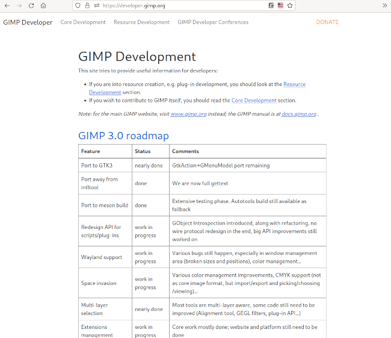

# GIMP 开发者网站的复苏

## 作品信息

- 原文：[Revival of the GIMP developer website](https://www.gimp.org/news/2022/10/16/gimp-developer-website-rewrite/)
- 作者：[Wilber](https://www.gimp.org/author/wilber.html)
- 许可证：[CC-BY-SA 4.0](https://creativecommons.org/licenses/by-sa/4.0/)
- 译者：暮光的白杨
- 日期：2022-10-18

----

这个周末，我们发布了一个新的[开发者🧑‍💻网站](https://developer.gimp.org/)！🥳

顾名思义，它面向开发人员，包括核心贡献者（开发 GIMP 本体的人）和第三方开发人员（制作插件并在旁边发布它们的人）。这就是为什么该网站有两个主要部分：

- [Core](https://developer.gimp.org/core/)（核心）：针对核心开发人员，提供路线图、有关如何构建 GIMP 的信息、编码风格指南……
- [Resources](https://developer.gimp.org/resource/)（资源）：为第三方开发者提供公共 `libgimp` API 的链接、制作插件的教程……  
我们将来将此部分称为“资源”，它还可能包含有关如何为 GIMP 制作画笔或其他数据的信息。

## 一点历史

[GIMP 开发者网站](https://developer.gimp.org/)至少有 20 年的历史（互联网档案馆可以追溯到 2001 年的早期页面），但遗憾的是，自 2009 年以来大部分时间都没有得到维护。

从那时起，开发人员的文档分散在[通用网站](https://www.gimp.org/)、源代码库本身和 2 个 wiki（开发人员和 GUI wiki）上。如你所知，[开发者 wiki 最近遇到了一些问题](https://www.gimp.org/news/2022/08/27/gimp-2-99-12-released/#development-website)。至于 GUI wiki，它仍然存在，尽管我们计划将两个 wiki 合并到我们新的开发者网站中。

我们希望将开发人员文档整合到一个入口点，而不是到处都有重复的文档。

## 正在进行的工作

这个新网站仍在修缮中。内容仍然不完整且经常过时。我们决定以当前状态发布它并随时更新，而不是单纯等待完善的成品。

像往常一样，我们坚持只提供静态页面，不提供服务器端脚本。它更简单、更安全，因为我们不想花时间管理网页（我们开发的是 GIMP，而不是网页）。

到目前为止已完成的事：

- 在 Pat David 的帮助下，我们将网站从 DockBook 移植到了 [Hugo](https://gohugo.io/)，在此特别感谢 Robin Swift。Hugo 有几个优点：  
    - Markdown 语法不如 DockBook XML 强大，但迄今为止足够简单。它应该会促进[贡献](https://gitlab.gnome.org/Infrastructure/gimp-web-devel/)。  
    - Hugo 网站更容易构建和测试，在开发过程中使用 hugo 网络服务器时具有良好的即时反馈循环。  
    - Hugo 有一个很好的组织，文件结构也决定了网站结构。  
- 内容被重新组织、审查、部分重写或合并。保留一些过时的文档是出于历史利益，但可能与现代 GIMP 使用不相关。  
    - 我们确定了 2 个如上所述的主要部分：核心和资源；以及一个额外的会议部分（Conferences section），我们主要跟踪历史会议，开发人员在这些会议上对 GIMP 的未来做出了一些决定。我们会尝试在这些部分和小节中组织相关的文档。  
- 我们逐步提高了网站发布的自动化程度，例如自动抓取最新的 `libgimp` 库文档和早期错误检测。  
- 我们创建了一个测试网站来在发布到主网站之前验证更改（类似于我们为 `gimp.org` 所做的）。这两个网站每天都会从他们自己的分支自动发布，并且可以通过 Gitlab 上的持续集成作业手动触发。  
- 我们回收了旧开发者网站上的所有文档，并在检查后将其转换为 markdown，重组或丢弃。  
- 来自 `gimp.org` 主网站的一些与开发相关的文档已移至 `developer.gimp.org` 或合并到其他文档中。例如，我们有关于为 GIMP 贡献代码的冗余页面。现在（除非我们漏了什么）只有一个教程：[提交你的第一个补丁](https://developer.gimp.org/core/submit-patch/)。  
- 数十个旧的 wiki 文档被转换为 markdown 格式，并在检查后被移动或丢弃。特别是，一些请求最多的页面又有了一个主页：  
    - [GIMP 路线图](https://developer.gimp.org/core/roadmap/)  
    - [GIMP 的编译教程](https://developer.gimp.org/core/setup/)  
- 来自 GIMP 主要源存储库的一些文档已被移动。一个重要的文件是 [GIMP 编码风格指南](https://developer.gimp.org/core/coding_style/)。  
- 我们创建了重定向，因为“[酷 URI 不会改变](https://www.w3.org/Provider/Style/URI)”并且被移动页面的链接可以在许多第三方网站中找到。例如，路线图的旧链接（以前位于 [wiki.gimp.org/wiki/Roadmap](https://wiki.gimp.org/wiki/Roadmap)）现在重定向到新路线图。  

## 下一步计划

更多的文档需要移动、重写或修复。 这只是一个开始。

此外，网站风格目前非常简单和朴素。一方面，对于一个开发网站来说，这可能还不错。另一方面，已经发生了一些讨论，建议让网站看起来更活泼一点，不那么朴素🧐。敬请期待！

## 为什么是这个网站

### 降低贡献难度

通过有一个单一的入口，我们希望新手可以更轻松地了解在哪里构建 GIMP 和贡献补丁。

现在，如果有人问如何做贡献，请告诉他们查看 [GIMP 开发者网站的核心部分](https://developer.gimp.org/core/)。

### 简化插件开发

我们努力打造一个活跃的第三方插件生态系统。为此，我们希望帮助第三方开发人员。很多关于插件开发的文档和教程遍布网络，其中许多链接已经失效，很大一部分文档因为缺少维护，已经过时。

这个新网站在这方面还没有带来什么，不过通过将插件开发作为两个主要部分之一，我们显然打算为即将到来的 GIMP 3.0 改变这一现状。你不应该指望有新的 GIMP 2.10 插件开发教程，但如果你对 GIMP 3.0 的插件制作感兴趣，你绝对应该关注这个地方：[GIMP 开发者网站的资源部分](https://developer.gimp.org/resource/)。

## 统计数据

主要工作发生在 [`gimp-web-devel` 存储库](https://gitlab.gnome.org/Infrastructure/gimp-web-devel/)上。

自 7 月中旬，当我们开始网站更新时，以下贡献者参与了：

- Jehan: 86 commits
- Pat David: 38 commits
- Robin Swift: 15 commits
- Lukas Oberhuber: 1 commit

在 [`gimp-web`（主网站）存储库](https://gitlab.gnome.org/Infrastructure/gimp-web/)中还有一些未在此处列出的工作。

## 为 GIMP 做贡献或进行资助

像往常一样，我们提醒 GIMP 是社区、自由和自由软件。这是我们所有人共同创造的。这也是开发者网站存在的主要原因。希望你会发现它很有用。如果没有，也请不要忘记该网站本身是社区制作的。不必拘谨，[请随时提出缺失的开发人员教程以及对现有教程的修复或更新](https://gitlab.gnome.org/Infrastructure/gimp-web-devel/)。

[帮助 GIMP 开发](https://developer.gimp.org/core/){ .md-button }

最后但并非最不重要的一点是，如果 GIMP 对你有用并且**你希望资助开发**，非常欢迎你向项目捐款并资助核心 GIMP 开发人员，作为回馈和加速 GIMP 开发的一种方式。

[通过**捐款**赞助我们](https://www.gimp.org/donating/){ .md-button }