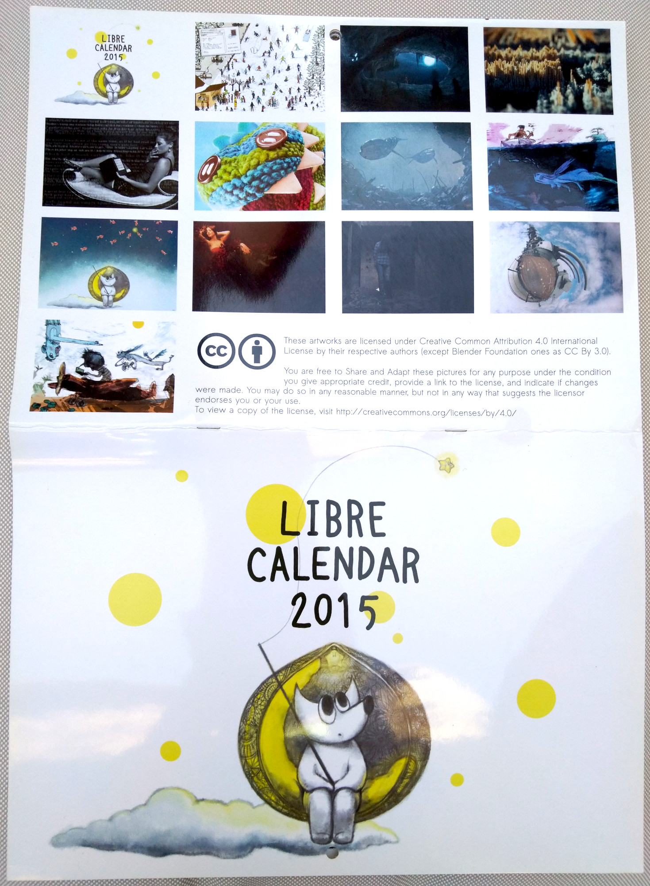

# GSoC 2022 项目公布：CMYK 特性

## 译文信息

- 原文：[GSoC 2022 project announced: CMYK features](https://www.gimp.org/news/2022/06/03/cmyk-in-gsoc-2022/)
- 作者：[Wilber](https://www.gimp.org/author/wilber.html)
- 日期：2022-06-04
- 许可证：[CC-BY-SA 4.0](https://creativecommons.org/licenses/by-sa/4.0/)
- 译者：暮光的白杨

## 正文

最终项目已经确认：Nikc，一名 Google Summer of Code 学生，今年正致力于[将 CMYK 功能引入 GIMP](https://summerofcode.withgoogle.com/programs/2022/projects/x9DLkUcC)。让我们更详细地讨论一下。

声明一下，我们只向谷歌申请了这个独特的项目名额。Nikc 事先与我们讨论，以了解需求、项目的现状以及想要的方向。他们也在 GSoC 选拔前贡献了补丁，所以我们知道他们在代码审查时的互动情况。如果有人对未来几年的 GSoC 感兴趣，请考虑与我们进行这样的沟通，而不是只扔下一个提案而不在我们的[邮件列表](https://www.gimp.org/discuss.html#mailing-lists)或 [IRC](https://www.gimp.org/discuss.html#irc-matrix) 上联系我们。😉

### GIMP 和 CMYK 到底是怎么回事？

从历史上看，在 GIMP 中实现对 CMYK 的支持是很复杂的，因为该程序过去是硬性规定几乎所有东西都使用 sRGB 色彩空间。多年来，支持任何 RGB 色彩空间的工作一直在进行，在 2.10 稳定版系列中已经有了很大的改进。另一方面，几十年来，我们的项目并没有将打印作为主要的工作流程来推动。

从 2000 年末开始，我们一直在考虑 CMYK 的后期装订工作流程，即你在 RGB 中工作，在 CMYK 中进行软打样，然后导出为 CMYK。与我们合作的 UX 架构师 Peter Sikking [提出了一个计划](http://blog.mmiworks.net/2009/05/gimp-enter.html)，但图像处理引擎缺少所需的更改，因此必须有人在 GUI 中公开所有内容。

我们最终缺少有兴趣优先考虑此事的贡献者，而且几年前我们从贡献者那里获得的一个[补丁](https://gitlab.gnome.org/GNOME/gimp/-/issues/356)由于架构原因无法合并，必须完全重构才能与 GIMP 的其余代码很好地配合。

几年前，Øyvind Kolås 终于[将缺失的部分添加到](https://www.patreon.com/posts/cmyk-progress-22901518)我们的图像处理引擎 GEGL，这使得我们可以将 CMYK 图像与 RGBA 图像混合并将结果写入 TIFF CMYK 文件。这为这个特定的 GSoC 项目铺平了道路。

### 此 GSoC 项目的目标是什么？

首先，我们还不是在讨论 CMYK 图像模式，类似于 “RGB”、“灰度”和“索引”，就像你所知道的那样。下面是该项目将关注的内容。

**在 CMYK 颜色空间中导入和导出图像。**GIMP 将在 CMYK 颜色空间中打开图像并将其转换为 RGB(A) 以供查看和编辑。你还可以将图像导出为 CMYK。我们目前的目标是 TIFF、PSD、PDF、EPS、AI 和 PDF 文件格式。

虽然你还不能在非原生色彩空间中编辑 CMYK 图像，但能够打开（如果只是查看）和导出 CMYK 数据显然是向前迈进了一步。此外，虽然使用 CMYK 后端对某些使用场景很有用（根据打印机的指示控制黑色或其他准确的颜色混合、墨水覆盖、陷印、叠印等等），但使用 *RGB 图像，然后在最后转移到 CMYK，仍然是许多工作类型的推荐工作流程。例如，GIMP 团队和其他团队的图形专业人员使用 GIMP 和 [Scribus](https://www.scribus.net/) 的组合取得了很大的成功，这是我们强烈推荐的软件。

>
>*使用 FLOSS 打印的示例：“[Libre Calendar 2015](https://librecal2015.libreart.info/)” 是 [LILA](https://libreart.info/) 与几位艺术家（插画家、摄影师和 3D）的合作项目，使用 GIMP、Inkscape 和 Scribus 制作，基于 Creative Commons 2.0 进行授权。*

以下是有关文件格式中 CMYK 支持的当前进展：

- JPEG：  
    - 多年来，GIMP 一直支持加载 CMYK JPEG 加载。  
    - CMYK JPEG 加载最近被 Jehan Pagès 移植到使用 `babl` 进行转换。  
    - Jehan Pagès 也实现了 CMYK JPEG 导出。  
    - 这些改进将在即将发布的 GIMP 2.99.12 中提供，并作为 Nikc 的演示样本实施，因为 Jehan 是项目导师。  
- PSD：
    - 感谢 Massimo Valentini 的帮助，自 GIMP 2.10.18 以来，CMYK PSD 8-bpc CMYK 加载已经可用。  
    - Jacob Boerema 已更新代码以在 GIMP 2.99.10 中加载 CMYK PSD 16-bpc 文件。  
    - Nikc 正在进行移植 CMYK PSD 加载代码以使用 `babl` 库进行转换的工作（如果通过审查，应该在 GIMP 2.99.12 中可用）。  
    - 以 PSD 格式导出 CMYK 文件也属于此 GSoC 项目的范围。
- CMYK TIFF 加载和导出是 Nikc 正在进行的一项工作，如果按时通过审查，可能会在 GIMP 2.99.12 中可用。
- 将考虑支持 CMYK 的其他格式。

**一个新的用于颜色管理的可停靠对话框。**为了帮助后期装订工作流程，我们需要能够轻松切换软打样（模拟 CMYK 结果）。现在打开或关闭它并选择配置文件是通过繁琐的菜单完成的。

Nikc 将开发一个新的可停靠对话框，以通过 ICC 配置文件、控制软打样等在色彩空间之间进行转换。这是 CMYK 支持各种文件格式之后的下一步。一旦它被积极处理，我们会很乐意谈论这个。

作为一等公民的软打样配置文件：目前，软打样配置文件附加到视图，这意味着它会消失，需要在会话之间重新设置。此外，所选配置文件对插件不可用，这使得我们的 CMYK 导出功能在实现之前变得不那么有趣。这就是为什么我们想将软打样配置文件改为图像数据，并将其存储在 XCF 文件中。Nikc 宣布已经开始着手这方面的工作。

我们正在进行讨论以使这种更改具有通用性，以便从长远来看甚至可以存储多个模拟配置文件。 当 GIMP 将支持多个导出目标的概念时，这将特别有意义，正如[早期博客文章](https://girinstud.io/news/2015/09/improving-the-export-process-in-gimp/)中所理论化阐述的那样。事实上，单个图像可以针对低质量的网络预览、高质量的数字查看、打印……甚至可以有不同的打印目标。这不在本 GSoC 项目的范围内，但我们在修改核心代码时需要尽早考虑。

**识别和修复色彩管理问题。**GIMP 的色彩管理实现中仍然存在各种错误和缺陷。我们已经知道其中一些，并且我们毫不怀疑随着这个 GSoC 项目的工作继续进行，其他缺陷会显露出来。 其中明显需要关注的细节领域有：采色和[采样点](https://gitlab.gnome.org/GNOME/gimp/-/merge_requests/589)、[颜色选择](https://gitlab.gnome.org/GNOME/gimp/-/merge_requests/633)、软打样、各种类型的预览、可能改进特定颜色通道的工作方式……因此修复或改进这些绝对是项目的一部分。正如你从上面的链接中看到的那样，其中一些领域的工作已经开始，并且将更多代码移植到使用 [babl](https://gegl.org/babl/) 进行流线型转换是该项目的重要组成部分。

请注意，所有改进最终不一定只针对 CMYK，因为我们一直在努力使我们的颜色代码更通用，这意味着可能需要在更为底层的级别上进行一些更改，从而提高工作流程、效率和准确性与任何色彩模型。

### 我们何时交付 GSoC 项目的成果？

目前，我们希望将 Nikc 在今年春夏开发的所有新功能和改进都纳入 GIMP 3.0。

### 是否会有 CMYK 模式？

简短的回答是：“最终会有的”。

之前，我们谈到了 Space Invasion initiative 范围内的 *anyRGB* 编辑方法（图像的端到端 ICC 配置文件属性，同时通过节点组合中的各种操作传递图像）。从本质上讲，你应该能够在色彩空间（例如 *AdobeRGB*）中打开一幅图像，除非某个特定的 GEGL 操作需要，否则永远不会将其转换为 *sRGB*。

我们修改了 *anyRGB* 计划，将其扩展到 *anyModel*（RGB、CMYK、LAB 等）。这将是一项艰巨的任务，我们不期望能在 GIMP 3.0 中发布它，并且我们目前不想给出任何预估。

即使停留在印刷界的范围内，硬编码特定的 CMYK 模型，而不是拥有通用核心，也是没有意义的。例如，如果你还可以在图像中添加专色通道会怎样？ 这个 *anyModel* 核心是我们前进的方向，也是多年来由几个贡献者慢慢建立的基础工作的结果。