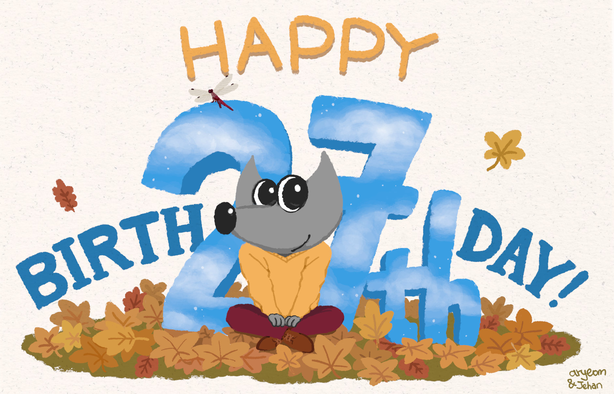

# 27 岁快乐！

## 作品信息

- 原文：[Happy 27!](https://www.gimp.org/news/2022/11/21/gimp-27-birthday/)
- 作者：[Jehan](https://www.gimp.org/author/jehan.html)  
- 许可证：[cc-by-sa 4.0](https://creativecommons.org/licenses/by-sa/4.0/)
    - 配图作者：[Aryeom](https://film.zemarmot.net/)  
    - 许可证：[cc-by-sa 4.0](https://creativecommons.org/licenses/by-sa/4.0/)
- 译者：暮光的白杨
- 日期：2022 年 11 月 22 日

----

## 正文

今天，2022 年 11 月 21 日，**[GNU 图像处理程序](https://www.gimp.org/)迎来了 27 岁生日**（参见 [于 1995 年 11 月 21 日，第一次发布的公告](https://www.gimp.org/about/prehistory.html#november-1995-an-announcement)）。

为了庆祝，Aryeom（ZeMarmot 的导演）画了这个漂亮的生日插图（该作品完全在 GIMP 中绘制，当然也是使用 CC BY-SA 4.0 进行许可！）：

!!! tip "Happy 27th birthday!"
      
    *由 Aryeom（他还绘制了一个[无 Wilber 版本插画](https://www.gimp.org/news/2022/11/21/gimp-27-birthday/gimp-27th-birthday-bg.jpg)作为 gimp.org 临时标题背景）创作，以 CC BY-SA 4.0 进行共享。*

对于 Aryeom 和我 (Jehan) 来说，自 2012 年 9 月首次提交（动画播放插件中的基本图标更改补丁，不久之后提交了越来愈多的补丁……）起，这是我们持续贡献的第十个年头。那时，我们从未想过会在这个不错的核心社区中坚持这么久（在这一点上，我们感谢其他贡献者的接纳，尤其是出色的 [mitch](https://www.gimp.org/news/2017/03/01/an-interview-with-michael-natterer-gimp-maintainer/)）并在 GIMP 中贡献了成千上万个补丁！ 所以这也是一个相当重要的个人里程碑。

这也是我维护 GIMP 的第二年。公平地说，Aryeom 在我的维护中扮演着重要的角色，不断审查、测试我（和其他贡献者）的代码、跟进反馈、详述行为（同时一直关心他人的惯用法！当她帮助设计变更时，她的主要规则之一是研究并想知道其他人有什么工作流程）。为了让这一切有序完成，Aryeom 在幕后中做了很多工作。

但 GIMP 不仅仅只有我们。如果没有 Øyvind Kolås，我们会怎么样？如今，他在 GIMP 项目，承担着大部分基于流的核心图形引擎（[GEGL](https://gegl.org/)）和其姐妹项目（[babl](https://gegl.org/babl/) 和 [ctx](https://ctx.graphics/)）的维护工作。

当然，我不会忘记所有其他出色的贡献者：开发人员、打包人员、社区支持人员、翻译人员（在我们目前支持的 84 种语言中，[27 种语言](https://l10n.gnome.org/module/gimp/)的翻译进度已经超过了 90%）、文档人员、网站贡献者、教程作者……当然，我们也应该感谢 GNOME 基础设施团队的帮助。在此感谢更多人！没有你们，GIMP 不会有今日的成就！💌

稍后我可能会做一份更详细的报告（就像我去年所做的那样）来总结 2022 年发生的事件，所以我会在这个消息中保持简短。就这一次！

总而言之，我们想提醒一下 **GIMP 是由社区驱动开发的自由软件。**GIMP 是[我们共同创造的](https://www.gimp.org/develop/)。我们非常热烈地欢迎贡献者🤗！

最后，如果你无法贡献你的时间，在这些年终奉献的时候，不要忘记你也可以[**在经济上支持 GIMP 开发人员**](https://www.gimp.org/donating/)。GIMP 项目积极支持愿意以他们为自由软件所作的贡献谋生的贡献者。现在这意味着你可以赞助 3 个人：（*通过 ZeMarmot 项目*）作为 [GIMP 维护者](https://www.patreon.com/zemarmot)的 Aryeom 和 我自己，以及作为 [GEGL 维护者](https://www.patreon.com/pippin)的 Øyvind。如果您感谢我们所做的并**希望回馈**，资助我们是一个很好的方式。它是 GIMP 开发工作可持续发展的一部分。

对于真正渴望看到 GIMP 3.0 推出的每个人来说，不言而喻，资助开发者才能加速 GIMP的发展。

**🎁因此，GIMP 和 [Wilber](https://www.gimp.org/about/linking.html#wilber-the-gimp-mascot)，我们祝你 27 岁快乐！ 🎂**

并致社区的每一位成员：**感谢大家在这 27 年的全部或部分时间里坚持这个项目！**没有你们，GIMP 不会有今天的成就！💌