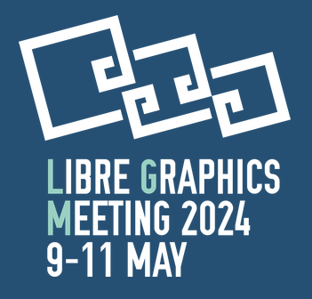

# LGM 2024 上的 GIMP（法国雷恩）

- 译文信息：
    - 源文：[GIMP at LGM 2024 (Rennes, France)](https://www.gimp.org/news/2024/05/06/gimp-at-lgm-2024/)
    - 作者：[GIMP Team](https://www.gimp.org/author/gimp-team.html)
    - 许可证：[CC-BY-SA 4.0](https://creativecommons.org/licenses/by-sa/4.0/)
    - 日期：2024-05-07
    - 译者：暮光的白杨

----

**Libre Graphics Meeting**（LGM）是自由软件图形创作领域最大的国际聚会。该活动诞生于 [2006] 年，是我们 [GIMPCon] 的演变，此后每年都会举行，这要归功于 [Blender]、[Inkscape]、[Scribus] 等各种大型项目的支持……直到 2019 年，因为一场众所周知的 COVID-19 传染病来袭而中断！

[GIMPCon]: https://developer.gimp.org/conferences/
[2006]: https://libregraphicsmeeting.org/2006/
[Blender]: https://www.blender.org/
[Inkscape]: https://inkscape.org/
[scribus]: https://www.scribus.net/

LGM 在线上举办两年后，又中断了两年，现在终于回来了，地点是法国雷恩，时间是 2024 年 5 月 9 日（星期四，法国假期）至 5 月 11 日（星期六）！

  
<grey><em>
2024 年 Libre Graphics Meeting 徽标
</em></grey>

与往年一样，GIMP 团队也将出席会议。团队成员将发表三场演讲，其中一场演讲将在标准制定研讨会上进行：

- **5 月 10 日星期五下午 2:30**：[OpenType and the desktop][t1]，由我们的长期贡献者之一 Liam Quin 主讲：  
> <grey><em>提出一种（基于 DBUS？）跨桌面字体服务，以支持用户界面，供人们实例化可变字体、编辑彩色字体调色板、选择备用字形、安装/卸载字体，并能向任何应用程序返回路径、字形列表、字体名称或渲染文本。</em></grey>
- **5 月 10 日星期五下午 4 点**：由 Liam Quin 主讲的 [OpenType and the desktop][t1] 的研讨会环节内容：希望演讲能进入讨论阶段，以便自由软件项目能合作提出字体列表、选择、使用等方面的标准。
- **5 月 11 日星期六下午 2 点**： [GIMP 3.0 及更高版本][t2]，由整个团队共同完成：  
> <grey><em>GIMP 团队将推出期待已久的 GIMP 新主要版本 3.0。  
> 菜单上有：无损编辑、多层选择、色彩管理改进、全新插件 API、移植到 GTK3（HiPPI、Wayland 支持、CSS 主题、更好的绘图板支持等）等等。  
> 我们还将公开我们未来的计划。</em></grey>
- **5 月 11 日星期六下午 3 点**：[提前放映现场音乐（电影音乐会）： 《ZeMarmot》][a1]。  
   
  Jehan（GIMP 维护者）和 Aryeom（常驻艺术家、插画家、设计师......）将展示他们的动画短片《[ZeMarmot]》，该片由非营利电影制作公司 [LILA（Libre comme l’Art / Free as Art）][lila]制作。  
  目前尚未完成（颜色和背景未完成）的电影将由我们的音乐合作伙伴 [AMMD] 的三位音乐家（ORL、Pelin 和 Adrien）进行现场音乐演奏。他们与我们合作制作了这部电影，并且只生产自由音乐。  
   
  放映时间约为 10 分钟，随后将由 Aryeom（电影导演）、ORL（电影配乐作曲家和音乐家）和 Jehan（技术、开发、组织、后台……）进行讨论和提问。

我们期待在会上见到你！

[AMMD]: https://ammd.net/
[ZeMarmot]: https://film.zemarmot.net/%3E
[lila]: https://libreart.info/
[t1]: https://libregraphicsmeeting.org/2024/wk-liamquin-opentypedesktop.html
[t2]: https://libregraphicsmeeting.org/2024/gimpteam-gimp.html
[a1]: https://libregraphicsmeeting.org/2024/Aryeomehan-zemarmot.html

## 信息总结

- [活动页面]
- 地点：
> Activdesign  
> 4A rue du Bignon  
> 35000 Rennes  
> FRANCE
- **Libre Graphics Meeting**：2024 年 5 月 9 日至 11 日，上午 9 点开门，然后全天开放！
- **Main GIMP talk**：2024 年 5 月 11 日星期六下午 2 点至下午 3 点（由 GIMP 团队主持）
- **OpenType talk**：2024 年 5 月 10 日星期五下午 2:30 至 3:30（由 Liam Quin 主讲）
- **OpenType workshop**：2024 年 5 月 10 日星期五下午 4 点至下午 6 点（由 Liam Quin 主持）
- **ZeMarmot musical showing and talk**：2024 年 5 月 11 日星期六下午 3 点至下午 4 点（由电影导演 Aryeom、作曲家 ORL、开发人员 Jehan 以及音乐家 Pelin 和 Adrien 提供）
- [完整计划]
- [在线地图]
- [有关如何到达该地点的更多信息]
- 事件被记录：**是**

[完整计划]: https://libregraphicsmeeting.org/2024/program.html
[在线地图]: https://www.openstreetmap.org/?mlat=48.09567&mlon=-1.63642#map=19/48.09567/-1.63642
[有关如何到达该地点的更多信息]: https://libregraphicsmeeting.org/2024/location.html
[活动页面]: https://libregraphicsmeeting.org/2024/index.html

别忘了，你还可以[为 GIMP 开发人员捐款和提供个人资助][donating]，**以此回馈项目并加速 GIMP 的开发**。社区承诺有助于项目的发展壮大！💪🥳

[donating]: https://www.gimp.org/donating/