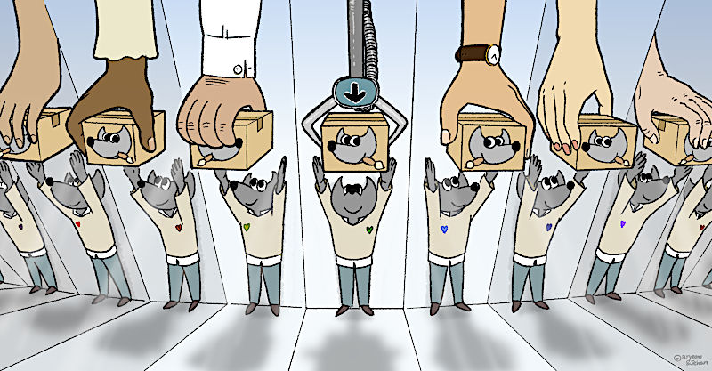

# GIMP 官方镜像和镜像政策

## 作品信息

- 原文：[GIMP’s official mirrors and mirror policy](https://www.gimp.org/news/2021/10/06/official-mirror-policy/)
- 作者：[Wilber](https://www.gimp.org/author/wilber.html)  
- 许可证：[cc-by-sa 4.0](https://creativecommons.org/licenses/by-sa/4.0/)
    - 配图作者：[Aryeom](https://film.zemarmot.net/)  
    - 许可证：[cc-by-sa 4.0](https://creativecommons.org/licenses/by-sa/4.0/)
- 译者：暮光的白杨
- 日期：2022 年 3 月 12 日

----

## 正文

据我们所知，来自世界各地的组织通过镜像🪞 我们的文件下载来支持 GNU 图像处理程序。 这很重要，因为我们可能必须每天维持数十万次下载。

### 官方镜像（至文章发表时）

目前官方镜像列表（按字母顺序排列）：

- Aalborg University
- Academic Computer Club, Umeå University
- Artfiles New Media GmbH
- Astra ISP
- CSC - IT Center for Science / FUNET
- Cu.be Solutions
- Dmitry Shishkin
- dogado GmbH
- eScience Center, Nanjing University
- Friedrich-Alexander-Universität Erlangen-Nürnberg (FAU)
- Göttingen University and Max Planck Society
- Interdisciplinary Centre for Mathematical and Computational Modelling UW, University of Warsaw
- IP-Connect LLC
- Korea FreeBSD Users Group
- Jaleco
- Kumi Systems
- Lysator ACS
- nbshare.io
- Studenten Net Twente (SNT), the University of Twente
- UKFast
- University of Crete
- University of Kent UK Mirror Service
- University of Maryland, College Park
- XMission

*目前正在处理另一个镜像请求。*

始终更新的列表位于专门的[赞助商页面](https://www.gimp.org/donating/sponsors.html)上。上面诗意地表现了镜子的图片，由 ZeMarmot 项目的 Aryeom 提供，也将用于赞助商页面。

💌 感谢所有这些组织！

### 什么是官方镜像

我们最近根据这些规则清理了我们的镜像列表：

- 我们现在列出的正是经过基础设施团队验证的镜像，不多也不少。经过验证，你就有了rsync 证书，可以更快、更安全地更新。如果你想加入，请看[下文](./gimp-mirror-policy.md#_5)。
- [下载页面](https://www.gimp.org/downloads/)中不再列出镜像，因为单击下载按钮时会自动运行镜像跳转。相反，我们有专门的[赞助商](https://www.gimp.org/donating/sponsors.html)页面，这意味着赞助商镜像的可见性更好，同时简化了过去信息过于拥挤的下载页面。
- 我们显示镜像组织的名称，例如 “XYZ 大学” 以及指向组织网站的链接，而不仅仅是 URL。

*注意：我们在以前的下载页面上列出了更多镜像，或者多年来有兴趣成为官方镜像的报告（当时我们的工作流程更加模糊）。我们向他们所有人发送了消息，但不确定是否送达至负责人。 如果你希望成为官方列表的一员，帮助承担下载负载并出现在我们的赞助商页面上，请阅读以下流程。*

### 如何成为官方镜像

这与 GNOME 镜像的[申请流程](https://wiki.gnome.org/Infrastructure/Mirrors)相同，但你必须明确要求成为 GIMP 镜像：

1. 在[基础设施跟踪器](https://gitlab.gnome.org/Infrastructure/Infrastructure/issues/new?issuable_template=new-mirror)上创建镜像请求；
2. 在标题和介绍中写下你特别想成为 GIMP 的镜像；
3. 在请求描述或评论中添加 `/cc @Jehan`；
4. 填写新镜像模板中的相关字段；
5. 如果你希望在镜像赞助商列表中显示特定名称和 URL，请在报告中明确写出（否则我们将选择与你所写内容最相关的任何组织名称和 URL）；
6. 一旦我们完成对你的组织的验证，rsync 凭据将被安全地交换，允许你将镜像与源服务器同步；
7. 要出现在赞助商页面上没有什么需要特意去做的事情，该页面将通过脚本定期更新。然而，有时可能需要几天甚至几周的时间。因此，如果你的组织名称没有立即出现此页面，请不要担心！

我们以随机的时间间隔检查镜像是否更新得足够快和数据是否匹配（出于明显的安全原因）。

### 技术细节

我们曾经在 [gimp.org/downloads/](https://www.gimp.org/downloads/) 上以声明的方式列出镜像。鼓励希望下载的人选择镜像而不是主下载服务器。

多年前，我们通过网络重定向实现自动化镜像选择。换句话说，指向 download.gimp.org/mirror/ 的任何 URL 都会自动重定向到任何已配置的镜像（包括我们自己的下载服务器），从而减轻所有服务器的负担，而无需人们在无聊的列表中手动选择镜像。

然而后续检查还不够彻底，没有明确的流程提供给镜像管理员，并且网站上列出的镜像与实际参与下载轮换的镜像存在差异。这些是需要改变的地方。

仅列出经过验证的镜像具有以下优点：

- 基础架构团队进行背景调查以验证组织是否值得信赖。
- 镜像获得 rsync 凭证，从而实现更快的更新（而不是通过第三方，这些第三方本身可能从其他第三方同步，因此避免了几天的延迟）。
- 我们的团队有一份准确的镜像列表，用于对文件存在和真实性进行系统的安全检查。如果出现问题，我们会迅速做出反应。
- 我们仅在下载跳转设置中添加经过验证的镜像，从而有助于获得更大的下载量。它们被放在突出位置是很正常的。

更多讨论正在进行，以通过使用 *Mirrorbits* 软件进一步改进程序和镜像技术。稍后会有更多关于这方面的内容（在更广泛的测试之后）。

**除了镜像，我们还要 🙏 感谢 GNOME 基础架构团队的宝贵帮助！**

### 贡献者

镜像方面的工作是一项长期的后台工作，由许多人改进，特别是 [Michael Schumacher](https://testing.gimp.org/news/2017/05/15/an-interview-with-michael-schumacher-gimp-administrator/) 和 [Pat David](https://patdavid.net/)。

这些最近对镜像流程的改进，使用户下载 GIMP 时更快、更安全，并且对贡献者和镜像管理员更易于操作的活动，由 GIMP 共同维护者、*ZeMarmot* 项目的 Jehan 完成（[Liberapay](https://liberapay.com/ZeMarmot/) 和 [Patreon](https://www.patreon.com/zemarmot) 资助）。我们的目标是尽可能地简化和自动化这个过程，使我们的镜像列表始终是最新的，提供更可靠的下载体验，同时也通过运行自动数据完整性验证脚本来验证镜像的安全性。