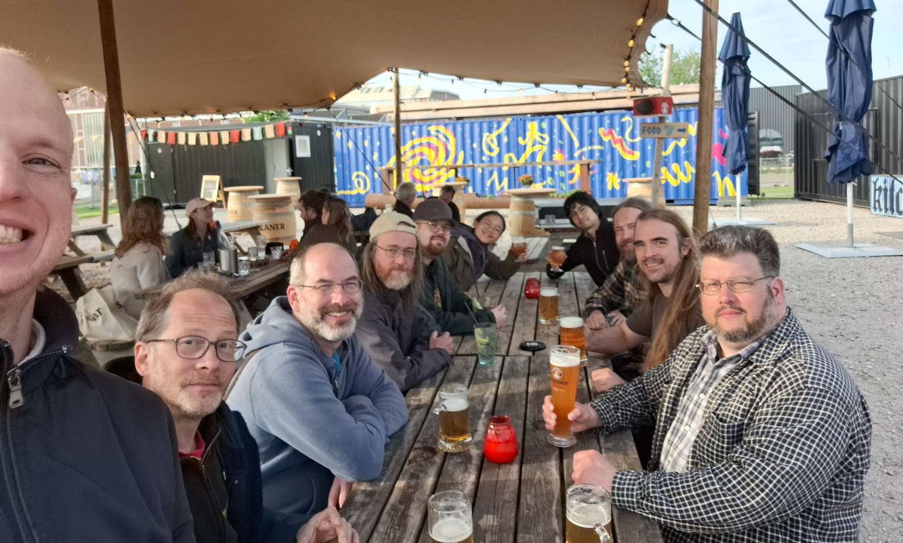
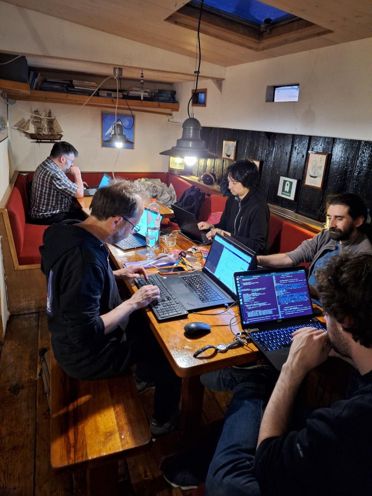
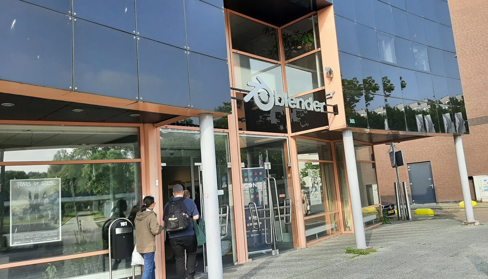
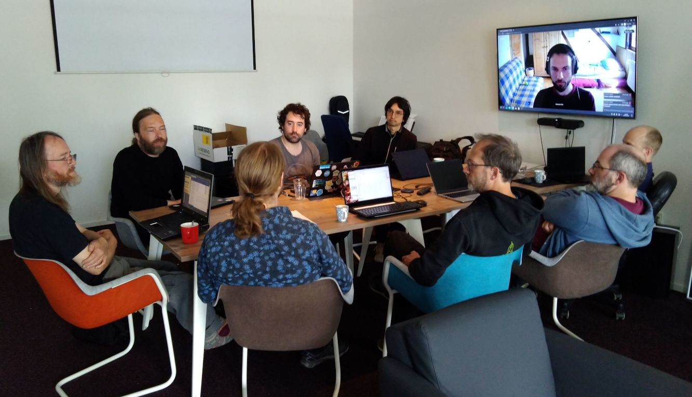
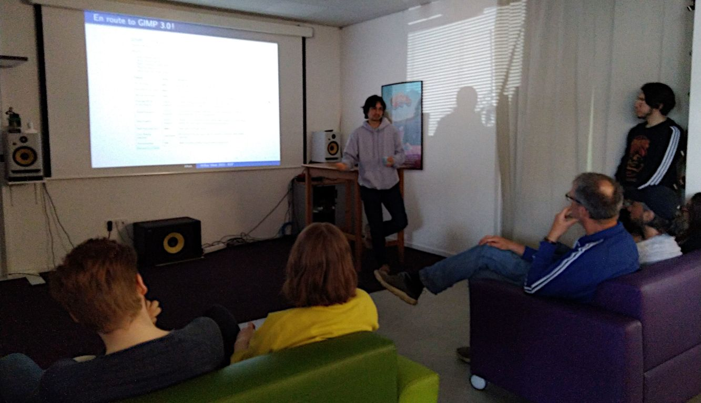

# GIMP Wilber Week 2023：报道

## 译文信息

- 原文：[Wilber Week 2023: report](https://www.gimp.org/news/2023/06/29/wilber-week-2023/)
- 作者：[Jehan]
- 许可证：[cc-by-sa 4.0](https://creativecommons.org/licenses/by-sa/4.0/)
- 译者：暮光的白杨
- 日期：2023-06-29

----

## 正文

由于过去几年的健康状况不佳，GIMP 团队自 2019 年以来一直无法聚会。这影响了软件的发展（commit 数量下降了一半！），因为对于我们许多人来说，GIMP 不仅仅是一个软件：它是人们，是一个社区。因此，由于缺乏社交接触，GIMP 的动力减弱了。

因此，我们很高兴地宣布 Wilber Week 回归：为期一周的 GIMP 贡献者会议（[始于 2017 年][2017]，作为 [Libre Graphics Meeting] 的配套活动）。

一个月前，我们在阿姆斯特丹举办了第二届 Wilber Week！

[2017]: https://www.gimp.org/news/2017/01/18/wilberweek-2017-announced/
[Libre Graphics Meeting]: https://libregraphicsmeeting.org/

  
<grey><em>Wilber Week 2023：GIMP/Inkscape 贡献者（从左到右：Niels、Mitch、Simon、Liam、Ville、Aryeom、Jehan、Øyvind、Chris 和 Schumaml） — 照片由 Niels 拍摄，基于 CC BY-SA 授权使用。</em></grey>

### 会议配置

今年，共有 10 位 GIMP 贡献者参加聚会，以下列表按字母顺序排列：

- [Aryeom]：*ZeMarmot* 的电影导演、11 年贡献者、图形贡献者、UI 设计、alpha 测试员……
- [Carlos Garnacho]：任何输入设备、GTK 或 GNOME 相关的长期贡献者和顾问，GNOME 中各种重要模块的贡献者和维护者。
- [Jehan]: 我自己，11 年的贡献者、GIMP 共同维护者、*ZeMarmot* 技术方面……
- [Liam Quin (demib0y)]：15 年以上的贡献者、社区帮助者，致力于保持 GIMP 社区的友好和热情……
- [Michael Natterer (mitch)]：20 多年的贡献者、管理员、出色的分类员、社区帮助者等等……
- [Niels de Graef]：4 年以上的贡献者，GNOME、GTK 等方面的重要贡献者……
- [Øyvind Kolås (pippin)]：20 多年的贡献者、GEGL 维护者、数字媒体工具专家……
- [Simon Budig (nomis)]：25 年以上的贡献者，关心的是如何让 GIMP 永远成为一个美好的社区……
- [Ville Pätsi (drc)]：22 年以上的贡献者、摄影师、图形贡献者……

[Aryeom]: https://film.zemarmot.net/
[Carlos Garnacho]: https://blogs.gnome.org/carlosg/
[Jehan]: https://film.zemarmot.net/
[Liam Quin (demib0y)]: https://www.fromoldbooks.org/
[Michael Natterer (mitch)]: https://www.gimp.org/news/2017/03/01/an-interview-with-michael-natterer-gimp-maintainer/
[Niels de Graef]: https://nielsdg.pages.gitlab.gnome.org/development-blog/about/
[Øyvind Kolås (pippin)]: https://pippin.gimp.org/
[Simon Budig (nomis)]: https://www.home.unix-ag.org/simon/
[Ville Pätsi (drc)]: https://shadowdrama.net/

此外，我们还邀请了 2 位 [Inkscape] 贡献者。一开始只是 Mastodon 上的一条[嘟文]，后来变成了与来自 Inkscape 的 Martin Owens 的私人讨论，他希望与我们讨论色彩管理。因此，我们邀请他们来享受我们的聚会并进一步讨论！

最后，Inkscape 开发者 [Marc Jeanmougin] 和图形贡献者 [Chris Rogers] 与我们一起度过了一周！

我们都暂住在一艘非常老（数百年之久）的帆船里。不是开玩笑！那是一个非常酷的地方，我们可以从第一天就开始 hacking！

[Inkscape]: https://inkscape.org/
[嘟文]: https://fosstodon.org/@CmykStudent/110251080501454428
[Marc Jeanmougin]: https://inkscape.org/~MarcJeanmougin/
[Chris Rogers]: https://inkscape.org/~C.Rogers/

{ width=70% }  
<grey><em>Wilber Week 2023：在帆船上进行 hacking（从左到右：Schumaml、Mitch、Jehan、Carlos、Marc） — 照片由 Niels 拍摄，基于 CC BY-SA 授权使用。</em></grey>

关于城市本身，请允许我郑重声明，作为一个素食主义者和支持[软性交通]的人，阿姆斯特丹似乎是一个非常好的居住地

[软性交通]: https://www.carrentalgateway.com/glossary/soft-mobility/

### Blender 基金会总部

[Blender 基金会]慷慨地将工作室和会议室借给我们的团队。

  
<grey><em>GIMP 贡献者进入 Blender 总部 — 照片由 Schumaml 拍摄，基于 CC BY-SA 授权使用。</em></grey>

当然，获得“办公桌”并不是我们选择这个办公室的真正原因。能与 Blender 团队会面真是太酷了。我们还进行了各种有趣的讨论。此外，Blender 的 [Nathan Vegdahl] 非常热情，并向我们展示了很多非常酷的东西！

正如预期的那样，我们讨论了色彩管理，特别是在 Wayland 下，因为 Wayland 色彩管理的主要贡献者 Sebastian Wick 通过远程视频通话被多次邀请加入会谈（感谢 Niels 的帮助！）。这是非常有建设性的！

  
<grey><em>Wilber Week 2023：在 Blender 总部与 GIMP、Inkscape 和 Wayland 贡献者会面（从左到右：Liam、Øyvind、Nathan、Marc、Jehan、Mitch、Simon、Niels；以及屏幕上的 Sebastian） — 照片由 Aryeom 拍摄，基于 CC BY-SA 授权使用。</em></grey>

概要：与 Blender 人员的互动让这次旅行非常值得！

与此同时，我希望讨论更多的事情，例如我们的程序之间更好的文件交换和交互（想想 *Libre Graphics Suite*，这是我们在 *ZeMarmot* 项目中遇到的一个主要问题，因为我们与所有这些软件一起工作，这并不容易）。已经发生了太多事情，这一切都没有发生。 希望有机会再来！

[Blender 基金会]: https://www.blender.org
[Nathan Vegdahl]: https://projects.blender.org/nathanvegdahl

### 直接成果

#### 错误修复！*Mitch 回来了！*

这是一个非常充实的一周，我们在 GIMP 上进行了 hacking，修复了一些错误，改进了一些早该改进的代码等活动。这很大程度上要归功于我们找回了我们的共同维护者 [Michael Natterer，又名 mitch][mitch]！

我们非常想念他，很高兴他能再次检查我们的代码，并像以前一样疯狂地 hacking 到深夜！

  
<grey><em>Wilber Week 2023：Mitch 这两年去了哪里？原来他只是在睡觉…… — 照片由 Jehan 拍摄，基于 CC BY-SA 授权使用。</em></grey>

[mitch]: https://www.gimp.org/news/2017/03/01/an-interview-with-michael-natterer-gimp-maintainer/

当然，还有很多其他老前辈回来编写代码，所以我们不要忘记他们！

#### 改进

在这非常繁忙的一周中发生的许多事情（或直接后果）中，让我们简要提一下：

- Simon Budig 应该受到赞扬，因为他修复了警告、清理了代码并更新了已弃用 API 的代码！
- Niels de Graef 和 Carlos Garnacho 帮助修复了各种与 GTK 和 Wayland 相关的问题。这也激发了 GTK 或其他依赖项的补丁，而不仅仅是 GIMP。
- 插件 API 得到了认真的研究，添加了对 `GBytes` 作为插件参数的支持，改进了新的 `GimpResource` 类和子类，允许插件轻松操作各种数据（画笔、动态、图案……）等等。
- Autotools 终于从我们的主存储库中消失了！（尽管它仍然存在于稳定分支中）
- 我们的持续集成现在显示来自 meson 单元测试的 JUnit 报告。
- Ville 正在习惯于改进我们的主题：他完成了 2.10 主题，现在他再次帮助改进了 Default 3.0 主题，改进了其他贡献者开始的工作。
- 作为 *Wilber Week* 的直接成果，Carlos 不久之后实现了 GIMP 的数位板定制功能（关于这项工作有[一篇非常好的文章][article]）。由于审核需要一些时间，因此新功能不会出现在 2.99.16 中，但肯定会出现在 GIMP 3.0 中！
- Aryeom 在各个 GIMP 贡献者（特别是 Ville、Øyvind 和 Simon）以及来自 Inkscape 的 Chris 的帮助下制作了新徽标。该工作仍在进行中。
- 本周进行了一些改进的 GEGL 集成讨论和工作，然后继续进行，允许[在 GIMP 菜单中轻松添加第三方 GEGL 操作][gegl]，并在[搜索操作]中搜索它们（注意：自从这些嘟文发出后，实现方式发生了变化；现在并不是所有的操作都会出现在菜单中，只有当操作中出现了特定的元数据时才会出现。）。
- Aryeon 更新了下一个开发版本的启动屏幕（待续……）。
- 虽然遗憾的是他们未能到场，但我们不应该忘记 Jacob Boerema、Alx Sa 和其他同时继续远程改进 GIMP 的人！
- 由于我们在 [GSoC 2023] 中选择了 3 个项目，并由 Liam 和我作为导师，因此我们以远程通话的方式与学生举行了 GSoC 会议。

[gegl]: https://floss.social/@GIMP/110193618328736185
[搜索操作]: https://floss.social/@GIMP/110163688457663102
[article]: https://blogs.gnome.org/carlosg/2023/06/16/getting-the-best-of-tablet-pads/
[GSoC 2023]: https://www.gimp.org/news/2023/03/20/gimp-in-gsoc-2023/

#### 放弃比特币捐赠方式

我们在网站上有一个比特币地址。有些人要求提供更多的加密货币选择。随着诈骗的增加、高能源消耗和不同的国家税收影响，经过 Wilber Week 期间的讨论和投票，我们决定不再提供比特币捐赠链接。

我们已经收到了比特币捐款，并使用了其中一部分，但我们仍在研究如何正确引导这些资金用于我们的开支。

### 制定计划

#### 基金会？

我们在 Blender 时接受了 Pablo Vazquez 的采访在事实上表明，秘密现在已经以一种相当公开的方式泄露了：我们一直在尝试建立自己的实体。但首先，既然我逗你玩，以下是采访视频：

<iframe title="GIMP's Wilber Week 2023 at Blender HQ" src="https://video.blender.org/videos/embed/13d47d70-ffd4-4846-b00e-029f99a69aa6" allowfullscreen="" sandbox="allow-same-origin allow-scripts allow-popups" width="560" height="315" frameborder="0"></iframe> <grey><em>Wilber Week 2023：GIMP 在 Blender 总部举办的 Wilber Week 2023，作者：Pablo Vazquez（Simon、Jehan 和 Mitch 主演）</em></grey>

如果你想了解更多，这些幻灯片可以在[这里][here]找到，它们来自于我给 Blender 成员做的一个活动结束的演讲。

[here]: https://download.gimp.org/users/jehan/WW23-eof.pdf

  
<grey><em>Wilber Week 2023：EOF 演讲 — 照片由 Aryeom 拍摄，基于 CC BY-SA 授权使用。</em></grey>

为 GIMP 建立一个合适的实体是我多年来一直在想的事情，自 2019 年以来，我开始与团队的其他成员以及其他非营利组织的朋友讨论，以帮助我找到最好的方法！在这个项目中断一段时间后，我在 2022 年底恢复了我的工作，实际上我们已经取得了相当大的进展，尽管我现在不会提供太多细节，以免给它带来麻烦。

让我们看看结果如何！

现在需要澄清的是：GIMP 一直是一个有点混乱但友好的社区项目。这种无政府状态就是我喜欢它的部分原因。无论我们为支持该项目而建设什么，我都将永远为这种精神而奋斗。这实际上是建立一个组织的困难之一，也是为什么花了这么长的时间：在没有组织接管项目的情况下这样做，而是作为社区的一个支持。

### GIMP 3 及更高版本！⛵

显然，这次 Wilber Week 让我相信我的初步计划（在 [2022 年报告]中概述为希望今年有 GIMP 3.0 候选版本）应该是可能的。如果我们能让社区保持活跃，那么这种情况发生的可能性就很大。

我们现在显然正处于激动人心的时刻，朝着一个非常酷的未来航行！😄

[2022 年报告]: ./gimp-2022-annual-report.md

### 下一步行动

对于任何感兴趣的人，[开发者网站上的会议页面]提供了有关所发生事件、实际讨论内容、会议记录等的更多详细信息。

目前，我们正在深入准备 GIMP 的下一个开发版本（GIMP 2.99.16）的发布。虽然它还没有发布，但我们已经对下一个版本感到非常兴奋（在最好的情况下，它甚至可能是候选版本！）。

同时，不要忘记你可以[捐赠并资助 GIMP 开发人员][donate]，作为回馈和加速 GIMP 发展的一种方式。社区的承诺有助于项目发展壮大！💪🥳

[开发者网站上的会议页面]: https://developer.gimp.org/conferences/wilberweek/2023-amsterdam/
[donate]: https://www.gimp.org/donating/