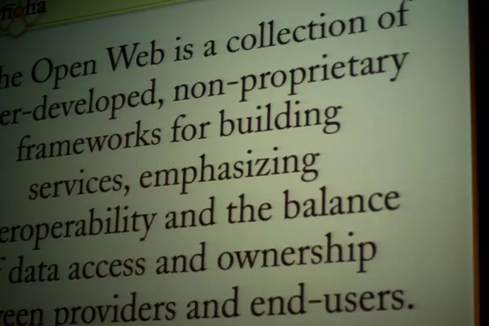

# 谷歌正在危害开放网络

- 译文信息：
    - 原文： [Google vs. the Open Web][博客]
    - 作者： [Interpeer Project](https://interpeer.io/)
    - 许可证： [CC BY-SA 4.0](https://creativecommons.org/licenses/by-sa/4.0/)
    - 译者： 暮光的白杨
    - 日期： 2023-07-27

[博客]: https://interpeer.io/blog/2023/07/google-vs-the-open-web/

----

几天前，我在社交媒体上发表了一篇关于谷歌与开放网络的文章。这篇文章得到了一些回应，因此我将其转载如下，并附上一些补充评论。

  
<grey>
[Randy Stewart] 创作的 “[Open Web - Gnomedex 2008]” 以 [CC BY-SA 2.0] 许可发布。</grey>

[Open Web - Gnomedex 2008]: https://www.flickr.com/photos/35034356597@N01/2787595632
[CC BY-SA 2.0]: https://creativecommons.org/licenses/by-sa/2.0/
[Randy Stewart]: https://www.flickr.com/photos/35034356597@N01

----

## 谷歌正在试图扼杀开放网络

使用建议的 “Web Environment Integrity”（网络环境完整性）意味着网站可以选择希望在哪些设备（浏览器）上显示，并可以拒绝向其他设备提供服务。它将客户端软件与网站绑定在一起，创建了一个孤立的应用程序。

- [GitHub 上的 Web Environment Integrity]

[GitHub 上的 Web Environment Integrity]: https://github.com/RupertBenWiser/Web-Environment-Integrity/blob/main/explainer.md

这将对无法使用（网络环境完整性认证的）首选客户端软件的平台造成不利影响。

这是一个无障碍和包容性的问题，特别是当软件不可用的原因与边缘化群体的需求有关时，例如贫困使他们无法拥有足够现代化的设备等。

“网络环境完整性”是一个极具反社会性的提议，与网络的设计原则背道而驰。

其实，谷歌此举并不令人意外。长期以来，他们一直试图将网络作为自己的平台。这只是最新的一场战役。

但这也标志着一个特别反常的点，即该提案承认它的存在主要是为了从人们身上榨取价值。这是最糟糕的 “People mining”。

还记得他们的座右铭是“[不作恶]”吗？

[不作恶]: https://en.wikipedia.org/wiki/Don%27t_be_evil

----

## 提案分析

关于该提案的一些细节可能会有所帮助。

该提案建议，网站应能要求浏览器证明（attestation）其“完整性（integrity）”。这种证明将由外部代理程序（agent）提供，据推测，外部代理程序将检查浏览器及其插件，只有在这些检查合格的情况下才会发出批准（approval）。

证明将被送回网站，如果代理程序未批准，网站现在可以决定拒绝服务。

从表面上看，这是**为了确保**用户的环境没有受到任何篡改。不过，所描述的使用案例相当清楚地表明，这一功能是**为商业**而设计的。

特别是，提案建议 “Google Play” 可以提供此类证明，并提供了一个旨在确保广告只提供给被认可的用户，而不是机器人的示例案例。

这两点并不是一起提出来的。但把它们放在一起，你就会发现以下潜在的问题：

1. 广告商希望降低成本。
2. 网站所有者希望展示广告。
3. 谷歌的广告网络按展示**次数**收费。
4. 机器人创造**次数**。

该提案有效地为谷歌的广告问题提供了解决方案，并试图以更用户友好的方式表达它。上述场景最接近他们直接描述的问题。

提案中提出的解决方案是通过证明排除机器人，这样广告仅对登录的 Google Play 用户产生展示次数。

然而……

一般来说，机器人很容易被排除。他们通常通过用户代理字符串来宣传自己。是的，这可以是伪造的——但使用伪造的用户代理的机器人似乎不太可能产生如此大量的展示次数，以至于谷歌必须使用这种途径来对付它们。如果我查看自己的网络服务器日志，只需从日志信息中就可以清楚地看出哪些是机器人请求。

如果机器人不是真正的问题，那么什么才是真正的问题呢？

提供证明的代理程序可以自由地使用任何方式来批准或拒绝浏览器。这包括检查浏览器是否运行广告拦截器。

鉴于广告网络如何跟踪用户，而用户跟踪这种做法受到越来越多的批评，广告拦截器也越来越受欢迎。安全专家经常建议使用广告拦截器作为网络安全措施，因为广告可用于将恶意软件旁加载到原本合法网站中。

谷歌真正想要杀死的是广告拦截器。

## 问题

这种方法的缺点是它为任意滥用打开了大门。除非你安装他们专有的数据收集代理程序，否则网站可以拒绝提供服务。如果你使用了错误的浏览器，网站也可以拒绝提供服务——我们将再次进入 90 年代末的[浏览器大战]。

[浏览器大战]: https://en.wikipedia.org/wiki/Browser_wars

该提案被接受之日，就是开放网络倒退数十年之日。

在《[The Future of the Internet -- And How to Stop It]》（中文：《[互联网的未来]》）一书中，Jonathan Zittrain 从电话网络入手，阐述了“电器（appliances）”和“自我繁殖系统（[generative systems]）”的存在。

[generative systems]: https://en.wikipedia.org/wiki/Generative_systems
[The Future of the Internet -- And How to Stop It]: https://yalebooks.yale.edu/book/9780300151244/the-future-of-the-internet-and-how-to-stop-it/
[互联网的未来]: https://book.douban.com/subject/5939015/

“电器”的工作原理与任何其他家用电器（如烤面包机）一样。它只有一个主要功能，而它可能提供的所有其他功能充其量只是主要功能的轻微变化。它能烤面包。

Zittrain 将 PC 和互联网列为自我繁殖系统的示例。自我繁殖系统的功能不一定像电器一样完整——它们提供一些基本功能，但没有特定的主要目的。目的留给用户。另一种表达方式是将这些东西称为工具或制作材料。

也许此时此刻应该指出上图的文字：

> **开放网络（The Open Web）是用户开发的、用于构建服务的非专有框架的集合，强调互操作性以及供应商和最终用户之间数据访问和所有权的平衡。**

自我繁殖系统比电器更具影响力，正是因为它们利用用户的想象力来满足自己的需求。它们在全球范围内众筹意义。这正是互联网的强大之处。

来自专横地执行事务的代理程序的证明有效地将网络变成了一个“电器”，或者更具体地说，它将浏览器变成了“电器”网站的扩展。

当然，网站所有者可以自由地构建“电器”。他们已经在这样做了。但这一步步降低了“网络”的实用性，直到失去开放的自我繁殖网络。我们已经看到了这样做的负面影响，而提出类似的技术只会加速这一趋势。

谷歌并不介意。资本主义的不可阻挡的逻辑意味着，那些成功建立在自我繁殖系统之上的企业现在必须将同一系统转变为满足自身需求的工具，否则就有可能面临被竞争的风险。

## 回应

对这篇文章的反应多种多样，其中一些值得讨论。

1. **这并不意味着可访问性或包容性问题！**——是，也不是。不，原则上这种技术不会**造成**无障碍问题。但是[帕累托法则]意味着，应该把精力花在 20% 的浏览器市场上，因为这能抓住 80% 的用户，而成本效益则要求忽略剩下的 20% 用户，因为他们的支持成本太高了。 
这正是令人担忧的地方。需要专门浏览器的边缘群体——例如具有良好的屏幕阅读功能，或能够在较便宜/较老的设备上运行——将被合理的商业逻辑有效地排除在外。
2. **担心的是访问，而不是技术！**——此观点认为，良好的监管框架将在法律上强制要求获取信息，因此这应该是重点。 
这是事实，但还不够。这种思路存在两个问题：首先，良好的监管框架很少见。部分原因是第二个问题，即技术的发展速度快于法律的发展速度。 
这就意味着，如果只担心访问问题而不是技术问题，在实践中仍会将边缘化群体排除在外。我们需要做的是在短期内关注技术，在长期内关注监管。
3. **企业希望保护自己的利益是合法的。**——这一点值得商榷。企业“保护自己的利益”而损害民众的利益是不合法的。但在此范围内，当然可以。 
但问题是：互联网和开放网络是一种**自我繁殖系统**，这意味着它们之所以能产生积极影响，是因为人们可以决定如何使用它们。一旦这种决策权被削弱，系统就会向“电器”转变。 
如果企业为了保护自己的利益，将以前的自我繁殖系统沦为**电器**，那么从定义上讲，这就是在损害人们的利益，不再合法。

## 后续更新

请关注 Interpeer Project 在该[博客]末附加的动态消息。

[帕累托法则]: https://en.wikipedia.org/wiki/Pareto_principle