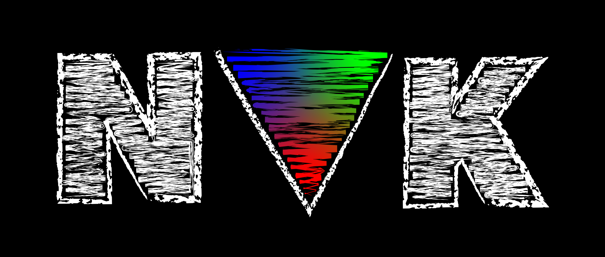

# NVK 简介

## 作品信息

- 原文：[Introducing NVK](https://www.collabora.com/news-and-blog/news-and-events/introducing-nvk.html)
- 作者：[Jason Ekstrand](https://www.jlekstrand.net/jason/welcome/)
- 许可证：Collabora Ltd © 2005-2022. All rights reserved.
- 译者：暮光的白杨
- 日期：2022-10-05

----

## 正文

在过去的几个月里，我一直在为 Mesa 中的 NVIDIA 硬件编写一个名为 NVK，全新的 Vulkan 开源驱动程序。

这个新驱动程序主要由我自己 (Jason Ekstrand) 以及 Red Hat 的 Karol Herbst 和 Dave Airlie 编写。在过去的一两个月里，我们已经开始从社区人员那里收到一些 commit，我希望社区参与开发能持续增加。



### 为什么是 NVIDIA？为什么是现在？

在开源驱动程序中对 NVIDIA 硬件的支持一直有些欠缺。现有的 nouveau 驱动程序经常缺少功能，存在许多错误或是不支持某些显卡。这是由多种因素共同造成的。与 Intel 和 AMD 驱动程序不同，nouveau 驱动程序堆栈的开发几乎没有官方文档或 NVIDIA 的帮助。他们偶尔会在这里提供微薄的支持。从历史上看，这些支持主要专注于启用 nouveau，以便你可以安装 Linux 发行版、访问 Web 浏览器并下载其专有的驱动程序堆栈。

我们（开源图形社区）拥有的大部分硬件知识都是通过逆向工程、挖掘 CUDA 文档（有时它非常靠近底层）以及通过 NVIDIA 在各处给我们提供的少量信息来学习的。致使在最佳的时刻拖慢了开发速度，并使得某些问题几乎无解。

技术斗争的最大领域可能是从内核空间正确驱动硬件。从显示到任务执行再到电源管理，NVIDIA 硬件都依赖于签名固件。NVIDIA 过去提供的固件 blob 是他们仅为开源驱动程序创建的精简版本。这些固件 blob 很可能缺少一些（我们无从得知的）功能，而且从来没有像 NVIDIA 专有驱动程序所使用的固件那样经过大量的内部测试，因此有时某些显卡无法工作，而我们也不知道原因。我们也不完全了解如何正确地做某些事情，如电源管理，所以大多数英伟达显卡一直以最低时钟频率运行，导致性能比一些集成显卡更差。

另一个因素是缺乏贡献者。这实际上并不是社区的失败，而是开源软件经济学的不幸影响。与 Mesa 的 Intel 和 AMD 驱动程序不同，nouveau 从未得到强大的企业支持。除了 Red Hat 的几个兼职开发 nouveau 的人员之外，过去几年参与的大多数开发人员都是在空闲时间做的志愿者。逆向工程是一项艰苦的工作，人们经常会发现一些更容易或更充实的事情去做，然后离开 nouveau。任何在 Mesa 或内核中坚持活跃并展示显著技能和能力的人很快就会被某家公司雇用来从事与 nouveau 无关的工作，并且他们对 nouveau 的贡献很快就会下降。

不幸的现实是，虽然最初的 nouveau 驱动程序是由一些了不起的工程师编写的，并且在十年前是最先进的，但在过去的几年里 nouveau 已经落后了。少数开发人员为 nouveau 投入的时间主要花在基本的硬件支持和尝试加入 OpenGL 新版本支持上，而系统和架构的问题没有得到解决。

最近发生了一些变化，使技术环境更加友好。第一个变化实际上发生在几年前，当时 NVIDIA 推出了他们的图灵级硬件。基于图灵架构的 GPU 使用新的统一固件 blob。GSP 固件包含启动 GPU 所需的一切，一旦加载了 GSP 固件，它就会加载 GPU 各个部分所需的所有其他固件。如果我们能让 GSP 工作，这将允许我们使用与专有 NVIDIA 驱动程序相同的固件，并且应该可以解决许多神秘的错误。Dave Airlie 在 LPC 上就这一点[做了很好的演讲](https://youtu.be/KkOdMwZRpYY?t=30603)。

第二个变化是：几个月前，NVIDIA 发布了[他们的内核驱动程序的开源版本](https://github.com/NVIDIA/open-gpu-kernel-modules)。虽然这不是完整的文档，但它确实为我们提供了一些参考，以了解 NVIDIA 如何驱动他们的硬件。 NVIDIA 发布的代码并不适合 Linux 上游，但它确实让我们有机会重新处理上游驱动程序的情况并把它做好。

第三个变化是：NVIDIA 已开始为 3D 和计算硬件提供官方头文件。虽然这也没有真正的文档好，但它至少为我们提供了我们一直在编程的所有寄存器的名称。致力于 nouveau 的 Mesa 开发人员已经通过逆向工程弄清楚了很多硬件的操作方式，但 nouveau 驱动程序仍然充满了被塞入神秘寄存器的神秘位。我们现在终于有了所有这些位的名称！我们也有了一些在如果试图找出某些特定功能不起作用的原因的时候，可以用于检索的东西。"哦，看啊! 还有更多我没有设置的深度测试寄存器！"

所有这些事情加在一起，使现在成为重新启动 nouveau 驱动程序栈的理想时机。

### 什么是 NVK

如上所述，NVK 是 Mesa 中用于 NVIDIA 硬件的一个新的开源 Vulkan 驱动程序。它几乎完全是使用 NVIDIA 的新官方头文件从头开始编写的。我们偶尔会引用现有的 nouveau OpenGL 驱动程序，但是由于官方头文件经常使用与逆向工程驱动程序不同的名称，因此我们经常无法直接复用代码。Vulkan 也与 OpenGL 有很大的不同，以至于我们经常不得不重新思考。

我对 NVK 的个人目标之一是让它成为 Mesa 中新的 Vulkan 驱动程参考。Mesa 中的所有 Vulkan 驱动程序都可以追溯到英特尔 Vulkan 驱动程序 (ANV)，并通过从中复用源码来完成驱动开发。我们暂时不会那么做，但我希望 NVK 最终会成为每个人都可参考的驱动程序。为此，我正在使用我们在过去 7.5 年中为 Vulkan 驱动程序开发的所有最佳实践构建 NVK，并努力保持代码库的清洁和组织良好。

我还在尝试尽可能地以现代的方式构建 NVK，以此作为在 Mesa 中开发通用 Vulkan 运行时代码的动力；并将从其他 Vulkan 驱动程序复用的代码保持在最低水平。每当我想从 ANV 或其他驱动程序中复用已有的代码时，这反而表明我们需要更通用的框架代码。例如，NVK 从未有过一行渲染通道代码；但它实现了动态渲染，并为传统渲染通道使用了[通用渲染通道实现](https://gitlab.freedesktop.org/mesa/mesa/-/merge_requests/14961)。几周前在实现 `robustBufferAccess` 时，我直接使用了 `VK_EXT_pipeline_robustness` 和一些通用代码的助手，以使其更符合工效学。

长期而言，我们希望 NVK 对 NVIDIA 硬件的作用就像 RADV 对 AMD 硬件的作用一样。然而，这是一个相当高的标准。RADV 是一个相当成熟的驱动程序，具有许多功能和出色的运行时性能。在我们现在的位置和 RADV 级别的驱动程序质量之间还有很多工作要做，但它给了我们一个目标。

### NVK 现在的状态如何？

考虑到 NVK 仅开发了几个月，我们已经取得了令人惊讶的进展。在撰写这篇博文时，我们通过了大约 98% 的具有非常基本功能集的 Vulkan CTS。更具体地说，我上次运行 CTS 的结果如下：

```
Pass: 193734, Fail: 1064, Crash: 1286, Warn: 4, Skip: 1364208, Flake: 265
```

这些数据不仅提供了对驱动质量的直观感觉，还表明了我们在开发中的进展。如你所见，目前我们只运行了略高于 10% 的测试。一个平均水平的全功能 Vulkan 1.3 驱动程序（如 ANV 或 RADV）运行大约 50% 的 CTS，而其他 50% 由于不支持各种图像格式和次要功能而被跳过。这意味着就功能而言，我们可能已经完成了大约 20-25% 的工作。

在架构上，它此时也处于相当不错的状态。我一直专注于大型核心组件，这些组件可能需要深度更改或大型重构才能正确运行。在我们获得更多贡献者之前，我想确保驱动的框架是稳固的，这样其他组件就有了坚实的基础。如果有多人同时工作，我们还需要代码库保持相对稳定。否则，在处理看似不相关的功能时可能会发生冲突。截至目前，大部分大件都处于良好状态。唯一可能需要进行重大架构返工的是管道编译，但我将把它推迟到我们使编译器情况总体上更好为止。

### 支持哪些硬件？

目前，我们的目标是图灵及更新架构的 GPU。我自己有一个一直在使用的 RTX 2060。我认为 Karol 和 Dave 一直在研究安培架构的 GPU。随着 [Lovelace 显卡](https://www.nvidia.com/en-us/geforce/ada-lovelace-architecture/)的发布，我很可能很快就会升级到其中一张用于我的开发。

Karol 有为 Kepler、Maxwell 和 Pascal 架构显卡提供补丁，但仍然不完整。目前还不清楚今后的内核情况会是什么样子。多亏了 GSP，我们**可能**选择让任何新内核工作 Turing+，这可能会稍微限制用户空间。当前的 nouveau 内核接口对 Vulkan 来说不是很好，因此我们可能会严重依赖未来的新内核，从而限制了硬件支持。这一切仍然非常待定。

### 我可以试试吗？

当然！试用 NVK 与任何其他 Mesa 驱动程序没有什么不同。你只需从 [nouveau/mesa](https://gitlab.freedesktop.org/nouveau/mesa) 项目中拉出 nvk/main 分支，构建它，然后试一试。但是，尽管我们欢迎人们使用驱动程序并做出贡献，但请不要提交有关要求提供额外的硬件支持或特定应用程序无法运行的错误报告，我们很清楚有很多缺失的功能和错误。在一段时间内，NVK 驱动程序仍应被视为 alpha 质量。一旦驱动变得更加稳定，发现应用程序错误会很有帮助，但现在我们仍然专注于修复 CTS 测试和缩小功能差距，这些类型的错误报告没有帮助。

### 我可以贡献吗？

绝对地可以！该项目位于 freedesktop.org 上的 [nouveau/mesa](https://gitlab.freedesktop.org/nouveau/mesa) 仓库的 nvk/main 分支中。你可以在此处找到并提交[合并请求](https://gitlab.freedesktop.org/nouveau/mesa/-/merge_requests)。你也可以加入我们在 [OFTC](https://oftc.net/) 的`#nouveau-vk` 频道。

如果你确实希望做出贡献，我强烈建议你购买基于图灵或更新架构的 NVIDIA GPU。幸运的是，GPU 短缺似乎已经结束，而且由于图灵架构发布至今已经 4 年了，现在买到它们应该很容易。

### NVK 什么时候会并入上游 Mesa 驱动？

这是个好问题！通常，我早就提交了合并请求。Mesa 中已经有更多的 alpha 质量驱动程序。问题是我们真的需要一个新的内核 uAPI 来正确支持 Vulkan，我不想在接下来的五年里一直支持当前的 nouveau uAPI。理论上，我们可以将其上游化，并忽略与内核相关的部分，但是我们需要始终在分支之上进行开发，并在每次制作 MR 时重新设置内核补丁以删除内核补丁。到目前为止，只在分支中工作要容易得多。 如果我们能够足够快地解决内核问题，我希望我们能够将新内核 uAPI 与 NVK 一起并入 Mesa 上游。

### OpenGL 驱动程序会发生什么？

首先，没有人会删除它们，因此它们将继续像以往一样工作。但是，当前的 gallium 驱动器存在一些重大问题，并且与其他 nouveau 驱动堆栈的故事一样，没有人花时间修复它们。当使用 nouveau 驱动桌面和一些简单的应用程序时，其中许多问题并不明显。一旦我们使用 GSP 固件在图灵或更新的 GPU 上重新计时并且人们尝试游玩流行游戏时，这些瓶颈将很快成为焦点。我们需要一个长期的解决方案。

一种选择是根据我们通过编写 NVK 学到的知识来改进 nouveau 的 gallium 驱动程序，甚至完全重写它们（这听起来似乎并不那么有效）。在开发 NVK 时，我一直有意将各个部分拆分为可以与 gallium 驱动程序共享的库，就像几年前我们对英特尔驱动程序所做的那样。这应该使得在驱动程序之间共享新的和改进的图像布局代码之类的东西变得容易。随着我对编译器的深入研究，它会得到相同的处理。

正在讨论的另一个选择是在未来使用 [Zink](https://www.collabora.com/news-and-blog/blog/2018/10/31/introducing-zink-opengl-implementation-vulkan/) 替代原有的 OpenGL 驱动。它已经能够运行大多数 Wayland 混成器、XWayland、带有模式设置后端的 X.org，以及大多数人关心的应用程序。在 NVK 上获得完整的 Zink 支持还需要一些工作（仍然缺少功能），但它可能比构建整个 OpenGL 驱动程序更容易。这是否是长期的最佳选择仍未确定。

我们有很多选择，但还没有做出任何决定。随着我们对 NVK 的进一步了解和重新构建 nouveau 堆栈的各个部分，哪些选项是最好的将更加清楚。

### 下一步做什么？

正如已经多次提到的，我们需要一个新的内核 uAPI，同时 nouveau 内核需要相当多的工作。我不会在这篇博文中详细介绍所有需要更改的内容，但它非常接近于抛弃旧 API 并重新开始。我们很可能还需要对 nouveau 内核驱动程序进行其他内部结构更改。Dave 目前正在研究这个问题，但他无法成为 nouveau 内核主要的长期维护者。

在我们走得更远之前需要做大量工作的另一件事是编译器。nouveau 着色器编译器，就像 nouveau 的其他部分一样，在十年前可能是最先进的，但现已年久失修。人们继续启用新的硬件，但更大的结构变化或真正困难的错误修复却没有发生。Karol 几年前添加了 NIR 支持，但直到最近才默认启用，整个编译器的结构仍然是以 gallium 为中心的形式构建的。解决这个问题最佳的形式是深度手术。我下一个从 2022 年底或 2023 年初开始的项目，要么编写一个新的编译器，要么弄清楚如何修复我们所拥有的。

（是的，我知道有人会评论问为什么要编写一个新的编译器而不是修复我们拥有的编译器。老实说，只是修复现有的东西只是在原地踏步。然而，使编译器现代化并使其以 NIR 为中心，需要进行深入的工作和非常广泛的重构。nv50 后端本身正在做的相当多的事情，实际上应该由 NIR 来做，所有这些都需要小心翼翼地剥离出来。寄存器分配器也有严重的问题，它有时会失败，没有后退。当所有的事情都完成后，原来的东西可能就所剩无几了。用旧的编译器作为参考重写可能比在不破坏任何东西的情况下慢慢重构它更容易。一般来说，我怀疑试图挽救当前的基础设施是否值得长期努力，但在确定最佳前进道路之前，我需要更深入地研究它。）

在进行这两项工作的同时，我希望其他人也能致力于启用一些功能，并努力实现一致性。在编译器和内核部分到位之前，我们很可能无法获得实际的一致性，但在我们接近与英伟达专有驱动程序的功能同等性之前，还有很多错误需要修复，还有一些小功能需要添加。