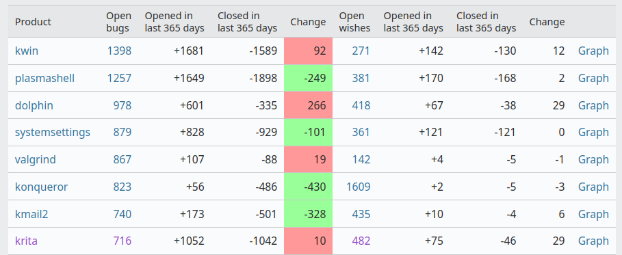
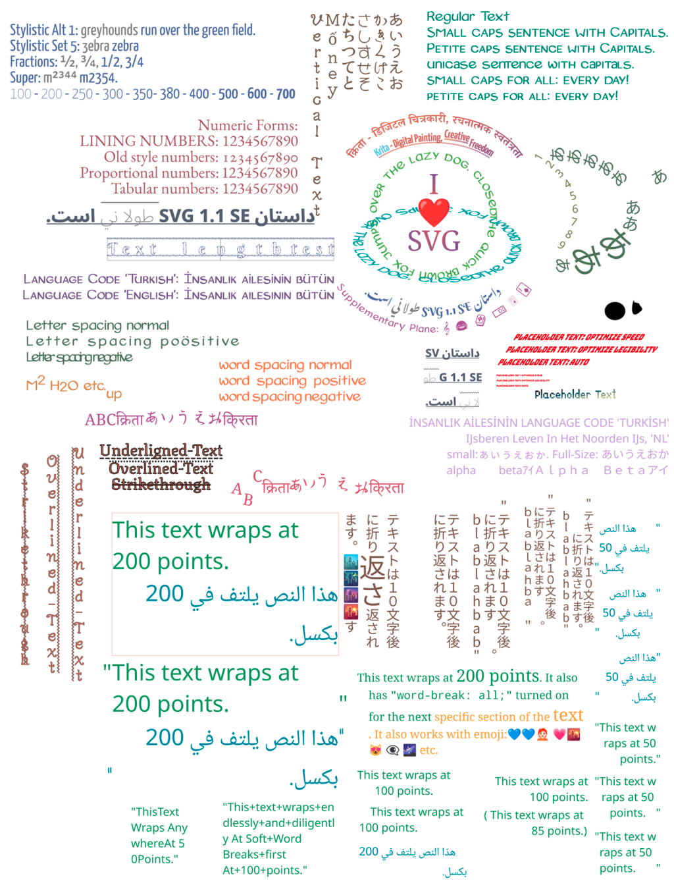
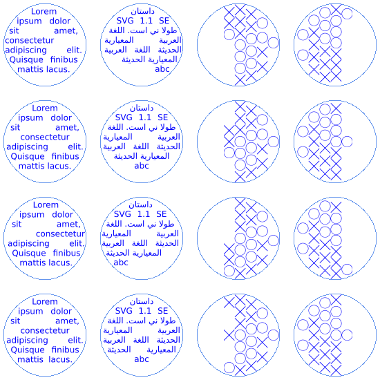
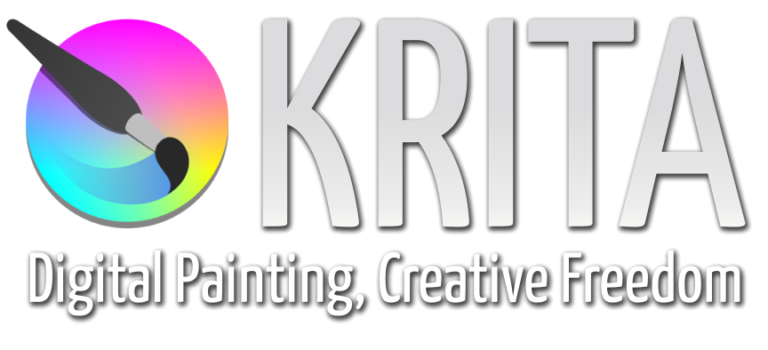

# Krita 2022 年回顾与 2023 年展望

## 译文信息

- 源文：[Krita in 2022 and 2023](https://krita.org/en/item/krita-in-2022-and-2023/)
- 作者：[Krita project](https://krita.org)  
- 许可证：[cc-by-sa 4.0](https://creativecommons.org/licenses/by-sa/4.0/)
- 译者：暮光的白杨
- 日期：2023-04-03

----

## 正文

这是我们非常晚才发布的，对过去一年的年度回顾，并对刚刚开始的一年进行展望。如果你对这些事情不感兴趣，可以忽略本文！

与 2021 年和 2020 年一样，Krita 团队没有成员真正死于正在进行的大流行病。这听起来有点神奇，但确实如此。这是相当糟糕的一年，尽管，Krita 的维护者感染力 COVID-19，花了很久时间才康复（就是我，Halla……），七天里有四天因病无法做任何事——以及其他各种动荡，我们不打算详述，因为这不安全，或者说谈起来太隐私，我们真的渡过了非常艰难的一年。

2022 年之前的几年中，我们主要努力（有时是拼命地）控制流入的错误报告的数量。不得不说，很多错误报告基本上是不可执行的。这不能怪报告者，他们花了很多时间注册然后写下了他们的问题。这真是令人钦佩的努力。但问题往往出在操作系统对数位板的支持、显示驱动程序……以及明显的误解上。还有寻求用户支持的人。但现在公开的错误报告比一年前更多。

因此，对于今年，我们决定采取不同的方法。我们想主动确定我们想要做什么，然后讨论如何去做，再然后动手去做，而不是对错误报告、wish bugs 和功能请求做出简单反应。

所以，2022 年初，封控一解除，Krita 的两名开发人员 Halla 和 Wolthera 就立马坐在代芬特尔[^deventer]一起准备这个想法。当然，即使在乌克兰战争爆发和由此引发的所有问题之前，我们也无法在 Krita Developers’ Sprint[^sprint] 上聚集全部的人。所以这是有限的。

[^deventer]: 代芬特尔（荷兰东部一座城市）
[^sprint]: <https://en.wikipedia.org/wiki/Krita#Sprint_events>

我们两人坐下来讨论 Krita 的主要商业竞争对手是谁。好吧，那当然是 [Clip Studio][clip]。在绘画支持方面，Photoshop 并没有真正取得进展，[Corel Painter][corel] 也不是我们可以作为示例的应用程序：我们想要创造用来最高效地创建图像的应用程序。将照片变成绘画作品不是我们的目标。

[clip]: https://www.clipstudio.net/en/
[corel]: https://www.painterartist.com/en/product/painter/

讨论的结果是一份[文件][doc-1]，我们试图找出 Krita 中遗漏或缺少的最重要的东西。这就是我们想出的部分：

[doc-1]: https://docs.google.com/document/d/18ZL_DiMc3VdtcN_dCz_BTMn1fR3M72GuRw2E4ThRdiw

- 文本对象功能
- 单张图片与书籍或项目
- 展开的首页
- 云集成
- 移动用户界面
- 追踪 3D 模型
- 可变形的漫画画板
- 矢量画笔
- 图层管理改进
- 项目资产管理
- 新的填充工具

然后我们与整个赞助开发者团队举行了一次[虚拟会议][meeting-1]，并允许人们选择他们感兴趣的事情：

[meeting-1]: https://docs.google.com/document/d/1GPcclrQbxZN7iDeSP6Zo3CckEN8rrotwYozjmjktmX8

- Dmitry 将专注于拆分画笔编辑器中的逻辑，这样我们就可以在不破坏画笔引擎的情况下创建新的画笔编辑器界面。此事已经完成。
- 文本对象。为了明确区分文本对象和文本工具，Wolthera 花费了大量的工作来改进文本对象。该对象现在支持 SVG2 和 CSS，带有自动换行和所有功能。以下这张图片显示了她的工作成果：  

{ width=80% }
  
这是自动换行的结果：  

{ width=70% }
  
这项工作也大部分完成并合并了。
- Agata 一直致力于改善 [Krita 助手功能的用户体验][experience]，并打算开发可变形的漫画画板。第一个现在正在审查 ([1][review], 2)，第二个仍然需要从设计开始。
- Sharaf 一直致力于[将欢迎页面移植到 QML][port] 并使其更加灵活和有用。这项工作进展缓慢，因为他还需要在 Android 和 ChromeOS 上维护 Krita，而频繁的 API 变更使这项工作充满挑战。另一个挑战是 KDE QML 框架 [Kirigami] 一直处于不断变化的状态，并不像我们希望的那样稳定。
- Emmet（以及 2022 年 12 月之前的 Eoin）正在致力于全面改进动画系统中的音频支持。从技术上讲，[MR 已经准备就绪][mr]，但在所有平台上构建支持库时存在问题。

[review]: https://invent.kde.org/graphics/krita/-/merge_requests/1563
[experience]: https://phabricator.kde.org/T13380
[Kirigami]: https://develop.kde.org/frameworks/kirigami/
[port]: https://invent.kde.org/graphics/krita/-/merge_requests/1522
[mr]: https://invent.kde.org/graphics/krita/-/merge_requests/1323

同时，我们修复了超过一千份错误报告。

我们还发布了一系列版本：

- 5.0.6：2022-04-27，[发行公告](https://krita.org/en/item/krita-5-0-6-released/)
- 5.0.8：2022-05-25，这是一个只含源码的版本，修复了 Qt > 5.12 的 Linux 发行版的构建回归。
- 5.1.0：2022-08-18，[发行公告](https://krita.org/en/item/krita-5-1-0-released/)，[发行说明](https://krita.org/en/krita-5-1-release-notes/)
- 5.1.1：2022-09-13，[发行公告](https://krita.org/en/item/krita-5-1-1-released/)
- 5.1.3：2022-11-7，[发行公告](https://krita.org/en/item/krita-5-1-3-released/)（我们没有发布 5.1.2）
- 5.1.4：2022-12-14，[发行公告](https://krita.org/en/item/krita-5-1-4-released/)

虽然我们没能将 Krita 引入 macOS（不是 iPadOS）商店——macOS 上商店应用程序的沙盒完全打败了我们，我们也没能找到让它工作的方法。然而当谈到商店方面时，我们并没有看到 [Steam] 或 [Windows 商店][windows]的销售额大幅下降——尽管这是显而易见的。来自 Google Play 和 [Epic] 的捐款很少。

[windows]: https://apps.microsoft.com/store/detail/9N6X57ZGRW96?hl=en-us&gl=US
[Steam]: https://store.steampowered.com/app/280680/Krita/
[Epic]: https://www.epicgames.com/store/p/krita

鉴于每个人都承受着巨大的压力，Krita 发展基金、遗留的开发基金以及下载后偶尔的捐款自然会减少。我们遇到了这种情况，但幸运的是，我们得到了[第一个企业赞助商][patron]：Intel！

[patron]: https://krita.org/en/item/intel-becomes-first-krita-development-fund-corporate-gold-patron/

{ width=30% }
{ width=30% }

但如果我们想继续这样发展，那么我们将需要更多的钱，这是不可避免的。2023 年将是充满不确定性的一年。

说到赞助开发者，我们几乎整个团队都还在一起：Sharaf、Dmitry、Halla、Wolthera、Tiar、Emmet、Ivan、Amy。Eoin 在 2022 年底离开，开始从事另一个非常有趣的免费软件项目 [Godot]。

[Godot]: https://godotengine.org/

但是我们被[回归错误][regression]所困扰，甚至我们的单元测试套件都无法在我们发布之前停止报错。这倒是有点周期性。Krita 版本似乎从稳定到稳定，从令人遗憾再到稳定，都是为了应对一些我们还没有确定的事情。这就是为什么我们要做测试版的原因！请测试它们！

[regression]: https://en.wikipedia.org/wiki/Software_regression

总而言之，正如我所说，2022 年是艰难的一年。鉴于种种限制，我们取得了惊人的进展。但这一年考验了开发者社区和更广泛的 Krita 社区的脾气，不仅是与开发者团队实际交谈的那部分社区，还有像 discord 或 reddit 这样的附属社区。

人们常常对他们认为“开发者”缺乏响应的行为感到生气。虽然 [krita-artists.org] 取得了巨大的成功，并且是一个人们真正互相帮助的地方，但 Krita 的开发者不可能阅读所有的建议和功能请求，也不可能查看那些经常是非常详细的模型。我们根本跟不上！

[krita-artists.org]: http://krita-artists.org/

因此，如果您想参与 Krita 的发展和改进，您需要直接与 Krita 的开发人员取得联系。请在 IRC（或 Matrix）上，通过在 [invent.kde.org] 或邮件列表提出合并请求。即便如此，请记住，我们一直在与大量错误报告作斗争，同时试图实现我们已经确定为最优先考虑的功能和改进！

[invent.kde.org]: https://invent.kde.org

2023 年会发生什么？

我们可能会推迟发布 Krita 5.2.0。时间会推迟是因为 2022 年的工作结束之后，许多团队成员已经筋疲力尽，需要比平时更长的休息时间。2022 年困扰我们的问题并没有消失，我们中的一些人要么是被迫的，要么是为了学习，不得不搬到新的国家。而且我只剩管理项目的精力，几乎没有做过任何编程开发！

但 Krita 5.2.0 将拥有上面列出的全部或大部分新功能。您可以使用 KDE 的 gitlab milestone 功能跟踪 Krita 5.2.0 中的内容，同时我们正在编写发行说明： [milestone]。在 5.2.0 之后，我们将致力于修复错误——当然还有我们优先列表中尚未开始的其他事情！

[milestone]: https://invent.kde.org/graphics/krita/-/milestones/5#tab-merge-requests

如果你想看到新版本的发布，请通过[一次性捐赠](https://krita.org/en/support-us/donations/)、[订阅开发基金](http://fund.krita.org/)或在受支持的应用程序商店之一购买 Krita 来支持 Krita！