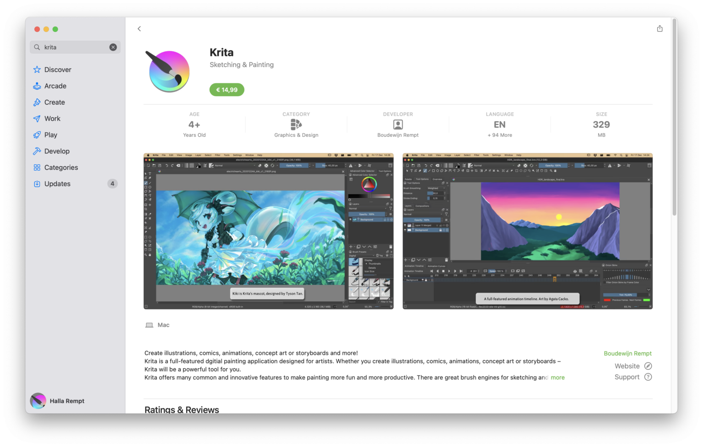

# Krita 登陆 MacOS App Store

- 译文信息：
    - 源文：[Krita in Stores — Update!](https://krita.org/en/item/krita-in-stores-update/)
    - 作者：[Krita project](https://krita.org)  
    - 许可证：[CC-BY-SA 4.0](https://creativecommons.org/licenses/by-sa/4.0/)
    - 译者：暮光的白杨
    - 日期：2023-10-21

----

Krita 已经在各种应用商店（Steam、Windows Store、Epic Store、Google Play）上架了一段时间。虽然你始终可以从 krita.org 免费下载所有平台的 Krita（或者修改源代码并自行构建），但商店中的 Krita 不是免费应用。

今年早些时候，由于通货膨胀正在侵蚀我们的开发能力，我们将 Krita 的商店价格提高到了 14.99 美元。最初，这增加了我们的收入，但随着通货膨胀也侵蚀了每个人的消费能力，我们将 Krita 的价格降低至 9.99 美元。该规定将于下周生效，因为各商店都有不同的审批程序。

但更好的消息是，经过几个月与 MacOS App Store 应用程序强制使用的 MacOS 沙盒系统以及 Apple 审核流程的艰苦斗争，我们在 MacOS App Store（注意**不是** iPadOS 商店）上发布了 Krita。请注意，如果你搜索 Krita，则必须向下滚动搜索结果，因为许多其他艺术应用程序已使用 Krita 关键字来增加其应用程序的流量，并且它们在商店中的存在时间更长。

 *MacOS store 的 Krita*

这个售价比其他商店更贵，因为 MacOS App Store 的开发成本非常高。**每位**开发者需要 100 美元的开发订阅费、额外的硬件和大量的时间。因此，在 MacOS App Store 上，Krita 的售价为 14.99 美元——我们本想选择 12.99 美元，但如果这样做，苹果就会让我们支付 14.99 美元。

如果您想直接支持 Krita（商店会从中抽取高额佣金……），请考虑[捐款]或加入[开发基金]！

[捐款]: https://krita.org/en/support-us/donations/
[开发基金]: https://fund.krita.org/