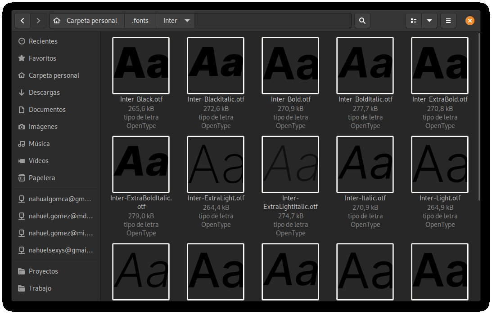
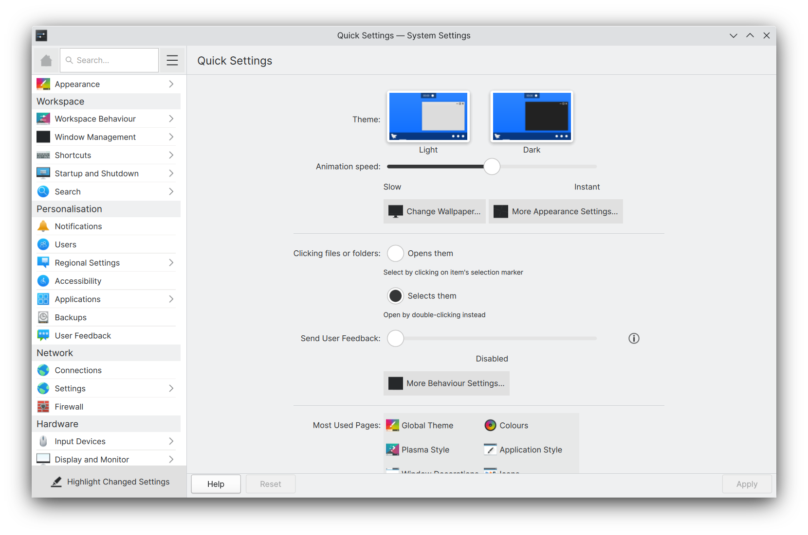
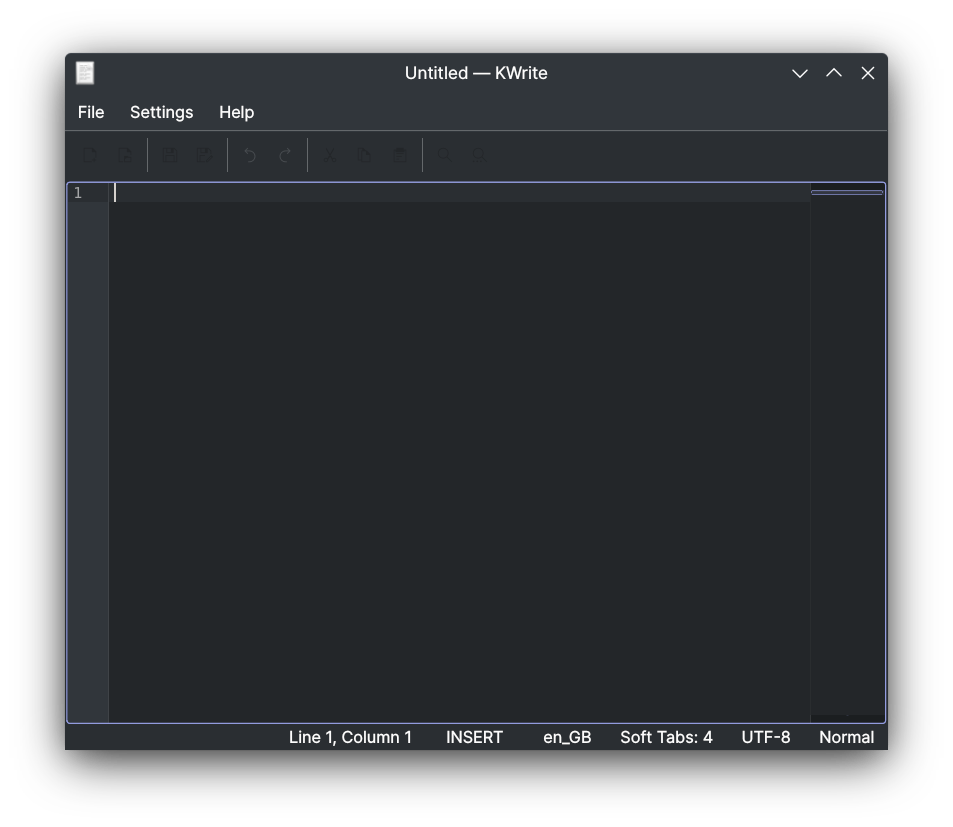
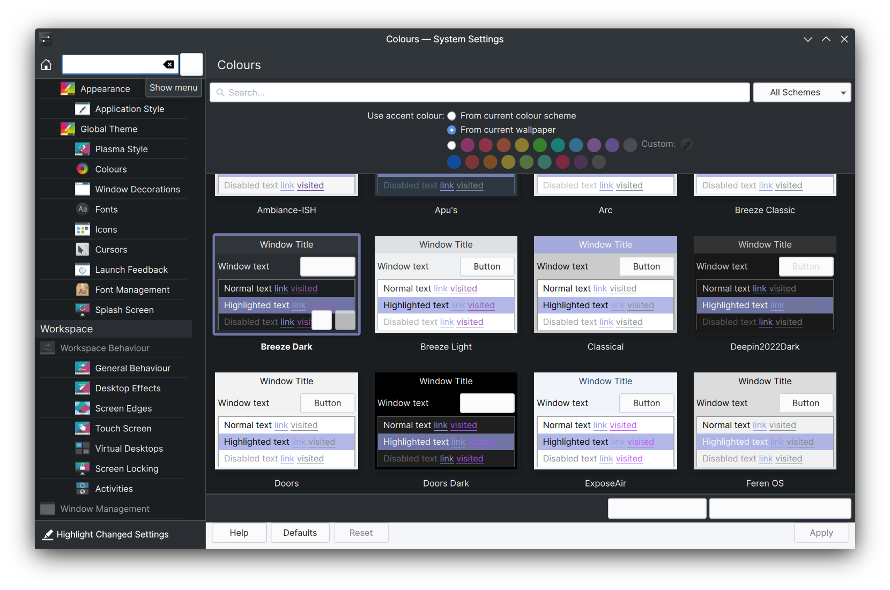

# libadwaita：修复 Linux 桌面的可用性问题

## 作品信息

- 原文：[libadwaita: Fixing Usability Problems on the Linux Desktop](https://theevilskeleton.gitlab.io/2022/07/28/libadwaita-fixing-usability-problems-on-the-linux-desktop.html)
- 作者：[TheEvilSkeleton](https://theevilskeleton.gitlab.io/about)
- 许可证：[CC-BY-SA 4.0](https://creativecommons.org/licenses/by-sa/4.0/legalcode.txt)
- 译者：暮光的白杨
- 日期：2022-08-22

!!! tip "扩展阅读"

    [【翻译】请别再使用主题装饰我们的软件](https://zhul.in/2021/11/05/please-dont-theme-our-apps/)（[原文](https://stopthemingmy.app/)）

----

## 声明

1. 本文的前提是让对 GTK 知之甚少的人能够轻松了解 libadwaita 背后的情况和动机。
2. 为了提供真实世界的示例，我必须提及某些实物并提供链接以进一步解释该主题。
3. 我不是代表 GNOME 发言。我只是一个观察 GNOME 项目并试图了解他们在有争议的变化背后的推理和动机的局外人。

## 引言

由于 GNOME 对主题的立场，libadwaita 在 Linux 桌面社区引起了巨大的争议。

我听到了很多关于 GTK4 和 libadwaita 的主要是基于误解的错误信息。我想花点时间解释一下 GTK4 和 libadwaita 是什么，为什么 GNOME 决定走这条路，以及为什么它是朝着正确方向迈出的一大步。

## GTK4 和 libadwaita 是什么？

首先，GTK 到底是什么？GTK 是 GNOME 项目的一个工具包，这意味着它为图形用户界面提供了构建块。GTK4 是 GTK 的第 4 次迭代，它带来了比 GTK3 更好的性能和更多功能。

libadwaita，用外行的话来说，是 GTK4 的一个插件，它添加了更多为 GNOME 桌面环境量身定制的构建块。这些块用于提供更复杂的小部件以帮助维护和促进开发。

## 了解自定义主题的问题和应用程序的复杂性

*不要与本段的前提混淆：GNOME 本身并没有反对自定义主题。这只是我想指出的自定义主题的副作用，以便我可以扩展到实际问题。*

关于自定义主题和 GNOME 应用程序的最大问题之一是，自定义主题无法赶上应用程序的发展。这些应用程序是复杂的，在这个意义上，许多功能和 UI 上面叠加了一些层，以改善界面的某些方面，即可访问性、外观等，或使用 CSS，因为当基础组件无法满足需求时，有很多理由为 UI 使用额外的层。

考虑到自定义层，许多 GNOME 开发人员在有限的时间内使用小范围的主题进行测试，主要是 Adwaita 和 Adwaita-dark——毕竟这些项目是在空闲时间开发的。

这意味着，在这些情况下未经测试的许多自定义主题可能会导致视觉问题。例如由于某些内容偏了合适的位置，程序界面可能看起来令人不快；或具有不正常的颜色模式，也可能导致可访问性错误，或者出现更糟糕的情况，致使应用程序完全无法运行。

此外，许多 GNOME 开发人员希望稍微改变 UI 以改善其视觉效果。这些微小的更改可能会在更新发布后破坏自定义主题，因为主题通常对任何类型的更改都非常敏感。他们必须适应解决新问题。

## 默认预置自定义主题的发行版

许多发行版，例如 Ubuntu 和 Pop!_OS，通常要么提供默认具有多个视觉错误的主题，要么使用户可以非常轻松地更改主题，为用户营造一种简单易用的体验。

以下是一些例子：

???+ example "Pop!_OS"
      
    使用深色样式的 [Nautilus](https://apps.gnome.org/app/org.gnome.Nautilus/) 的低对比度字体缩略图（[来源](https://web.archive.org/web/20220722052234/https://nitter.pussthecat.org/nahuelwexd/status/1433095710598180870)）  

???+ example "Ubuntu"
      
    使用深色样式的 GNOME [Fonts](https://apps.gnome.org/app/org.gnome.font-viewer/) 的低对比度字体缩略图。

???+ example "样例三"
      
    使用深色样式的 GNOME [Characters](https://apps.gnome.org/app/org.gnome.Characters/) 出现对比度低且字符偏离正常位置的问题。

???+ example "样例四"
      
    [Contrast](https://apps.gnome.org/app/org.gnome.design.Contrast/) 的白色背景

通过这些示例，我们观察到这些主题破坏了应用程序的几个方面，有些甚至使它们无法运行。当发行版预置自定义主题时，用户得到的印象是应用程序有问题，而不是主题本身有问题。尽管应用程序本身按预期工作，但这会让用户对此应用程序留下不好的印象并恶化其声誉。此外，许多用户随后联系 GNOME 开发人员来解决应用程序中不存在的问题。GNOME 开发人员必须将用户指引给主题开发人员，或者创建修补主题的新样式，然后他们必须维护这些样式。无论哪种方式，它都会越来越让维护者感到恼火。

开发者也是普通人，对于重复劳作的事务是有容忍极限的。就应用程序中不存在的问题向用户提供支持通常是可以的，因为它确实发生了。然而，当这种事件持续重复 5 次、10 次或更多时，它会给开发人员带来压力和负担。归根结底，许多 GNOME 开发人员在这里开发应用程序并在其支持范围内修复错误，而不是不断地对无效问题、电子邮件等进行分类，并将用户指引给其他开发人员。同样，这是在空闲时间完成的。许多开发人员有本职工作，想和家人、朋友待在一起，或者只是利用他们的空闲时间专注于项目的其他事情。

!!! summary "注意"
    *澄清一下：本节讨论的是默认情况下带有自定义主题的发行版，而不是有意使用第三方主题的修补匠。*

## 请求

考虑到这些问题，这导致 GNOME 贡献者在 2019 年写了一封[公开信](https://stopthemingmy.app/)，[礼貌地要求发行版默认停止发布自定义主题，并让用户手动应用主题（如果他们选择这样做）](https://zhul.in/2021/11/05/please-dont-theme-our-apps/)。然而，在这封信之后的几年内，一切都没有改变：发行版继续默认发布自定义主题，这导致它们破坏了许多应用程序，GNOME 开发人员继续对无效问题进行分类并负担过重，他们的开发会以某种方式受到阻碍，等等。

## 解决方案

作为回应，GNOME 引入了 [libadwaita](https://gitlab.gnome.org/GNOME/libadwaita)。如开头所述，libadwaita 是 GTK4 的“插件”。与纯粹使用 GTK4 相比，它允许开发人员轻松使用复杂的小部件。然而，这种便利是有代价的：“最终用户的自由”，我将在本文后面谈到。

GNOME 计划通过实施重新着色 API 来促进品牌塑造，让供应商注入他们的品牌并使其看起来更有吸引力，正如 Adrien Plazas 在[这篇文章](https://aplazas.pages.gitlab.gnome.org/blog/blog/2020/04/02/coloring-api.html)中所解释的那样。从本质上讲，这意味着 GNOME 开发人员开始投入更多工作来实现适当的 API，以让用户和发行版自定义应用程序，而无需 hack。

随着 libadwaita 的加入，我个人看到了它的巨大好处和可预见的未来。我目前是 [Bottles](https://usebottles.com/) 的开发者之一。感谢 libadwaita，它帮助我们减少了项目的代码库，使我们更容易维护。它也让 Bottles 看起来更漂亮，让我们有机会在项目的其他方面开展工作。

## 批评者们提出的其他方案

现在我们知道了 GNOME 做出的决定以及他们这样做的原因，让我们看看人们提出的一些论点，即 GNOME 应该采取措施来防止 libadwaita 的存在和“锁定”自定义主题。

### 警告用户

许多用户认为 GNOME 开发人员可以某种方式警告用户。例如，一个在用户准备创建新 issue 时要求用户联系主题开发人员的 issue 模板。不幸的是，事情没那么简单。GNOME 开发人员必须编写将用户引向主题开发人员的模板。 为此，他们必须假设用户的知识水平，例如用户是否知道要联系谁、如何联系、联系什么等等。更重要的是，他们将是维护模板的人。

此外，最重要的是，issue 模板和类似方法会恶化用户体验。GNOME 开发人员将被迫向用户提供不需要和意外的警告和说明。应用程序和发行版的目的是解决现实世界的问题，而不是通过让用户在社交或技术上感到震惊来推开用户。通过将用户推荐到许多地方，这会排斥他们，甚至可能会阻止他们一开始就提出问题。

这也忽略了这样一个事实，即用户是否甚至阅读、忽略或误读模板等，并最终在错误的错误跟踪器中创建 issue。即使 GNOME 开发人员没有过错，这些事件也会直接或间接地影响他们和/或他们的项目。他们几乎没有空间来捍卫或保护自己。

### 没有担保; 没有支持

许多用户认为 GNOME 开发人员有权不提供任何支持，因为他们使用的大多数许可证都有免责声明，即该项目的分发没有任何保证。虽然这是真的，但它并非没有后果。不提供任何支持对项目不利。如果开发者拒绝支持用户，那么这个事件就有可能恶化项目甚至开发者的声誉和形象。

当然，不提供支持是必然的，但尽量减少不提供支持的可能性，对项目、开发者的心理健康，以及开发者和用户之间的关系都有好处。 GNOME 开发人员不能简单地不提供支持，因为这样做会产生不良后果。

### 变更许可证

我经常从用户那里听到的另一个论点是简单地更改许可证，特别是专有许可证。好吧，这 100% 违背了自由和开源的理念。GNOME 开发人员遵循自由软件理念的主要原因之一是出于道德原因。

许多人说 GNOME 不关心他们的用户。 在我看来，说 GNOME 开发人员不关心用户是一种诬告。

GNOME 开发人员通常使用 copyleft 许可证，特别是像 GPL 这样的 GNU 许可证。 GPL 防止组织或个人创建专有和闭源分支。例如，如果我分支（获取代码）一个以 GPL 进行授权许可的 GNOME 项目，我在法律上不能在不披露源代码的情况下修改和重新分发该软件，因为 GPL 禁止分叉者这样做，从而从字面上保护用户自由。

虽然“锁定”主题美化可能会降低用户自由度，但它可以防止发行版破坏应用程序，从而保护用户体验。每一个决定都必须有一些妥协。GNOME 开发人员略微牺牲了用户自由以保护用户体验，因为它可以防止用户在使用 GNOME 应用程序时获得低于标准的体验。 在我看来，这是绝对值得妥协的。

坦率地说，GTK4+libadwaita 仍然允许覆盖 CSS，就像任何以前的 GTK 版本一样，但需要 CSS 知识并且由于前面提到的原因非常敏感。这意味着 GNOME 从字面上看并不限制自定义主题，因此我在整篇文章中都给 `锁定` 和 `最终用户自由` 加上引号。

## Qt 的自定义主题也会遇到问题

我听到许多用户抱怨这些问题只出现在 GTK 主题和应用程序中，而不会出现在 Qt 中。 然而，这是不正确的；Qt 也有很多由主题引起的问题。

### qt5ct 和 Plasma

!!! note "注意"
    *[qt5ct](https://sourceforge.net/projects/qt5ct/) 允许你在没有样式或集成 Qt 的桌面环境中自定义 Qt，例如 Cinnamon 和 GNOME。它从来没有打算在 KDE Plasma 中使用，但是在那些桌面环境中使用 qt5ct 的说明导致 qt5ct 无论如何都可以在 KDE Plasma 中使用。*

qt5ct 是一个 [QPlatformTheme](https://doc.qt.io/qt-5/qpa.html)，用于控制 Qt 的视觉方面，以及 Qt 在执行操作时的行为，例如单击文件。同样，[plasma-integration](https://invent.kde.org/plasma/plasma-integration) (KDEPlatformTheme) 是 KDE 的 QPlatformTheme，允许 Plasma 将其外观和行为应用于 Qt。

但是，Qt 一次只能使用一个 QPlatformTheme，这意味着在 Plasma 中使用 qt5ct 会禁用 KDEPlatformTheme，从而导致视觉问题和不正确的应用程序行为。

我们会在使用 qt5ct 时遇到视觉问题，可以在系统设置中看到一个示例：

!!! example "样例"
      
    使用 KDEPlatformTheme 时的系统设置  
      
    使用 qt5ct 时的系统设置

正如我们在 qt5ct 中观察到的，系统设置现在使用 Qt 的默认样式，导致这些按钮，大量的单选按钮和复选框，以及随机散布在整个界面中的黑色图标的出现。

在系统设置之外，应用程序也不再根据你的配色方案重新着色其图标，从而在使用深色配色方案时导致 Plasma 中的对比度问题：

!!! example "样例"
    
    使用 Breeze Dark 配色方案和 qt5ct 的 KWrite

### Kvantum

Kvantum 是另一种流行的 Qt 主题美化方式。与作为 QPlatformTheme 的 qt5ct 不同，Kvantum 是一种 [QStyle](https://doc.qt.io/qt-5/qstyle.html)（应用程序风格），这意味着 Qt 应用程序可以完全按照桌面环境的预期进行集成。然而，Kvantum 也有问题。

Kvantum 使用将预定义配色方案应用于应用程序的主题。这适用于大多数应用程序，因为它们遵循 Qt 提供给应用程序的配色方案。但是，有些应用程序会覆盖配色方案，例如某些 KDE 应用程序。

这会导致这些应用程序存在严重的可读性问题。例如，如果在某些 KDE 应用程序上应用了不同于预期使用的配色方案：

!!! example "样例"
      
    使用 KvArc 在 Kvantum 上使用 Breeze Dark 配色方案的系统设置

如此处所示，覆盖颜色的应用程序可能会劣化 Kvantum 的视觉效果，因为 Kvantum 并不是为强制执行与 Kvantum 预期不同的配色方案的应用程序而设计的。

### 不是全部的 Qt 程序都可被自定义主题

为了添加更多内容，一些 Qt 应用程序，例如 Telegram，硬编码自己的主题，并且没有提供任何简单的选项来使用系统主题。我们应该责怪他们吗？当然不是。这些应用程序在视觉环境中非常复杂。允许使用系统主题意味着它们肯定会提供一定程度的支持，这可能会阻碍开发速度。

## Fedora 项目的关系

Fedora 项目设法与 GNOME 开发者进行了适当的沟通并达成了协议，使其对许多方面都有很大的吸引力。Fedora Linux 使用了原版 GNOME，只是在背景的右下方增加了 Fedora Linux 的标志。在我看来，这种方式才是发行版应该追求的。

## 结论

总之，主题美化对变化非常敏感，即使是最轻微的变化。虽然用户故意为应用程序设置自定义主题对 GNOME 开发人员来说不是问题，但问题在于尽管明确要求不要这样做，但一些发行版仍然在分发预置的默认自定义主题。

重要的是明白虽然这篇文章是关于 GNOME、GTK 和 libadwaita 的，但这是一个普遍的问题，而不是 GTK 特定的问题。其中 GNOME 在 libadwaita 的帮助下迈出了解决这个基本问题的一步，不仅保护了开发者，也保护了用户体验，同时使其对几方都有很大的吸引力。

在 libadwaita 之前，我对开发 GUI 应用程序没有兴趣，因为我不想处理这个负担。 感谢 libadwaita，我确信 GNOME 正在构建一个稳定的生态系统，吸引潜在的开发人员、贡献者和用户。 就我个人而言，以我对 libadwaita 的有限经验，这是积极的。 我真诚地赞扬所有开发人员和贡献者在 GTK 和 libadwaita 上投入了大量工作，以建立一个拥有光明未来的生态系统。

这对每个人来说也是非常重要的一课：拥有做某事的自由并不意味着它应该做。 虽然能够做任何你想做的事是个好主意，但你有可能影响周围的人，或者更糟的是，影响你自己。

----

***仅仅因为你能，并不意味着你应该。***