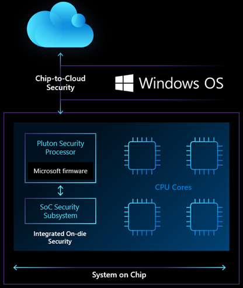

# 认识 Microsoft Pluton 处理器——专为未来 Windows PC 设计的安全芯片

## 译文信息

- 原文：[Meet the Microsoft Pluton processor – The security chip designed for the future of Windows PCs](https://www.microsoft.com/security/blog/2020/11/17/meet-the-microsoft-pluton-processor-the-security-chip-designed-for-the-future-of-windows-pcs/)
- 作者：David Weston
- 许可信息： © Microsoft 2022
- 译者：暮光的白杨
- 日期：2022-06-26

----

## 正文

Windows PC 的作用和对技术的信任比以往任何时候都更加重要，因为我们的设备使我们在工作和生活中保持联系和生产力。Windows 10 是有史以来最安全的 Windows 版本，以端对端安全为基础，从边缘到云端一直到硬件都有保护。诸如 Windows Hello 生物识别面部识别、内置微软安全中心反病毒软件、固件保护、System Guard 以及 Windows 应用控制等先进的系统功能，帮助微软跟上了不断变化的威胁形势。

虽然云计算提供的保护和 Windows 操作系统的人工智能进步使攻击者越来越难，成本越来越高，但他们正在迅速发展，转向新的目标：目前硬件和软件之间无法触及或监测违规操作的缝隙。我们已经采取措施，通过提供先进身份、操作系统和硬件保护的安全核心 PC（[secured-core PCs](https://www.microsoft.com/security/blog/2019/10/21/microsoft-and-partners-design-new-device-security-requirements-to-protect-against-targeted-firmware-attacks/)）等创新，与我们的合作伙伴一起对抗这些富有经验的网络犯罪分子和民族国家行为者。

今天，Microsoft 与我们最大的芯片合作伙伴一起宣布了 Windows 安全的新愿景，以帮助确保我们的客户在今天和未来都受到保护。我们与领先的芯片合作伙伴 AMD、英特尔和高通合作，推出了 Microsoft Pluton 安全处理器。这种在 Xbox 和 Azure Sphere 中首创的芯片到云安全技术（`chip-to-cloud security technology`）将为未来的 Windows PC 带来更多的安全改进，并标志着与生态系统和 OEM 合作伙伴的新旅程的开始。

我们对 Windows PC 未来的愿景是将安全置于最核心的位置，内置于 CPU，将硬件和软件紧密地整合在一个统一的方式中，旨在消除整个攻击载体。这种革命性的安全处理器设计将使攻击者更难隐藏在操作系统之下，并提高我们防范物理攻击、防止凭证和加密密钥被盗以及从软件错误中恢复的能力。

### Pluton 设计重新定义了 CPU 的 Windows 安全性

如今，大多数 PC 上操作系统安全的核心位于与 CPU 分离的芯片中，即可信平台模块 (TPM)。TPM 是一个硬件组件，用于帮助安全地存储验证系统完整性的密钥和测量值。Windows 在 10 年前开始就已经支持 TPM，并支持许多关键技术，例如 Windows Hello 和 BitLocker。鉴于 TPM 在执行关键安全任务方面的有效性，攻击者已经开始创造攻击它的方法，特别是在攻击者可以窃取或临时[获得对 PC 的物理访问权](https://pulsesecurity.co.nz/articles/TPM-sniffing)的情况下。这些复杂的攻击技术针对 CPU 和 TPM 之间的通信通道，该通道通常是总线接口。该总线接口提供了在主 CPU 和安全处理器之间共享信息的能力，但它也为攻击者提供了[使用物理攻击](https://pulsesecurity.co.nz/articles/TPM-sniffing)窃取或修改传输中信息的机会。

Pluton 设计通过将安全性直接构建到 CPU 中，消除了该通信通道受到攻击的可能性。使用 Pluton 架构的 Windows PC 将首先模拟一个与现有 TPM 规范和 API 兼容的 TPM，这将使客户能够立即受益于依赖于 TPM 的 Windows 功能（如 BitLocker 和 System Guard）的增强安全性。带有 Pluton 的 Windows 设备将使用 Pluton 安全处理器来保护凭据、用户身份、加密密钥和个人数据。即使攻击者安装了恶意软件或完全拥有 PC 物理访问权限，这些信息也无法从 Pluton 中删除。

这是通过在 Pluton 处理器中安全地存储敏感数据（如加密密钥）来实现的，该处理器与系统的其余部分隔离，有助于确保新兴攻击技术（如推测执行（`speculative execution`））无法访问密钥信息。Pluton 还提供独特的安全硬件加密密钥 (Secure Hardware Cryptography Key, SHACK) 技术，有助于确保密钥永远不会暴露在受保护的硬件之外，甚至不会暴露给 Pluton 固件本身，从而为 Windows 客户提供前所未有的安全级别。

Pluton 安全处理器补充了微软与社区所做的工作，包括 [Cerberus 项目](https://github.com/opencomputeproject/Project_Olympus/blob/master/Project_Cerberus/Project%20Cerberus%20Architecture%20Overview.pdf)，它为 CPU 提供了一个可由 Cerberus 证明的安全身份，从而增强了整个平台的安全性。

Pluton 解决的其他主要安全问题之一是如何使系统固件在整个 PC 生态系统中保持最新。如今，客户从难以管理的各种不同来源收到对其安全固件的更新，从而导致广泛的补丁问题。Pluton 为运行固件提供了一个灵活、可更新的平台，该平台实现了由 Microsoft 创造、维护和更新的端到端安全功能。用于 Windows 计算机的 Pluton 将与 Windows 更新过程集成，就像连接到 IoT 设备的 Azure Sphere 安全服务一样。

Microsoft 的操作系统安全改进、[安全核心 PC](https://www.microsoft.com/security/blog/2019/10/21/microsoft-and-partners-design-new-device-security-requirements-to-protect-against-targeted-firmware-attacks/) 和 [Azure Sphere](https://azure.microsoft.com/en-us/blog/anatomy-of-a-secured-mcu/) 等创新以及我们的芯片合作伙伴的硬件创新的融合为 Microsoft 提供了抵御跨 Windows PC、Azure 云和 Azure 智能边缘设备的复杂攻击的能力。

### 与我们的合作伙伴一起创新以增强芯片到云的安全性

PC 的成功很大程度上归功于一个充满活力的生态系统，操作系统、芯片和 OEM 合作伙伴都在共同努力，通过协作创新来解决棘手的问题。10 多年前，随着 TPM 的成功推出，这一点得到了证明，这是第一个广泛可用的硬件信任基础设备。自该里程碑以来，微软和合作伙伴继续在下一代安全技术方面进行合作，充分利用最新的操作系统和芯片创新来解决最具挑战性的安全问题。这种更好的协同方法是我们打算如何使 PC 生态系统成为最安全的可用方法。

Microsoft Pluton 设计技术融合了从向数亿台 PC 交付支持硬件信任根（`root-of-trust-enabled`）的设备的所有经验。Pluton 设计是 Microsoft 与 AMD 合作，于 2013 年发布的 Xbox One 主机中集成硬件和操作系统安全功能的一部分，Microsoft 也在 Azure Sphere 中引入该技术。将 Microsoft 的 IP 技术直接引入 CPU 芯片有助于防止物理攻击、防止发现密钥并提供从软件错误中恢复的能力。

凭借最初 Pluton 设计的有效性，我们学到了很多关于如何使用硬件来缓解一系列物理攻击的知识。现在，我们正在利用从中学到的知识来实现从芯片到云的安全愿景，从而为 Windows PC 的未来带来更多的安全创新（请访问 [Microsoft BlueHat](https://www.youtube.com/watch?v=quLa6kzzra0) 以获得本次演讲中的更多详细信息）。Azure Sphere 利用类似的安全方法，成为第一个满足“[高度安全设备的七大特性](https://www.microsoft.com/en-us/research/wp-content/uploads/2017/03/SevenPropertiesofHighlySecureDevices.pdf)”的物联网产品。

通过利用相关公司的安全专业知识和技术，共享的 Pluton 信任根技术将最大限度地提高整个 Windows PC 生态系统的健康和安全性。 Pluton 安全处理器将通过 AMD、英特尔和高通的未来芯片为 Windows PC 提供下一代硬件安全保护。

>“在 AMD，安全是我们的重中之重，我们很自豪一直处于硬件安全平台设计的最前沿，以支持有助于保护用户免受最复杂攻击的功能。作为警戒威胁的一部分，AMD 和微软一直密切合作开发和不断改进基于处理器的安全解决方案，从 Xbox One 控制台开始，现在在 PC 中。我们在设计和构建产品时考虑到了安全性，将微软的 Pluton 技术引入芯片级将增强我们处理器已经强大的安全能力。” ——　Jason Thomas, AMD 产品安全主管 

>“英特尔将继续与微软合作，以提高 Windows PC 平台的安全性。将 Microsoft Pluton 引入未来的英特尔 CPU 将进一步实现英特尔硬件与 Windows 操作系统之间的集成。” —— Mike Nordquist，英特尔商业客户端安全高级总监

>“高通很高兴继续与 Microsoft 合作，以帮助提高大量设备和用例的安全性。我们相信，像 Microsoft Pluton 这样的基于硬件的片上信任根是保护多个用例和支持它们的设备的重要组成部分。” —— Asaf Shen，高通技术公司产品管理高级总监

我们相信像 Pluton 这样具有内置安全性的处理器是计算硬件的未来。借助 Pluton，我们的愿景是通过将这种内置信任级别扩展到设备和无处不在的事物，为智能边缘和智能云提供更安全的基础。

我们与社区的合作帮助 Microsoft 在每一层不断创新和增强安全性。我们很高兴能与芯片行业的知名人士一起使这一革命性的安全设计成为现实，因为我们不断努力提高所有人的安全性。