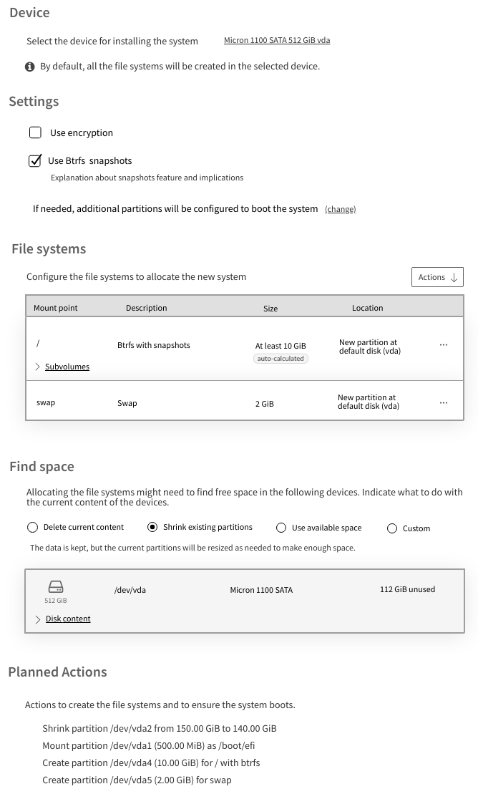

# Agama 年

- 译文信息：
    - 原文：[The Year of Agama](https://yast.opensuse.org/blog/2024-02-08/year-of-agama)
    - 作者：[YaST 团队](https://yast.opensuse.org/)
    - 许可证：**不明**
    - 日期：2024-02-17
    - 译者：暮光的白杨

----

> *[Agama] 是 openSUSE [YaST 团队]开发的下一代基于服务（Service-based）的 Linux 安装程序。它旨在提供可重用性、与第三方工具的集成以及在其上构建高级用户界面的可能性。*

[Agama]: https://github.com/openSUSE/agama
[YaST 团队]: https://yast.opensuse.org/

我们于 2023 年底发布了 Agama 7，并指出该版本是我们可以自认为[^agama7] “功能足够强大” 的第一个原型，涵盖了本地化、网络配置、存储设置、身份验证基础和预装软件选择等一些领域。现在是时候深入每个领域了……我们已经为此制定了计划。

[^agama7]: 引用自 <https://yast.opensuse.org/blog/2023-12-22/agama7>

## Agama 2024 年路线图展望

俗话说“计划是无用的，但规划是必不可少的”。因此，我们决定对 2024 年的前几个月进行必不可少的规划，并制定了这个无用的计划。

虽然我们将以相对稳定的速度不断推出新版本的 Agama，但我们设立了两个里程碑作为检查点。第一个里程碑预计在 4 月中旬左右，第二个里程碑计划在 7 月中旬。然后，我们利用这两个里程碑对接下来要完成的任务进行分组。

4 月的里程碑应该是对 Agama 的架构进行改造，使其不再依赖 Cockpit，并为配置存储设置提供更全面的用户界面。本文将对这两方面进行深入介绍。

7 月的里程碑将带来使 Agama 更具适应性的机制，以及对无人值守安装的诸多改进，从而使 Agama 成为 [AutoYaST] 的有力竞争者。

[autoyast]: https://doc.opensuse.org/projects/autoyast/

让我们深入了解第一个里程碑的预期改进。

## 架构变更

到目前为止，我们是在 [Cockpit 项目]提供的基础设施之上构建了 Agama。这使我们能够快速启动项目，而无需在身份验证或向 Web 界面提供文件等方面投入太多。但经过一年多的 Agama 开发，我们现在对如何做某些事情有了清晰的认识，而 Cockpit 开始成为限制因素。

[Cockpit 项目]: https://cockpit-project.org/

更多详情请查看 [Github 上的讨论]，但总而言之，我们认为从 Cockpit 中获得的少量功能并不能证明对它的强依赖是合理的，尤其是现在 Cockpit 正在将 Python 作为其运行时的一个基本组成部分。

[Github 上的讨论]: https://github.com/openSUSE/agama/discussions/1000

因此，我们将在接下来的几个月里，按照 Github 上的讨论所述，对方法进行一些改变。这应该会在不久的将来为改进 Agama 开辟出许多道路。

## 更强大的存储配置提案 UI

上述架构变更对于远程或无人值守安装以及将 Agama 集成到更大的解决方案中非常重要，但对于普通用户来说，这些变化可能并不明显。但这并不意味着未来几个月在交互式安装方面会很无聊。恰恰相反，我们计划对 Agama 的提案页面进行许多改进，以便调整存储配置。

新界面的目标是为新用户提供足够的便利，你可以从下面的模型中看到这一点。但我们知道 openSUSE/SUSE 用户对自定义设置有很大的期望。因此，我们更新了[文档]，描述了新界面将如何工作，以及它将为那些决定越过最初提案的用户提供的所有可能性。如果你想了解自己的基本需求是否能得到满足，请立即查看该文档和其中包含的扩展模型。

[文档]: https://github.com/openSUSE/agama/blob/master/doc/storage_ui.md

{ width=50% }

如果你不喜欢界面描述和模拟图，也不用担心。我们已经开始实现新界面的某些部分，因此你可以在即将推出的 Agama 原型中逐步体验这些变化。

## 即将到来的 openSUSE 大会

如果仔细观察上述两个里程碑的日期，你会发现有一件事情几乎会在此期间发生——[2024 年的 openSUSE 大会]！

[2024 年的 openSUSE 大会]: https://events.opensuse.org/conferences/oSC24

我们希望届时 Agama 能够在某些场景和发行版中取代 YaST。因此，我们希望利用这次会议与社区讨论 Agama 在 openSUSE 中可能的未来。

但是，正如我们之前多次提到的，安装体验并不局限于安装程序本身。执行安装程序的环境也是一个至关重要的方面。因此，除了用 Agama 替换 YaST 之外，我们还需要用一些现代的替代品来替换当前所谓的 "安装镜像"。

到目前为止，Agama Live ISO 测试版已经满足了我们的演示目的，但如果我们能在构建适合更真实安装场景的系统方面获得你的帮助，我们将不胜感激。

如果你对减小 live ISO 的大小、正确地将发行版存储库集成到镜像文件、简化启动过程或任何其他话题有好的想法……你知道在哪里可以找到我们。

## 保持联系

如前所述，你的贡献和意见是确保 Agama 实现其目标的关键因素，因此请随时联系 [YaST 开发邮件列表中的 YaST 团队]、[Libera.chat] 上的 `#yast` 频道或 [GitHub 上的 Agama 项目][Agama]。

[YaST 开发邮件列表中的 YaST 团队]: https://lists.opensuse.org/archives/list/yast-devel@lists.opensuse.org/
[Libera.chat]: https://libera.chat/

帮助我们让 2024 年成为新蜥蜴年！🤝🦎