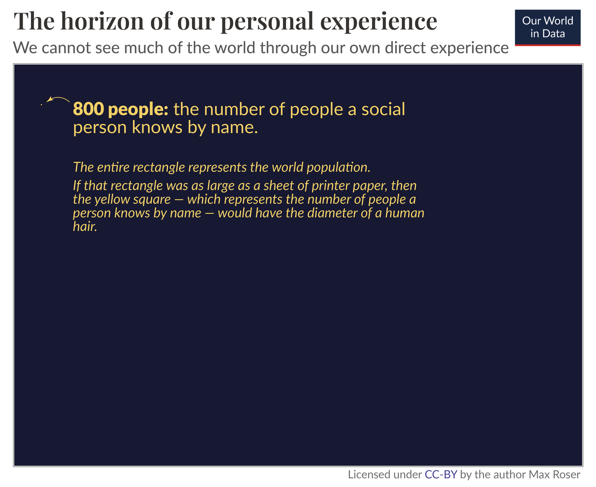
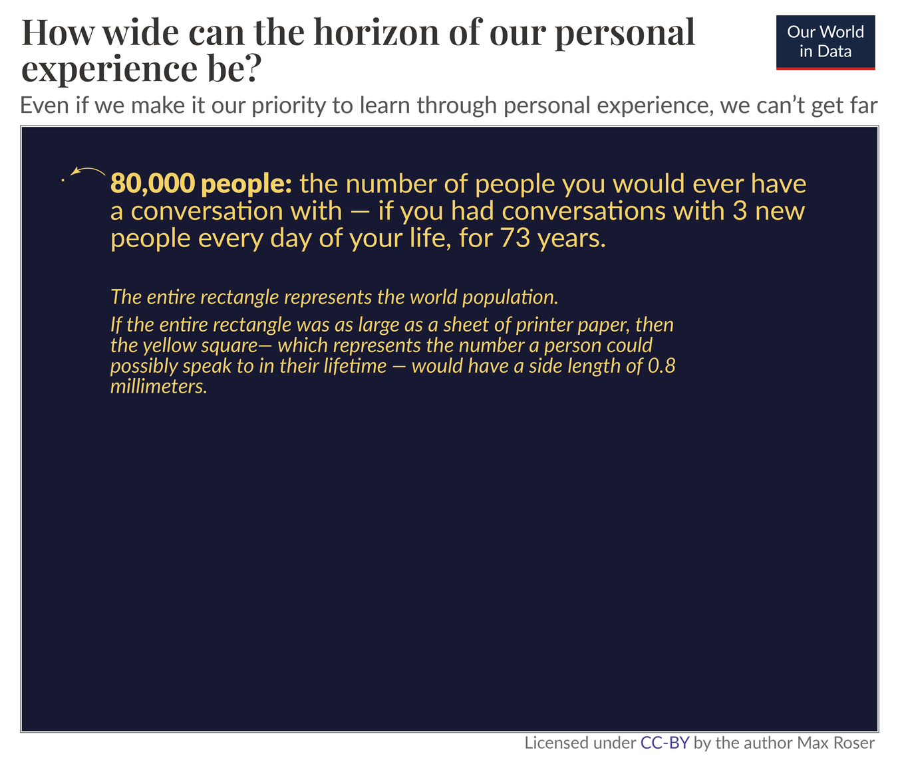
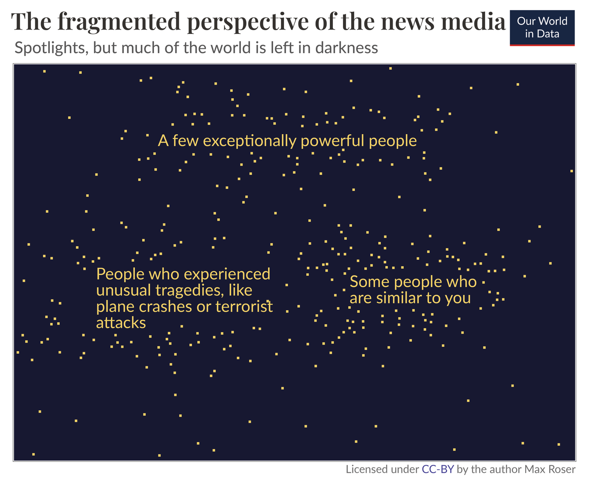
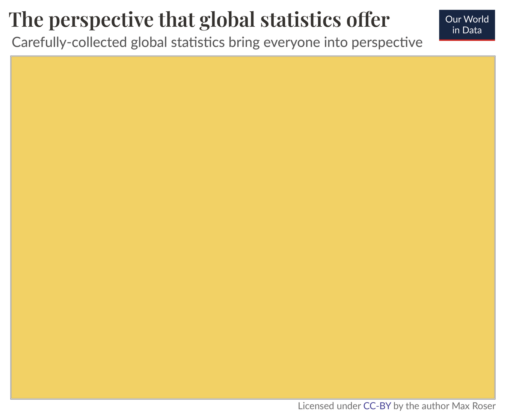

# 我们个人经验的限制与统计数据的价值

- 译文信息：
    - 原文：[https://ourworldindata.org/limits-personal-experience](https://ourworldindata.org/limits-personal-experience)
    - 作者：[Max Roser](https://ourworldindata.org/team)
    - 许可证：[CC-BY 4.0](https://creativecommons.org/licenses/by/4.0/)
    - 译者：暮光的白杨
    - 日期：2023-07-28

----

我们很容易相信，我们可以简单地依靠个人经验来加深对世界的理解。但这是错误的。世界很大，但我们只能亲身经历其中很小的一部分。要了解世界是什么样的，我们需要依赖其他手段：精心收集的全球统计数据。

当然，我们的个人交往也是我们世界观的组成部分。我们从与周围人的交往中拼凑出他们的生活图景。每当我们遇到别人，听到他们的生活，我们的世界观就多了一个角度。这是观察世界和扩展我们的理解力的好方法，我不想提出其他建议。但我想提醒我们自己，仅仅通过人际交往，我们对社会的了解是多么的有限，而统计数据在帮助我们构建其余的图景方面又是多么的宝贵。

## 我们个人经验的视野

你本人认识多少人？

让我们对“认识一个人”下一个广义的定义，即说出你所有叫得出名字的人。美国的一项研究询问了美国人知道多少人的名字，结果发现平均每人知道 611.1 个人的名字[^name]。

[^name]: [Tyler H. McCormick]，[Matthew J. Salganik]，[Tian Zheng]. How many people do you know?: Efficiently estimating personal network size.[J]. Journal of the American Statistical Association, 105(489), 59–70.

    在线阅读：<https://www.ncbi.nlm.nih.gov/pmc/articles/PMC3666355/>；免费下载：<https://www.princeton.edu/~mjs3/mccormick_salganik_zheng10.pdf>

    研究人员通过询问具有代表性的美国人口样本，了解他们认识多少拥有特定名字的人，从而得出估计结果。通过将受访者的回答与这些名字在人群中出现的频率进行比较，研究人员得出了受访者认识多少人的估计值。

    美国人认识的人数呈对数正态分布，平均网络规模为 611 人，中位数为 472 人。

[Tyler H. McCormick]: https://pubmed.ncbi.nlm.nih.gov/?term=McCormick%20TH%5BAuthor%5D
[Matthew J. Salganik]: https://pubmed.ncbi.nlm.nih.gov/?term=Salganik%20MJ%5BAuthor%5D
[Tian Zheng]: https://pubmed.ncbi.nlm.nih.gov/?term=Zheng%20T%5BAuthor%5D

假设你比普通美国人更善于社交，你认识 800 人。在全球 80 亿人口中，这意味着你认识的人占总人口的 0.00001%。十万分之一[^2]。

[^2]: 800 / 8,000,000,000 *100 = 0.00001%

很难想象这是一个多么小的分数。如果按比例绘制这幅插图，那么代表世界人口的蓝色矩形就有一张打印纸那么大，而代表一个人知道的数字的黄色正方形的直径就只有一根头发丝那么大[^3]。

[^3]: [根据维基百科]，人类头发的直径各不相同，从 17μm 到 181μm 不等。通常选择的一个标称值是 75μm。

    在我的计算中，我假设头发的直径大致在该范围的中间，直径为 79µm，占据的平方面积为 6237µm²。

    如果头发更稀疏或更浓密，或者头发更紧密或更松散，那么代表 800 人的区域就会相应地变小或变大。

    世界各地的标准打印纸有所不同（A4 在某些地区很常见，而在其他地区，信纸格式更常见）。因此，在本文中，我指的是一张打印纸。

    在我的计算中，我使用 A4 作为一张打印纸的参考格式，但这一说法同样适用于所有类似 A4 的格式（如美国的 “letter”）。这是因为“头发宽度”的合理范围很大，正如我们刚才所看到的。因此，头发稍粗，页面就会稍大。（重点是，一页打印纸和一根头发直径之间的比率大约是 10,000,000 ）。

    我是这样计算的：

    800 人与 80 亿人的比例是 1000 万。

    A4 页的尺寸为 210mm x 297mm = 62,370mm²。这代表了 80 亿人。因此，该面积的百万分之一代表 800 人：62,370 mm² /10,000,000 = 0.006237 mm² → 转换为 µm²（百万分之一平方毫米）为 6237µm²。

    6237μm² 的平方根为 78.97μm，即一根头发的宽度。

    检查计算：79μm = 0.079mm 是一根头发的直径。

    (210mm/0.079mm) x (297mm/0.079mm) = 9,993,591 = 1000 万根头发可容纳在一张A4纸上。

    或者直接：((210mm/0.079mm) x (297mm/0.079mm)) x 800 = 7,994,872,617 → 世界上的人口数量

    因此，如果矩形有 A4 页那么大，那么代表你认识的人数的正方形就有一根头发的宽度。

    ----

    或者再做一个比较： 你声称自己通过人际交往了解世界，就好比你看过一部电影的六百万分之一秒后，就声称自己了解这部电影。

    一部 2 小时的电影长度为 (2\*60\*60\*1,000,000) = 7,200,000,000 微秒。  
    <http://www.randalolson.com/2014/01/25/movies-arent-actually-much-longer-than-they-used-to-be/>

    7,200,000 微秒的 0.00001% 是 (800/8,000,000,000)*7,200,000,000 = 720微秒，也就是 0.00072 秒——即不到千分之一秒。

    根据维基百科，现在的胶片画幅长度通常为 1/24、1/25 或 1/30 秒。因此，最快的画幅（1/30）比 0.00072 秒长 45 倍。

    只有当你认识 36000 人（比 800 人多 45 倍）时，你所认识的人才能代表这部电影的一个画面。

    即使你认识的人数是普通人的 131 倍（80,000 人），也意味着你只认识世界人口的 0.001%。也就是（80,000 / 8,000,000,000 * 100），还不到那部 2 小时电影的十分之一秒（不到 3 帧）。

这就是为什么当人们根据他们从熟人那里听到的消息来谈论“如今的世界”时，我会非常怀疑。

我们无法通过我们直接的经验看到这个世界的很多东西。我们个人经验的视野非常狭窄。你每认识一个人，就有一千万个你不认识的人。

而且，你认识的人很可能与你很相似，远不能代表整个世界或你的国家。



[根据维基百科]: https://en.wikipedia.org/wiki/Hair%27s_breadth

## 我们个人经验的视野可以有多宽？

也许你认为把学习对象限制在你知道名字的人的数量上过于狭隘。毕竟，你也会从遇到的陌生人身上学习，即使你不知道他们的名字。

假设你在这方面非常出色，一生中每天都能与三个新朋友交谈。

如果你能坚持 73 年，你将认识 8 万人[^4]。

[^4]: 365.25\*3*73 = 79,989.75 = ca. 80,000

这仍然只是世界上很小的一部分。经过一生与人交谈，你将与世界人口的 0.001% 交谈过。与你交谈过的每一个人中，仍有 10 万人你从未与之交谈过。

按比例绘制的橙色正方形代表了你可能与之交谈过的人数，宽度不到 1 毫米（0.8 毫米）[^5]。

[^5]: 而实际上，你所交谈的部分甚至更小，因为在这 73 年中活着的人数将超过 80 亿。

    计算结果是 80,000 / 8,000,000,000 * 100 = 0.001%。

    如果用基长为 79 微米的正方形面积来表示 800 人，那么表示 80000 人的正方形面积就会大 100 倍。这意味着它将宽 10 倍，高 10 倍：790 微米乘 790 微米。

    790 微米是 0.79 毫米。

    检查计算：(210mm/0.79mm)\*(297mm/0.79mm)*80,000 = 7,994,872,617

    对于一部 2 小时的电影来说，它甚至还不到十分之一秒（少于 3 帧）。

我把重点放在人际交往上，这是了解他人最直接、最深入的方式，但人际交往并不是我们了解他人的唯一途径。我们还可以通过看别人的衣服、看别人的房子或听别人谈论自己的个人经验来了解他人。尽管这些经验也有帮助，但仍然不能让我们走得太远。世界很大，即使你特别细心，特别善于与人沟通和交谈，也根本不可能直接看到世界上的很多东西。



## 新闻媒体支离破碎的视角：一些焦点集中在特定人物身上，但世界的大部分却被置于黑暗之中

我们个人经验的局限并没有超越我们自己。如果我们想看到这个狭小范围之外的世界，又该如何了解这个世界呢？

我们不得不以这样或那样的方式依赖媒体。无论是电视、广播、报纸还是摄影、书籍、播客、纪录片、研究论文、统计表或社交媒体。

这个事实是如此明显，以至于人们很容易忽略它的重要性：你所听到的关于几十米之外的任何人的一切，都是通过某种形式的媒体了解到的。

这就是为什么我们选择依赖的媒体对我们了解世界如此重要。

新闻是塑造我们世界观最重要的媒体。如今，新闻常常与社交媒体交织在一起。新闻的价值在于，它能让我们看到自己狭小视野之外的世界，但新闻所提供的视角是斑驳而零碎的。

新闻报道的是**某一天**发生的不寻常的事情，但**每天**发生的事情却从未被提及。这让我们对世界的了解有失偏颇和完整；我们充斥着关于[恐怖主义]的详细新闻，却很少听到[日常悲剧]，比如每天有 16000 名儿童死亡。

[恐怖主义]: https://ourworldindata.org/terrorism#media-coverage-of-terrorism
[日常悲剧]: https://ourworldindata.org/child-mortality-big-problem-in-brief

侧面的例证形象地展示了这种支离破碎的观点。新闻关注的焦点是那些特别有权势的人或那些经历了不寻常悲剧的人。但是，在将聚光灯对准这些少数人的同时，却将世界上的大多数人置于黑暗之中。

问题不在于新闻媒体报道了什么，而在于它没有报道什么。那些被遗弃在黑暗中的人往往贫穷无力，地理位置也远离我们。我们在新闻中看到的东西远远不足以了解我们所生活的世界。



## 缺少的是：其他人——为此，我们需要全球数据

当然，听取每个人的意见是很有挑战性的。但如果我们不想留下分散且带有偏见的世界观，这就是我们必须面对的挑战。

如果我们想了解到底发生了什么，我们就必须讲述**所有的**故事。这是有可能的。统计数据可以同时讲述许多故事。

统计方法可以对整个人口得出可靠的结论。统计学是一项非凡的文化成就，它使我们能够拓宽视野，从聚光灯下的个人故事转向包括每一个人的视角。

全球经济数据可以告诉我们这个星球上[**每个人**的收入]。[全球健康数据]旨在告诉我们每个人的死因。同样，我们可以了解每个无法获得[基本电力]的人、每个无法获得[清洁饮用水]的人以及每个无法获得[基本卫生设施]的人。

[**每个人**的收入]: https://ourworldindata.org/global-economic-inequality-introduction
[全球健康数据]: https://ourworldindata.org/explorers/global-health
[基本电力]: https://ourworldindata.org/grapher/people-without-electricity-country?tab=chart
[清洁饮用水]: https://ourworldindata.org/water-access
[基本卫生设施]: https://ourworldindata.org/sanitation

全球统计数据不仅让我们看到“当今的世界”是什么样子，还让我们看到它是如何变化的。对于那些主要依靠新闻来了解世界的人来说，记录世界如何变化的统计数据往往非常令人惊讶。虽然新闻绝大多数关注的是所有出错的事情，但历史统计数据让我们也能看到哪些事情是正确的——世界取得的[巨大]的[进步]。

[巨大]: https://ourworldindata.org/child-mortality-in-the-past
[进步]: https://ourworldindata.org/a-history-of-global-living-conditions-in-5-charts

统计数据可以以我们的个人经验和新闻媒体无法做到的方式展示世界。这就是为什么我们，[Our World in Data]，依靠全球统计数据来了解世界正在如何变化。

[Our World in Data]: https://ourworldindata.org

这幅图展示了精心收集的全球统计数据的可能性：它们照亮了我们周围的整个世界，让我们能够看到每个人正在发生的事情。



## 没有数据是完美的

收集和制作良好的统计数据是一项重大挑战。数据在某些方面可能不具代表性，可能测量有误，有些数据可能完全缺失。每个依赖统计数据形成世界观的人都需要意识到这些缺陷。

我们在 “Our World in Data” 的目标是展示现有的最佳数据，同时强调其不足之处。最重要的工作首先由收集和发布全球数据库的统计人员完成。我们的职责是使他们的工作易于获取和理解。为了实现这一目标，我们与专家交谈，阅读科学文献，分析现有数据，从而突出现有的最佳统计数据，并强调即使是最佳数据也存在的不足之处。

## 对世界的统计理解应成为我们文化的核心内容

我并不想说依靠个人经验或新闻来了解世界是个坏主意。每一种了解世界的方式都有其价值。关键在于我们如何将它们结合起来：只有个人互动才能给我们带来的深入了解，新闻提供的对强大和不寻常事物的关注，以及让我们有机会看到每个人的统计视角。

我们有多种了解世界的方式，我们应该利用所有这些方式。没有个人经验的统计观点缺乏深度，没有统计知识的个人经验缺乏视角。

问题在于，我们的注意力大多集中在个人经验和新闻上。它们备受推崇，而统计则被搁置在我们文化的一个小角落里。这不是它们的归属。一个渴望关爱每一个人的社会，需要将对世界的统计理解带入其文化的中心。

为此，我们需要记住统计数字的真正含义。电子表格不仅仅是数字，它还能告诉我们周围人们的真实情况，让我们能够一目了然地看到发生在每个人身上的事情。

---

<strong>这与我们的使命的关系：</strong><em>我关注的是我们对全球的理解，但在较小的范围内也是如此。要了解我们自己的国家、我们自己的城市是什么样的，我们需要统计数据。这些统计数据是存在的，但它们往往既不容易获取，也不容易理解。它们埋藏在电子表格中，隐藏在付费墙后，以学术术语呈现。

我们（Our World in Data）的使命就是改变这种状况，让每个人都能获取和理解了解我们社会所需的统计数据。→ 了解更多关于[我们的使命]的信息。</em>

[我们的使命]: https://ourworldindata.org/problems-and-progress

----

**致谢：**感谢 Hannah Ritchie、Natasha Ahuja、Ike Saunders、Edouard Mathieu、Esteban Ortiz-Ospina 和 Bastian Herre 对本文草稿和可视化效果提出的有益意见。

---


<center><strong>引用这个作品</strong></center>

我们的文章和数据可视化依赖于许多不同的人和组织的工作。引用本主题页面时，请同时引用底层数据源。该主题页面可以引用为：

```
Max Roser (2023) - "The limits of our personal experience and the value of statistics". Published online at OurWorldInData.org. Retrieved from: 'https://ourworldindata.org/limits-personal-experience' [Online Resource]
```

BibTeX 引用：

```
@article{owid-limits-personal-experience,
    author = {Max Roser},
    title = {The limits of our personal experience and the value of statistics},
    journal = {Our World in Data},
    year = {2023},
    note = {https://ourworldindata.org/limits-personal-experience}
}
```