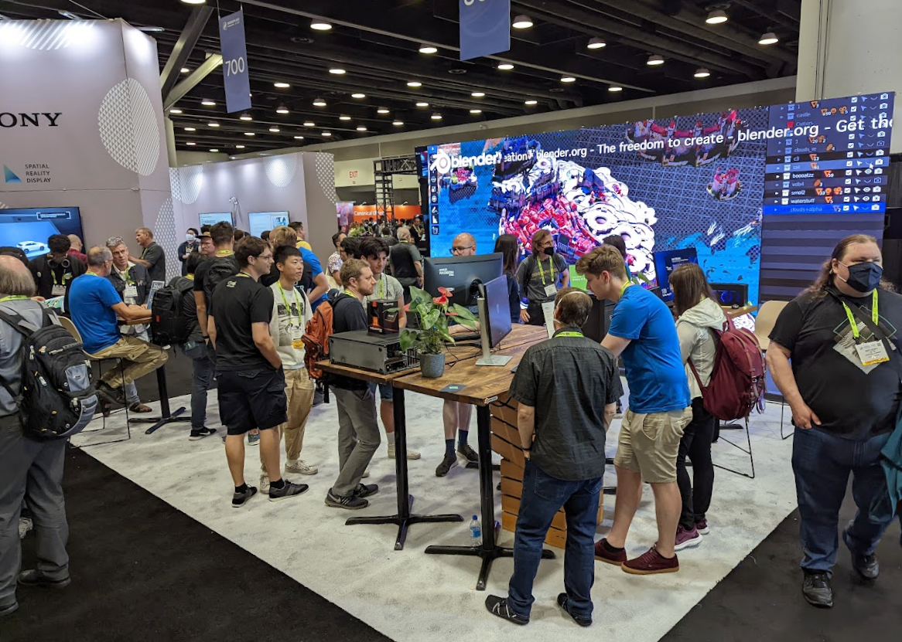
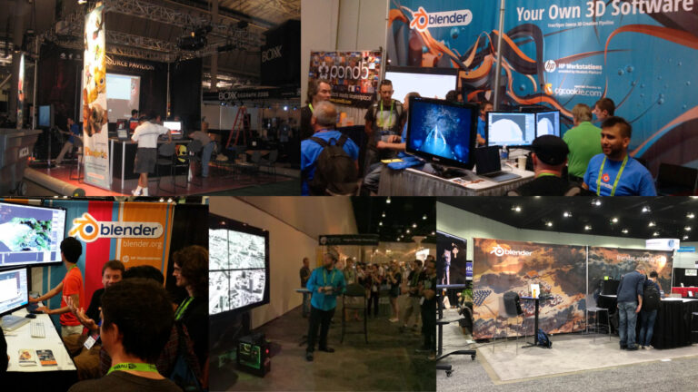
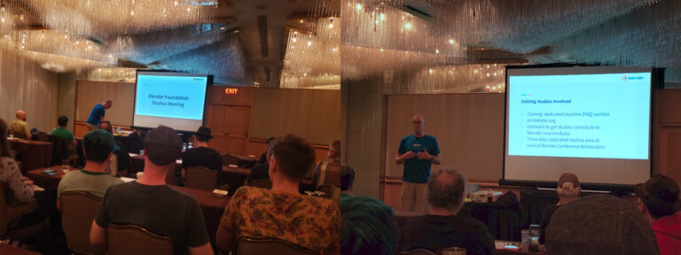
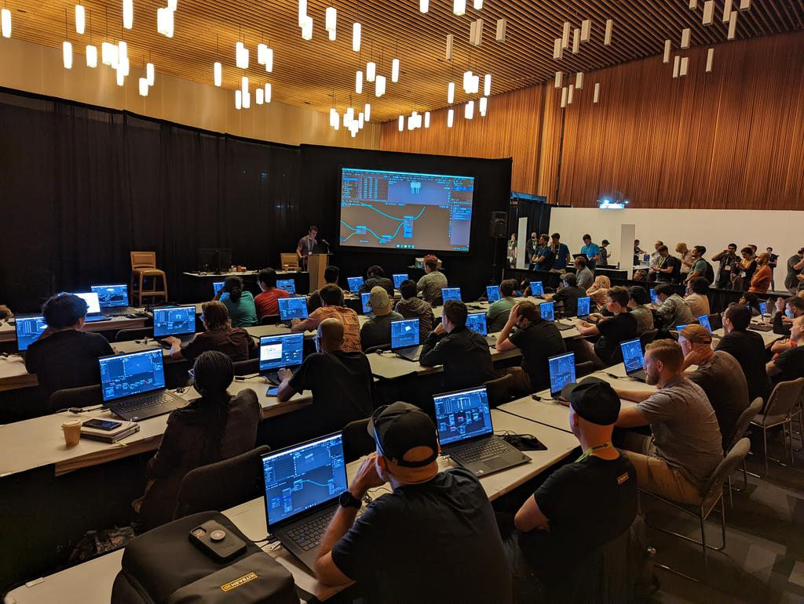

# Blender SIGGRAPH 2022 展会报告

## 作品信息

- 原文：[SIGGRAPH 2022 Report](https://www.blender.org/media-exposure/siggraph-2022-report/)
- 作者：[FRANCESCO SIDDI](https://www.blender.org/author/fsiddi/)
- 许可证：[CC-BY-SA 3.0](https://creativecommons.org/licenses/by-sa/3.0/)
- 译者：暮光的白杨
- 日期：2022-08-27

----

## 正文

经过 2 年的中断，Blender 回到了温哥华的 [SIGGRAPH](https://www.siggraph.org/)（计算机图形学与交互技术特别兴趣小组）！多年来，Ton 一直在分享关于前几届活动的精彩故事和见解。这一次，为了庆祝我的第一个 SIGGRAPH 10 周年，我会试一试。

### 前台和中心

我们第一次能够将 Blender 展位从展会的边缘移到展会的中间。得益于包括 4 个吧台、一些植物、3 个演示工作站和一个巨大的 LED 墙，可以不间断地播放 Blender 影片的简单的布局，我们的展位很容易辨认，引人注目并吸引了许多人。

!!! info "展位实景"
      
    Blender SIGGRAPH 2022 站台。由 Jacques Lucke 拍摄。  
      
    多年来（2006、2013、2015、2017、2019）的 Blender 展位。图片来源：Andy Goralczyk Andrew Price、OpenVisualFX 和 architosh）

来自欧洲的超过 10 人的代表团，加上一些当地的帮助，展位总是人满为患，全天候进行许多有趣的对话和演示。每天都有数百人前来打招呼、重新联系或了解 Blender。

与过去的 SIGGRAPH 展会相比，现在几乎没有人再问这个不讨喜的问题：“你是如何赚钱的？”。 相反，许多人说：“谢谢”。有人从 2.8 天以前才开始使用 Blender。也有人在上高中和大学期间就已经接触到 Blender 并使用了 10 年以上，现在在工作室工作或作为内容创作者工作，这要归功于他们在 Blender 中磨练出来的技能。有时他们不能在工作中使用 Blender，但这是他们个人工作的首选工具。许多人认识到 Blender 在帮助他们达到目标方面发挥了重要作用。

许多工作室，包括大型工作室，也成功地使用了 Blender，并正在考虑在他们的工作流中进一步采用它。

最后，Ton 因子。Ton 是一个步行（或站立）的地标，人们从远处走来，请求拍照和握手，分享感激之情。看的很开心。:)

<iframe width="711" height="396" src="https://www.youtube.com/embed/9G9I4WFe3B0" title="Blender @ SIGGRAPH 2022" frameborder="0" allow="accelerometer; autoplay; clipboard-write; encrypted-media; gyroscope; picture-in-picture" allowfullscreen></iframe>

### 特别兴趣小组会议

按照传统，Blender 基金会组织了一个公开的（~~物以类聚~~）特别兴趣小组 (SIG)，专注于分享 Blender 项目正在进行的活动、收集反馈并提供交流机会。来自科技公司和工作室的各种个人、教师、研究人员和开发人员参加了此次活动。许多人表达了对 Blender 未来路线图的极大兴趣。

!!! info "Blender SIG"
      
    由 jer.bot.net 拍摄  

### 其他活动

在 SIG 和会展展位旁边，我们设置了更多活动：关于美元的专门会议和几何节点演示会议。

!!! info "几何节点演示会议"
      
    由 Orange Turbine 拍摄  

这两项活动都很成功，帮助人们更好地与 Blender 团队和项目建立联系。 几何节点演示会议非常受欢迎，座无虚席，甚至还有人在外面等着！

### 开发赞助联系

最后，由于现场活动是亲自见面的好机会，我们与 Blender 发展基金赞助商举行了几次战略会议。总体而言，对 Blender 状态的反馈是积极的，通过发展基金提供的支持被认为是一项非常好的投资。我们还与一些动画工作室就加入发展基金的话题进行了初步对话。种子已经种下！

### Blender 在电影工业

每当与在中/大型动画或 VFX 工作室工作的人进行非正式交谈时，都会出现以下一个或多个主题：

- Blender 被愉快地用作生产流程的一部分；
- Blender 用于艺术创作过程的关键部分，因为它比任何其他软件做得更好；
- 除非 Blender 添加功能 X，否则我们不会在生产中使用它；
- Blender 需要坚持 VFX 参考平台！
- 我们已经使用了 Blender，但我们不能谈论细节。

所有这些话题都很有趣，为了与电影业建立更有效的合作，还有很多工作要做。这可以通过让工作室有效地参与到 Blender 项目中来实现，同时确保工作室感到有能力直接拥有和解决问题。

### 趋势

美元、人工智能和元宇宙是几个对话中的热门话题。 此时此刻，对元宇宙所代表的烟与镜最实用的翻译，就是协作。从架构和数据结构的角度来看，这可以进一步解释为使内容创建过程和工作流更具交互性和互操作性。

协作和内容共享的主题也是 Blender 项目旨在调查的内容；我们坚持自由和开源原则，通过创建社区（自下而上）而不是公司（自上而下）来创建一些东西。

### Blender 适用于艺术家

总的来说，这次 SIGGRAPH 是一次积极的体验。Blender 非常受喜爱，尤其是个人和小团队，他们因 Blender 提供的自由创作而真正茁壮成长。期待我们下一次盛大的聚会：[Blender Conference 2022](https://conference.blender.org/2022/)！