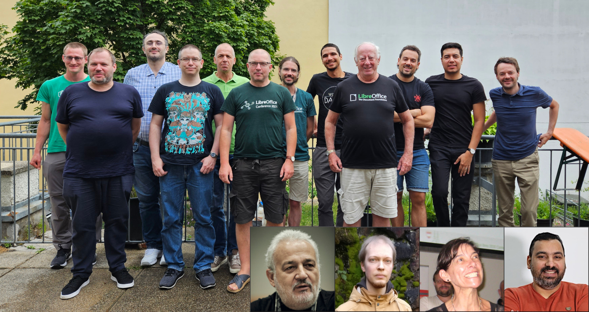
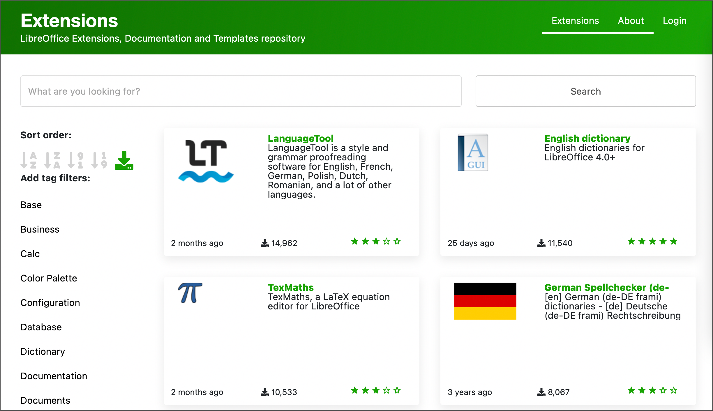

# LibreOffice 项目和社区月度总结：2023 年 7 月

- 译文信息：
    - 原文： [LibreOffice project and community recap: July 2023](https://blog.documentfoundation.org/blog/2023/08/02/libreoffice-project-and-community-recap-july-2023/)
    - 作者：[Mike Saunders](https://blog.documentfoundation.org/blog/author/mikesaunders/)
    - 许可证：[CC-BY-SA 3.0](https://creativecommons.org/licenses/by-sa/3.0/)
    - 译者：暮光的白杨
    - 日期：2023-08-02

---

{ width=60% }

以下是过去四个星期 LibreOffice 项目的更新、事件和活动的摘要 - 单击链接了解更多信息……

- 七月初，我们[欢迎 Michael Weghorn] 加入文档基金会（LibreOffice 背后的非营利组织）。迈克尔是一名开发人员，最初将专注于[可访问性]的改进。

[欢迎 Michael Weghorn]: https://blog.documentfoundation.org/blog/2023/07/04/welcome-michael-weghorn-new-developer-at-tdf/
[可访问性]: https://www.libreoffice.org/get-help/accessibility/

{ width=75% }

- TDF 团队的讨论：TDF 团队成员于 6 月份在慕尼黑会面，讨论社区和软件的想法和建议。他们讨论了很多主题——现在我们[已经上传了会议报告]。看看并让我们知道你的想法！

[已经上传了会议报告]: https://community.documentfoundation.org/t/report-from-in-person-team-meeting-in-munich/11437

{ width=75% }

- 更多来自基金会的消息：负责管理会员申请和续费的会员委员会（MC）[宣布采用名为 Proteus 的新会员管理系统]。

[宣布采用名为 Proteus 的新会员管理系统]: https://blog.documentfoundation.org/blog/2023/07/17/tdfs-membership-committee-announces-a-new-membership-management-system-proteus/

- 与此同时，我们的文档和本地化社区也做了大量工作：他们[更新了 LibreOffice 7.5 入门指南]，并[完成了 LibreOffice 7.4 绘图指南的捷克语翻译]。真是太棒了!

[更新了 LibreOffice 7.5 入门指南]: ./tdf-libreoffice-7.5-new-guideline.md
[完成了 LibreOffice 7.4 绘图指南的捷克语翻译]: https://blog.documentfoundation.org/blog/2023/07/28/czech-translation-of-libreoffice-draw-guide-7-4-and-more-news/

{ width=60% }

- 我们在 7 月份发布了一个版本：[LibreOffice 7.5.5]。这是 LibreOffice 7.5 分支的第五个维护版本，建议所有用户获取更新。

[LibreOffice 7.5.5]: ./tdf-libreoffice7.5.5-released.md

{ width=90% }

- 最后：我们的[扩展和模板网站得到了一系列改进]，这要归功于 TDF 新的 Web 开发人员 Juan José González（又名“JJ”）。

[扩展和模板网站得到了一系列改进]: ./tdf-the-new-goodie-site.md

{ width=90% }

保持联系 - 在 [Mastodon]、[Twitter] 和 [Facebook] 上关注我们。喜欢我们的工作吗？[请捐款支持我们的社区] - 或加入我们，[帮助 LibreOffice 变得更好]！

[Mastodon]: https://fosstodon.org/@libreoffice
[Twitter]: https://twitter.com/libreoffice
[Facebook]: https://www.facebook.com/libreoffice.org
[请捐款支持我们的社区]: https://www.libreoffice.org/donate/
[帮助 LibreOffice 变得更好]: https://www.libreoffice.org/community/get-involved/