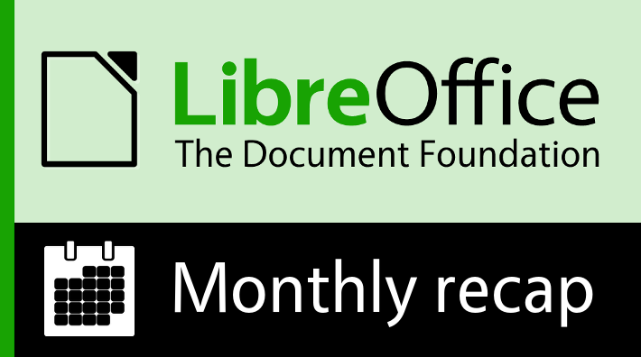
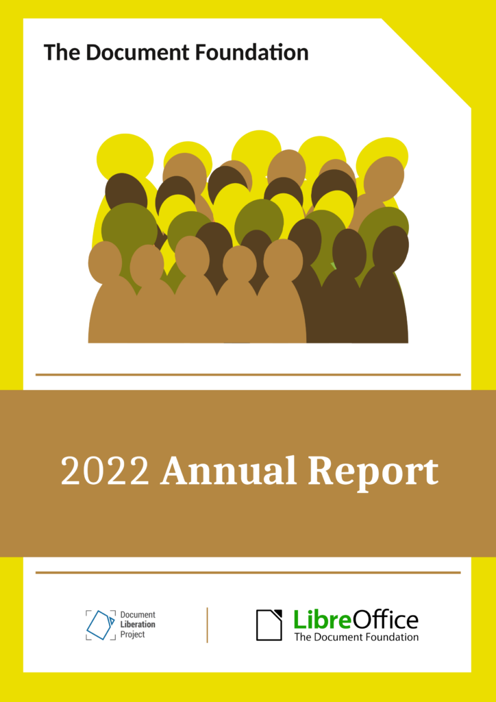
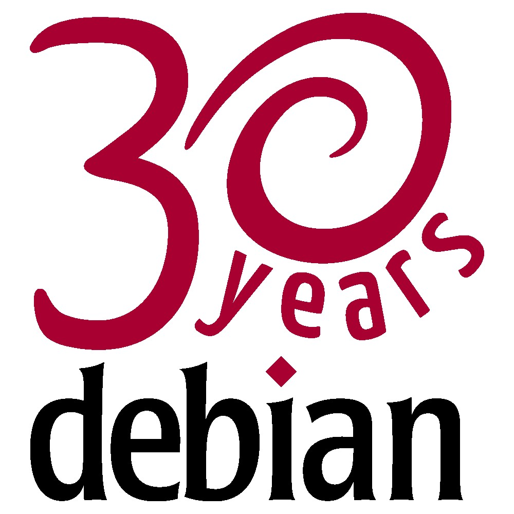
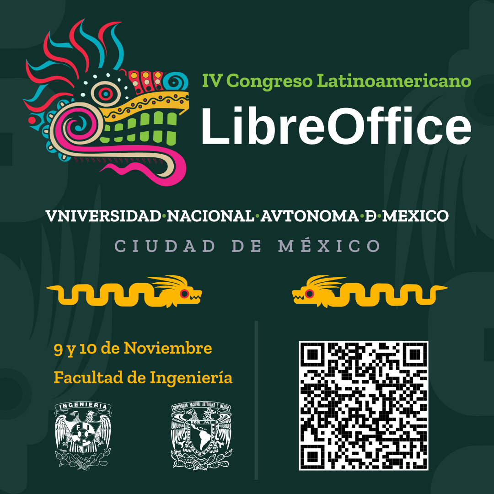

# LibreOffice 项目和社区月度总结：2023 年 8 月

- 译文信息：
    - 原文： [LibreOffice project and community recap: August 2023](https://blog.documentfoundation.org/blog/2023/09/04/libreoffice-project-and-community-recap-august-2023/)
    - 作者：[Mike Saunders](https://blog.documentfoundation.org/blog/author/mikesaunders/)
    - 许可证：[CC-BY-SA 3.0](https://creativecommons.org/licenses/by-sa/3.0/)
    - 译者：暮光的白杨
    - 日期：2023-09-05

---

{ width=60% }

以下是过去四个星期 LibreOffice 项目的更新、事件和活动的摘要——单击链接了解更多信息……

- 我们在八月初就发布了[《TDF 2022 年年度报告》的完整版本]。文档基金会是 LibreOffice 背后的非营利实体，我们的报告重点介绍了上一年的社区和项目活动。请下载阅读此报告！

[《TDF 2022 年年度报告》的完整版本]: ./tdf-2022-annual-report.md

{ width=75% }

- 接下来是 [LibreOffice 文档团队的双重礼物]：Impress Guide 7.5 和 Draw Guide 7.5。非常感谢所有帮助更新指南的人 👍

[LibreOffice 文档团队的双重礼物]: ./tdf-draw-impress-guide-7.5.md

{ width=75% }

- 我们的母语社区使用 Weblate 来翻译 LibreOffice 的用户界面。感谢捐赠，文档基金会能够[资助一些 Weblate 改进]，以帮助所有用户。

[资助一些 Weblate 改进]: ./tdf-weblate.md

{ width=75% }

- Debian 项目由 Ian Murdock 于 30 年前的 1993 年 8 月 16 日正式创立。Debian 社区每年的这一天都会庆祝其生日，即 Debian Day。[我们与他们一起庆祝了 30 周年]，因为他们是从第一天起支持 LibreOffice 项目的组织之一。

[我们与他们一起庆祝了 30 周年]: https://blog.documentfoundation.org/blog/2023/08/16/debian-day/

{ width=75% }

- 8 月份最大的新闻是 [LibreOffice 7.6 的发布]，其中包含大量新功能和更新。非常感谢所有为本次发布做出贡献的社区成员、开发者和生态系统公司！ 😊

[LibreOffice 7.6 的发布]: ./tdf-libreoffice-7.6.md

{ width=75% }

- 我们通过[宣布第四届 LibreOffice 拉丁美洲会议]来结束这个月。会议将于 11 月 9 日（星期四）和 10 日（星期五）在墨西哥城墨西哥国立自治大学工程学院举行。加入我们吧！

[宣布第四届 LibreOffice 拉丁美洲会议]: https://blog.documentfoundation.org/blog/2023/08/30/announcing-the-fourth-edition-of-the-libreoffice-latin-america-conference/

{ width=75% }

保持联系 - 在 [Mastodon]、[Twitter] 和 [Facebook] 上关注我们。喜欢我们的工作吗？[请捐款支持我们的社区] - 或加入我们，[帮助 LibreOffice 变得更好]！

[Mastodon]: https://fosstodon.org/@libreoffice
[Twitter]: https://twitter.com/libreoffice
[Facebook]: https://www.facebook.com/libreoffice.org
[请捐款支持我们的社区]: https://www.libreoffice.org/donate/
[帮助 LibreOffice 变得更好]: https://www.libreoffice.org/community/get-involved/