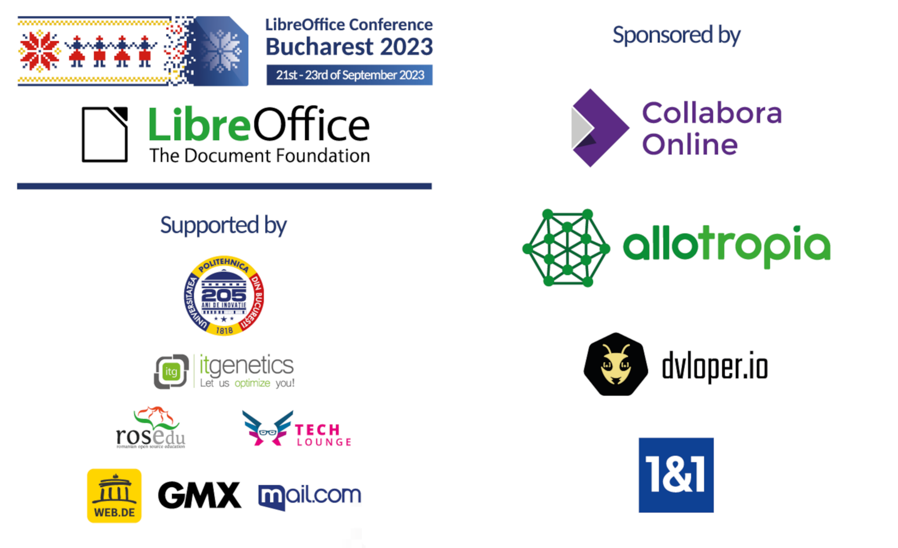

# LibreOffice 项目和社区月度总结：2023 年 9 月

- 译文信息：
    - 原文： [LibreOffice project and community recap: August 2023](https://blog.documentfoundation.org/blog/2023/09/04/libreoffice-project-and-community-recap-august-2023/)
    - 作者：[Mike Saunders](https://blog.documentfoundation.org/blog/author/mikesaunders/)
    - 许可证：[CC-BY-SA 3.0](https://creativecommons.org/licenses/by-sa/3.0/)
    - 译者：暮光的白杨
    - 日期：2023-10-03

---

以下是过去四个星期 LibreOffice 项目的更新、事件和活动的摘要——单击链接了解更多信息……

- 我们在本月伊始就[重点介绍了即将举行的活动]：LibreOffice Conference 2023（现已结束——稍后会详细介绍）；拉丁美洲会议和 LibreOffice Conf.Asia。

[重点介绍了即将举行的活动]: https://blog.documentfoundation.org/blog/2023/09/05/big-events-coming-up-in-the-libreoffice-community/

{ width=75% }

- 接下来，我们准备了一堆 [LibreOffice Expert] 杂志赠送给学校和当地社区。现在它们都已被认领，但如果你仍然想要一份副本，可以从出版商那里获取一份。

[LibreOffice Expert]: https://blog.documentfoundation.org/blog/2023/09/06/new-libreoffice-expert-magazines-available-for-schools-and-communities/

{ width=75% }

- 9 月 11 日，我们宣布新的 LibreOffice 7.6 系列[下载量达到 150 万次]！我们还有更多统计数据可以分享……

[下载量达到 150 万次]: ./tdf-1.5million.md

{ width=75% }

- 然后我们的文档社区[发布了 LibreOffice Writer Guide 7.6]——该软件的重要配套资料。大家辛苦了😊

[发布了 LibreOffice Writer Guide 7.6]: https://blog.documentfoundation.org/blog/2023/09/12/writer-guide-7-6-is-ready-for-you/

{ width=40% }

- 今年，LibreOffice 再次成为谷歌编程之夏（GSoC）的指导组织，这是一个全球计划，致力于让更多学生开发人员参与自由开源软件开发。五个项目顺利完成。学生和导师很享受这段时光，[我们展示了一些成果]，这些成果应该会在 2024 年 2 月上旬进入 LibreOffice 24.2！

[我们展示了一些成果]: ./tdf-gsoc-2023.md

{ width=75% }

- 9 月份最大的活动是在罗马尼亚的布加勒斯特举行的 [LibreOffice Conference 2023]。我们度过了一段美好的时光，举办了演讲、研讨会和社交聚会——未来几周我们将在这个博客上发布更多内容（包括演示视频）！

[LibreOffice Conference 2023]: https://blog.documentfoundation.org/blog/2023/09/16/libreoffice-conference-2023-in-bucharest/

{ width=75% }

- 最后，我们[发布了 LibreOffice 7.6.2 和 7.5.7]，这是带有安全修复的重要更新。建议所有用户更新。

[发布了 LibreOffice 7.6.2 和 7.5.7]: https://blog.documentfoundation.org/blog/2023/09/26/lo-762-and-lo-757/

{ width=30% }

