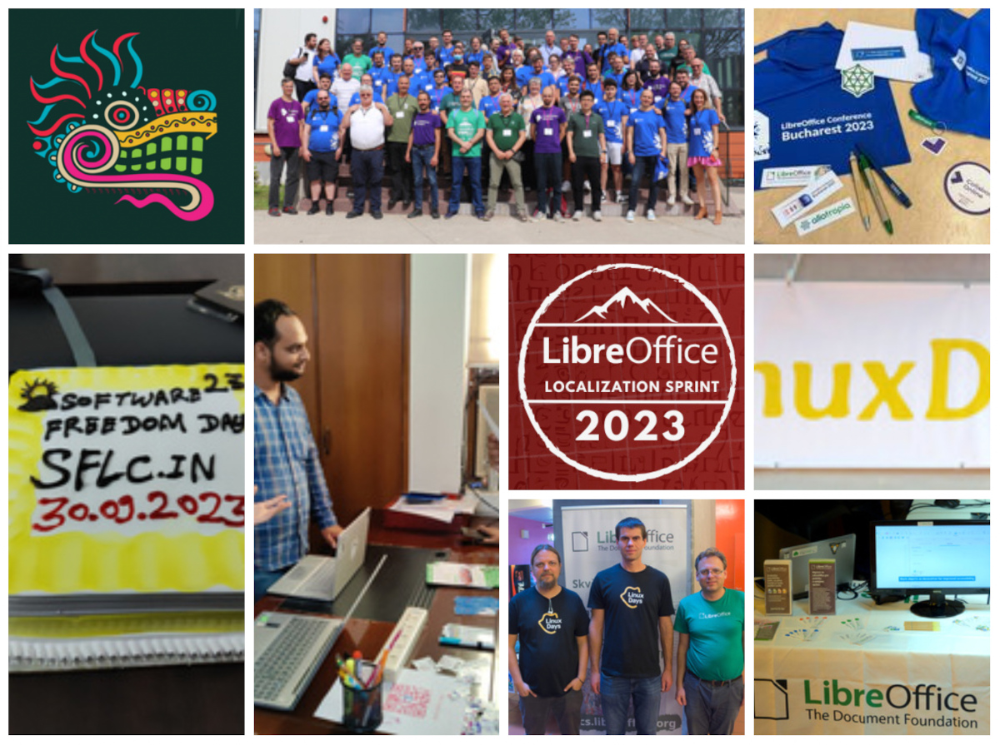
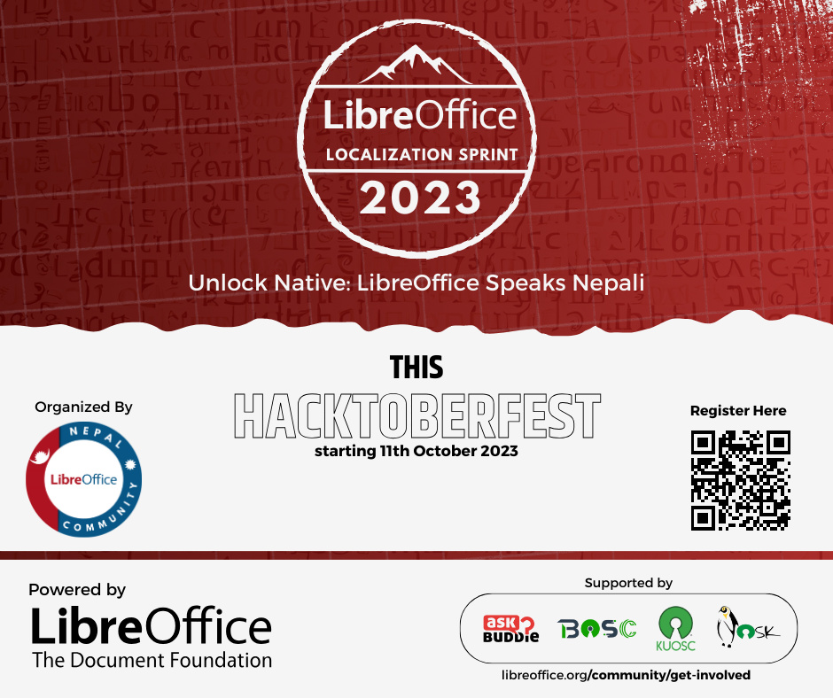
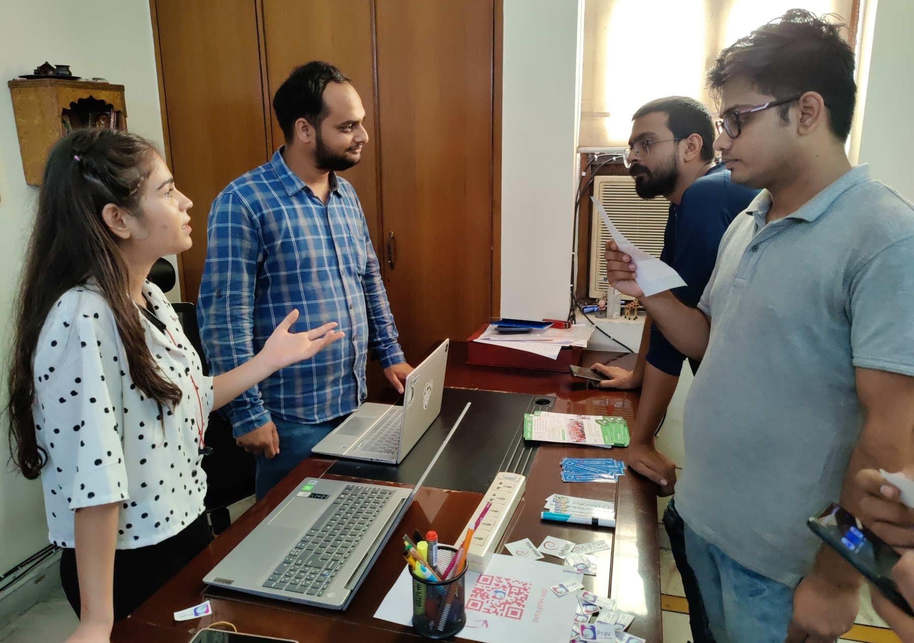
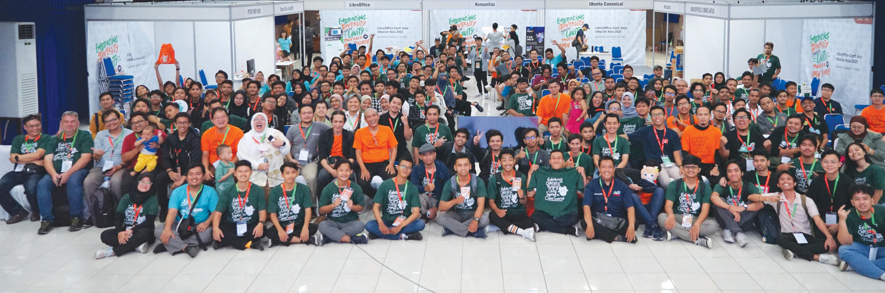
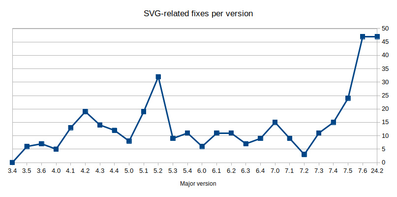

# LibreOffice 项目和社区月度总结：2023 年 10 月

- 译文信息：
    - 原文： [LibreOffice project and community recap: October 2023](https://blog.documentfoundation.org/blog/2023/10/31/libreoffice-project-and-community-recap-october-2023/)
    - 作者：[Mike Saunders](https://blog.documentfoundation.org/blog/author/mikesaunders/)
    - 许可证：[CC-BY-SA 3.0](https://creativecommons.org/licenses/by-sa/3.0/)
    - 译者：暮光的白杨
    - 日期：2023-11-01

---

以下是过去四个星期 LibreOffice 项目的更新、事件和活动的摘要——单击链接了解更多信息……

- 本月初，我们宣布了 [2023 年 LibreOffice 尼泊尔语本地化短跑比赛]，该活动于 10 月 11 日开始。活动的目标是鼓励开源社区和大学学生俱乐部做出贡献。我们期待最终成果！

{ width=75% }

[2023 年 LibreOffice 尼泊尔语本地化短跑比赛]: https://blog.documentfoundation.org/blog/2023/10/06/libreoffice-nepali-localization-sprint/

- 本月，我们编辑并上传了最近在罗马尼亚的布加勒斯特举行的 [LibreOffice Conference 2023 的视频]。大多数视频（共 37 个视频）现已上线，更多视频准备上线，敬请期待。（我们还发布了会议的快速回顾。）

[LibreOffice Conference 2023 的视频]: https://blog.documentfoundation.org/blog/2023/10/08/first-batch-of-videos-from-the-libreoffice-conference-2023/

<iframe width="508" height="450" src="https://www.youtube.com/embed/O0nwnsRRZJY?list=PL0pdzjvYW9REpoqsxpmA4yxAHVU-Z2f9U" title="Opening session - LibreOffice Conference 2023" frameborder="0" allow="accelerometer; autoplay; clipboard-write; encrypted-media; gyroscope; picture-in-picture; web-share" allowfullscreen></iframe>

- 接下来，我们[汇报了 LibreOffice 在印度德里软件自由法律中心的活动情况]。来自德里各地的自由软件爱好者参加了此次活动。

[汇报了 LibreOffice 在印度德里软件自由法律中心的活动情况]: https://blog.documentfoundation.org/blog/2023/10/12/libreoffice-at-the-software-freedom-law-centre-in-india/

{ width=75% }

- 然后是另一份活动报告：[LibreOffice 参加了在布拉格举行的 LinuxDays 2023]！今年的会议更加令人期待，因为它是在 COVID-19 病毒爆发四年之后举办的。

[LibreOffice 参加了在布拉格举行的 LinuxDays 2023]: https://blog.documentfoundation.org/blog/2023/10/16/libreoffice-at-linuxdays-2023-in-prague/

{ width=75% }

- 另外还有取得巨大成功的 [LibreOffice Conf. Asia 2023]，演讲者和与会者来自世界各地。

[LibreOffice Conf. Asia 2023]: https://blog.documentfoundation.org/blog/2023/10/23/libreoffice-conf-asia-2023-report-and-summary/

{ width=75% }

- 现在，我们期待着将于 2023 年 11 月 9 日至 10 日在墨西哥城的墨西哥国立自治大学举行的 [2023 年拉丁美洲 LibreOffice 会议]。届时见！

<iframe width="508" height="450" src="https://www.youtube.com/embed/1-rASEYjYiE" title="IV Congreso Latinoamericano de LibreOffice 2023" frameborder="0" allow="accelerometer; autoplay; clipboard-write; encrypted-media; gyroscope; picture-in-picture; web-share" allowfullscreen></iframe>

[2023 年拉丁美洲 LibreOffice 会议]: https://blog.documentfoundation.org/blog/2023/10/26/join-us-in-mexico-city-for-the-latin-america-libreoffice-conference-2023/

- 最后，我们的 QA 社区在他们的博客上[发布了有关 SVG 支持改进的内容]，以及与 Inkscape 社区在互操作性方面的合作。

[发布了有关 SVG 支持改进的内容]: https://qa.blog.documentfoundation.org/2023/10/30/qa-weekly-focus-svg/

{ width=75% }

保持联系 - 在 [Mastodon]、[Twitter] 和 [Facebook] 上关注我们。喜欢我们的工作吗？[请捐款支持我们的社区] - 或加入我们，[帮助 LibreOffice 变得更好]！

[Mastodon]: https://fosstodon.org/@libreoffice
[Twitter]: https://twitter.com/libreoffice
[Facebook]: https://www.facebook.com/libreoffice.org
[请捐款支持我们的社区]: https://www.libreoffice.org/donate/
[帮助 LibreOffice 变得更好]: https://www.libreoffice.org/community/get-involved/