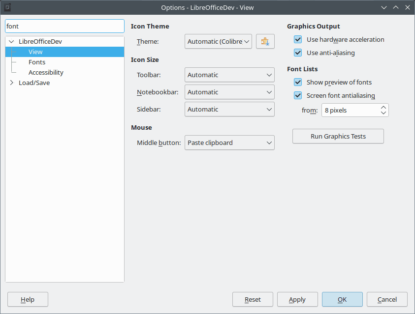

# LibreOffice 与谷歌编程之夏 2023：活动成果

- 译文信息：
    - 原文： [LibreOffice and Google Summer of Code 2023: The results](https://blog.documentfoundation.org/blog/2023/09/15/libreoffice-and-google-summer-of-code-2023-the-results/)
    - 作者：[Ilmari Lauhakangas](https://blog.documentfoundation.org/blog/author/buovjaga/)
    - 许可证：[CC-BY-SA 3.0](https://creativecommons.org/licenses/by-sa/3.0/)
    - 译者：暮光的白杨
    - 日期：2023-09-21

---

{ width=70% }

LibreOffice 今年再次成为[谷歌编程之夏]（GSoC）的指导组织，这是一个致力于让更多学生开发人员参与自由与开源软件开发的全球计划。学生和导师度过了愉快的时光，并顺利完成了五个项目。我们会在此文中展示一些成果，这些成果应该会在 2024 年 2 月上旬进入 [LibreOffice 24.2]！

[谷歌编程之夏]: https://summerofcode.withgoogle.com/archive
[LibreOffice 24.2]: https://wiki.documentfoundation.org/ReleaseNotes/24.2

你可以通过使用[每日构建]来体验新功能，并在我们的错误跟踪器中[报告任何问题]。

[每日构建]: https://wiki.documentfoundation.org/QA/Testing_Daily_Builds
[报告任何问题]: https://wiki.documentfoundation.org/QA/BugReport

## 改善 LibreOffice 中的 OpenPGP 加密体验，作者：Ahmed Gamal Eltokhy

**导师：Thorsten Behrens ([allotropia])、Heiko Tietze ([TDF])、Hossein Nourikhah (TDF)**

通过使用 [gpg4win]、[GPGTools] 和 [gnupg] 等外部应用程序，LibreOffice 可以使用 OpenPGP 公钥加密技术加密文档。多亏了 Ahmed 的工作，现在管理和搜索密钥变得更容易了，浏览大型密钥环的速度也更快了。

[allotropia]: https://www.allotropia.de/
[TDF]: https://www.documentfoundation.org
[gpg4win]: https://www.gpg4win.org/
[GPGTools]: https://gpgtools.org/
[gnupg]: https://gnupg.org/

[请在最终报告中了解有关加密体验改进的更多信息。](https://tokiesan.github.io/blogposts/gsoc/final_report.html)

## 基于机器学习选择在 gerrit 补丁上运行的测试，作者：Baole Fang

**导师：Thorsten Behrens ([allotropia])、Stéphane Guillou (TDF)、Christian Lohmaier (TDF)**

这个项目的灵感来自 [Mozilla 在火狐浏览器持续集成方面的工作]。现在已经有一个系统可以预测提交的代码变更测试失败的可能性，并决定以最有效的方式构建变更。由于这种机制对每个人来说都非常新颖，因此我们预计后续还会有很多调整。

[Mozilla 在火狐浏览器持续集成方面的工作]: https://hacks.mozilla.org/2020/07/testing-firefox-more-efficiently-with-machine-learning/

[请在最终报告中了解有关机器学习项目的更多信息。](https://baolef.github.io/libreoffice-ci/)

## 选项中的搜索字段，作者：Bayram Çiçek

**导师：Andreas Heinisch、Heiko Tietze (TDF)**

{ width=85% }

如今，在应用程序中搜索选项已成为相当标准的做法，因此 LibreOffice 是时候学习如何做到这一点了！

[请在最终报告中了解有关搜索功能的更多信息。](https://bayramcicek.github.io/libreoffice-dev/2023/08/26/final-report-2023-gsoc.html)

## 将 Writer 的 Java UNO API 测试转换为 C++，作者：Dipam Turkar

**导师：Tomaž Vajngerl ([Collabora])、Xisco Faulí (TDF)**

[Collabora]: https://www.collaboraoffice.com/

这里的想法是减少 LibreOffice 构建过程中对 Java 的依赖。Writer 的一半测试已转换。

[请在最终报告中了解有关测试转换项目的更多信息。](https://medium.com/@dipamt1729/google-summer-of-code-2023-wrapping-up-an-incredible-journey-42464aaaec4c)

## 添加 APNG 导入/导出支持，作者：Paris Oplopoios

**导师：Tomaž Vajngerl ([Collabora])**

APNG 是[动态可移植网络图形]的缩写。它不是 PNG 的官方扩展，但目前在网络浏览器中得到了广泛的支持。感谢 Paris 的工作，LibreOffice 现在完全支持这种格式。

[动态可移植网络图形]: https://en.wikipedia.org/wiki/APNG

[请在最终报告中了解有关 APNG 功能的更多信息。](https://offtkp.github.io/GSoC23FE/)

## 结语

非常感谢所有利用暑假时间改进 LibreOffice 的贡献者。你们太棒了！还要特别感谢那些总是为这些任务投入大量热情和精力的导师们。这就是 LibreOffice 的魅力所在。

我们现在期待着明年的 GSoC。如果你对此感兴趣，为什么不早作准备呢？要了解更多信息，请访问[维基页面]，其中[列出了一些想法]。

[维基页面]: https://wiki.documentfoundation.org/Development/GSoC
[列出了一些想法]: https://wiki.documentfoundation.org/Development/GSoC/Ideas

参加 GSoC 是培养技能、向未来雇主展示自己能力的好方法！