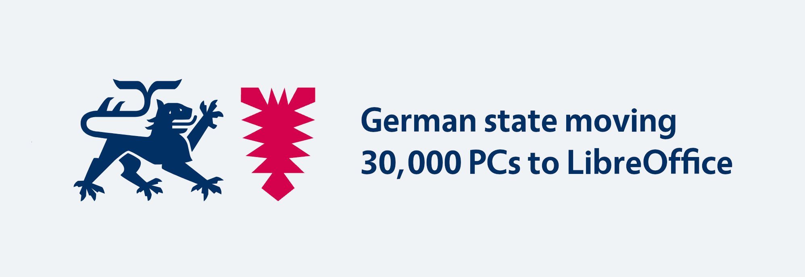

# 德国将 3 万台个人电脑迁移至 LibreOffice

- 译文信息：
  - 原文：[German state moving 30,000 PCs to LibreOffice](https://blog.documentfoundation.org/blog/2024/04/04/german-state-moving-30000-pcs-to-libreoffice//)
  - 作者：[Mike Saunders](https://blog.documentfoundation.org/blog/author/mikesaunders/)
  - 许可证：[CC BY-SA 4.0](https://creativecommons.org/licenses/by-sa/4.0/)
  - 译者：暮光的白杨
  - 日期：2024-04-05

----

试点项目取得成功后，德国北部联邦 [Schleswig-Holstein] 州决定在当地政府使用的 30,000 台 PC 上从 Microsoft Windows 和 Microsoft Office 迁移到 Linux 和 LibreOffice（以及其他 [FOSS] 软件）。据部长-主席主页报道：

[Schleswig-Holstein]: https://en.wikipedia.org/wiki/Schleswig-Holstein
[FOSS]: https://en.wikipedia.org/wiki/Free_and_open-source_software

> <em>
> “独立、可持续、安全：Schleswig-Holstein 州将成为数字先驱地区，也是德国第一个在州政府中引入数字主权 IT 工作场所的州。随着内阁决定全面引入开源软件 LibreOffice 作为标准办公解决方案，政府已批准迈出该州完全数字主权的第一步，并将采取进一步措施。”
> </em>

**数字主权**（digital sovereignty）一词在这里非常重要。如果公共管理部门使用的是无法研究或修改的专有、闭源软件，就很难知道用户的数据发生了什么变化：

> <em>
> “我们对这些[专有]解决方案的操作流程和数据处理，包括可能向第三国外流的数据，没有任何影响力。作为一个国家，我们对我们的公民和公司负有重大责任，必须确保他们的数据在我们这里是安全的，我们必须确保我们始终控制我们所使用的信息技术解决方案，并确保我们作为一个国家能够独立行事。”
> </em>

这是根据[欧洲数据保护监管机构]（EDPS）的调查结果得出的，即[欧盟委员会对 Microsoft 365 的使用违反了数据保护法][news]。

[欧洲数据保护监管机构]: https://www.edps.europa.eu/
[news]: https://blog.documentfoundation.org/blog/2024/03/29/use-of-microsoft-365-breaches-data-protection-law-in-eu/

此外，还有一个问题：**为什么地方政府要用纳税人的钱从单一供应商那里购买闭源的专有软件？**有了 LibreOffice 和自由软件，管理部门可以有更多选择[从何处获取软件和支持][support]，并且可以资助本地开发人员进行改进。此外，地方政府还可以保持对软件的完全控制，研究其源代码，进行所需的更改，并将其完全部署在自己的基础设施上。[了解有关“公共资金，公共代码”的更多信息][exinfo]。

[support]: https://www.documentfoundation.org/certified-developers/
[exinfo]: https://publiccode.eu/en/

因此，我们欢迎 Schleswig-Holstein 州决定将其 IT 管理转向自由和开源软件，因为这将为当地政府和该州近 300 万公民带来各种好处。

[州总理府的完整声明见此处（德文）](https://www.schleswig-holstein.de/DE/landesregierung/ministerien-behoerden/I/Presse/PI/2024/CdS/240403_cds_it-arbeitsplatz.html)