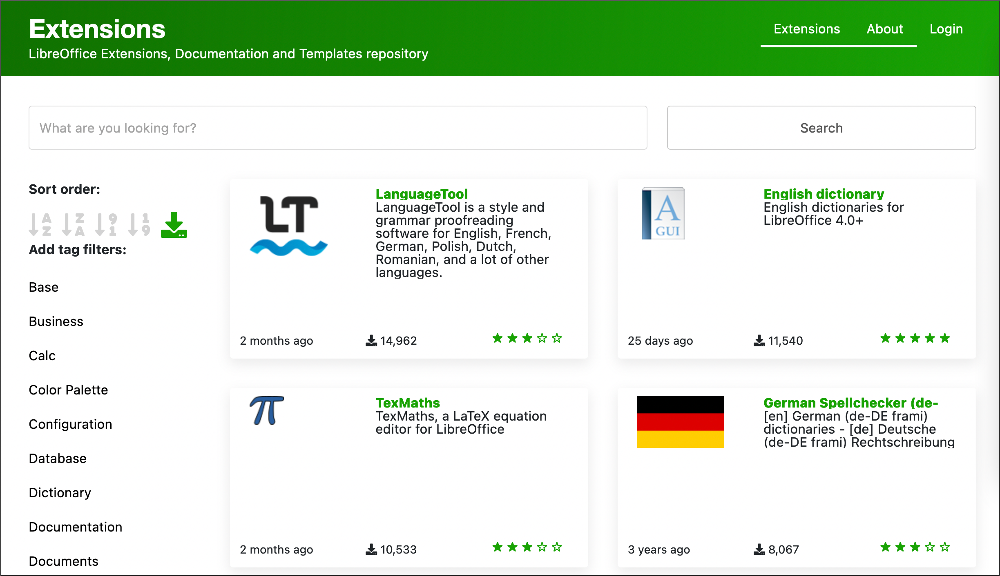

# 试试我们更新后的扩展和模板网站！

- 译文信息：
    - 原文：[Try our updated Extensions and Templates site!](https://blog.documentfoundation.org/blog/2023/07/27/try-our-updated-extensions-and-templates-site/)
    - 作者：[Mike Saunders](https://blog.documentfoundation.org/blog/author/mikesaunders/)
    - 许可证：[CC BY-SA 3.0](https://creativecommons.org/licenses/by-sa/3.0/)
    - 译者：暮光的白杨
    - 日期：2023-08-02

---

[LibreOffice] 包含广泛的功能，涵盖了大多数使用情况。我们的全球社区已经提交了数百个优秀的扩展（和模板）。

[LibreOffice]: https://www.libreoffice.org/

最近，我们的新 Web 开发人员 [Juan José González]（又名 “JJ”）改进了网站的设计，使其更实用且更具视觉吸引力，这些改进包括：

[Juan José González]: https://blog.documentfoundation.org/blog/2023/01/27/welcome-juan-jose-gonzalez-tdfs-new-web-technology-engineer/

- 下载次数计数器
- 更突出的搜索栏
- 左侧菜单中的标签筛选器
- 更大的排序按钮
- 更容易读取上次更新的日期（例如，“2 months ago”）

[点此浏览新网站！]{ .md-button }

如果你发现任何有待改进的地方，请在我们的[跟踪器]上报告。

[点此浏览新网站！]: https://extensions.libreoffice.org/
[跟踪器]: https://redmine.documentfoundation.org/projects/extensions

**衷心感谢**所有扩展和模板维护者——你们为网站做出了最大的贡献。

## 创建并提交扩展

有兴趣进行扩展并与世界分享吗？这是了解 LibreOffice 开发的好方法。以下是一些入门指南：

- [开发 LibreOffice 扩展的概述](https://wiki.documentfoundation.org/Development/Extension_Development)
- [LibreOffice “Hello World” 扩展分步教程](https://wiki.documentfoundation.org/Development/Create_a_Hello_World_LibreOffice_extension)
- [向网站提交扩展的指南](https://extensions.libreoffice.org/en/home/using-this-site-as-an-extension-maintainer/)