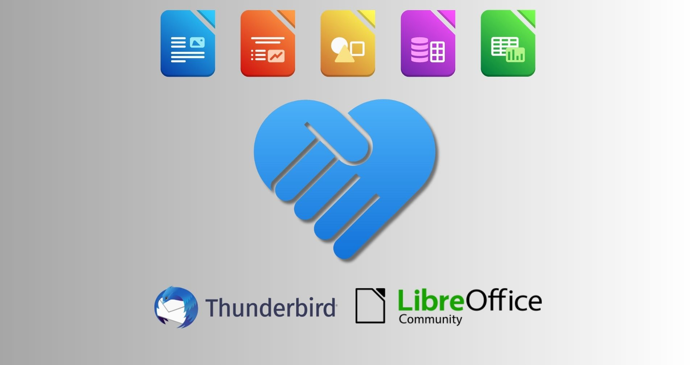

# 五种我们能让 LibreOffice 与 Thunderbird 更好地协作的办法

## 译文信息

- 原文：[Five ways we can make LibreOffice and Thunderbird work better together](https://blog.documentfoundation.org/blog/2023/06/19/five-ways-we-can-make-libreoffice-and-thunderbird-work-better-together/)
- 作者：[Mike Saunders](https://blog.documentfoundation.org/blog/author/mikesaunders/)
- 许可证：[CC BY-SA 3.0](https://creativecommons.org/licenses/by-sa/3.0/)
- 译者：暮光的白杨
- 日期：2023-06-19

----

## 正文

[LibreOffice] 不包含电子邮件程序，但有许多优秀的免费和开源软件客户端可以与它配合使用。一个突出的例子是 [Mozilla Thunderbird]——[Firefox] 网络浏览器的姊妹项目。

[LibreOffice]: https://www.libreoffice.org/
[Mozilla Thunderbird]: https://www.thunderbird.net/
[Firefox]: https://www.mozilla.org/en-US/firefox/

我们知道许多人将 LibreOffice 和 Thunderbird 用作日常工作流程的一部分——那么我们如何才能让它们更好地协同工作呢？我们通过社交媒体（[Mastodon][Mastodon1] 和 [Twitter][Twitter1]）来听取用户的意见（Thunderbird 项目也 [Mastodon][Mastodon2] 和 [Twitter][Twitter2] 上在发布了相同的讨论贴。）

[Mastodon1]: https://fosstodon.org/@libreoffice/110150592222353571
[Twitter1]: https://twitter.com/LibreOffice/status/1643871918376865794
[Mastodon2]: https://mastodon.online/@thunderbird/110151140625679579
[Twitter2]: https://twitter.com/mozthunderbird/status/1644022368270950422

非常感谢所有回复的人！我们收到了很多好主意，以下为前五名回复：

**Jay Robbie:**

> *一致的 UI/UX 将有助于新手更快地熟悉这两种工具……如果你要结合两个应用程序的功能，可能会有一个统一的设置区。在 LibreOffice 仪表板中包含一个 Thunderbird 应用程序启动器。*

**Briani Davide:**

> *将文档链接到日历事件或任务，以便在会议期间或处理项目时快速访问相关文件，并直接从 LibreOffice 中创建日历事件或任务。*

**this.ven:**

> *将 LibreOffice 的查看、编辑和导出功能更好地集成到 Thunderbird 中以通过邮件发送文件怎么样？例如，ODT 文件可以直接在 Thunderbird 中查看和编辑（无需离开窗口）并导出为 PDF 文件。*

**Johannes:**

> *对我来说，如果两者都具有相同的文本样式快捷方式，那将会有所帮助。例如 Ctrl+1 表示 Header1 等。*

**Fabián Valverde:**

> *能够在写作时从 Thunderbird 联系人插入 LibreOffice，就像你在 Twitter 上键入 “@” 时一样……*

**所以，让我们实现这些改进吧！**LibreOffice 和 Thunderbird 是社区驱动的开源项目，所以我们得到的帮助越多越好。在我们这边，我们有一个[元错误跟踪互操作性和集成][meta]，[这个页面显示了如何参与][get-involved]。如果你想在 Thunderbird 项目中提供帮助，请参阅[此页面][thunderbird-get-involved]。（如果你是运行 LibreOffice 和 Thunderbird 的企业，请考虑[资助开发人员来开发你需要的功能][fund]。）

[meta]: https://bugs.documentfoundation.org/show_bug.cgi?id=154755
[get-involved]: https://www.libreoffice.org/community/get-involved/
[thunderbird-get-involved]: https://www.thunderbird.net/en-US/get-involved/
[fund]: https://www.documentfoundation.org/certified-developers/

预先感谢所有帮助——让我们一起为这些应用程序狂欢吧😊