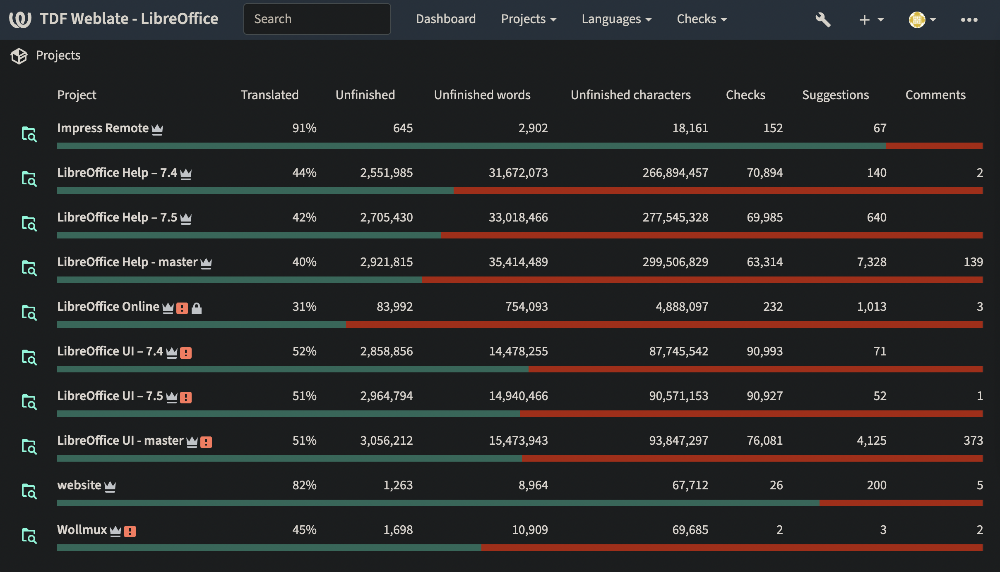

# 由文档基金会资助的 Weblate（翻译工具）改进

- 译文信息：
    - 原文：[Weblate (translation tool) improvements funded by TDF](https://blog.documentfoundation.org/blog/2023/08/16/weblate-translation-tool-improvements-funded-by-tdf/)
    - 作者：[Mike Saunders](https://blog.documentfoundation.org/blog/author/mikesaunders/)
    - 许可证：[CC BY-SA 3.0](https://creativecommons.org/licenses/by-sa/3.0/)
    - 译者：暮光的白杨
    - 日期：2023-08-16

---

Weblate 是一款自由与开源（FOSS），具有版本控制功能的翻译工具。世界各地的许多项目（包括 LibreOffice、Fedora 和 openSUSE）都使用它来帮助其社区翻译用户界面、文档和软件的其他方面。

[Weblate]: https://weblate.org/

由于我们在 LibreOffice 项目中使用 Weblate，因此我们希望回馈 Weblate，并为修复和改进提供资金。这一切都要感谢您的慷慨[捐助]！

[捐助]: https://www.libreoffice.org/donate/

完整的更改列表位于本博文的底部，摘要如下：

- TDF 对管理界面进行了改进，使权限的设置和生成报告时的语言筛选变得更加容易。此外，还添加了夜间主题（如下图所示）以及其他外观上的改进，现在译员还可以解释拒绝建议的原因。

所有这些变更都在 Weblate 4.18（最新版本）和未来版本中提供。Weblate 5.0 还将提供更多功能，例如[嵌套项目或项目分组以及每种语言的翻译工作流程设置][new]。

[new]: https://github.com/WeblateOrg/weblate/issues/263

**再次感谢我们的[捐助者][捐助]使这一切成为可能，并感谢 Sophie Gautier 和 Jan ‘Kendy’ Holešovský 的帮助！我们可以对其他寻找翻译工具的 FOSS 项目说，我们推荐 Weblate 👍**

----

## 改进和修复的完整列表

- [#7205](https://github.com/WeblateOrg/weblate/issues/7205) – unchanged translation flag notwithstanding glossary term marked as untranslatable, fixed in 4.17
- [#5854](https://github.com/WeblateOrg/weblate/issues/5854) – Autofix Bangla/Bengali sentence ender to ।, fixed in 4.17
- [#5842](https://github.com/WeblateOrg/weblate/issues/5842) – Shortcut for suggest, fixed in 4.15
- [#4368](https://github.com/WeblateOrg/weblate/issues/4368) – Improved presentation of differences in machine translations, fixed in 4.18
- [#4160](https://github.com/WeblateOrg/weblate/issues/4160) – Allow to filter on language in reports, fixed in 4.17
- [#3242](https://github.com/WeblateOrg/weblate/issues/3242) – Ability to download all translation memory from a given project in a per-language basis, fixed in 4.17
- [#2241](https://github.com/WeblateOrg/weblate/issues/2241) – Search who translates the same language, fixed in 4.18
- [#2127](https://github.com/WeblateOrg/weblate/issues/2127) – Create Group Administration Permissions, fixed in 4.15
- [#1994](https://github.com/WeblateOrg/weblate/issues/1994) – Check if two different strings share same translation, fixed in 4.18
- [#1661](https://github.com/WeblateOrg/weblate/issues/1661) – Suggestion rejection reason: possibility of explaining why you reject a suggestion, fixed in 4.18
- [#2969](https://github.com/WeblateOrg/weblate/issues/2969) – Add night theme, fixed in 4.18
- [#5519](https://github.com/WeblateOrg/weblate/issues/5519) – Glossary import and export with explanations, fixed in 4.18