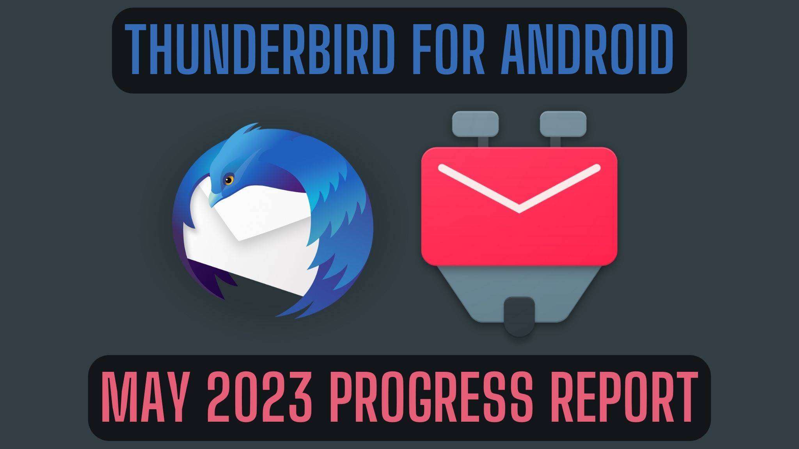
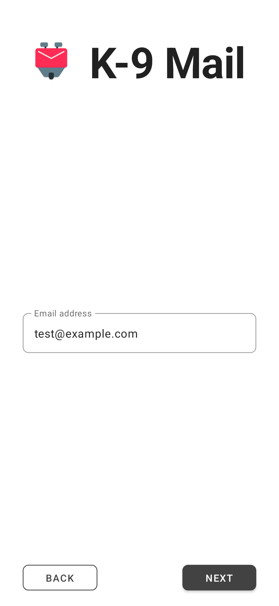
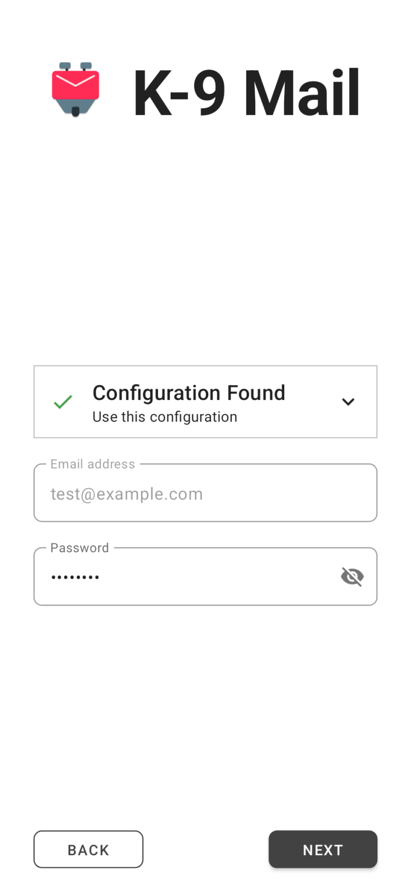
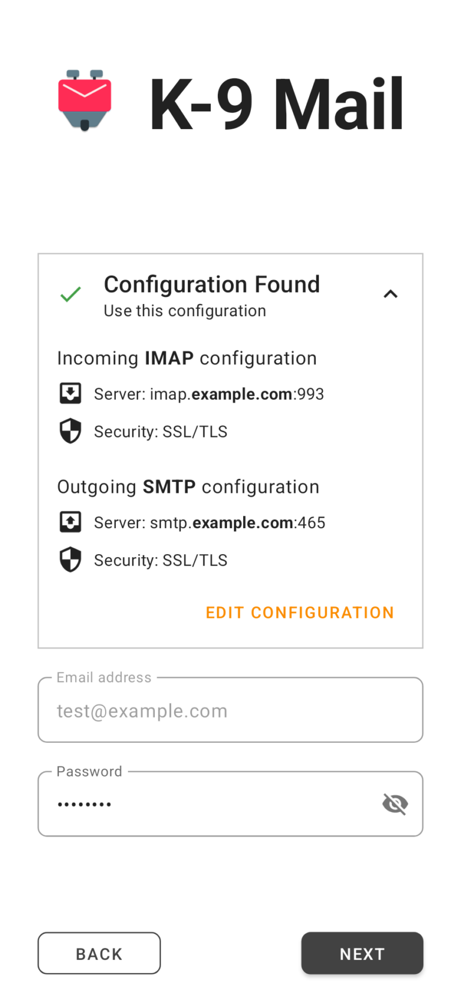

# Thunderbird for Android / K-9 Mail：2023 五月进度报告

## 作品信息

- 原文：[Thunderbird for Android / K-9 Mail: May 2023 Progress Report](https://blog.thunderbird.net/2023/06/thunderbird-for-android-k-9-mail-may-2023-progress-report/)
- 作者：[cketti](https://blog.thunderbird.net/author/ckettithunderbird-net/)
- 许可证：[CC-BY-SA 3.0](http://creativecommons.org/licenses/by-sa/3.0/)
- 译者：暮光的白杨
- 日期：2023-06-16

---

## 正文

正如在[上个月][2023-04]的进度报告中所宣布的那样，我们在 5 月份主要致力于新的帐户设置体验。要了解更多相关信息，以及 K-9 Mail 演变为 Thunderbird For Android 的过程中还发生了什么，请继续阅读。

*【本月进度报告由 cketti 和 Wolf 共同撰写】*

### 改进后的帐户设置 UI

在我们不断努力提升用户体验的过程中，我们重新设计了帐户设置 UI。这是我们与用户的第一个联系点，我们希望确保它尽可能直观和直接。我们集成了 [Thunderbird 的自动配置][autoconfig]以实现无缝的电子邮件帐户设置，开始将应用程序的 UI 从 XML Android 布局过渡到 [Jetpack Compose]，并采用[原子设计原则][atom]来实现连贯、直观的设计。

这种转变的核心是 Thunderbird 自动配置的集成。该系统能够自动配置大多数电子邮件账户，通过轻松连接到电子邮件服务器来简化用户体验。用户只需输入自己的邮箱地址，即可通过多种方式获取服务器设置。它们可以来自中央数据库 (ISPDB)，通过配置服务器直接从 ISP 检索，从提供的配置文件中提取。如果这些方法不成功，配置将派生自通用服务器名称。如果一切都失败了，用户可以手动配置。有了这个强大的工具，设置电子邮件帐户变得轻而易举。

我们重新设计的帐户设置 UI 是使用 Jetpack Compose 编写的。尽管 XML 布局长期以来一直是构建 Android UI 的标准，但 Android 生态系统正在向 Jetpack Compose 作为新规范过渡。这个声明式 UI 工具包使我们能够更有效地构建 UI，减少样板代码并降低出现错误的可能性。Jetpack Compose 将 UI 元素定义为用 Kotlin 代码编写的可组合函数。这会产生更直观、更具表现力和可读性的组件，并促进 UI 组件的重用，从而简化 UI 设计过程。这与我们新设计体系的实施非常吻合。

结合我们遵循原子设计原则的[新设计体系][design]，帐户设置 UI 呈现出一个连贯且直观的用户界面。原子设计的基本概念涉及将设计分解为更小、可重复使用的组件（原子），这些组件可以组合形成更大、更复杂的结构（分子和有机体）。这种方法使我们能够系统地将我们的 UI 界面解构为它们的基本组件，并将它们组合起来形成更复杂、可重用的帐户设置 UI 组件。结果是一个更加结构化、可扩展和高效的设计体系，提高了我们应用程序的一致性和可用性。

{ width=30% }
{ width=30% }
{ width=30% }

我们相信，这些变更带来了更顺畅、更人性化的帐户设置过程。在我们准备发布包含此功能的新测试版时，我们渴望收到你对这些改进的想法和反馈。

[autoconfig]: https://mzla.link/autoconfig
[Jetpack Compose]: https://developer.android.com/jetpack/compose
[atom]: https://atomicdesign.bradfrost.com/chapter-2/
[design]: https://github.com/thundernest/k-9/tree/main/core/ui/compose/designsystem
[2023-04]: https://blog.thunderbird.net/2023/05/thunderbird-for-android-k-9-mail-april-progress-report/

### 回复，还是全部回复？

当我们在 K‑9 Mail 6.600 中发布经过全面改进的消息视图时，用于回复消息的按钮从提供回复、全部回复和转发的菜单更改为具有默认操作的单个按钮，附加操作移至折叠菜单 (⋮). K‑9 Mail 6.600 中的默认操作是回复所有人。由于许多投诉，我们在 K‑9 邮件 6.602 中将其更改为回复。

然而，很明显，这两种默认设置都不适用于每个人，甚至在任何情况下都不适用于一个人。 我们将继续努力解决这个问题，希望我们能找到一个解决方案，让每个人都可以执行自己喜欢的行为，而不必强迫很大一部分用户必须深入了解设置才能修改行为。

### 社区贡献

- [Ilya Bizyaev] 对应用程序做了一个小改动，因此它也可以在不支持主屏幕小部件的 Android 设备上运行（参见 [#6889]）。
- [Georg Sieber] 修复了初始化顺序错误的错误（请参阅 [#6909]）。这导致在某些情况下（错误地）显示“无法连接到加密提供程序”的错误消息（参见 [#6068]）。如果你受到此影响并想表示感谢，我们会指出有一种方法可以[赞助 Georg 的开源工作][sponsor]。
- [Siva Subramaniam] 注意到使用深色主题时“使用 Google 登录”按钮不可读（参见  [#6924]），并致力于解决该问题（参见 [#6928]）。
- [Simon Arlott] 修复了导入和导出身份的几个问题（参见 [#6936]）。

非常感谢大家！❤️

[Ilya Bizyaev]: https://github.com/IlyaBizyaev
[#6889]: https://github.com/thundernest/k-9/pull/6889
[Georg Sieber]: https://github.com/schorschii
[#6909]: https://github.com/thundernest/k-9/pull/6909
[#6068]: https://github.com/thundernest/k-9/issues/6068
[sponsor]: https://github.com/sponsors/schorschii
[Siva Subramaniam]: https://github.com/siva-subramaniam-v
[#6924]: https://github.com/thundernest/k-9/issues/6924
[#6928]: https://github.com/thundernest/k-9/pull/6928
[Simon Arlott]: https://github.com/nomis
[#6936]: https://github.com/thundernest/k-9/pull/6936

### 安全审计

在[开源技术改进基金][ostif]的帮助下，我们聘请了 [7ASecurity] 对 K-9 邮件进行安全审计。我们很高兴地报告没有发现任何严重问题。

我们在 5 月份花了几天时间修复了审计期间发现的大部分安全问题。我们已经在我们的问题跟踪器中创建了仍然需要解决的发现条目。

最终报告应该很快就会准备好。我们将在此博客中公开此报告。

[ostif]: https://ostif.org/
[7ASecurity]: https://7asecurity.com/

### 发行

2023 年 5 月，我们发布了以下稳定版本：

- [K-9 Mail v6.602] (2023-05-11)

……以及以下测试版：

- [K-9 Mail v6.702] (beta) (2023-05-02)
- [K-9 Mail v6.703] (beta) (2023-05-08)
- [K-9 Mail v6.704] (beta) (2023-05-23)

**如果你想帮助塑造应用程序的未来版本，请成为 [Beta 测试员][tester]并在新功能仍在开发时提供反馈。**

[K-9 Mail v6.602]: https://github.com/thundernest/k-9/releases/tag/6.602
[K-9 Mail v6.702]: https://github.com/thundernest/k-9/releases/tag/6.702
[K-9 Mail v6.703]: https://github.com/thundernest/k-9/releases/tag/6.703
[K-9 Mail v6.704]: https://github.com/thundernest/k-9/releases/tag/6.704
[tester]: https://forum.k9mail.app/t/how-do-i-become-a-beta-tester/68