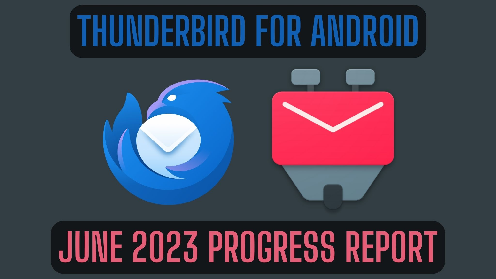
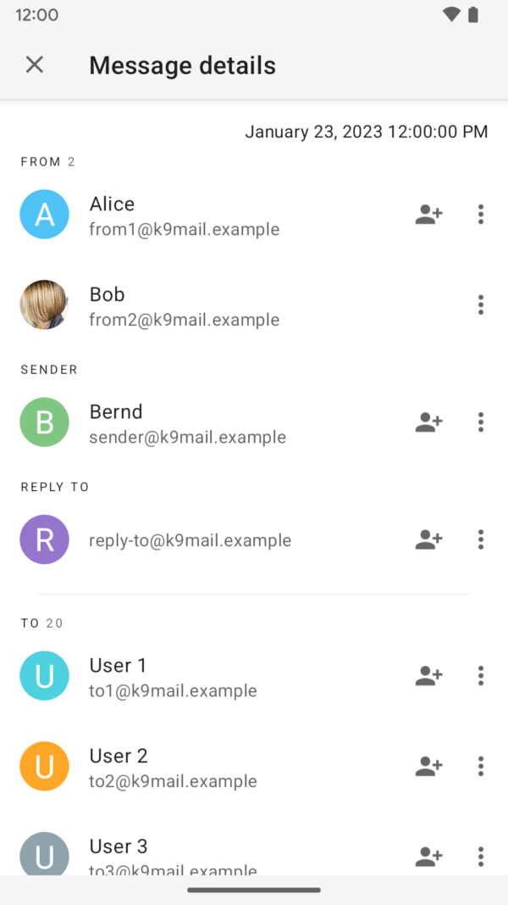
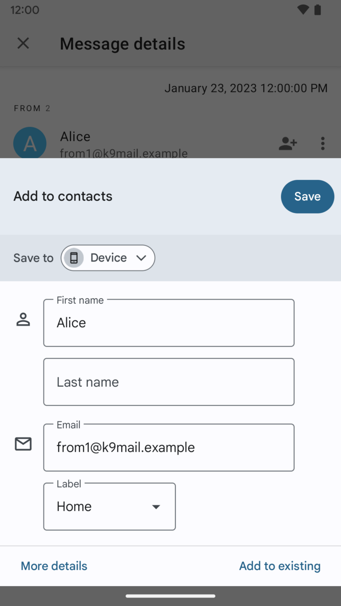
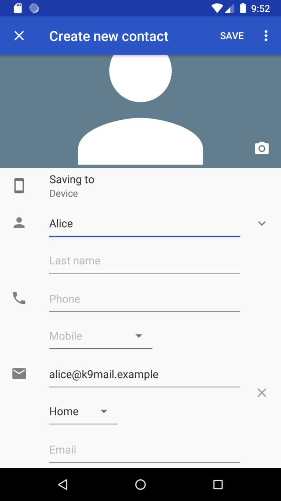
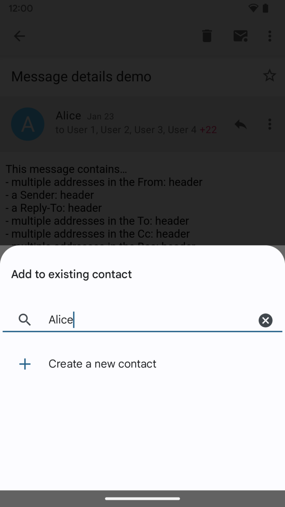
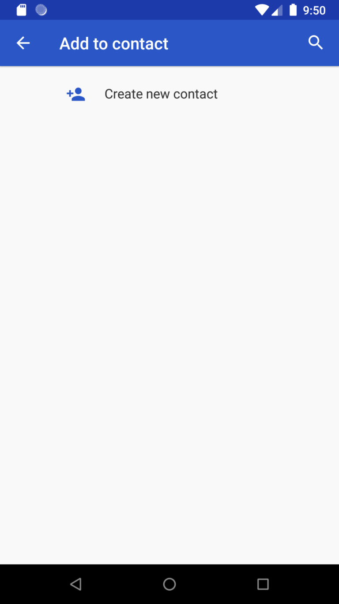

# Thunderbird for Android / K-9 Mail：2023 年 6 月进度报告

- 译文信息：
    - 原文：[Thunderbird for Android / K-9 Mail: June 2023 Progress Report](https://blog.thunderbird.net/2023/08/thunderbird-for-android-k-9-mail-june-2023-progress-report/)
    - 作者：[cketti](https://blog.thunderbird.net/author/ckettithunderbird-net/)
    - 许可证：[CC BY-SA 3.0](http://creativecommons.org/licenses/by-sa/3.0/)
    - 译者：暮光的白杨
    - 日期：2023-08-01

----

显然我们的七月太忙了，以至于我们没有时间写六月的进度报告。但延迟报告总比不报告好 😄

如果你需要回顾上个月发生的事情，请阅读 [2023 年 5 月进度报告]。

[2023 年 5 月进度报告]: ./thunderbird-2023-06-16.md

## 改进的帐户设置

我们目前正在研究的[路线图]项目是**改进帐户设置**。我们的大部分时间都花在了这方面的工作上。然而，六月没有令人兴奋的消息可以分享。我们主要是在内部管道上下功夫；这一点很重要，但不一定是博文的好素材。希望在七月份的进度报告中能有新的截图与大家分享。

[路线图]: https://developer.thunderbird.net/planning/android-roadmap

## 应用程序维护

拥有一个具有庞大用户群的应用程序意味着我们不能将所有时间都花在开发新功能上。修复错误是这项工作的重要组成部分。以下是我们在 6 月份修复的三个错误的记录。

### 文件夹似乎是空的

一位用户[报告][report1]说，K-9 Mail 中的某些文件夹似乎是空的。通过他提供的调试日志（❤️），我们能够追踪到一条包含无效电子邮件地址的消息，特别是其本地部分（@ 符号之前的文本）超过 64 个字符的限制的消息。

该错误是由于[新添加的]电子邮件地址解析器产生的，它比我们以前使用的解析器更严格。起初，这导致文件夹中的消息无法显示，这有点令人惊讶。我们特意将这个新实现保留在负责下载后解析电子邮件的代码和显示消息的代码之外。

然而，事实证明，在获取属于电子邮件地址的联系人姓名时，使用了新的电子邮件地址解析器。从本地数据库加载文件夹的消息列表时执行此查找。如果在此步骤中发生错误，则会向用户显示空消息列表。

为了修复此错误并限制将来类似问题的影响，我们进行了以下[更改]：

[report1]: https://github.com/thundernest/k-9/issues/6980
[更改]: https://github.com/thundernest/k-9/pull/6987
[新添加的]: https://github.com/thundernest/k-9/pull/6987

- 从用户收到的邮件中解析电子邮件地址时，忽略大多数错误。世界上有很多违反规范的电子邮件地址，但在实际使用中大多都能正常工作。不过，我们仍然希望在接受电子邮件地址时严格把关，例如在设置新账户时。
- 在尝试获取属于该电子邮件地址的系统联系人时，忽略电子邮件地址的错误。这可能会导致应用程序无法获取违反规范的电子邮件地址的联系人姓名。但这不会再导致无法加载整个邮件列表。
- 我们在测试账户中添加了一条包含本地部分超过长度限制的电子邮件地址的消息。这样，我们就有可能在测试版发布之前发现与此类电子邮件地址相关的错误。

我们非常感谢我们的 Beta 测试人员发现并报告了这样的错误。这样我们就可以在它们进入稳定版本之前修复它们。

### 将电子邮件地址添加到现有联系人

随着消息详细信息屏幕的引入，我们添加了一个按钮，可以使用已安装的联系人应用程序将消息发件人或收件人添加到联系人数据库。如果电子邮件地址已在联系人数据库中找到，则此按钮将隐藏，点击联系人姓名、电子邮件地址或联系人图片将打开联系人应用程序。

{ width=40% }  
消息详细信息屏幕

应用程序以前没有做出这种区分，点击电子邮件地址或联系人姓名将使用“显示或创建”操作打开联系人应用程序。显然，这可以可靠地向现有联系人添加电子邮件地址。但是，详细信息屏幕使用的“插入”操作仅允许将电子邮件地址添加到某些联系人应用程序的现有联系人中，而不允许其他应用程序 😞

=== "支持添加到现有联系人的联系人应用程序的“插入”操作"

    { width=40% }

=== "在不支持添加到现有联系人的联系人应用程序中执行“插入”操作"

    { width=40% }

我们将启动联系人应用程序的操作从“插入”更改为“插入或编辑”，这似乎可靠地提供了将电子邮件地址添加到现有联系人的选项。

=== "使用 Google 通讯录应用程序进行“插入或编辑”操作"

    { width=40% }

=== "使用 AOSP 联系人应用程序进行“插入或编辑”操作"

    { width=40% }

### 回复行为取决于消息大小

一位用户[报告][repot2]说，在回复通过邮件列表检索到的邮件时，应用的行为会因邮件是完全下载还是仅部分下载而有所不同。

K-9 Mail 支持在邮件超过配置大小时仅下载邮件的部分内容。在这种情况下，也只下载邮件头的选定部分。不幸的是，我们忘记了加入 `List-Post` 头信息字段，该字段用于确定要回复的电子邮件地址。

[解决方法]很简单，只需在要从 IMAP 服务器获取的标题字段列表中添加 `List-Post`。

[repot2]: https://github.com/thundernest/k-9/issues/6414
[解决方法]: https://github.com/thundernest/k-9/pull/7008

## 社区贡献

六月，我们合并了外部贡献者的以下拉取请求：

- [不要要求保存未更改的草稿](https://github.com/thundernest/k-9/pull/6965)
- [撰写邮件时收件人姓名不一致](https://github.com/thundernest/k-9/pull/6972)

## 发布

2023 年 6 月，我们发布了以下测试版：

- [K-9 Mail v6.705 (beta)](https://github.com/thundernest/k-9/releases/tag/6.705) (2023-06-12)
- [K-9 Mail v6.706 (beta)](https://github.com/thundernest/k-9/releases/tag/6.706) (2023-06-16)
- [K-9 Mail v6.707 (beta)](https://github.com/thundernest/k-9/releases/tag/6.707) (2023-06-19)

如果你想帮助塑造应用程序的未来版本，请[成为 Beta 测试人员]，并在新功能仍在开发过程中提供反馈。

[成为 Beta 测试人员]: https://forum.k9mail.app/t/how-do-i-become-a-beta-tester/68