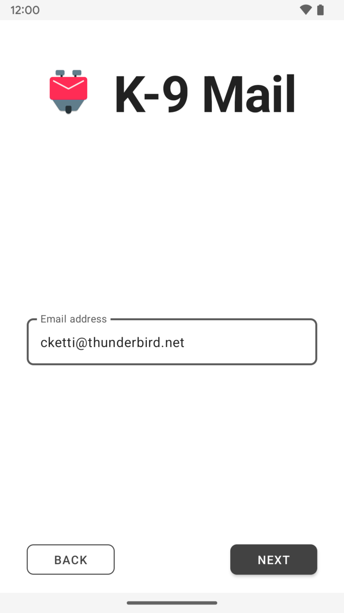
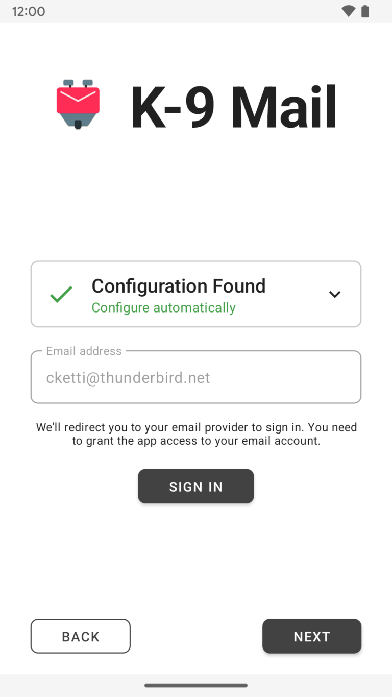
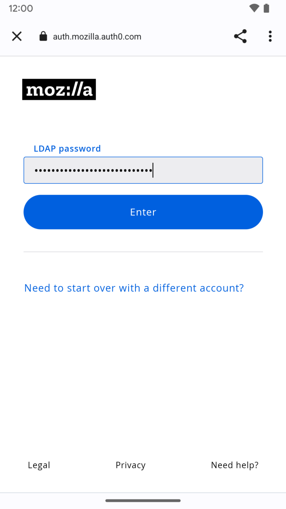
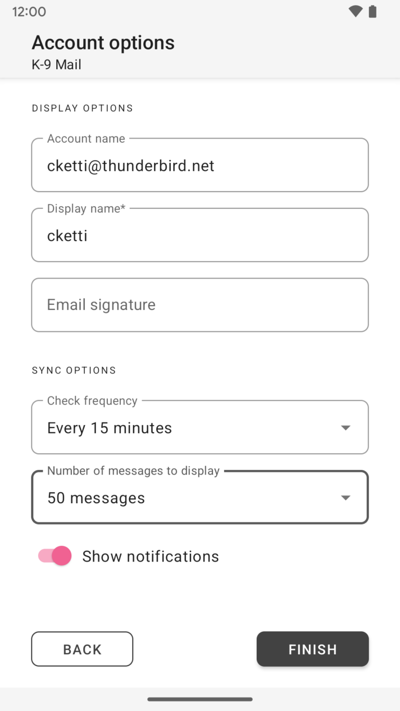

# Thunderbird for Android / K-9 Mail：2023 年 7 月进度报告

- 译文信息：
    - 原文：[Thunderbird for Android / K-9 Mail: July 2023 Progress Report](https://blog.thunderbird.net/2023/08/thunderbird-for-android-k-9-mail-july-2023-progress-report/)
    - 作者：[cketti](https://blog.thunderbird.net/author/ckettithunderbird-net/)
    - 许可证：[CC BY-SA 3.0](http://creativecommons.org/licenses/by-sa/3.0/)
    - 译者：暮光的白杨
    - 日期：2023-08-25

----

我写这篇文章的那天，外面很热。太热了，我无法为这篇博客文章想到一个很好的介绍，其中还包括[上个月进度报告]的链接……好吧，我想这必须要做。我去买冰淇淋了🍨😎

[上个月进度报告]: ./thunderbird-2023-08-01.md

请欣赏我们 2023 年 7 月开发活动的简短报告。

## 改进的帐户设置

自从 Wolf 在今年 2 月加入以来，他花费了大量时间在构成新的和改进的帐户设置用户界面的许多单独部分上。七月是事情开始发生的月份。我们第一次能够测试整个流程，而不仅仅是单个部分。

{ width=40% } { width=40% }
{ width=40% } { width=40% }

事情看起来不错。但一些小问题让我们很忙，并阻止我们发布包含新帐户设置的测试版。

## Material 3 实验

我们做了一些实验，以便更好地了解将应用程序切换到 Material 3（Google 开源设计系统的最新版本）需要做多少工作。我们现在持谨慎乐观的态度。因此，[当前的计划]是切换到 Material 3，然后将应用程序从 K-9 Mail 重命名为 Thunderbird。

[当前的计划]: https://developer.thunderbird.net/planning/android-roadmap

## 社区贡献

我们在 7 月合并了外部贡献者的以下拉取请求：

- [消息视图：查看线程中的消息（来自统一收件箱）时不显示帐户卡片](https://github.com/thundernest/k-9/pull/7004)
- [删除帐户不会正确更改当前颜色](https://github.com/thundernest/k-9/pull/7003)

## 安全审计报告

在围绕 [Thunderbird Supernova 发布]忙碌了几天之后，我们终于发布了由 [OSTIF] 组织、[7ASecurity] 执行的安全审计报告。我们很高兴地报告，没有发现任何高风险漏洞。安全审计确实发现了一些中低风险漏洞。

[Thunderbird Supernova 发布]: ./thunderbird-supernova.md
[OSTIF]: https://ostif.org/
[7ASecurity]: https://7asecurity.com/

如需了解更多信息，请阅读我们的博客文章《[K-9 Mail 与 OSTIF、7ASecurity 合作开展安全审计]》。

[K-9 Mail 与 OSTIF、7ASecurity 合作开展安全审计]: ./thunderbird-security-audit.md

感谢所有参与此次活动的人员！